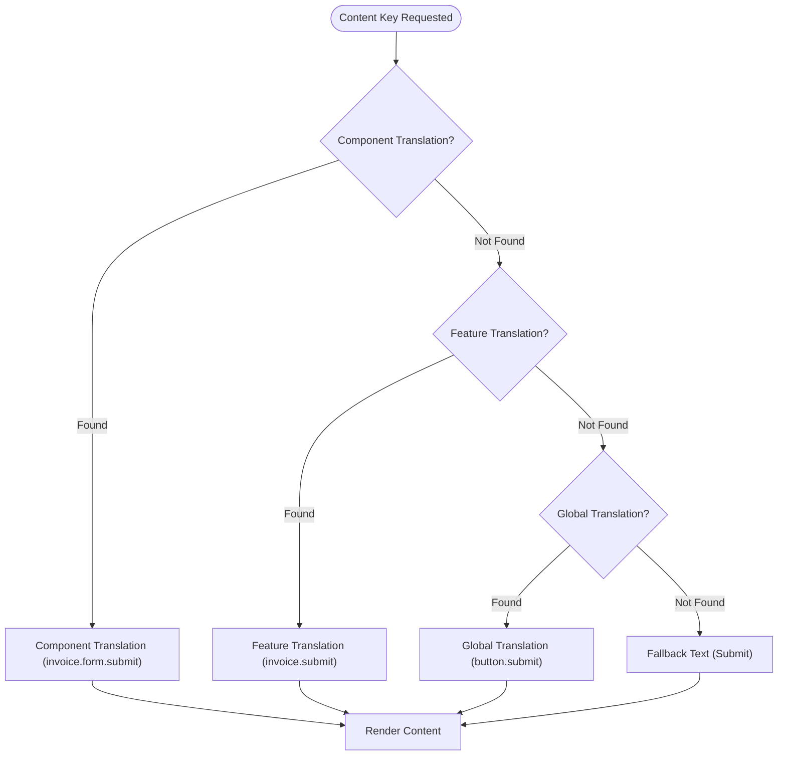
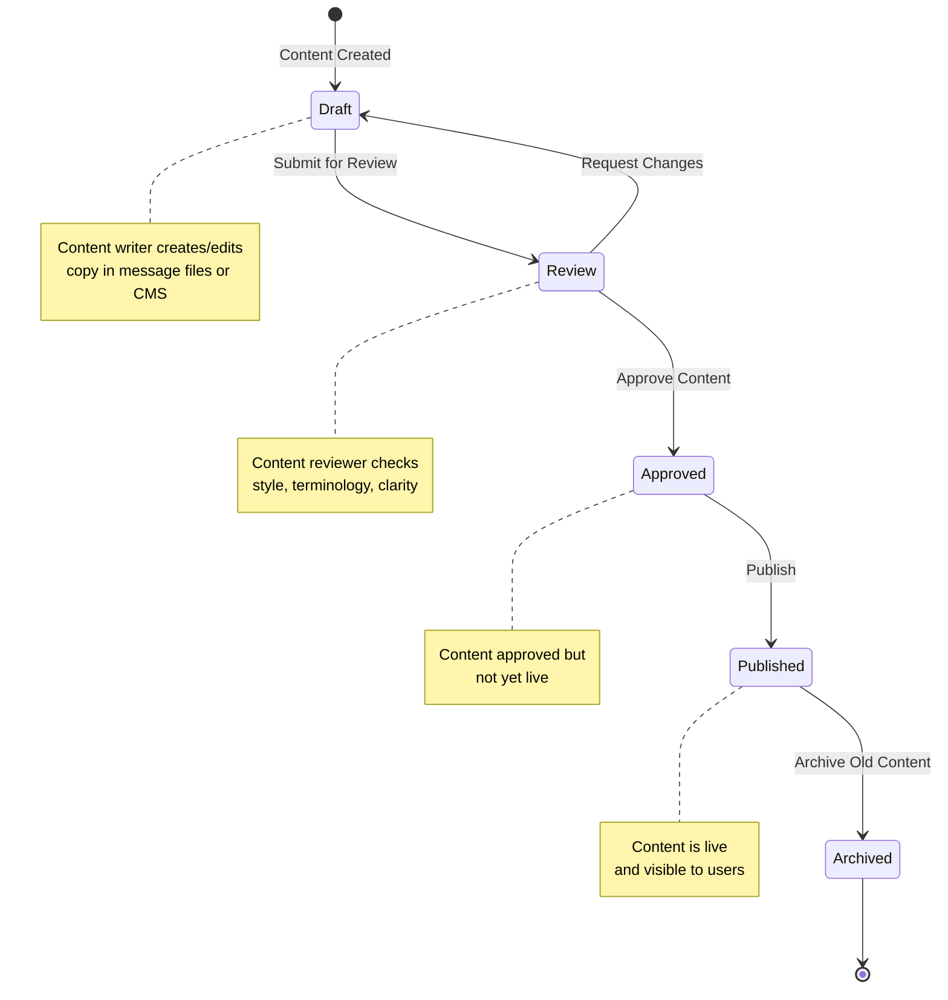

# Architecture: Content Strategy

## Contents

- [Content Management Patterns](#content-management-patterns)
- [String Externalization](#string-externalization)
- [Dynamic Content](#dynamic-content)
- [Content Hierarchy in Components](#content-hierarchy-in-components)
- [Markdown in UI](#markdown-in-ui)
- [Style Guide Enforcement](#style-guide-enforcement)
- [Server-Side Content](#server-side-content)
- [Versioning](#versioning)

## Content Management Patterns

Content strategy requires architectural decisions about how content is stored, accessed, and updated.

### Hardcoded Strings (Not Recommended)

The simplest approach — strings written directly in code:

```vue
<!-- Vue 3 - Avoid this -->
<button>Submit</button>
<p>Error: Unable to save</p>
```

```tsx
// React - Avoid this
<button>Submit</button>
<p>Error: Unable to save</p>
```

**Problems:**
- No internationalization support
- Copy changes require code deployment
- Inconsistent terminology
- No content review process

### i18n Message Catalogs (Recommended Default)

Externalize all strings to message files managed by i18n libraries:

**Vue 3 with vue-i18n:**
```vue
<template>
  <button>{{ $t('invoice.create.submit') }}</button>
  <p>{{ $t('invoice.create.error.save') }}</p>
</template>
```

```json
// locales/en.json
{
  "invoice": {
    "create": {
      "submit": "Create Invoice",
      "error": {
        "save": "Unable to save invoice. Please try again."
      }
    }
  }
}
```

**React with react-intl:**
```tsx
import { FormattedMessage, useIntl } from 'react-intl';

function InvoiceForm() {
  const intl = useIntl();
  return (
    <>
      <button>{intl.formatMessage({ id: 'invoice.create.submit' })}</button>
      <p><FormattedMessage id="invoice.create.error.save" /></p>
    </>
  );
}
```

```json
// locales/en.json
{
  "invoice.create.submit": "Create Invoice",
  "invoice.create.error.save": "Unable to save invoice. Please try again."
}
```

**Spring Boot with MessageSource:**
```java
@RestController
public class InvoiceController {
    @Autowired
    private MessageSource messageSource;
    
    @GetMapping("/invoices/{id}")
    public ResponseEntity<?> getInvoice(@PathVariable String id, Locale locale) {
        try {
            // ... fetch invoice
        } catch (InvoiceNotFoundException e) {
            String message = messageSource.getMessage(
                "invoice.error.notFound",
                new Object[]{id},
                locale
            );
            return ResponseEntity.status(404).body(new ErrorResponse(message));
        }
    }
}
```

```properties
# messages_en.properties
invoice.error.notFound=Invoice {0} not found. Please check the ID and try again.
```

**Benefits:**
- Full i18n support
- Centralized content management
- Enables content review workflow
- Supports A/B testing different copy

### CMS-Backed Content (For Dynamic Content)

For marketing pages, help content, or frequently updated copy, use a headless CMS:

```typescript
// Fetch content from CMS
const helpContent = await cms.getContent('invoice-help', locale);

// Render in component
<div v-html="helpContent.body" />
```

**Use Cases:**
- Marketing landing pages
- Help documentation
- Feature announcements
- Legal/terms content

**Trade-offs:**
- More complex infrastructure
- Requires CMS integration
- May need caching strategy
- Not suitable for all UI copy (too slow for every label)

### A/B Testable Copy

Structure content to support A/B testing:

```typescript
// Content with variants
const buttonCopy = useABTest('invoice.create.button', {
  variantA: 'Create Invoice',
  variantB: 'New Invoice',
  default: 'Create Invoice'
});
```

```vue
<button>{{ buttonCopy }}</button>
```

## String Externalization

**All user-facing strings must be externalized** — no hardcoded strings in components or templates.

### Key Naming Conventions

Use hierarchical, feature-based naming:

```
{feature}.{component}.{element}.{state?}
```

**Examples:**
- `invoice.create.submit` — Invoice creation form submit button
- `invoice.list.empty.firstTime` — First-time empty state for invoice list
- `invoice.detail.error.load` — Error loading invoice details
- `invoice.delete.confirm.title` — Confirmation dialog title

**Best Practices:**
- Use dot notation for hierarchy
- Be specific: `invoice.create.submit` not `button1`
- Include state when relevant: `invoice.status.paid` vs `invoice.status.pending`
- Group related content: all invoice-related keys under `invoice.*`

### Namespace Organization

Organize message files by feature or domain:

```
locales/
├── en.json
├── es.json
├── fr.json
└── features/
    ├── invoice.en.json
    ├── invoice.es.json
    ├── project.en.json
    └── billing.en.json
```

**Vue 3 (vue-i18n):**
```typescript
import { createI18n } from 'vue-i18n';
import invoiceEn from './features/invoice.en.json';
import projectEn from './features/project.en.json';

const i18n = createI18n({
  locale: 'en',
  messages: {
    en: {
      ...invoiceEn,
      ...projectEn,
    },
  },
});
```

**React (react-intl):**
```typescript
import invoiceEn from './features/invoice.en.json';
import projectEn from './features/project.en.json';

const messages = {
  en: {
    ...invoiceEn,
    ...projectEn,
  },
};
```

## Dynamic Content

Content often needs to be dynamic — interpolating values, handling plurals, conditional rendering.

### Interpolation

Insert dynamic values into strings:

**Vue 3:**
```vue
<template>
  <p>{{ $t('invoice.list.count', { count: invoiceCount }) }}</p>
</template>
```

```json
{
  "invoice.list.count": "You have {count} invoices"
}
```

**React:**
```tsx
<FormattedMessage
  id="invoice.list.count"
  values={{ count: invoiceCount }}
/>
```

**Spring Boot:**
```java
String message = messageSource.getMessage(
    "invoice.list.count",
    new Object[]{invoiceCount},
    locale
);
```

```properties
invoice.list.count=You have {0} invoices
```

### Pluralization

Handle singular/plural forms correctly:

**Vue 3 (vue-i18n):**
```vue
<template>
  <p>{{ $tc('invoice.list.count', invoiceCount) }}</p>
</template>
```

```json
{
  "invoice.list.count": "You have {count} invoice | You have {count} invoices"
}
```

**React (react-intl):**
```tsx
<FormattedMessage
  id="invoice.list.count"
  values={{ count: invoiceCount }}
/>
```

```json
{
  "invoice.list.count": "{count, plural, =0 {No invoices} one {# invoice} other {# invoices}}"
}
```

**Spring Boot:**
```properties
invoice.list.count=You have {0} invoice
invoice.list.count.plural=You have {0} invoices
```

### Gender-Aware Content

Some languages require gender agreement:

```json
{
  "user.welcome": "{gender, select, male {Welcome, {name}!} female {Welcome, {name}!} other {Welcome, {name}!}}"
}
```

### Conditional Content Based on State

Show different content based on application state:

```vue
<template>
  <p v-if="isFirstTime">
    {{ $t('invoice.list.empty.firstTime') }}
  </p>
  <p v-else-if="hasFilters">
    {{ $t('invoice.list.empty.filtered') }}
  </p>
  <p v-else>
    {{ $t('invoice.list.empty.default') }}
  </p>
</template>
```

## Content Resolution Chain

Content resolution follows a hierarchical fallback chain:



## Content Hierarchy in Components

Components often need multiple content types. Establish a clear hierarchy:

1. **Label** — Always visible (form field label, button text)
2. **Help Text** — Contextual, shown on demand (tooltip, info icon)
3. **Validation Message** — Shown when validation fails
4. **Error Message** — Shown when operation fails
5. **Tooltip** — Additional context on hover

**Example: Form Field**
```vue
<template>
  <div class="form-field">
    <!-- 1. Label (always visible) -->
    <label>{{ $t('invoice.form.number.label') }}</label>
    
    <!-- 2. Help text (shown inline or on info icon) -->
    <span class="help-text">
      {{ $t('invoice.form.number.help') }}
    </span>
    
    <input v-model="invoiceNumber" />
    
    <!-- 3. Validation message (shown on blur/change) -->
    <span v-if="errors.number" class="validation-error">
      {{ $t('invoice.form.number.validation.required') }}
    </span>
    
    <!-- 4. Error message (shown on API error) -->
    <span v-if="apiError" class="error-message">
      {{ $t('invoice.form.error.save') }}
    </span>
  </div>
</template>
```

**Which to Show When:**
- **Label**: Always visible
- **Help Text**: On page load (inline) or on info icon click
- **Validation Message**: On field blur or form submit if invalid
- **Error Message**: On API/operation failure
- **Tooltip**: On hover/focus (for icons, abbreviations)

## Markdown in UI

Help content, descriptions, and user-generated content often use Markdown.

### Rendering Markdown

**Vue 3:**
```vue
<template>
  <div v-html="renderedMarkdown" />
</template>

<script setup>
import { marked } from 'marked';
import { computed } from 'vue';

const props = defineProps<{ content: string }>();

const renderedMarkdown = computed(() => {
  return marked(props.content);
});
</script>
```

**React:**
```tsx
import ReactMarkdown from 'react-markdown';

<ReactMarkdown>{helpContent}</ReactMarkdown>
```

### Sanitization (XSS Prevention)

**Critical**: Always sanitize Markdown before rendering to prevent XSS:

**Vue 3:**
```typescript
import { marked } from 'marked';
import DOMPurify from 'dompurify';

const renderedMarkdown = computed(() => {
  const html = marked(props.content);
  return DOMPurify.sanitize(html);
});
```

**React:**
```tsx
import ReactMarkdown from 'react-markdown';
import rehypeSanitize from 'rehype-sanitize';

<ReactMarkdown rehypePlugins={[rehypeSanitize]}>
  {helpContent}
</ReactMarkdown>
```

### Rich Text for User-Generated Content

For user-generated content (comments, descriptions), use a rich text editor:

```vue
<template>
  <QuillEditor
    v-model="content"
    :options="editorOptions"
  />
</template>
```

Sanitize on save and render:
```typescript
import DOMPurify from 'dompurify';

const sanitizedContent = DOMPurify.sanitize(userContent);
```

## Style Guide Enforcement

Automate style guide enforcement through linting and tooling.

### Linting for Terminology Consistency

**ESLint Plugin Example:**
```javascript
// .eslintrc.js
module.exports = {
  plugins: ['content-lint'],
  rules: {
    'content-lint/forbidden-terms': ['error', {
      forbidden: ['click here', 'submit', 'workspace'],
      suggestions: {
        'click here': 'use descriptive link text',
        'submit': 'use specific action (e.g., "Create Invoice")',
        'workspace': 'use "project" (see terminology glossary)'
      }
    }],
    'content-lint/required-terms': ['error', {
      required: {
        'error.*': 'must include actionable next steps',
        'empty.*': 'must include call to action'
      }
    }]
  }
};
```

### Forbidden Words List

Maintain a list of forbidden terms:

```json
{
  "forbidden": [
    "click here",
    "submit",
    "leverage",
    "utilize",
    "oops",
    "error 500"
  ],
  "preferred": {
    "submit": "use specific action (Create, Save, Delete)",
    "leverage": "use",
    "utilize": "use"
  }
}
```

### Capitalization Rules

Enforce capitalization consistency:

- **Sentence case** for UI elements: "Create invoice", "Save changes"
- **Title case** for page headings: "Invoice Management"
- **Lowercase** for form placeholders: "e.g., invoice-2024-Q1"

```javascript
// Lint rule: enforce sentence case for button labels
'content-lint/capitalization': ['error', {
  'button.*': 'sentence-case',
  'heading.*': 'title-case',
  'placeholder.*': 'lowercase'
}]
```

## Server-Side Content

Backend APIs must also externalize content for error messages and responses.

### Spring MessageSource for API Error Messages

**Configuration:**
```java
@Configuration
public class MessageSourceConfig {
    @Bean
    public MessageSource messageSource() {
        ReloadableResourceBundleMessageSource messageSource =
            new ReloadableResourceBundleMessageSource();
        messageSource.setBasename("classpath:messages");
        messageSource.setDefaultEncoding("UTF-8");
        return messageSource;
    }
}
```

**Usage in Controllers:**
```java
@RestController
public class InvoiceController {
    @Autowired
    private MessageSource messageSource;
    
    @PostMapping("/invoices")
    public ResponseEntity<?> createInvoice(
            @RequestBody InvoiceRequest request,
            Locale locale) {
        try {
            // Validation
            if (request.getAmount() == null) {
                String message = messageSource.getMessage(
                    "invoice.validation.amount.required",
                    null,
                    locale
                );
                return ResponseEntity.badRequest()
                    .body(new ErrorResponse(message));
            }
            
            // Business logic
            Invoice invoice = invoiceService.create(request);
            String message = messageSource.getMessage(
                "invoice.create.success",
                new Object[]{invoice.getId()},
                locale
            );
            return ResponseEntity.ok(new SuccessResponse(message, invoice));
        } catch (DuplicateInvoiceException e) {
            String message = messageSource.getMessage(
                "invoice.create.error.duplicate",
                new Object[]{e.getInvoiceNumber()},
                locale
            );
            return ResponseEntity.status(409)
                .body(new ErrorResponse(message));
        }
    }
}
```

**Message Files:**
```properties
# messages_en.properties
invoice.validation.amount.required=Invoice amount is required. Please enter a valid amount.
invoice.create.success=Invoice {0} created successfully.
invoice.create.error.duplicate=Invoice number {0} already exists. Please use a different number.
```

### Locale-Aware Response Messages

**Locale Resolution:**
```java
@Configuration
public class LocaleConfig {
    @Bean
    public LocaleResolver localeResolver() {
        SessionLocaleResolver resolver = new SessionLocaleResolver();
        resolver.setDefaultLocale(Locale.ENGLISH);
        return resolver;
    }
    
    @Bean
    public LocaleChangeInterceptor localeChangeInterceptor() {
        LocaleChangeInterceptor interceptor = new LocaleChangeInterceptor();
        interceptor.setParamName("lang");
        return interceptor;
    }
}
```

**Accept-Language Header Support:**
```java
@RestController
public class InvoiceController {
    @GetMapping("/invoices/{id}")
    public ResponseEntity<?> getInvoice(
            @PathVariable String id,
            @RequestHeader(value = "Accept-Language", defaultValue = "en") String lang) {
        Locale locale = Locale.forLanguageTag(lang);
        // Use locale with MessageSource
    }
}
```

### Content Negotiation

Support multiple content formats:

```java
@GetMapping(value = "/invoices/{id}", produces = {
    MediaType.APPLICATION_JSON_VALUE,
    MediaType.APPLICATION_XML_VALUE
})
public ResponseEntity<InvoiceResponse> getInvoice(@PathVariable String id) {
    // Response format negotiated based on Accept header
}
```

## Content Governance Workflow

Content goes through a structured workflow from creation to publication:



## Versioning

Content changes require versioning strategy.

### Content Changes That Need Deployment

**Code-level content** (labels, error messages, button text):
- Requires code deployment
- Goes through standard code review
- Versioned with application code
- Requires i18n updates for all locales

**Process:**
1. Content writer creates/updates copy
2. Developer implements in message files
3. Code review (including content review)
4. Deploy with application

### Content Changes via CMS

**Dynamic content** (help pages, marketing copy):
- Updated via CMS without deployment
- May require content review workflow
- Versioned in CMS
- Can be A/B tested independently

**Process:**
1. Content writer updates in CMS
2. Content review/approval workflow
3. Publish (no deployment needed)
4. May require cache invalidation

### A/B Testing Different Copy

Structure content to support experimentation:

```typescript
// Feature flag + content variant
const buttonCopy = useFeatureFlag('invoice-create-button-copy', {
  control: 'Create Invoice',
  variantA: 'New Invoice',
  variantB: 'Add Invoice'
});
```

Track metrics:
- Click-through rate
- Task completion rate
- User satisfaction
