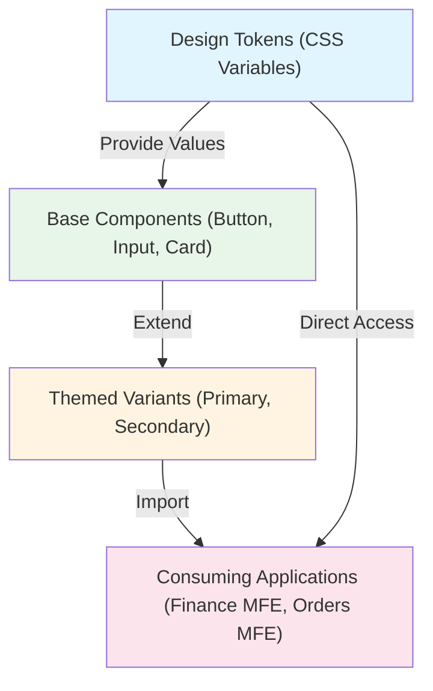

# Architecture: Design Consistency & Visual Identity

## Contents

- [Design Token Architecture](#design-token-architecture)
- [Component Library Integration Patterns](#component-library-integration-patterns)
- [Theming Systems](#theming-systems)
- [Layout Systems](#layout-systems)
- [Page Transitions and Motion](#page-transitions-and-motion)
- [MFE Design Consistency](#mfe-design-consistency)
- [Iconography and Asset Management](#iconography-and-asset-management)

## Design Token Architecture

Design tokens are the atomic design decisions—colors, spacing, typography, shadows, border-radius—expressed as semantic variables. They form the foundation of visual consistency.

### Design Token Pipeline

```mermaid
flowchart LR
    Figma["Figma Design Tokens (Designer Creates)"]
    Transform["Transform Layer (Style Dictionary)"]
    CSSVars["CSS Variables (--color-primary)"]
    Components["Component Consumption (var(--color-primary))"]
    Apps["Consuming Applications (MFEs & Apps)"]
    
    Figma -->|Export JSON| Transform
    Transform -->|Generate CSS| CSSVars
    CSSVars -->|Reference| Components
    Components -->|Use| Apps
    
    style Figma fill:#e1f5ff
    style Transform fill:#fff4e1
    style CSSVars fill:#e8f5e9
    style Components fill:#f3e5f5
    style Apps fill:#fce4ec
```



### What Tokens Are

Tokens abstract design values into named, semantic variables:

```css
/* Primitive tokens - raw values */
--color-blue-500: #3b82f6;
--spacing-4: 16px;
--font-size-base: 16px;

/* Semantic tokens - meaning-based */
--color-primary: var(--color-blue-500);
--spacing-card-padding: var(--spacing-4);
--font-size-body: var(--font-size-base);
```

**Token categories**:
- **Colors**: Backgrounds, text, borders, status colors (success, error, warning)
- **Spacing**: Margins, padding, gaps, component spacing
- **Typography**: Font families, sizes, weights, line heights
- **Shadows**: Elevation levels, focus rings
- **Border radius**: Component rounding, card corners
- **Motion**: Duration, easing curves

### Token Hierarchy

Design tokens follow a three-level hierarchy that enables flexibility, maintainability, and theming. Understanding this hierarchy is critical for building scalable design systems.

**Primitive → Semantic → Component**

```
Level 1 - Primitive: --color-blue-500: #3b82f6
    ↓
Level 2 - Semantic: --color-primary: var(--color-blue-500)
    ↓
Level 3 - Component: .button-primary { background: var(--color-primary); }
```

#### Level 1: Primitive Tokens (Foundation)

**Primitive tokens** are raw, context-free values—the building blocks of your design system. They have no semantic meaning.

**Characteristics:**
- **No meaning**: `--color-blue-500` doesn't imply "primary" or "action"
- **Reusable**: Same primitive can be used for multiple semantic purposes
- **Theme-agnostic**: Primitives don't change between themes
- **Designer-controlled**: Designers define these in Figma/design tools

**Primitive token examples:**
```css
/* Colors - Raw color values */
--color-blue-50: #eff6ff;
--color-blue-500: #3b82f6;
--color-blue-900: #1e3a8a;

/* Spacing - Raw spacing values (4px or 8px base) */
--spacing-1: 4px;
--spacing-2: 8px;
--spacing-4: 16px;
--spacing-8: 32px;

/* Typography - Raw font values */
--font-size-12: 12px;
--font-size-16: 16px;
--font-weight-normal: 400;
--font-weight-semibold: 600;
```

#### Level 2: Semantic Tokens (Meaning)

**Semantic tokens** assign meaning to primitives. They describe **what** the token is used for, not **what** it looks like.

**Characteristics:**
- **Context-aware**: `--color-primary` means "primary action color"
- **Theme-aware**: Can change between light/dark themes
- **Purpose-driven**: Describe function, not appearance

**Semantic token examples:**
```css
/* Color semantics - What the color represents */
--color-primary: var(--color-blue-500);
--color-primary-hover: var(--color-blue-600);
--color-background: var(--color-white);
--color-text-primary: var(--color-gray-900);

/* Spacing semantics - What the spacing is for */
--spacing-card-padding: var(--spacing-4);
--spacing-section-gap: var(--spacing-8);

/* Typography semantics */
--font-size-body: var(--font-size-16);
--font-size-heading-1: var(--font-size-32);
```

**Why semantic tokens matter:**
- **Theme switching**: Change `--color-primary` from blue to green without touching components
- **Context adaptation**: `--color-text-primary` can be white in dark mode, black in light mode
- **Maintainability**: Update brand colors in one place (semantic tokens), not every component

#### Level 3: Component Tokens (Usage)

**Component tokens** are component-specific tokens that compose semantic tokens into UI elements.

**Component token examples:**
```css
.button-primary {
  background: var(--color-primary);
  color: var(--color-text-inverse);
  padding: var(--spacing-sm) var(--spacing-md);
  border-radius: var(--radius-md);
}
```

### Token Naming Conventions

**Naming pattern:**
```
--{category}-{variant}-{state?}-{property?}
```

**Examples:**
- `--color-primary` (category: color, variant: primary)
- `--color-primary-hover` (category: color, variant: primary, state: hover)
- `--spacing-card-padding` (category: spacing, variant: card, property: padding)

**Categories:**
- `color-*` - Colors (backgrounds, text, borders, status)
- `spacing-*` - Spacing (margins, padding, gaps)
- `font-size-*` - Font sizes
- `shadow-*` - Shadows and elevations
- `radius-*` - Border radius

### Token Format

#### CSS Custom Properties

```css
:root {
  --color-primary: #3b82f6;
  --spacing-4: 16px;
  --border-radius-md: 8px;
}

.button {
  background: var(--color-primary);
  padding: var(--spacing-4);
  border-radius: var(--border-radius-md);
}
```

**Benefits**: Runtime theming, browser-native, no build step required.

#### Style Dictionary

Transforms design tokens into platform-specific formats:

```json
{
  "color": {
    "primary": {
      "value": "#3b82f6"
    }
  }
}
```

Generates CSS, JavaScript, iOS, Android formats from single source.

#### Tailwind Config

```javascript
// tailwind.config.js
module.exports = {
  theme: {
    extend: {
      colors: {
        primary: {
          500: '#3b82f6',
          600: '#2563eb',
        }
      },
      spacing: {
        '4': '16px',
        '8': '32px',
      }
    }
  }
}
```

**Usage**: `className="bg-primary-500 p-4"` - tokens become utility classes.

## Component Library Integration Patterns

### Component Library Architecture



### Consuming Propulsion

Propulsion is Pax8's mandatory design system for certain projects. When using Propulsion, you must balance customization needs with the requirement to receive design system updates without breaking changes.

#### Direct Usage (Preferred)

**Use Propulsion components directly** without modification when possible:

```vue
<!-- Vue 3: Direct Propulsion usage -->
<template>
  <PaxButton variant="primary" @click="handleClick">
    Save Changes
  </PaxButton>
  
  <PaxCard>
    <PaxCardHeader>
      <PaxHeading level="3">Title</PaxHeading>
    </PaxCardHeader>
    <PaxCardContent>
      Content here
    </PaxCardContent>
  </PaxCard>
</template>

<script setup>
import { 
  PaxButton, 
  PaxCard, 
  PaxCardHeader, 
  PaxCardContent,
  PaxHeading 
} from '@pax8/propulsion-vue';
</script>
```

**Benefits:**
- ✅ Automatic design system updates
- ✅ Consistent with Pax8 standards
- ✅ No maintenance burden
- ✅ Accessibility built-in

#### Extending Propulsion via Composition

**When you need custom behavior**, compose Propulsion components rather than modifying them:

```vue
<!-- ✅ Good: Compose Propulsion components -->
<template>
  <PaxCard class="custom-feature-card">
    <PaxCardHeader>
      <PaxHeading level="3">{{ title }}</PaxHeading>
      <PaxButton 
        variant="ghost" 
        size="sm"
        @click="handleAction"
      >
        <Icon name="more" />
      </PaxButton>
    </PaxCardHeader>
    <PaxCardContent>
      <slot />
    </PaxCardContent>
    <PaxCardFooter v-if="showFooter">
      <PaxButton variant="secondary">Cancel</PaxButton>
      <PaxButton variant="primary">Save</PaxButton>
    </PaxCardFooter>
  </PaxCard>
</template>

<script setup lang="ts">
import { PaxCard, PaxCardHeader, PaxCardContent, PaxCardFooter, PaxButton, PaxHeading } from '@pax8/propulsion-vue';

defineProps<{
  title: string;
  showFooter?: boolean;
}>();

const handleAction = () => {
  // Custom logic
};
</script>

<style scoped>
/* Only add layout/spacing, don't override Propulsion styles */
.custom-feature-card {
  /* Use Propulsion spacing tokens */
  margin-bottom: var(--pax-spacing-4);
}

/* ❌ Bad: Don't override Propulsion component internals */
/* .custom-feature-card :deep(.pax-card-header) {
  background: red; // This breaks on Propulsion updates!
} */
</style>
```

#### Overriding Propulsion Styles (Use Sparingly)

**When you must override Propulsion styles**, use CSS custom properties or scoped overrides that won't break on updates:

```vue
<!-- ⚠️ Use with caution: Override via CSS custom properties -->
<template>
  <PaxButton 
    variant="primary"
    class="custom-brand-button"
  >
    Custom Brand Button
  </PaxButton>
</template>

<style scoped>
/* Override via Propulsion's CSS custom properties (if supported) */
.custom-brand-button {
  /* Only if Propulsion exposes these tokens */
  --pax-button-primary-bg: var(--brand-color-primary);
  --pax-button-primary-hover: var(--brand-color-primary-hover);
}

/* ❌ Avoid: Direct style overrides that break on updates */
/* .custom-brand-button :deep(.pax-button) {
  background: red; // Breaks when Propulsion updates!
} */
</style>
```

#### Propulsion Token Usage

**Use Propulsion's design tokens** for spacing, colors, typography:

```vue
<template>
  <div class="custom-layout">
    <PaxCard>
      <PaxCardContent>
        <h2 class="custom-heading">Title</h2>
        <p class="custom-text">Content</p>
      </PaxCardContent>
    </PaxCard>
  </div>
</template>

<style scoped>
.custom-layout {
  /* Use Propulsion spacing tokens */
  padding: var(--pax-spacing-4);
  gap: var(--pax-spacing-2);
}

.custom-heading {
  /* Use Propulsion typography tokens */
  font-size: var(--pax-font-size-heading-2);
  font-weight: var(--pax-font-weight-semibold);
  color: var(--pax-color-text-primary);
  margin-bottom: var(--pax-spacing-2);
}

.custom-text {
  font-size: var(--pax-font-size-body);
  color: var(--pax-color-text-secondary);
  line-height: var(--pax-line-height-normal);
}
</style>
```

#### Handling Propulsion Version Updates

**When Propulsion updates**, your code should continue working:

**✅ Safe patterns (survive updates):**
- Direct component usage
- Composition of components
- Using exposed CSS custom properties
- Following Propulsion's API (props, slots, events)

**❌ Risky patterns (break on updates):**
- Deep CSS selectors (`:deep(.pax-button-internal)`)
- Overriding internal component styles
- Relying on undocumented APIs
- Modifying Propulsion components directly

**Migration strategy when Propulsion updates:**
```typescript
// 1. Update Propulsion version
// npm install @pax8/propulsion-vue@latest

// 2. Check for breaking changes in Propulsion changelog
// 3. Test your custom compositions
// 4. Update any deprecated prop usage
// 5. Verify visual regression tests pass
```

#### Propulsion-Specific Patterns

**Component composition pattern:**
```vue
<!-- Create reusable compositions using Propulsion -->
<template>
  <PaxCard class="data-card">
    <PaxCardHeader>
      <div class="card-header-content">
        <PaxHeading level="4">{{ title }}</PaxHeading>
        <PaxBadge v-if="badge" :variant="badgeVariant">
          {{ badge }}
        </PaxBadge>
      </div>
    </PaxCardHeader>
    <PaxCardContent>
      <slot />
    </PaxCardContent>
  </PaxCard>
</template>

<style scoped>
.card-header-content {
  display: flex;
  align-items: center;
  justify-content: space-between;
  gap: var(--pax-spacing-2);
}
</style>
```

**Key principles**:
- ✅ Use Propulsion components directly; avoid wrapping unless necessary
- ✅ Follow Propulsion spacing and typography tokens
- ✅ Extend via composition, not modification
- ✅ Avoid deep CSS selectors that target Propulsion internals
- ✅ Use Propulsion's exposed CSS custom properties for theming
- ✅ Test after Propulsion updates to catch breaking changes early

### Consuming MUI

Material-UI provides comprehensive components with powerful theming capabilities. Understanding MUI's theming system and styling approaches (`sx` prop vs `styled` components) is critical for maintaining consistency while customizing.

#### MUI Theme Customization

**Basic theme customization** with `createTheme`:

```jsx
// React: Basic MUI theme
import { createTheme, ThemeProvider } from '@mui/material/styles';
import { Button } from '@mui/material';

const theme = createTheme({
  palette: {
    primary: {
      main: '#3b82f6',      // Primary color
      light: '#60a5fa',     // Light variant
      dark: '#2563eb',      // Dark variant
      contrastText: '#ffffff', // Text color on primary
    },
    secondary: {
      main: '#6b7280',
    },
    error: {
      main: '#ef4444',
    },
    background: {
      default: '#ffffff',
      paper: '#f9fafb',
    },
  },
  typography: {
    fontFamily: '"Inter", "Roboto", "Helvetica", "Arial", sans-serif',
    h1: {
      fontSize: '2.5rem',
      fontWeight: 600,
    },
    body1: {
      fontSize: '1rem',
      lineHeight: 1.5,
    },
  },
  spacing: 8, // 8px base unit (default)
  shape: {
    borderRadius: 8, // Default border radius
  },
});

function App() {
  return (
    <ThemeProvider theme={theme}>
      <Button variant="contained" color="primary">
        Save Changes
      </Button>
    </ThemeProvider>
  );
}
```

#### Advanced Theme Customization

**Component-level theme overrides** (use sparingly):

```jsx
// Advanced: Override specific component defaults
const theme = createTheme({
  palette: {
    primary: {
      main: '#3b82f6',
    },
  },
  components: {
    // Override Button component defaults
    MuiButton: {
      styleOverrides: {
        root: {
          borderRadius: 8,
          textTransform: 'none', // Don't uppercase button text
          padding: '8px 16px',
        },
        contained: {
          boxShadow: '0 1px 2px 0 rgba(0, 0, 0, 0.05)',
          '&:hover': {
            boxShadow: '0 4px 6px -1px rgba(0, 0, 0, 0.1)',
          },
        },
      },
      defaultProps: {
        disableRipple: false, // Enable ripple effect
      },
    },
    // Override TextField component
    MuiTextField: {
      styleOverrides: {
        root: {
          '& .MuiOutlinedInput-root': {
            borderRadius: 8,
          },
        },
      },
    },
  },
});
```

**When to use component overrides:**
- ✅ Consistent styling across all instances of a component
- ✅ Brand requirements that apply globally
- ✅ Accessibility improvements (e.g., larger touch targets)

**When to avoid component overrides:**
- ❌ One-off styling needs (use `sx` prop instead)
- ❌ Feature-specific styling (use styled components)
- ❌ Overriding too many components (loses MUI's design language)

#### MUI Styling Approaches: `sx` Prop vs `styled` Components

MUI provides two primary styling approaches, each suited to different scenarios.

##### Approach 1: `sx` Prop (Recommended for One-Off Styling)

**Use `sx` prop** for component-specific styling that doesn't need to be reused:

```jsx
// ✅ Good: sx prop for one-off styling
import { Button, Box } from '@mui/material';

function MyComponent() {
  return (
    <Box
      sx={{
        display: 'flex',
        gap: 2, // Uses theme.spacing(2) = 16px
        padding: 3, // Uses theme.spacing(3) = 24px
        backgroundColor: 'primary.main', // Uses theme.palette.primary.main
        borderRadius: 2, // Uses theme.shape.borderRadius * 2
        '&:hover': {
          backgroundColor: 'primary.dark',
        },
        // Responsive styling
        [theme.breakpoints.down('md')]: {
          flexDirection: 'column',
        },
      }}
    >
      <Button
        sx={{
          backgroundColor: 'secondary.main',
          '&:hover': {
            backgroundColor: 'secondary.dark',
          },
        }}
      >
        Click me
      </Button>
    </Box>
  );
}
```

**`sx` prop advantages:**
- ✅ Access to theme values via shorthand (`gap: 2` uses `theme.spacing(2)`)
- ✅ Responsive breakpoints built-in
- ✅ Theme-aware (colors, spacing reference theme)
- ✅ No additional component definition needed
- ✅ Good for prototyping and one-off styles

**`sx` prop disadvantages:**
- ❌ Not reusable (can't share styles easily)
- ❌ Can make JSX verbose with complex styles
- ❌ Harder to test in isolation

##### Approach 2: `styled` Components (Recommended for Reusable Styles)

**Use `styled` components** when you need reusable, composable styled components:

```jsx
// ✅ Good: styled components for reusable styles
import { styled } from '@mui/material/styles';
import { Button, Card, CardContent } from '@mui/material';

// Create styled component
const StyledCard = styled(Card)(({ theme }) => ({
  borderRadius: theme.shape.borderRadius * 2, // 16px
  boxShadow: theme.shadows[2],
  transition: theme.transitions.create(['box-shadow', 'transform'], {
    duration: theme.transitions.duration.short,
  }),
  '&:hover': {
    boxShadow: theme.shadows[4],
    transform: 'translateY(-2px)',
  },
  // Responsive
  [theme.breakpoints.down('md')]: {
    borderRadius: theme.shape.borderRadius,
  },
}));

const PrimaryButton = styled(Button)(({ theme }) => ({
  backgroundColor: theme.palette.primary.main,
  color: theme.palette.primary.contrastText,
  padding: theme.spacing(1, 2),
  '&:hover': {
    backgroundColor: theme.palette.primary.dark,
  },
}));

// Usage
function MyComponent() {
  return (
    <StyledCard>
      <CardContent>
        <PrimaryButton>Click me</PrimaryButton>
      </CardContent>
    </StyledCard>
  );
}
```

**`styled` components advantages:**
- ✅ Reusable across components
- ✅ Composable (can extend other styled components)
- ✅ Type-safe with TypeScript
- ✅ Better for complex styling logic
- ✅ Easier to test in isolation

**`styled` components disadvantages:**
- ❌ More verbose for simple one-off styles
- ❌ Requires component definition
- ❌ More files/components to manage

##### When to Use Which Approach

**Use `sx` prop when:**
- One-off styling that won't be reused
- Quick prototyping
- Simple overrides (margin, padding, colors)
- Responsive adjustments

**Use `styled` components when:**
- Styles will be reused across multiple components
- Complex styling logic
- Creating component variants
- Building component library on top of MUI

**Example: Combining both approaches:**
```jsx
// Base styled component (reusable)
const StyledCard = styled(Card)(({ theme }) => ({
  borderRadius: theme.shape.borderRadius * 2,
  padding: theme.spacing(3),
}));

// Usage with sx prop for one-off adjustments
function MyComponent() {
  return (
    <StyledCard
      sx={{
        // One-off styling for this specific instance
        backgroundColor: 'background.paper',
        marginBottom: 2,
      }}
    >
      Content
    </StyledCard>
  );
}
```

#### MUI Theme Typography Scale

**Customize typography scale** to match design system:

```jsx
const theme = createTheme({
  typography: {
    fontFamily: '"Inter", sans-serif',
    h1: {
      fontSize: '2.5rem',    // 40px
      fontWeight: 600,
      lineHeight: 1.2,
      letterSpacing: '-0.02em',
    },
    h2: {
      fontSize: '2rem',      // 32px
      fontWeight: 600,
      lineHeight: 1.25,
    },
    h3: {
      fontSize: '1.5rem',    // 24px
      fontWeight: 600,
      lineHeight: 1.3,
    },
    body1: {
      fontSize: '1rem',      // 16px
      fontWeight: 400,
      lineHeight: 1.5,
    },
    body2: {
      fontSize: '0.875rem',  // 14px
      fontWeight: 400,
      lineHeight: 1.5,
    },
    button: {
      fontSize: '1rem',
      fontWeight: 500,
      textTransform: 'none', // Don't uppercase
    },
  },
});
```

#### MUI Dark Mode Implementation

**Implement dark mode** with theme switching:

```jsx
// Dark mode theme
const darkTheme = createTheme({
  palette: {
    mode: 'dark',
    primary: {
      main: '#60a5fa', // Lighter blue for dark mode
    },
    background: {
      default: '#111827',
      paper: '#1f2937',
    },
    text: {
      primary: '#f9fafb',
      secondary: '#d1d5db',
    },
  },
});

// Theme provider with mode switching
function App() {
  const [mode, setMode] = useState<'light' | 'dark'>('light');
  
  const theme = useMemo(
    () => createTheme(mode === 'light' ? lightTheme : darkTheme),
    [mode]
  );
  
  return (
    <ThemeProvider theme={theme}>
      <CssBaseline /> {/* Provides baseline CSS reset */}
      <Button onClick={() => setMode(mode === 'light' ? 'dark' : 'light')}>
        Toggle Theme
      </Button>
      {/* App content */}
    </ThemeProvider>
  );
}
```

**Customization approach**: Use `createTheme` for brand colors, typography, spacing. Use `sx` prop for one-off styling, `styled` components for reusable styles. Avoid component-level overrides when possible, but use them for consistent global changes.

### Wrapping Third-Party Components

When third-party components don't match design system:

```vue
<!-- Vue wrapper for consistency -->
<template>
  <div class="design-system-select">
    <ThirdPartySelect
      :options="options"
      :class="['pax-select', `pax-select--${variant}`]"
    />
  </div>
</template>

<style scoped>
.design-system-select {
  /* Apply design system spacing, colors */
  --select-padding: var(--spacing-4);
  --select-border-color: var(--color-border);
}
</style>
```

**Strategy**: Wrap with design system classes, apply tokens via CSS custom properties.

### Extending vs Overriding

**Extending** (preferred):
```jsx
// Create new component using design system primitives
import { Button } from '@mui/material';
import { styled } from '@mui/material/styles';

const IconButton = styled(Button)(({ theme }) => ({
  padding: theme.spacing(1),
  minWidth: 'auto',
}));
```

**Overriding** (avoid when possible):
```jsx
// Global theme override - use sparingly
const theme = createTheme({
  components: {
    MuiButton: {
      styleOverrides: {
        root: {
          borderRadius: '8px', // Override default
        },
      },
    },
  },
});
```

## Theming Systems

### CSS Custom Properties for Runtime Theming

```css
:root[data-theme="light"] {
  --color-background: #ffffff;
  --color-text: #1a1a1a;
}

:root[data-theme="dark"] {
  --color-background: #1a1a1a;
  --color-text: #ffffff;
}

.component {
  background: var(--color-background);
  color: var(--color-text);
}
```

**JavaScript toggle**:
```javascript
document.documentElement.setAttribute('data-theme', 'dark');
```

### Vue/React Theme Providers

**Vue 3 with provide/inject**:
```vue
<!-- ThemeProvider.vue -->
<script setup>
import { provide, ref } from 'vue';

const theme = ref('light');
const toggleTheme = () => {
  theme.value = theme.value === 'light' ? 'dark' : 'light';
  document.documentElement.setAttribute('data-theme', theme.value);
};

provide('theme', { theme, toggleTheme });
</script>
```

**React Context**:
```jsx
const ThemeContext = createContext();

function ThemeProvider({ children }) {
  const [theme, setTheme] = useState('light');
  
  useEffect(() => {
    document.documentElement.setAttribute('data-theme', theme);
  }, [theme]);
  
  return (
    <ThemeContext.Provider value={{ theme, setTheme }}>
      {children}
    </ThemeContext.Provider>
  );
}
```

### Dark Mode Architecture

**Token-based dark mode**:
```css
:root {
  /* Light mode defaults */
  --color-surface: #ffffff;
  --color-text-primary: #1a1a1a;
}

@media (prefers-color-scheme: dark) {
  :root {
    --color-surface: #1a1a1a;
    --color-text-primary: #ffffff;
  }
}

/* Manual override */
:root[data-theme="dark"] {
  --color-surface: #1a1a1a;
  --color-text-primary: #ffffff;
}
```

**Component-level dark mode**:
```jsx
// MUI dark mode
const darkTheme = createTheme({
  palette: {
    mode: 'dark',
  },
});
```

### Multi-Brand/White-Label Theming

```css
:root[data-brand="brand-a"] {
  --color-primary: #3b82f6;
  --font-family-heading: 'Brand A Font';
}

:root[data-brand="brand-b"] {
  --color-primary: #10b981;
  --font-family-heading: 'Brand B Font';
}
```

**Runtime brand switching**: Change `data-brand` attribute, all components update automatically.

## Layout Systems

### Consistent Grid

**12-column grid system**:
```css
.grid-container {
  display: grid;
  grid-template-columns: repeat(12, 1fr);
  gap: var(--spacing-4);
}

.col-4 { grid-column: span 4; }
.col-8 { grid-column: span 8; }
```

**Tailwind grid**:
```html
<div class="grid grid-cols-12 gap-4">
  <div class="col-span-4">Sidebar</div>
  <div class="col-span-8">Content</div>
</div>
```

### Spacing Scale

**4px or 8px base**:
```css
:root {
  --spacing-1: 4px;   /* 0.25rem */
  --spacing-2: 8px;   /* 0.5rem */
  --spacing-4: 16px;  /* 1rem */
  --spacing-8: 32px;  /* 2rem */
  --spacing-16: 64px; /* 4rem */
}
```

**Usage**: Always use tokens, never raw pixel values: `padding: var(--spacing-4)` not `padding: 15px`.

### Page Layout Templates

**Sidebar + Content**:
```vue
<template>
  <div class="layout-sidebar-content">
    <aside class="sidebar">
      <Navigation />
    </aside>
    <main class="content">
      <slot />
    </main>
  </div>
</template>

<style scoped>
.layout-sidebar-content {
  display: grid;
  grid-template-columns: 240px 1fr;
  min-height: 100vh;
}
</style>
```

**Full-width dashboard**:
```jsx
<div className="dashboard-grid">
  <Widget colSpan={6} rowSpan={2}>Chart 1</Widget>
  <Widget colSpan={6}>Chart 2</Widget>
  <Widget colSpan={12}>Table</Widget>
</div>
```

**Establish 2-3 standard layouts**, reuse across features.

## Page Transitions and Motion

### Purposeful Animation

Animations should guide attention and provide feedback, not distract:

```css
/* Page transition */
.page-enter-active {
  transition: opacity 0.2s ease-in, transform 0.2s ease-in;
}

.page-enter-from {
  opacity: 0;
  transform: translateY(10px);
}
```

### Shared Transition Patterns

**Consistent easing**:
```css
:root {
  --easing-standard: cubic-bezier(0.4, 0.0, 0.2, 1);
  --easing-decelerate: cubic-bezier(0.0, 0.0, 0.2, 1);
  --easing-accelerate: cubic-bezier(0.4, 0.0, 1, 1);
  
  --duration-fast: 150ms;
  --duration-normal: 250ms;
  --duration-slow: 350ms;
}
```

### Route Transition Conventions

**Vue Router**:
```vue
<template>
  <router-view v-slot="{ Component }">
    <transition name="page" mode="out-in">
      <component :is="Component" />
    </transition>
  </router-view>
</template>
```

**React Router**:
```jsx
<AnimatePresence mode="wait">
  <Routes>
    <Route path="/" element={<Home />} />
  </Routes>
</AnimatePresence>
```

## MFE Design Consistency

Micro-frontend architectures present unique challenges for design consistency. Each MFE is independently developed and deployed, yet users experience them as a single application. Maintaining visual consistency requires careful coordination of design tokens, component libraries, and theming.

### The MFE Consistency Challenge

**Problem**: Multiple teams, multiple deployments, one user experience.

**Challenges:**
- Each MFE team works independently
- Different deployment schedules
- Different component library versions
- Different styling approaches
- Need for visual consistency across all MFEs

**Solution**: Centralized design tokens with decentralized component usage.

### Strategy 1: Shared Design Tokens Package (Recommended)

**Create a shared npm package** that all MFEs consume:

```json
// @company/design-tokens/package.json
{
  "name": "@company/design-tokens",
  "version": "1.0.0",
  "main": "dist/tokens.css",
  "types": "dist/tokens.d.ts",
  "files": ["dist"]
}
```

**Token package structure:**
```
@company/design-tokens/
├── tokens/
│   ├── colors.css
│   ├── spacing.css
│   ├── typography.css
│   └── shadows.css
├── semantic/
│   ├── colors.css
│   └── spacing.css
├── dist/
│   ├── tokens.css (compiled)
│   └── tokens.d.ts (TypeScript definitions)
└── package.json
```

**Each MFE consumes tokens:**
```javascript
// finance-mfe/package.json
{
  "dependencies": {
    "@company/design-tokens": "^1.0.0"
  }
}

// finance-mfe/src/main.js
import '@company/design-tokens/dist/tokens.css';
// Now all CSS custom properties are available
```

**Usage in MFE components:**
```vue
<!-- finance-mfe: Uses shared tokens -->
<template>
  <div class="finance-card">
    <h2>Financial Summary</h2>
  </div>
</template>

<style scoped>
.finance-card {
  /* Uses shared design tokens */
  background: var(--color-surface);
  padding: var(--spacing-card-padding);
  border-radius: var(--radius-md);
  color: var(--color-text-primary);
}
</style>
```

**Benefits:**
- ✅ Single source of truth for design tokens
- ✅ Versioned (all MFEs can use same version)
- ✅ Easy updates (update package, MFEs get new tokens)
- ✅ Framework-agnostic (CSS custom properties work everywhere)

### Strategy 2: Shell-Provided CSS Custom Properties

**Shell application injects design tokens** that all MFEs inherit:

```html
<!-- Shell app: index.html -->
<!DOCTYPE html>
<html>
  <head>
    <!-- Shell loads design tokens first -->
    <link rel="stylesheet" href="/design-tokens.css">
    <style>
      /* Shell defines tokens at :root level */
      :root {
        --color-primary: #3b82f6;
        --color-secondary: #6b7280;
        --spacing-4: 16px;
        --spacing-8: 32px;
        --radius-md: 8px;
        /* ... all design tokens ... */
      }
    </style>
  </head>
  <body>
    <div id="shell-header"></div>
    <div id="shell-navigation"></div>
    <main id="mfe-container">
      <!-- MFEs render here and inherit tokens -->
      <div id="finance-mfe"></div>
      <div id="orders-mfe"></div>
    </main>
  </body>
</html>
```

**MFEs consume shell tokens:**
```vue
<!-- finance-mfe: Consumes shell-provided tokens -->
<template>
  <div class="finance-widget">
    Content
  </div>
</template>

<style scoped>
.finance-widget {
  /* Uses tokens from shell's :root */
  background: var(--color-surface);
  padding: var(--spacing-4);
  border: 1px solid var(--color-border);
}
</style>
```

**Shell token management:**
```typescript
// shell-app/src/design-tokens.ts
// Shell loads and injects design tokens
import designTokens from '@company/design-tokens';

export function injectDesignTokens() {
  const style = document.createElement('style');
  style.textContent = `
    :root {
      ${Object.entries(designTokens.colors).map(([key, value]) => 
        `--color-${key}: ${value};`
      ).join('\n      ')}
      ${Object.entries(designTokens.spacing).map(([key, value]) => 
        `--spacing-${key}: ${value};`
      ).join('\n      ')}
      /* ... other tokens ... */
    }
  `;
  document.head.appendChild(style);
}

// Call on shell app initialization
injectDesignTokens();
```

**Benefits:**
- ✅ MFEs automatically get latest tokens from shell
- ✅ No need to update each MFE when tokens change
- ✅ Shell controls visual consistency
- ✅ Works even if MFEs use different component libraries

### Strategy 3: Handling Component Library Version Mismatches

**Problem**: MFE A uses Propulsion v2.1, MFE B uses Propulsion v2.3. Components look slightly different.

**Solution A: Lock Versions (Strict)**
```json
// All MFEs use exact same version
// finance-mfe/package.json
{
  "dependencies": {
    "@pax8/propulsion-vue": "2.1.0" // Exact version, no ^
  }
}

// orders-mfe/package.json
{
  "dependencies": {
    "@pax8/propulsion-vue": "2.1.0" // Same exact version
  }
}
```

**Pros**: Guaranteed consistency
**Cons**: Can't update one MFE without updating all

**Solution B: CSS Custom Properties Abstraction (Flexible)**
```css
/* Shell provides normalized tokens */
:root {
  /* Abstract away component library differences */
  --button-primary-bg: #3b82f6;
  --button-primary-hover: #2563eb;
  --button-padding: 8px 16px;
  --button-radius: 8px;
}

/* MFE A (Propulsion v2.1) */
.pax-button-primary {
  background: var(--button-primary-bg);
  padding: var(--button-padding);
}

/* MFE B (Propulsion v2.3) - same tokens, different component library */
.mui-button-primary {
  background: var(--button-primary-bg);
  padding: var(--button-padding);
}
```

**Benefits:**
- ✅ MFEs can use different component library versions
- ✅ Visual consistency maintained via shared tokens
- ✅ More flexible than version locking

**Solution C: Wrapper Components (Normalization)**
```vue
<!-- Shell provides wrapper components that normalize differences -->
<!-- shell-app/components/SharedButton.vue -->
<template>
  <!-- Normalize Propulsion v2.1 and v2.3 differences -->
  <PaxButton 
    v-if="propulsionVersion === '2.1'"
    :variant="normalizedVariant"
    v-bind="$attrs"
  >
    <slot />
  </PaxButton>
  <PaxButton 
    v-else-if="propulsionVersion === '2.3'"
    :variant="normalizedVariant"
    v-bind="$attrs"
  >
    <slot />
  </PaxButton>
</template>

<script setup lang="ts">
import { computed } from 'vue';
import { PaxButton } from '@pax8/propulsion-vue';

const props = defineProps<{
  variant: 'primary' | 'secondary';
}>();

// Normalize variant names across versions
const normalizedVariant = computed(() => {
  // Handle version-specific differences
  return props.variant;
});
</script>
```

### MFE Theme Sharing Patterns

**Pattern 1: Shell Controls Theme, MFEs Inherit**
```typescript
// Shell app: Theme provider
function ShellApp() {
  const [theme, setTheme] = useState('light');
  
  useEffect(() => {
    // Set theme on document root
    document.documentElement.setAttribute('data-theme', theme);
    
    // Inject theme-specific tokens
    const themeTokens = theme === 'light' ? lightTokens : darkTokens;
    injectThemeTokens(themeTokens);
  }, [theme]);
  
  return (
    <div>
      <ThemeToggle onToggle={setTheme} />
      <MFEContainer />
    </div>
  );
}

// MFEs automatically inherit theme via CSS custom properties
```

**Pattern 2: Shared Theme Context (React)**
```typescript
// Shared theme context (published as npm package)
// @company/shared-theme/ThemeContext.tsx
export const ThemeContext = createContext<Theme>(null);

export function ThemeProvider({ children, theme }) {
  return (
    <ThemeContext.Provider value={theme}>
      {children}
    </ThemeContext.Provider>
  );
}

// Shell provides theme
function ShellApp() {
  const theme = useTheme();
  return (
    <ThemeProvider theme={theme}>
      <MFEContainer />
    </ThemeProvider>
  );
}

// MFEs consume theme
function FinanceMFE() {
  const theme = useContext(ThemeContext);
  return <div style={{ color: theme.palette.primary.main }}>Content</div>;
}
```

**Pattern 3: CSS Custom Properties for Runtime Theming**
```css
/* Shell injects theme tokens */
:root[data-theme="light"] {
  --color-background: #ffffff;
  --color-text: #111827;
}

:root[data-theme="dark"] {
  --color-background: #111827;
  --color-text: #f9fafb;
}

/* MFEs use theme tokens */
.mfe-component {
  background: var(--color-background);
  color: var(--color-text);
}
```

### MFE Consistency Testing

**Visual regression testing across MFEs:**
```typescript
// Test that all MFEs render consistently
test('MFE visual consistency', async ({ page }) => {
  // Load shell with all MFEs
  await page.goto('/shell');
  
  // Test Finance MFE
  await expect(page.locator('#finance-mfe')).toHaveScreenshot('finance-mfe.png');
  
  // Test Orders MFE
  await expect(page.locator('#orders-mfe')).toHaveScreenshot('orders-mfe.png');
  
  // Verify tokens are consistent
  const financePrimary = await page.evaluate(() => 
    getComputedStyle(document.querySelector('#finance-mfe .button-primary'))
      .getPropertyValue('--color-primary')
  );
  const ordersPrimary = await page.evaluate(() => 
    getComputedStyle(document.querySelector('#orders-mfe .button-primary'))
      .getPropertyValue('--color-primary')
  );
  
  expect(financePrimary).toBe(ordersPrimary);
});
```

### Best Practices for MFE Design Consistency

1. **Centralize tokens**: Use shared design token package or shell-provided tokens
2. **Version coordination**: Coordinate component library updates across MFEs
3. **CSS custom properties**: Prefer CSS custom properties over component library theming for cross-MFE consistency
4. **Visual regression testing**: Test visual consistency across all MFEs
5. **Documentation**: Document token usage patterns and MFE-specific guidelines
6. **Governance**: Establish design system team to coordinate MFE consistency

### Wrapper/Shell Components

The shell application provides consistent chrome that all MFEs inherit:

```jsx
// Shell app: Consistent layout
function AppShell({ children }) {
  return (
    <div className="app-shell">
      <Header /> {/* Consistent across all MFEs */}
      <Navigation /> {/* Consistent navigation */}
      <main className="app-content">
        {children} {/* MFE content injected here */}
      </main>
      <Footer /> {/* Consistent footer */}
    </div>
  );
}
```

**MFEs render into shell**, inheriting consistent header, navigation, footer, and design tokens.

## Iconography and Asset Management

### Consistent Icon Library

**Choose one icon library** (e.g., Material Icons, Heroicons, Font Awesome) and use consistently:

```vue
<!-- Vue with Heroicons -->
<template>
  <Icon name="check-circle" size="24" />
</template>
```

```jsx
// React with Material Icons
import CheckCircleIcon from '@mui/icons-material/CheckCircle';
<CheckCircleIcon fontSize="medium" />
```

### Icon Sizing Conventions

```css
:root {
  --icon-size-xs: 16px;
  --icon-size-sm: 20px;
  --icon-size-md: 24px;
  --icon-size-lg: 32px;
  --icon-size-xl: 48px;
}
```

**Usage**: Always use size tokens, maintain consistent sizing relative to text.

### SVG Sprite vs Individual Imports

**SVG Sprite** (better for performance):
```html
<svg>
  <use href="#icon-check"></use>
</svg>
```

**Individual imports** (better for tree-shaking):
```jsx
import { CheckIcon } from '@heroicons/react/24/solid';
```

**Recommendation**: Use individual imports with proper tree-shaking for modern bundlers.
