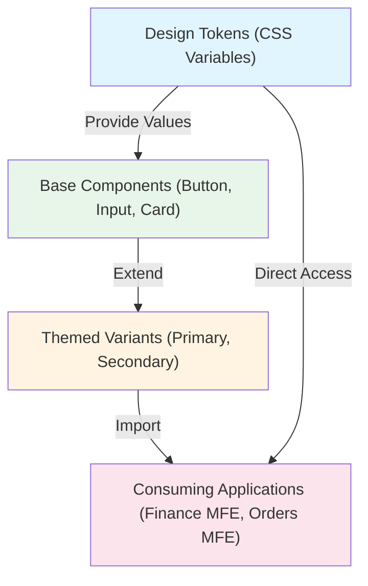

# Architecture: Design Consistency & Visual Identity

## Contents

- [Design Token Architecture](#design-token-architecture)
- [Component Library Integration Patterns](#component-library-integration-patterns)
- [Theming Systems](#theming-systems)
- [Layout Systems](#layout-systems)
- [Page Transitions and Motion](#page-transitions-and-motion)
- [MFE Design Consistency](#mfe-design-consistency)
- [Iconography and Asset Management](#iconography-and-asset-management)

## Design Token Architecture

Design tokens are the atomic design decisions—colors, spacing, typography, shadows, border-radius—expressed as semantic variables. They form the foundation of visual consistency.

### Design Token Pipeline

```mermaid
flowchart LR
    Figma["Figma Design Tokens (Designer Creates)"]
    Transform["Transform Layer (Style Dictionary)"]
    CSSVars["CSS Variables (--color-primary)"]
    Components["Component Consumption (var(--color-primary))"]
    Apps["Consuming Applications (MFEs & Apps)"]
    
    Figma -->|Export JSON| Transform
    Transform -->|Generate CSS| CSSVars
    CSSVars -->|Reference| Components
    Components -->|Use| Apps
    
    style Figma fill:#e1f5ff
    style Transform fill:#fff4e1
    style CSSVars fill:#e8f5e9
    style Components fill:#f3e5f5
    style Apps fill:#fce4ec
```



### What Tokens Are

Tokens abstract design values into named, semantic variables:

```css
/* Primitive tokens - raw values */
--color-blue-500: #3b82f6;
--spacing-4: 16px;
--font-size-base: 16px;

/* Semantic tokens - meaning-based */
--color-primary: var(--color-blue-500);
--spacing-card-padding: var(--spacing-4);
--font-size-body: var(--font-size-base);
```

**Token categories**:
- **Colors**: Backgrounds, text, borders, status colors (success, error, warning)
- **Spacing**: Margins, padding, gaps, component spacing
- **Typography**: Font families, sizes, weights, line heights
- **Shadows**: Elevation levels, focus rings
- **Border radius**: Component rounding, card corners
- **Motion**: Duration, easing curves

### Token Hierarchy

**Primitive → Semantic → Component**

```
Primitive: --color-blue-500: #3b82f6
    ↓
Semantic: --color-primary: var(--color-blue-500)
    ↓
Component: .button-primary { background: var(--color-primary); }
```

**Primitive tokens** are raw values (hex colors, pixel values). **Semantic tokens** add meaning (primary, danger, spacing-medium). **Component tokens** compose semantics into UI elements.

### Token Format

#### CSS Custom Properties

```css
:root {
  --color-primary: #3b82f6;
  --spacing-4: 16px;
  --border-radius-md: 8px;
}

.button {
  background: var(--color-primary);
  padding: var(--spacing-4);
  border-radius: var(--border-radius-md);
}
```

**Benefits**: Runtime theming, browser-native, no build step required.

#### Style Dictionary

Transforms design tokens into platform-specific formats:

```json
{
  "color": {
    "primary": {
      "value": "#3b82f6"
    }
  }
}
```

Generates CSS, JavaScript, iOS, Android formats from single source.

#### Tailwind Config

```javascript
// tailwind.config.js
module.exports = {
  theme: {
    extend: {
      colors: {
        primary: {
          500: '#3b82f6',
          600: '#2563eb',
        }
      },
      spacing: {
        '4': '16px',
        '8': '32px',
      }
    }
  }
}
```

**Usage**: `className="bg-primary-500 p-4"` - tokens become utility classes.

## Component Library Integration Patterns

### Component Library Architecture



### Consuming Propulsion

Propulsion is Pax8's mandatory design system for certain projects. Integration patterns:

```vue
<!-- Vue 3 with Propulsion -->
<template>
  <PaxButton variant="primary" @click="handleClick">
    Save Changes
  </PaxButton>
</template>

<script setup>
import { PaxButton } from '@pax8/propulsion-vue';
</script>
```

**Key principles**:
- Use Propulsion components directly; avoid wrapping unless necessary
- Follow Propulsion spacing and typography tokens
- Extend via composition, not modification

### Consuming MUI

Material-UI provides comprehensive components with theming:

```jsx
// React with MUI
import { Button, ThemeProvider, createTheme } from '@mui/material';

const theme = createTheme({
  palette: {
    primary: {
      main: '#3b82f6',
    },
  },
});

function App() {
  return (
    <ThemeProvider theme={theme}>
      <Button variant="contained" color="primary">
        Save Changes
      </Button>
    </ThemeProvider>
  );
}
```

**Customization approach**: Use `createTheme` for brand colors, typography, spacing. Avoid component-level overrides when possible.

### Wrapping Third-Party Components

When third-party components don't match design system:

```vue
<!-- Vue wrapper for consistency -->
<template>
  <div class="design-system-select">
    <ThirdPartySelect
      :options="options"
      :class="['pax-select', `pax-select--${variant}`]"
    />
  </div>
</template>

<style scoped>
.design-system-select {
  /* Apply design system spacing, colors */
  --select-padding: var(--spacing-4);
  --select-border-color: var(--color-border);
}
</style>
```

**Strategy**: Wrap with design system classes, apply tokens via CSS custom properties.

### Extending vs Overriding

**Extending** (preferred):
```jsx
// Create new component using design system primitives
import { Button } from '@mui/material';
import { styled } from '@mui/material/styles';

const IconButton = styled(Button)(({ theme }) => ({
  padding: theme.spacing(1),
  minWidth: 'auto',
}));
```

**Overriding** (avoid when possible):
```jsx
// Global theme override - use sparingly
const theme = createTheme({
  components: {
    MuiButton: {
      styleOverrides: {
        root: {
          borderRadius: '8px', // Override default
        },
      },
    },
  },
});
```

## Theming Systems

### CSS Custom Properties for Runtime Theming

```css
:root[data-theme="light"] {
  --color-background: #ffffff;
  --color-text: #1a1a1a;
}

:root[data-theme="dark"] {
  --color-background: #1a1a1a;
  --color-text: #ffffff;
}

.component {
  background: var(--color-background);
  color: var(--color-text);
}
```

**JavaScript toggle**:
```javascript
document.documentElement.setAttribute('data-theme', 'dark');
```

### Vue/React Theme Providers

**Vue 3 with provide/inject**:
```vue
<!-- ThemeProvider.vue -->
<script setup>
import { provide, ref } from 'vue';

const theme = ref('light');
const toggleTheme = () => {
  theme.value = theme.value === 'light' ? 'dark' : 'light';
  document.documentElement.setAttribute('data-theme', theme.value);
};

provide('theme', { theme, toggleTheme });
</script>
```

**React Context**:
```jsx
const ThemeContext = createContext();

function ThemeProvider({ children }) {
  const [theme, setTheme] = useState('light');
  
  useEffect(() => {
    document.documentElement.setAttribute('data-theme', theme);
  }, [theme]);
  
  return (
    <ThemeContext.Provider value={{ theme, setTheme }}>
      {children}
    </ThemeContext.Provider>
  );
}
```

### Dark Mode Architecture

**Token-based dark mode**:
```css
:root {
  /* Light mode defaults */
  --color-surface: #ffffff;
  --color-text-primary: #1a1a1a;
}

@media (prefers-color-scheme: dark) {
  :root {
    --color-surface: #1a1a1a;
    --color-text-primary: #ffffff;
  }
}

/* Manual override */
:root[data-theme="dark"] {
  --color-surface: #1a1a1a;
  --color-text-primary: #ffffff;
}
```

**Component-level dark mode**:
```jsx
// MUI dark mode
const darkTheme = createTheme({
  palette: {
    mode: 'dark',
  },
});
```

### Multi-Brand/White-Label Theming

```css
:root[data-brand="brand-a"] {
  --color-primary: #3b82f6;
  --font-family-heading: 'Brand A Font';
}

:root[data-brand="brand-b"] {
  --color-primary: #10b981;
  --font-family-heading: 'Brand B Font';
}
```

**Runtime brand switching**: Change `data-brand` attribute, all components update automatically.

## Layout Systems

### Consistent Grid

**12-column grid system**:
```css
.grid-container {
  display: grid;
  grid-template-columns: repeat(12, 1fr);
  gap: var(--spacing-4);
}

.col-4 { grid-column: span 4; }
.col-8 { grid-column: span 8; }
```

**Tailwind grid**:
```html
<div class="grid grid-cols-12 gap-4">
  <div class="col-span-4">Sidebar</div>
  <div class="col-span-8">Content</div>
</div>
```

### Spacing Scale

**4px or 8px base**:
```css
:root {
  --spacing-1: 4px;   /* 0.25rem */
  --spacing-2: 8px;   /* 0.5rem */
  --spacing-4: 16px;  /* 1rem */
  --spacing-8: 32px;  /* 2rem */
  --spacing-16: 64px; /* 4rem */
}
```

**Usage**: Always use tokens, never raw pixel values: `padding: var(--spacing-4)` not `padding: 15px`.

### Page Layout Templates

**Sidebar + Content**:
```vue
<template>
  <div class="layout-sidebar-content">
    <aside class="sidebar">
      <Navigation />
    </aside>
    <main class="content">
      <slot />
    </main>
  </div>
</template>

<style scoped>
.layout-sidebar-content {
  display: grid;
  grid-template-columns: 240px 1fr;
  min-height: 100vh;
}
</style>
```

**Full-width dashboard**:
```jsx
<div className="dashboard-grid">
  <Widget colSpan={6} rowSpan={2}>Chart 1</Widget>
  <Widget colSpan={6}>Chart 2</Widget>
  <Widget colSpan={12}>Table</Widget>
</div>
```

**Establish 2-3 standard layouts**, reuse across features.

## Page Transitions and Motion

### Purposeful Animation

Animations should guide attention and provide feedback, not distract:

```css
/* Page transition */
.page-enter-active {
  transition: opacity 0.2s ease-in, transform 0.2s ease-in;
}

.page-enter-from {
  opacity: 0;
  transform: translateY(10px);
}
```

### Shared Transition Patterns

**Consistent easing**:
```css
:root {
  --easing-standard: cubic-bezier(0.4, 0.0, 0.2, 1);
  --easing-decelerate: cubic-bezier(0.0, 0.0, 0.2, 1);
  --easing-accelerate: cubic-bezier(0.4, 0.0, 1, 1);
  
  --duration-fast: 150ms;
  --duration-normal: 250ms;
  --duration-slow: 350ms;
}
```

### Route Transition Conventions

**Vue Router**:
```vue
<template>
  <router-view v-slot="{ Component }">
    <transition name="page" mode="out-in">
      <component :is="Component" />
    </transition>
  </router-view>
</template>
```

**React Router**:
```jsx
<AnimatePresence mode="wait">
  <Routes>
    <Route path="/" element={<Home />} />
  </Routes>
</AnimatePresence>
```

## MFE Design Consistency

### Shared Design Tokens Package

```json
// @company/design-tokens/package.json
{
  "name": "@company/design-tokens",
  "version": "1.0.0",
  "main": "tokens.css"
}
```

**Each MFE consumes**:
```javascript
// In each MFE's build process
import '@company/design-tokens/tokens.css';
```

**Benefits**: Single source of truth, versioned tokens, easy updates.

### Wrapper/Shell Components

The shell application provides consistent chrome:

```jsx
// Shell app
function AppShell({ children }) {
  return (
    <div className="app-shell">
      <Header />
      <Navigation />
      <main className="app-content">
        {children} {/* MFE content injected here */}
      </main>
      <Footer />
    </div>
  );
}
```

**MFEs render into shell**, inheriting consistent header, navigation, footer.

### Handling Design System Version Mismatches

**Problem**: MFE A uses Propulsion v2.1, MFE B uses v2.3—visual inconsistencies.

**Solutions**:
1. **Lock versions**: All MFEs use same design system version
2. **CSS custom properties**: Shell provides tokens, MFEs consume (decouples versions)
3. **Wrapper components**: Shell provides wrapper components that normalize differences

**CSS custom properties approach**:
```css
/* Shell provides */
:root {
  --design-token-primary: #3b82f6;
  --design-token-spacing-4: 16px;
}

/* MFEs consume, regardless of internal component library version */
.mfe-component {
  color: var(--design-token-primary);
  padding: var(--design-token-spacing-4);
}
```

### Shared CSS Custom Properties via Shell

```html
<!-- Shell HTML -->
<html>
  <head>
    <link rel="stylesheet" href="/design-tokens.css">
  </head>
  <body>
    <div id="mfe-a"></div>
    <div id="mfe-b"></div>
  </body>
</html>
```

All MFEs inherit shell's CSS custom properties, ensuring visual consistency.

## Iconography and Asset Management

### Consistent Icon Library

**Choose one icon library** (e.g., Material Icons, Heroicons, Font Awesome) and use consistently:

```vue
<!-- Vue with Heroicons -->
<template>
  <Icon name="check-circle" size="24" />
</template>
```

```jsx
// React with Material Icons
import CheckCircleIcon from '@mui/icons-material/CheckCircle';
<CheckCircleIcon fontSize="medium" />
```

### Icon Sizing Conventions

```css
:root {
  --icon-size-xs: 16px;
  --icon-size-sm: 20px;
  --icon-size-md: 24px;
  --icon-size-lg: 32px;
  --icon-size-xl: 48px;
}
```

**Usage**: Always use size tokens, maintain consistent sizing relative to text.

### SVG Sprite vs Individual Imports

**SVG Sprite** (better for performance):
```html
<svg>
  <use href="#icon-check"></use>
</svg>
```

**Individual imports** (better for tree-shaking):
```jsx
import { CheckIcon } from '@heroicons/react/24/solid';
```

**Recommendation**: Use individual imports with proper tree-shaking for modern bundlers.
