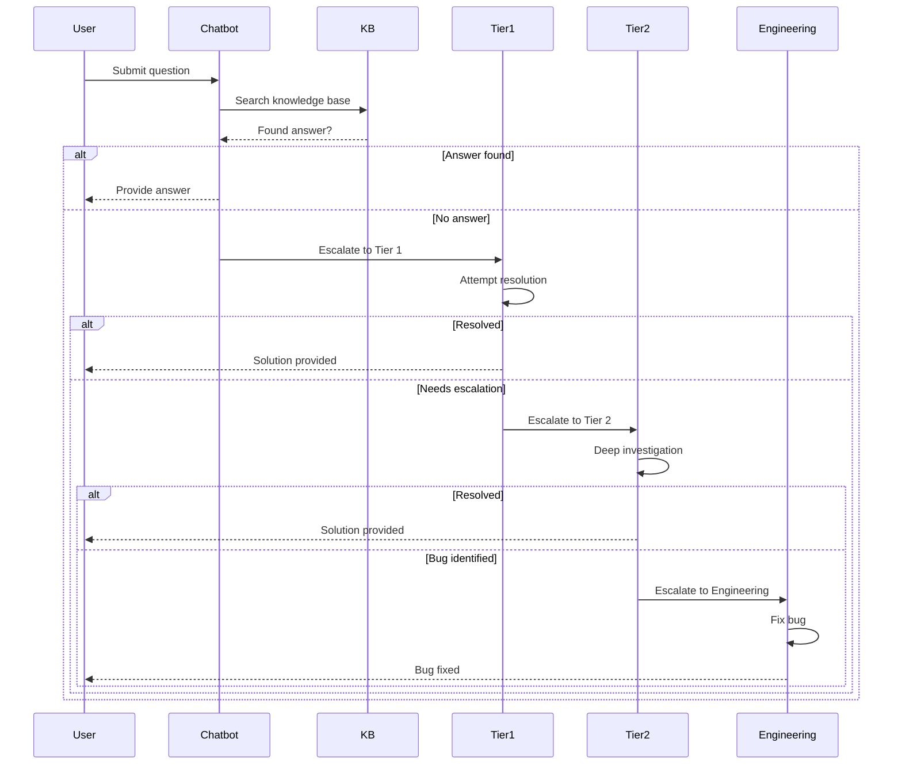
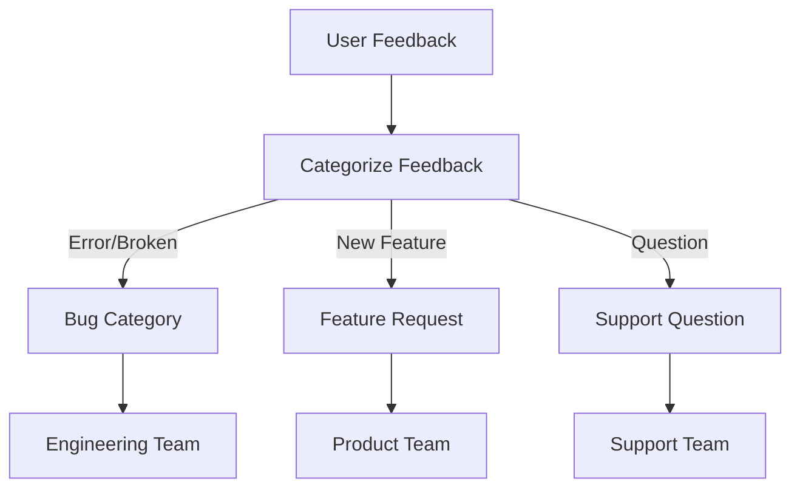

# Architecture: Feedback & Support

## Contents

- [Feedback Collection Architecture](#feedback-collection-architecture)
- [Support System Integration](#support-system-integration)
- [Knowledge Base Architecture](#knowledge-base-architecture)
- [In-App Help Patterns](#in-app-help-patterns)
- [Screenshot and Session Replay](#screenshot-and-session-replay)
- [Feedback Routing](#feedback-routing)
- [Analytics and Insights](#analytics-and-insights)
- [Multi-Tenant Considerations](#multi-tenant-considerations)

## Feedback Collection Architecture

### In-App Feedback Widget

The feedback widget is a persistent UI component that captures user feedback with minimal friction. It should be:

- **Always accessible**: Fixed position (e.g., bottom-right corner) or accessible via keyboard shortcut
- **Context-aware**: Automatically captures current page URL, user context, browser info, and timestamp
- **Lightweight**: Doesn't impact app performance or interfere with user workflows

**Vue 3 Implementation Example**:

```vue
<template>
  <FeedbackWidget
    v-if="showWidget"
    :user-context="userContext"
    :page-context="pageContext"
    @submit="handleFeedbackSubmit"
    @close="showWidget = false"
  />
  <button
    class="feedback-trigger"
    @click="showWidget = true"
    aria-label="Submit feedback"
  >
    💬 Feedback
  </button>
</template>

<script setup lang="ts">
import { ref, computed } from 'vue'
import { useRoute } from 'vue-router'
import { useUserStore } from '@/stores/user'

const route = useRoute()
const userStore = useUserStore()
const showWidget = ref(false)

const userContext = computed(() => ({
  userId: userStore.userId,
  email: userStore.email,
  tenantId: userStore.tenantId,
  role: userStore.role,
  browser: navigator.userAgent,
  timestamp: new Date().toISOString()
}))

const pageContext = computed(() => ({
  url: route.fullPath,
  routeName: route.name,
  query: route.query,
  params: route.params
}))

const handleFeedbackSubmit = async (feedback: FeedbackPayload) => {
  await submitFeedback({
    ...feedback,
    context: {
      user: userContext.value,
      page: pageContext.value
    }
  })
  showWidget.value = false
}
</script>
```

**React Implementation Example**:

```tsx
import { useState, useMemo } from 'react'
import { useLocation } from 'react-router-dom'
import { useUser } from '@/hooks/useUser'
import { FeedbackWidget } from '@/components/FeedbackWidget'

export function FeedbackButton() {
  const [showWidget, setShowWidget] = useState(false)
  const location = useLocation()
  const user = useUser()

  const context = useMemo(() => ({
    user: {
      userId: user.id,
      email: user.email,
      tenantId: user.tenantId,
      role: user.role
    },
    page: {
      url: location.pathname + location.search,
      routeName: location.pathname,
      timestamp: new Date().toISOString()
    },
    browser: navigator.userAgent
  }), [location, user])

  return (
    <>
      <button
        onClick={() => setShowWidget(true)}
        aria-label="Submit feedback"
      >
        💬 Feedback
      </button>
      {showWidget && (
        <FeedbackWidget
          context={context}
          onSubmit={handleSubmit}
          onClose={() => setShowWidget(false)}
        />
      )}
    </>
  )
}
```

### Feedback API Endpoint

**Spring Boot REST API**:

```kotlin
@RestController
@RequestMapping("/api/v1/feedback")
class FeedbackController(
    private val feedbackService: FeedbackService,
    private val supportIntegrationService: SupportIntegrationService
) {
    
    @PostMapping
    fun submitFeedback(
        @RequestBody request: FeedbackRequest,
        @AuthenticationPrincipal user: UserPrincipal
    ): ResponseEntity<FeedbackResponse> {
        val feedback = feedbackService.createFeedback(
            userId = user.id,
            tenantId = user.tenantId,
            type = request.type,
            category = request.category,
            subject = request.subject,
            description = request.description,
            context = request.context,
            attachments = request.attachments
        )
        
        // Route to appropriate support system
        val ticket = supportIntegrationService.createTicket(feedback)
        
        return ResponseEntity.ok(
            FeedbackResponse(
                feedbackId = feedback.id,
                ticketNumber = ticket.number,
                status = "submitted",
                estimatedResponseTime = "4 hours"
            )
        )
    }
    
    @GetMapping("/{feedbackId}/status")
    fun getStatus(
        @PathVariable feedbackId: String,
        @AuthenticationPrincipal user: UserPrincipal
    ): ResponseEntity<FeedbackStatusResponse> {
        val feedback = feedbackService.getFeedback(feedbackId, user.tenantId)
        val ticket = supportIntegrationService.getTicket(feedback.ticketId)
        
        return ResponseEntity.ok(
            FeedbackStatusResponse(
                status = ticket.status,
                lastUpdate = ticket.lastUpdated,
                resolution = ticket.resolution
            )
        )
    }
}
```

### Feedback Storage and Routing

Feedback should be stored in your database with full context:

```kotlin
@Entity
@Table(name = "feedback")
data class Feedback(
    @Id
    val id: String = UUID.randomUUID().toString(),
    
    val userId: String,
    val tenantId: String,
    
    @Enumerated(EnumType.STRING)
    val type: FeedbackType, // BUG, FEATURE_REQUEST, QUESTION, COMPLIMENT
    
    @Enumerated(EnumType.STRING)
    val category: FeedbackCategory, // UI, API, INTEGRATION, BILLING
    
    val subject: String,
    val description: String,
    
    @Type(type = "jsonb")
    val context: FeedbackContext, // URL, browser, user actions, screenshots
    
    val ticketId: String?, // External ticket system ID
    
    @Enumerated(EnumType.STRING)
    val status: FeedbackStatus = FeedbackStatus.SUBMITTED,
    
    val createdAt: Instant = Instant.now(),
    val updatedAt: Instant = Instant.now()
)

data class FeedbackContext(
    val url: String,
    val routeName: String?,
    val browser: String,
    val userAgent: String,
    val screenResolution: String?,
    val consoleErrors: List<String>?,
    val networkErrors: List<String>?,
    val screenshotUrl: String?,
    val sessionReplayId: String?
)
```

## Support System Integration

### Support Escalation Flow

Support requests escalate through multiple tiers based on complexity and user tier:



### Ticketing Systems

Integrate with external ticketing systems for ticket lifecycle management:

**Jira Service Management Integration**:

```kotlin
@Service
class JiraServiceManagementIntegration(
    private val jiraClient: JiraClient,
    private val feedbackRepository: FeedbackRepository
) : SupportIntegrationService {
    
    override fun createTicket(feedback: Feedback): SupportTicket {
        val issueRequest = CreateIssueRequest(
            projectKey = "SUPPORT",
            issueType = mapFeedbackTypeToIssueType(feedback.type),
            summary = feedback.subject,
            description = buildDescription(feedback),
            customFields = mapOf(
                "customfield_10001" to feedback.tenantId, // Tenant ID
                "customfield_10002" to feedback.category.name, // Category
                "customfield_10003" to feedback.context.url // Context URL
            ),
            priority = determinePriority(feedback)
        )
        
        val issue = jiraClient.createIssue(issueRequest)
        
        // Attach screenshot if available
        feedback.context.screenshotUrl?.let { url ->
            jiraClient.addAttachment(issue.key, url)
        }
        
        // Update feedback with ticket ID
        feedback.ticketId = issue.key
        feedbackRepository.save(feedback)
        
        return SupportTicket(
            number = issue.key,
            url = issue.self,
            status = issue.status.name
        )
    }
    
    override fun syncTicketStatus(ticketId: String) {
        val issue = jiraClient.getIssue(ticketId)
        val feedback = feedbackRepository.findByTicketId(ticketId)
        
        feedback?.let {
            it.status = mapIssueStatusToFeedbackStatus(issue.status)
            it.updatedAt = Instant.now()
            feedbackRepository.save(it)
            
            // Notify user of status change
            notificationService.notifyFeedbackStatusUpdate(it)
        }
    }
}
```

**Zendesk Integration**:

```kotlin
@Service
class ZendeskIntegration(
    private val zendeskClient: ZendeskClient
) : SupportIntegrationService {
    
    override fun createTicket(feedback: Feedback): SupportTicket {
        val ticketRequest = CreateTicketRequest(
            subject = feedback.subject,
            comment = TicketComment(
                body = buildDescription(feedback),
                htmlBody = buildHtmlDescription(feedback)
            ),
            requester = Requester(
                email = feedback.userEmail,
                name = feedback.userName
            ),
            customFields = listOf(
                CustomField(id = 12345678L, value = feedback.tenantId),
                CustomField(id = 12345679L, value = feedback.category.name)
            ),
            tags = listOf("feedback", feedback.type.name.lowercase()),
            priority = determinePriority(feedback)
        )
        
        val ticket = zendeskClient.createTicket(ticketRequest)
        
        return SupportTicket(
            number = ticket.id.toString(),
            url = ticket.url,
            status = ticket.status
        )
    }
}
```

### Bi-Directional Sync

Poll ticketing systems for status updates and sync back to your application:

```kotlin
@Scheduled(fixedRate = 300000) // Every 5 minutes
fun syncTicketStatuses() {
    val pendingFeedbacks = feedbackRepository.findByStatusIn(
        listOf(FeedbackStatus.SUBMITTED, FeedbackStatus.IN_PROGRESS)
    )
    
    pendingFeedbacks.forEach { feedback ->
        feedback.ticketId?.let { ticketId ->
            try {
                supportIntegrationService.syncTicketStatus(ticketId)
            } catch (e: Exception) {
                log.error("Failed to sync ticket status for $ticketId", e)
            }
        }
    }
}
```

## Knowledge Base Architecture

### Content Management

Knowledge base content should be:
- **Versioned**: Track changes over time
- **Searchable**: Full-text search with relevance ranking
- **Categorized**: Organized by topic, user role, feature area
- **Contextual**: Tagged with metadata for contextual help

**Content Model**:

```kotlin
@Entity
@Table(name = "knowledge_base_articles")
data class KnowledgeBaseArticle(
    @Id
    val id: String = UUID.randomUUID().toString(),
    
    val title: String,
    val slug: String,
    
    @Column(columnDefinition = "TEXT")
    val content: String, // Markdown or HTML
    
    @Column(columnDefinition = "TEXT")
    val excerpt: String,
    
    @Enumerated(EnumType.STRING)
    val category: ArticleCategory,
    
    val tags: List<String>,
    
    // Contextual metadata
    val applicableRoutes: List<String>?, // Routes where this article is relevant
    val applicableRoles: List<String>?, // User roles this applies to
    val applicableFeatures: List<String>?, // Feature flags
    
    val viewCount: Int = 0,
    val helpfulCount: Int = 0,
    val notHelpfulCount: Int = 0,
    
    val published: Boolean = false,
    val publishedAt: Instant?,
    
    val createdAt: Instant = Instant.now(),
    val updatedAt: Instant = Instant.now()
)
```

### Search Integration

Implement full-text search using Elasticsearch or PostgreSQL's full-text search:

```kotlin
@Service
class KnowledgeBaseSearchService(
    private val articleRepository: KnowledgeBaseArticleRepository,
    private val searchClient: SearchClient
) {
    
    fun search(
        query: String,
        filters: SearchFilters? = null
    ): List<SearchResult> {
        val searchRequest = SearchRequest(
            query = query,
            filters = filters ?: SearchFilters(),
            limit = 20
        )
        
        return searchClient.search(searchRequest).map { hit ->
            SearchResult(
                article = hit.document,
                relevanceScore = hit.score,
                matchedSnippets = hit.highlights
            )
        }
    }
    
    fun findContextualArticles(
        route: String,
        userRole: String,
        featureFlags: Set<String>
    ): List<KnowledgeBaseArticle> {
        return articleRepository.findByApplicableContext(
            route = route,
            role = userRole,
            features = featureFlags,
            published = true
        ).sortedByDescending { it.helpfulCount }
    }
}
```

### Versioning

Track article versions for audit and rollback:

```kotlin
@Entity
@Table(name = "knowledge_base_article_versions")
data class ArticleVersion(
    @Id
    val id: String = UUID.randomUUID().toString(),
    
    val articleId: String,
    val version: Int,
    
    @Column(columnDefinition = "TEXT")
    val content: String,
    
    val changedBy: String,
    val changeReason: String?,
    
    val createdAt: Instant = Instant.now()
)
```

## In-App Help Patterns

### Contextual Tooltips

Show tooltips on key UI elements:

```vue
<template>
  <div class="feature-section">
    <h2>
      Bulk Export
      <HelpTooltip
        article-id="bulk-export-guide"
        placement="right"
      />
    </h2>
  </div>
</template>
```

### Help Panel/Sidebar

Persistent help panel that shows contextual articles:

```tsx
export function HelpPanel({ route, userRole }: HelpPanelProps) {
  const { articles, loading } = useContextualHelp(route, userRole)
  
  return (
    <Drawer anchor="right" open={isOpen} onClose={onClose}>
      <HelpPanelHeader />
      <HelpArticleList articles={articles} />
      <HelpSearch />
    </Drawer>
  )
}
```

### Chatbot/AI Assistant

Integrate AI-powered help assistant:

```kotlin
@Service
class HelpAssistantService(
    private val llmClient: LLMClient,
    private val knowledgeBaseService: KnowledgeBaseService
) {
    
    suspend fun answerQuestion(
        question: String,
        context: UserContext
    ): AssistantResponse {
        // Retrieve relevant articles
        val relevantArticles = knowledgeBaseService.search(question, limit = 5)
        
        // Generate answer using LLM with article context
        val answer = llmClient.generateAnswer(
            question = question,
            context = relevantArticles.map { it.content },
            userContext = context
        )
        
        return AssistantResponse(
            answer = answer.text,
            sources = relevantArticles.map { it.id },
            suggestedArticles = relevantArticles.take(3)
        )
    }
}
```

### "What's New" Changelog

Display feature announcements and updates:

```kotlin
@Entity
@Table(name = "changelog_entries")
data class ChangelogEntry(
    @Id
    val id: String = UUID.randomUUID().toString(),
    
    val title: String,
    val description: String,
    
    @Enumerated(EnumType.STRING)
    val type: ChangelogType, // FEATURE, IMPROVEMENT, BUG_FIX, ANNOUNCEMENT
    
    val featureFlags: List<String>?, // Show only if feature flag enabled
    
    val publishedAt: Instant,
    val expiresAt: Instant?, // Auto-hide after date
    
    val viewCount: Int = 0,
    val dismissedBy: Set<String> = emptySet() // User IDs who dismissed
)
```

## Screenshot and Session Replay

### Automatic Context Capture

Capture screenshots and session data when feedback is submitted:

```typescript
// Frontend: Capture screenshot using html2canvas
import html2canvas from 'html2canvas'

export async function captureScreenshot(): Promise<string> {
  const canvas = await html2canvas(document.body, {
    useCORS: true,
    logging: false,
    scale: 0.5 // Reduce size
  })
  
  return canvas.toDataURL('image/png')
}

// Capture console errors
export function captureConsoleErrors(): string[] {
  const errors: string[] = []
  const originalError = console.error
  
  console.error = (...args) => {
    errors.push(args.join(' '))
    originalError.apply(console, args)
  }
  
  return errors
}

// Capture network errors
export function captureNetworkErrors(): Promise<NetworkError[]> {
  // Intercept fetch/XMLHttpRequest errors
  // Return array of failed requests
}
```

### Session Replay Integration

Integrate with session replay tools (Sentry, LogRocket, FullStory):

```typescript
import * as Sentry from '@sentry/browser'

export function initializeSessionReplay() {
  Sentry.init({
    dsn: process.env.VITE_SENTRY_DSN,
    integrations: [
      new Sentry.Replay({
        maskAllText: true, // Privacy: mask PII
        blockAllMedia: true
      })
    ],
    tracesSampleRate: 0.1,
    replaysSessionSampleRate: 0.1,
    replaysOnErrorSampleRate: 1.0 // Always capture on error
  })
}

// When feedback is submitted, include session replay ID
export function submitFeedbackWithReplay(feedback: FeedbackPayload) {
  const replayId = Sentry.getCurrentHub()
    .getClient()
    ?.getIntegration(Sentry.Replay)
    ?.getReplayId()
  
  return submitFeedback({
    ...feedback,
    context: {
      ...feedback.context,
      sessionReplayId: replayId
    }
  })
}
```

## Feedback Routing

### Feedback Routing Pipeline

User feedback flows through categorization and routing to the appropriate team:



### Categorization and Priority

Automatically categorize and prioritize feedback:

```kotlin
@Service
class FeedbackRoutingService {
    
    fun categorizeFeedback(feedback: Feedback): FeedbackCategory {
        val description = feedback.description.lowercase()
        
        return when {
            description.contains("error") || description.contains("broken") -> 
                FeedbackCategory.BUG
            description.contains("feature") || description.contains("add") -> 
                FeedbackCategory.FEATURE_REQUEST
            description.contains("how") || description.contains("question") -> 
                FeedbackCategory.QUESTION
            else -> FeedbackCategory.GENERAL
        }
    }
    
    fun determinePriority(feedback: Feedback): Priority {
        val isBlocking = feedback.context.consoleErrors?.isNotEmpty() == true
        val isAdminUser = feedback.userRole == "ADMIN"
        val mentionsCritical = feedback.description.contains("critical", ignoreCase = true)
        
        return when {
            isBlocking && isAdminUser -> Priority.CRITICAL
            isBlocking -> Priority.HIGH
            isAdminUser && mentionsCritical -> Priority.HIGH
            else -> Priority.MEDIUM
        }
    }
    
    fun routeToTeam(feedback: Feedback): Team {
        return when (feedback.category) {
            FeedbackCategory.BUG -> Team.ENGINEERING
            FeedbackCategory.FEATURE_REQUEST -> Team.PRODUCT
            FeedbackCategory.QUESTION -> Team.SUPPORT
            FeedbackCategory.BILLING -> Team.FINANCE
            else -> Team.SUPPORT
        }
    }
}
```

## Analytics and Insights

### Feedback Sentiment Analysis

Analyze feedback sentiment to prioritize issues:

```kotlin
@Service
class FeedbackAnalyticsService(
    private val sentimentAnalysisClient: SentimentAnalysisClient
) {
    
    fun analyzeSentiment(feedback: Feedback): SentimentAnalysis {
        val sentiment = sentimentAnalysisClient.analyze(feedback.description)
        
        return SentimentAnalysis(
            sentiment = sentiment.label, // POSITIVE, NEGATIVE, NEUTRAL
            score = sentiment.score,
            keywords = extractKeywords(feedback.description),
            urgency = calculateUrgency(sentiment)
        )
    }
    
    fun clusterCommonIssues(feedbacks: List<Feedback>): List<IssueCluster> {
        // Use ML clustering to group similar feedback
        // Identify patterns and common issues
    }
}
```

### Support Ticket Trend Tracking

Track ticket volume and resolution trends:

```kotlin
@Repository
interface FeedbackAnalyticsRepository : JpaRepository<Feedback, String> {
    
    @Query("""
        SELECT 
            DATE(created_at) as date,
            COUNT(*) as count,
            AVG(EXTRACT(EPOCH FROM (resolved_at - created_at))/3600) as avg_hours_to_resolve
        FROM feedback
        WHERE created_at >= :startDate
        GROUP BY DATE(created_at)
        ORDER BY date DESC
    """)
    fun getDailyTrends(startDate: Instant): List<DailyTrend>
    
    @Query("""
        SELECT category, COUNT(*) as count
        FROM feedback
        WHERE created_at >= :startDate
        GROUP BY category
        ORDER BY count DESC
    """)
    fun getCategoryBreakdown(startDate: Instant): List<CategoryCount>
}
```

## Multi-Tenant Considerations

### Tenant-Specific Support Channels

Isolate support channels per tenant:

```kotlin
@Service
class TenantSupportService {
    
    fun getSupportChannels(tenantId: String): List<SupportChannel> {
        val tenant = tenantRepository.findById(tenantId)
        
        return when (tenant.tier) {
            TenantTier.ENTERPRISE -> listOf(
                SupportChannel.EMAIL,
                SupportChannel.PHONE,
                SupportChannel.DEDICATED_SLACK
            )
            TenantTier.PRO -> listOf(
                SupportChannel.EMAIL,
                SupportChannel.CHAT
            )
            TenantTier.BASIC -> listOf(
                SupportChannel.EMAIL,
                SupportChannel.KNOWLEDGE_BASE
            )
        }
    }
}
```

### Admin vs End-User Support Paths

Different support paths for admins vs regular users:

```kotlin
fun createSupportTicket(
    feedback: Feedback,
    userRole: UserRole
): SupportTicket {
    val priority = when (userRole) {
        UserRole.ADMIN -> Priority.HIGH
        UserRole.USER -> Priority.MEDIUM
    }
    
    val team = when (userRole) {
        UserRole.ADMIN -> Team.ACCOUNT_MANAGEMENT
        UserRole.USER -> Team.SUPPORT
    }
    
    return supportIntegrationService.createTicket(
        feedback = feedback,
        priority = priority,
        assignedTeam = team
    )
}
```

### Tenant Isolation

Ensure feedback and tickets are properly isolated:

```kotlin
@Repository
interface FeedbackRepository : JpaRepository<Feedback, String> {
    
    fun findByTenantId(tenantId: String): List<Feedback>
    
    fun findByTenantIdAndId(
        tenantId: String,
        id: String
    ): Feedback?
    
    // Prevent cross-tenant access
    @Query("""
        SELECT f FROM Feedback f 
        WHERE f.tenantId = :tenantId 
        AND f.id = :id
    """)
    fun findSecure(tenantId: String, id: String): Feedback?
}
```
