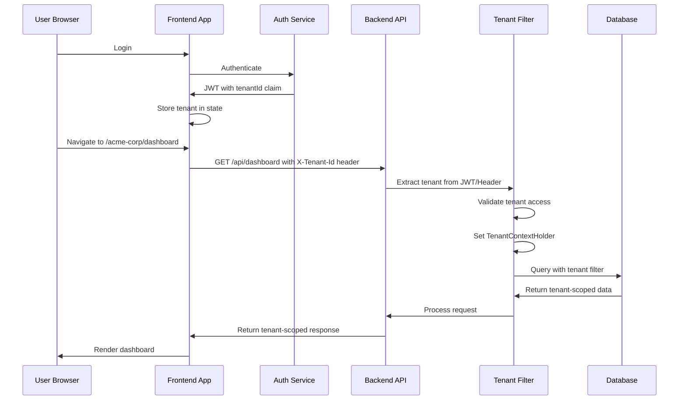
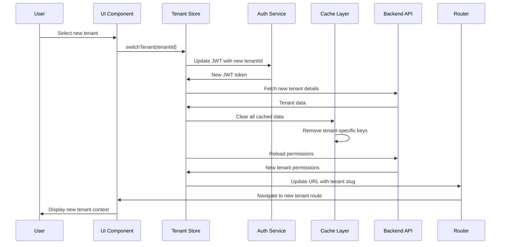

# Architecture: Multi-Tenancy UX

## Contents

- [Tenant Context Management](#tenant-context-management)
- [Frontend Tenant State](#frontend-tenant-state)
- [Tenant Switching Architecture](#tenant-switching-architecture)
- [White-Labeling Architecture](#white-labeling-architecture)
- [Data Isolation in the UI](#data-isolation-in-the-ui)
- [Tenant-Aware Routing](#tenant-aware-routing)
- [Multi-Tenant Notification Isolation](#multi-tenant-notification-isolation)
- [Server-Side Multi-Tenancy](#server-side-multi-tenancy)
- [Impersonation Architecture](#impersonation-architecture)

## Tenant Context Management

Tenant context must be established and maintained throughout the request lifecycle. Multiple mechanisms work together to ensure tenant identity is never lost.

### Tenant Context Flow



### Tenant ID in JWT Claims

The authentication token includes the current tenant ID, allowing the backend to validate tenant context.

```kotlin
// JWT Claims structure
{
  "sub": "user-123",
  "email": "sarah@example.com",
  "tenantId": "acme-corp",  // Current active tenant
  "tenantRoles": {
    "acme-corp": ["admin"],
    "beta-partners": ["viewer"]
  },
  "iat": 1234567890,
  "exp": 1234571490
}
```

**Backend validation:**
```kotlin
@Component
class TenantContextResolver {
    fun resolveTenant(request: HttpServletRequest): String {
        // 1. Check JWT claim (primary source)
        val jwt = extractJwt(request)
        val tenantId = jwt?.getClaim("tenantId")?.asString()
        if (tenantId != null) return tenantId
        
        // 2. Fallback to header
        val headerTenant = request.getHeader("X-Tenant-Id")
        if (headerTenant != null) return headerTenant
        
        // 3. Fallback to URL path
        val pathTenant = extractTenantFromPath(request.requestURI)
        return pathTenant ?: throw TenantContextMissingException()
    }
}
```

### Tenant ID in URL

URL structure includes tenant context for deep linking and bookmarking.

**Path-based:** `/acme-corp/dashboard`, `/acme-corp/products/123`
**Subdomain-based:** `acme.platform.com/dashboard`, `beta.platform.com/products/123`

```typescript
// Vue 3 route structure
const routes = [
  {
    path: '/:tenantSlug/dashboard',
    component: Dashboard,
    beforeEnter: validateTenantAccess
  },
  {
    path: '/:tenantSlug/products/:id',
    component: ProductDetail,
    beforeEnter: validateTenantAccess
  }
]
```

### Tenant Context in Request Headers

Frontend automatically includes tenant ID in all API requests.

```typescript
// Vue 3 API client with tenant header
import axios from 'axios'
import { useTenantStore } from '@/stores/tenant'

const apiClient = axios.create({
  baseURL: import.meta.env.VITE_API_BASE_URL
})

apiClient.interceptors.request.use((config) => {
  const tenantStore = useTenantStore()
  if (tenantStore.currentTenant?.id) {
    config.headers['X-Tenant-Id'] = tenantStore.currentTenant.id
  }
  return config
})
```

### Spring Security Tenant Filter

Backend filter validates tenant context on every request.

```kotlin
@Component
class TenantContextFilter(
    private val tenantResolver: TenantContextResolver,
    private val tenantAccessValidator: TenantAccessValidator
) : OncePerRequestFilter() {
    
    override fun doFilterInternal(
        request: HttpServletRequest,
        response: HttpServletResponse,
        filterChain: FilterChain
    ) {
        val tenantId = tenantResolver.resolveTenant(request)
        
        // Validate user has access to this tenant
        val user = SecurityContextHolder.getContext().authentication
        tenantAccessValidator.validateAccess(user, tenantId)
        
        // Set tenant context in ThreadLocal
        TenantContextHolder.setTenantId(tenantId)
        
        try {
            filterChain.doFilter(request, response)
        } finally {
            TenantContextHolder.clear()
        }
    }
}
```

## Frontend Tenant State

Frontend maintains tenant state in a centralized store, making it accessible throughout the application.

### Current Tenant in Pinia/Zustand Store

**Vue 3 with Pinia:**
```typescript
// stores/tenant.ts
import { defineStore } from 'pinia'
import { ref, computed } from 'vue'
import { tenantApi } from '@/api/tenant'

export const useTenantStore = defineStore('tenant', () => {
  const currentTenant = ref<Tenant | null>(null)
  const availableTenants = ref<Tenant[]>([])
  const isLoading = ref(false)
  
  const tenantId = computed(() => currentTenant.value?.id)
  const tenantSlug = computed(() => currentTenant.value?.slug)
  const tenantBranding = computed(() => currentTenant.value?.branding)
  
  async function loadAvailableTenants() {
    isLoading.value = true
    try {
      availableTenants.value = await tenantApi.getAvailableTenants()
    } finally {
      isLoading.value = false
    }
  }
  
  async function switchTenant(tenantId: string) {
    isLoading.value = true
    try {
      // Update JWT with new tenant context
      await authApi.switchTenant(tenantId)
      
      // Load new tenant details
      currentTenant.value = await tenantApi.getTenant(tenantId)
      
      // Clear all cached data
      await clearTenantData()
      
      // Refresh permissions and navigation
      await refreshTenantContext()
    } finally {
      isLoading.value = false
    }
  }
  
  return {
    currentTenant,
    availableTenants,
    isLoading,
    tenantId,
    tenantSlug,
    tenantBranding,
    loadAvailableTenants,
    switchTenant
  }
})
```

**React with Zustand:**
```typescript
// stores/tenantStore.ts
import { create } from 'zustand'
import { tenantApi } from '@/api/tenant'

interface TenantState {
  currentTenant: Tenant | null
  availableTenants: Tenant[]
  isLoading: boolean
  switchTenant: (tenantId: string) => Promise<void>
  loadAvailableTenants: () => Promise<void>
}

export const useTenantStore = create<TenantState>((set, get) => ({
  currentTenant: null,
  availableTenants: [],
  isLoading: false,
  
  switchTenant: async (tenantId: string) => {
    set({ isLoading: true })
    try {
      await authApi.switchTenant(tenantId)
      const tenant = await tenantApi.getTenant(tenantId)
      set({ currentTenant: tenant })
      await clearTenantData()
      await refreshTenantContext()
    } finally {
      set({ isLoading: false })
    }
  },
  
  loadAvailableTenants: async () => {
    const tenants = await tenantApi.getAvailableTenants()
    set({ availableTenants: tenants })
  }
}))
```

### Tenant Context Provider

React context provides tenant state to all components.

```typescript
// contexts/TenantContext.tsx
import { createContext, useContext, ReactNode } from 'react'
import { useTenantStore } from '@/stores/tenantStore'

const TenantContext = createContext<TenantContextValue | null>(null)

export function TenantProvider({ children }: { children: ReactNode }) {
  const tenantStore = useTenantStore()
  
  return (
    <TenantContext.Provider value={{
      currentTenant: tenantStore.currentTenant,
      switchTenant: tenantStore.switchTenant,
      isLoading: tenantStore.isLoading
    }}>
      {children}
    </TenantContext.Provider>
  )
}

export function useCurrentTenant() {
  const context = useContext(TenantContext)
  if (!context) {
    throw new Error('useCurrentTenant must be used within TenantProvider')
  }
  return context
}
```

### Tenant-Aware API Client

API client automatically includes tenant header and handles tenant-scoped responses.

```typescript
// api/client.ts
import axios, { AxiosInstance } from 'axios'
import { useTenantStore } from '@/stores/tenant'

class TenantAwareApiClient {
  private client: AxiosInstance
  
  constructor() {
    this.client = axios.create({
      baseURL: import.meta.env.VITE_API_BASE_URL
    })
    
    this.setupInterceptors()
  }
  
  private setupInterceptors() {
    // Request interceptor: add tenant header
    this.client.interceptors.request.use((config) => {
      const tenantStore = useTenantStore()
      if (tenantStore.tenantId) {
        config.headers['X-Tenant-Id'] = tenantStore.tenantId
      }
      return config
    })
    
    // Response interceptor: validate tenant context
    this.client.interceptors.response.use(
      (response) => response,
      (error) => {
        if (error.response?.status === 403 && 
            error.response?.data?.code === 'TENANT_ACCESS_DENIED') {
          // User doesn't have access to this tenant
          router.push('/unauthorized')
        }
        return Promise.reject(error)
      }
    )
  }
  
  get instance() {
    return this.client
  }
}

export const apiClient = new TenantAwareApiClient()
```

## Tenant Switching Architecture

Switching tenants requires coordinated updates across frontend state, backend context, and cached data.

### Tenant Switching Flow



### Re-fetch Permissions on Switch

Permissions are tenant-specific—switching tenants requires reloading permissions.

```typescript
// After tenant switch
async function refreshTenantContext() {
  // 1. Reload permissions for new tenant
  const permissions = await permissionsApi.getCurrentUserPermissions()
  permissionsStore.setPermissions(permissions)
  
  // 2. Update navigation based on permissions
  navigationStore.refreshNavigation(permissions)
  
  // 3. Reload user profile (may have different role in new tenant)
  const profile = await userApi.getCurrentUserProfile()
  userStore.setProfile(profile)
}
```

### Clear Cached Data for Previous Tenant

**Critical:** All cached data from previous tenant must be cleared to prevent data leakage.

```typescript
async function clearTenantData() {
  // Clear API response cache
  queryClient.clear() // React Query
  // or
  cache.clear() // Vue Query / Apollo
  
  // Clear localStorage/sessionStorage tenant-specific data
  const keys = Object.keys(localStorage)
  keys.forEach(key => {
    if (key.startsWith(`tenant:${previousTenantId}:`)) {
      localStorage.removeItem(key)
    }
  })
  
  // Clear IndexedDB tenant-specific data
  await clearTenantIndexedDB(previousTenantId)
  
  // Reset all stores to initial state
  productsStore.reset()
  ordersStore.reset()
  notificationsStore.reset()
}
```

### Update URL/Subdomain

URL must reflect new tenant context for deep linking and bookmarking.

```typescript
// Vue 3 router
async function switchTenant(tenantId: string) {
  await tenantStore.switchTenant(tenantId)
  
  const tenant = tenantStore.currentTenant
  const currentPath = router.currentRoute.value.path
  
  // Extract path without tenant slug
  const pathWithoutTenant = currentPath.replace(/^\/[^/]+/, '') || '/dashboard'
  
  // Navigate to same path but with new tenant slug
  router.push(`/${tenant.slug}${pathWithoutTenant}`)
}
```

### Refresh Navigation

Different tenants may have different feature sets based on subscription plans.

```typescript
// Navigation adapts to tenant plan + user permissions
async function refreshNavigation() {
  const tenant = tenantStore.currentTenant
  const permissions = permissionsStore.permissions
  
  // Load tenant plan features
  const planFeatures = await tenantApi.getPlanFeatures(tenant.id)
  
  // Build navigation based on plan + permissions
  const navigation = buildNavigation({
    planFeatures,
    permissions,
    tenantId: tenant.id
  })
  
  navigationStore.setNavigation(navigation)
}
```

## White-Labeling Architecture

White-labeling requires dynamic theme loading, asset management, and fallback handling.

### Tenant-Specific Theme (CSS Custom Properties)

Load tenant-specific CSS variables for colors, fonts, spacing.

```typescript
// Load tenant theme on tenant switch
async function loadTenantTheme(tenant: Tenant) {
  if (!tenant.branding) {
    // Use default theme
    document.documentElement.style.setProperty('--primary-color', '#1a73e8')
    return
  }
  
  // Apply tenant branding
  document.documentElement.style.setProperty(
    '--primary-color',
    tenant.branding.primaryColor || '#1a73e8'
  )
  document.documentElement.style.setProperty(
    '--secondary-color',
    tenant.branding.secondaryColor || '#34a853'
  )
  document.documentElement.style.setProperty(
    '--font-family',
    tenant.branding.fontFamily || 'system-ui'
  )
}
```

**CSS usage:**
```css
.button-primary {
  background-color: var(--primary-color);
  color: white;
}

.header {
  border-bottom: 2px solid var(--primary-color);
}
```

### Logo/Branding Storage and Serving

Tenant logos stored in CDN, served with caching and fallback.

```kotlin
// Backend: Serve tenant logo
@GetMapping("/api/tenants/{tenantId}/logo")
fun getTenantLogo(
    @PathVariable tenantId: String,
    @RequestParam(required = false) size: String?
): ResponseEntity<Resource> {
    val tenant = tenantService.getTenant(tenantId)
    val logoUrl = tenant.branding?.logoUrl
    
    if (logoUrl == null) {
        // Return default platform logo
        return ResponseEntity.ok(defaultLogoResource)
    }
    
    // Proxy logo from CDN or serve from storage
    val logoResource = logoService.getLogo(logoUrl, size)
    return ResponseEntity.ok()
        .header(HttpHeaders.CACHE_CONTROL, "public, max-age=3600")
        .body(logoResource)
}
```

**Frontend logo component with fallback:**
```vue
<template>
  
</template>

<script setup lang="ts">
import { computed } from 'vue'
import { useTenantStore } from '@/stores/tenant'

const tenantStore = useTenantStore()
const logoError = ref(false)

const logoUrl = computed(() => {
  if (logoError.value || !tenantStore.tenantBranding?.logoUrl) {
    return '/default-logo.svg'
  }
  return `/api/tenants/${tenantStore.tenantId}/logo`
})

const tenantName = computed(() => tenantStore.currentTenant?.name || 'Platform')

function handleLogoError() {
  logoError.value = true
}
</script>
```

### Custom Domain Mapping

Custom domains require DNS configuration and SSL certificate management.

```kotlin
// Backend: Resolve tenant from custom domain
@Component
class CustomDomainResolver {
    fun resolveTenantFromHost(host: String): String? {
        // Check custom domain mapping
        val tenant = tenantRepository.findByCustomDomain(host)
        if (tenant != null) return tenant.id
        
        // Check subdomain mapping (acme.platform.com)
        val subdomain = extractSubdomain(host)
        if (subdomain != null) {
            val tenantBySubdomain = tenantRepository.findBySubdomain(subdomain)
            if (tenantBySubdomain != null) return tenantBySubdomain.id
        }
        
        return null
    }
}
```

### Email Branding

Email templates use tenant branding for sender name, logo, colors.

```kotlin
// Email service with tenant branding
@Service
class TenantAwareEmailService {
    fun sendWelcomeEmail(user: User, tenant: Tenant) {
        val branding = tenant.branding ?: defaultBranding
        
        val email = EmailTemplate.builder()
            .to(user.email)
            .from(branding.fromEmail, branding.fromName)
            .subject("Welcome to ${tenant.name}")
            .template("welcome-email")
            .variables(mapOf(
                "tenantName" to tenant.name,
                "logoUrl" to branding.logoUrl,
                "primaryColor" to branding.primaryColor,
                "userName" to user.name
            ))
            .build()
        
        emailService.send(email)
    }
}
```

## Data Isolation in the UI

Frontend must never mix data from different tenants—server filtering and frontend cache management work together.

### Tenant-Scoped API Responses

Server always filters by tenant—frontend never receives cross-tenant data.

```kotlin
// Backend: All queries filtered by tenant
@Repository
interface OrderRepository : JpaRepository<Order, Long> {
    @Query("SELECT o FROM Order o WHERE o.tenantId = :tenantId")
    fun findByTenantId(tenantId: String): List<Order>
    
    // Hibernate filter automatically applies tenant filter
    @Query("SELECT o FROM Order o")
    fun findAll(): List<Order> // Automatically filtered by TenantContextHolder
}
```

**Hibernate filter configuration:**
```kotlin
@Entity
@FilterDef(name = "tenantFilter", parameters = [ParamDef(name = "tenantId", type = String::class)])
@Filter(name = "tenantFilter", condition = "tenant_id = :tenantId")
class Order {
    @Column(name = "tenant_id")
    var tenantId: String = ""
    // ...
}
```

### Frontend Never Stores Cross-Tenant Data

Cache keys include tenant ID to prevent mixing data.

```typescript
// React Query with tenant-scoped cache keys
function useOrders() {
  const tenantId = useTenantStore(state => state.tenantId)
  
  return useQuery({
    queryKey: ['orders', tenantId], // Tenant ID in cache key
    queryFn: () => ordersApi.getOrders(),
    staleTime: 5 * 60 * 1000
  })
}

// Vue Query equivalent
const { data: orders } = useQuery({
  queryKey: ['orders', tenantId.value],
  queryFn: () => ordersApi.getOrders()
})
```

### Clearing State on Tenant Switch

All tenant-specific state cleared when switching tenants.

```typescript
// Comprehensive state clearing
async function clearTenantState(previousTenantId: string) {
  // 1. Clear query cache (React Query / Vue Query)
  queryClient.removeQueries({ predicate: () => true })
  
  // 2. Clear component state stores
  productsStore.$reset()
  ordersStore.$reset()
  notificationsStore.$reset()
  
  // 3. Clear browser storage
  clearTenantLocalStorage(previousTenantId)
  clearTenantSessionStorage(previousTenantId)
  await clearTenantIndexedDB(previousTenantId)
  
  // 4. Clear route state
  router.replace({ name: 'dashboard', params: { tenantSlug: newTenantSlug } })
}
```

## Tenant-Aware Routing

Routing must validate tenant access and preserve tenant context in URLs.

### Tenant ID in URL

**Path-based:** `/acme-corp/dashboard`, `/acme-corp/products/123`
**Subdomain-based:** `acme.platform.com/dashboard`

```typescript
// Vue 3 router with tenant validation
const router = createRouter({
  routes: [
    {
      path: '/:tenantSlug/dashboard',
      component: Dashboard,
      beforeEnter: async (to, from, next) => {
        const tenantSlug = to.params.tenantSlug as string
        
        // Validate user has access to this tenant
        const hasAccess = await tenantApi.validateAccess(tenantSlug)
        if (!hasAccess) {
          next({ name: 'unauthorized' })
          return
        }
        
        // Set tenant context
        await tenantStore.switchTenantBySlug(tenantSlug)
        next()
      }
    }
  ]
})
```

### Route Guards That Validate Tenant Access

```typescript
// Route guard checks tenant access before navigation
router.beforeEach(async (to, from, next) => {
  const tenantSlug = to.params.tenantSlug as string | undefined
  
  if (tenantSlug) {
    const tenantStore = useTenantStore()
    
    // Check if user has access to this tenant
    const availableTenants = tenantStore.availableTenants
    const tenant = availableTenants.find(t => t.slug === tenantSlug)
    
    if (!tenant) {
      // User doesn't have access, redirect to first available tenant
      const firstTenant = availableTenants[0]
      if (firstTenant) {
        next(`/${firstTenant.slug}/dashboard`)
      } else {
        next('/unauthorized')
      }
      return
    }
    
    // Ensure current tenant matches route
    if (tenantStore.currentTenant?.slug !== tenantSlug) {
      await tenantStore.switchTenant(tenant.id)
    }
  }
  
  next()
})
```

### Deep Links with Tenant Context

Deep links preserve tenant context for sharing and bookmarking.

```typescript
// Generate tenant-aware deep link
function generateDeepLink(path: string): string {
  const tenantStore = useTenantStore()
  const tenantSlug = tenantStore.tenantSlug
  
  // Path-based: /acme-corp/products/123
  // Subdomain: acme.platform.com/products/123
  if (useSubdomainRouting.value) {
    return `https://${tenantSlug}.platform.com${path}`
  } else {
    return `/${tenantSlug}${path}`
  }
}
```

## Multi-Tenant Notification Isolation

Notifications must be scoped to the current tenant—users shouldn't see notifications from other tenants.

```typescript
// Notification store with tenant isolation
export const useNotificationStore = defineStore('notifications', () => {
  const notifications = ref<Notification[]>([])
  const tenantStore = useTenantStore()
  
  // Only show notifications for current tenant
  const tenantNotifications = computed(() => {
    return notifications.value.filter(
      n => n.tenantId === tenantStore.tenantId
    )
  })
  
  async function loadNotifications() {
    // API automatically filters by current tenant (via header)
    notifications.value = await notificationApi.getNotifications()
  }
  
  // Clear notifications when switching tenants
  watch(() => tenantStore.tenantId, () => {
    notifications.value = []
    loadNotifications()
  })
  
  return {
    notifications: tenantNotifications,
    loadNotifications
  }
})
```

**Backend notification filtering:**
```kotlin
@GetMapping("/api/notifications")
fun getNotifications(): List<Notification> {
    val tenantId = TenantContextHolder.getTenantId()
    return notificationRepository.findByTenantId(tenantId)
}
```

## Server-Side Multi-Tenancy

Backend implements tenant isolation at the data access layer.

### Spring Multi-Tenancy

**Schema-per-tenant with AbstractRoutingDataSource:**
```kotlin
@Configuration
class MultiTenantDataSourceConfig {
    @Bean
    fun dataSource(): DataSource {
        val resolver = TenantRoutingDataSource()
        resolver.setDefaultTargetDataSource(defaultDataSource())
        resolver.setTargetDataSources(tenantDataSources())
        return resolver
    }
    
    @Bean
    fun tenantResolver(): CurrentTenantIdentifierResolver {
        return object : CurrentTenantIdentifierResolver {
            override fun resolveCurrentTenantIdentifier(): String {
                return TenantContextHolder.getTenantId()
            }
            
            override fun validateExistingCurrentSessions(): Boolean = false
        }
    }
}
```

**Shared schema with Hibernate filter:**
```kotlin
@Entity
@Table(name = "orders")
@FilterDef(name = "tenantFilter", parameters = [ParamDef(name = "tenantId", type = String::class)])
@Filter(name = "tenantFilter", condition = "tenant_id = :tenantId")
class Order {
    @Column(name = "tenant_id", nullable = false)
    var tenantId: String = ""
    // ...
}

// Enable filter in repository
@Repository
class OrderRepository {
    @PostConstruct
    fun enableTenantFilter() {
        val session = entityManager.unwrap(Session::class.java)
        session.enableFilter("tenantFilter")
            .setParameter("tenantId", TenantContextHolder.getTenantId())
    }
}
```

### Tenant Resolver from JWT/Header

```kotlin
@Component
class TenantContextHolder {
    companion object {
        private val tenantId = ThreadLocal<String>()
        
        fun setTenantId(id: String) {
            tenantId.set(id)
        }
        
        fun getTenantId(): String {
            return tenantId.get() ?: throw TenantContextMissingException()
        }
        
        fun clear() {
            tenantId.remove()
        }
    }
}
```

### Tenant-Aware Caching

Cache keys include tenant ID to prevent cross-tenant cache hits.

```kotlin
@Service
class ProductService {
    @Cacheable(value = ["products"], key = "#tenantId + ':' + #productId")
    fun getProduct(tenantId: String, productId: String): Product {
        return productRepository.findByTenantIdAndId(tenantId, productId)
    }
}

// Redis key pattern: tenant:acme-corp:products:123
```

## Impersonation Architecture

Platform admins need to view the application as a specific tenant's user would see it.

### Impersonation Flow

```kotlin
// Backend: Start impersonation
@PostMapping("/api/admin/impersonate/{tenantId}")
@PreAuthorize("hasRole('PLATFORM_ADMIN')")
fun startImpersonation(
    @PathVariable tenantId: String,
    @RequestParam userId: String?
): ResponseEntity<ImpersonationSession> {
    val session = impersonationService.startImpersonation(
        adminUserId = getCurrentUserId(),
        tenantId = tenantId,
        targetUserId = userId
    )
    
    // Log impersonation start
    auditService.logImpersonationStart(session)
    
    return ResponseEntity.ok(session)
}
```

**Frontend impersonation indicator:**
```vue
<template>
  <div v-if="isImpersonating" class="impersonation-banner">
    <span>
      Viewing as {{ impersonatedTenant.name }} 
      ({{ impersonatedUser.name }})
    </span>
    <button @click="exitImpersonation">Exit Impersonation</button>
  </div>
</template>

<script setup lang="ts">
import { computed } from 'vue'
import { useAuthStore } from '@/stores/auth'

const authStore = useAuthStore()
const isImpersonating = computed(() => authStore.impersonationSession !== null)
const impersonatedTenant = computed(() => authStore.impersonationSession?.tenant)
const impersonatedUser = computed(() => authStore.impersonationSession?.user)

async function exitImpersonation() {
  await authStore.exitImpersonation()
  router.push('/admin/dashboard')
}
</script>
```

### Audit Logging of Impersonation

```kotlin
@Service
class ImpersonationAuditService {
    fun logImpersonationStart(session: ImpersonationSession) {
        auditLogRepository.save(AuditLog(
            action = "IMPERSONATION_START",
            adminUserId = session.adminUserId,
            tenantId = session.tenantId,
            targetUserId = session.targetUserId,
            timestamp = Instant.now(),
            ipAddress = getClientIpAddress()
        ))
    }
    
    fun logImpersonationAction(session: ImpersonationSession, action: String) {
        auditLogRepository.save(AuditLog(
            action = action,
            impersonationSessionId = session.id,
            adminUserId = session.adminUserId,
            tenantId = session.tenantId,
            timestamp = Instant.now()
        ))
    }
}
```
