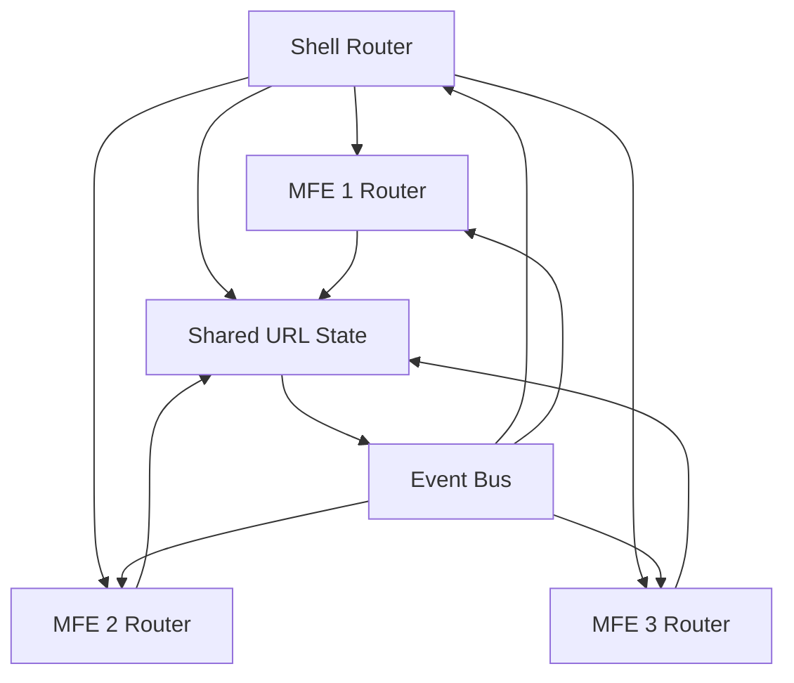

# Navigation -- Architecture

## Contents

- [Route Architecture](#route-architecture)
- [Nested and Dynamic Routing Patterns](#nested-and-dynamic-routing-patterns)
- [Layout Patterns](#layout-patterns)
- [Breadcrumb Generation](#breadcrumb-generation)
- [Deep Linking](#deep-linking)
- [MFE Navigation](#mfe-navigation)
- [Mobile Navigation Patterns](#mobile-navigation-patterns)
- [URL Design as UX](#url-design-as-ux)

## Route Architecture

### Route Resolution Flow

```mermaid
flowchart TD
    URL[URL Change] --> Router[Router]
    Router --> ParseURL[Parse URL]
    ParseURL --> MatchRoute[Match Route]
    MatchRoute --> AuthGuard{Auth Guard?}
    AuthGuard -->|Not Authenticated| RedirectLogin[Redirect to Login]
    AuthGuard -->|Authenticated| CheckPermissions{Permissions?}
    CheckPermissions -->|No Permission| RedirectUnauthorized[Redirect Unauthorized]
    CheckPermissions -->|Has Permission| LazyLoad{Lazy Load?}
    LazyLoad -->|Yes| LoadComponent[Load Component]
    LazyLoad -->|No| RenderComponent[Render Component]
    LoadComponent --> RenderComponent
    RenderComponent --> LoadData[Load Route Data]
    LoadData --> Render[Render View]
    RedirectLogin --> [*]
    RedirectUnauthorized --> [*]
    Render --> [*]
```

Vue Router provides a powerful routing system for Vue 3 applications with several key features:

**Named Routes:**

```javascript
// router/index.js
const routes = [
  {
    path: '/billing',
    name: 'billing',
    component: () => import('../views/BillingView.vue'),
    children: [
      {
        path: 'invoices',
        name: 'billing-invoices',
        component: () => import('../views/InvoicesView.vue')
      },
      {
        path: 'payments',
        name: 'billing-payments',
        component: () => import('../views/PaymentsView.vue')
      }
    ]
  }
]

// Navigation using named routes
router.push({ name: 'billing-invoices' })
```

**Nested Routes:**

Nested routes enable hierarchical navigation structures:

```javascript
const routes = [
  {
    path: '/products',
    component: ProductsLayout,
    children: [
      {
        path: '',
        name: 'products-list',
        component: ProductsList
      },
      {
        path: ':id',
        name: 'product-detail',
        component: ProductDetail,
        children: [
          {
            path: 'subscriptions',
            name: 'product-subscriptions',
            component: ProductSubscriptions
          }
        ]
      }
    ]
  }
]
```

**Route Guards:**

Route guards control navigation based on authentication, permissions, or other conditions:

```javascript
// Global guard
router.beforeEach((to, from, next) => {
  const requiresAuth = to.matched.some(record => record.meta.requiresAuth)
  
  if (requiresAuth && !isAuthenticated()) {
    next({ name: 'login', query: { redirect: to.fullPath } })
  } else {
    next()
  }
})

// Per-route guard
{
  path: '/admin',
  component: AdminView,
  meta: { requiresAuth: true, requiresRole: 'admin' },
  beforeEnter: (to, from, next) => {
    if (!hasRole('admin')) {
      next({ name: 'unauthorized' })
    } else {
      next()
    }
  }
}
```

**Lazy-Loaded Routes:**

Lazy loading improves initial load performance:

```javascript
const routes = [
  {
    path: '/dashboard',
    component: () => import(/* webpackChunkName: "dashboard" */ '../views/Dashboard.vue')
  }
]
```

**Meta Fields:**

Use meta fields to store route metadata for breadcrumbs, permissions, etc.:

```javascript
{
  path: '/billing/invoices/:id',
  meta: {
    title: 'Invoice Details',
    breadcrumb: 'Invoice',
    requiresAuth: true
  }
}
```

### React Router

React Router v6+ provides a modern routing solution with loaders and nested routes:

**Basic Route Setup:**

```jsx
// App.jsx
import { BrowserRouter, Routes, Route } from 'react-router-dom'

function App() {
  return (
    <BrowserRouter>
      <Routes>
        <Route path="/" element={<Home />} />
        <Route path="/billing" element={<BillingLayout />}>
          <Route index element={<BillingDashboard />} />
          <Route path="invoices" element={<InvoicesList />} />
          <Route path="invoices/:id" element={<InvoiceDetail />} />
        </Route>
      </Routes>
    </BrowserRouter>
  )
}
```

**Loaders (Data Loading):**

Loaders fetch data before rendering:

```jsx
import { useLoaderData } from 'react-router-dom'

export async function invoiceLoader({ params }) {
  const invoice = await fetchInvoice(params.id)
  if (!invoice) {
    throw new Response('Not Found', { status: 404 })
  }
  return { invoice }
}

function InvoiceDetail() {
  const { invoice } = useLoaderData()
  return <div>{invoice.number}</div>
}

// Route definition
<Route 
  path="invoices/:id" 
  element={<InvoiceDetail />}
  loader={invoiceLoader}
/>
```

**Nested Routes with Outlet:**

Use `<Outlet />` to render child routes:

```jsx
function BillingLayout() {
  return (
    <div>
      <BillingNav />
      <Outlet /> {/* Child routes render here */}
    </div>
  )
}
```

**Route Guards:**

Implement route protection using loaders or components:

```jsx
async function protectedLoader({ request }) {
  const user = await getCurrentUser()
  if (!user) {
    throw redirect('/login')
  }
  return { user }
}

<Route 
  path="/admin" 
  element={<AdminPanel />}
  loader={protectedLoader}
/>
```

**useLocation for Active State:**

```jsx
import { useLocation, Link } from 'react-router-dom'

function NavItem({ to, children }) {
  const location = useLocation()
  const isActive = location.pathname.startsWith(to)
  
  return (
    <Link 
      to={to} 
      className={isActive ? 'active' : ''}
    >
      {children}
    </Link>
  )
}
```

**ScrollRestoration:**

```jsx
import { useEffect } from 'react'
import { useLocation } from 'react-router-dom'

function ScrollToTop() {
  const { pathname } = useLocation()
  
  useEffect(() => {
    window.scrollTo(0, 0)
  }, [pathname])
  
  return null
}
```

## Nested and Dynamic Routing Patterns

**Parameterized Routes:**

```javascript
// Vue Router
{
  path: '/products/:productId/subscriptions/:subscriptionId',
  name: 'subscription-detail',
  component: SubscriptionDetail
}

// Access params
const route = useRoute()
const productId = route.params.productId

// React Router
<Route path="/products/:productId/subscriptions/:subscriptionId" />
// Access params
const { productId, subscriptionId } = useParams()
```

**Catch-All Routes (404 Handling):**

```javascript
// Vue Router - must be last route
{
  path: '/:pathMatch(.*)*',
  name: 'not-found',
  component: NotFound
}

// React Router
<Route path="*" element={<NotFound />} />
```

**Optional Parameters:**

```javascript
// Vue Router
{
  path: '/products/:productId?',
  // productId is optional
}

// React Router - use separate routes or handle in component
<Route path="/products/:productId?" element={<Products />} />
```

**Query Parameters:**

```javascript
// Vue Router
router.push({ 
  name: 'search', 
  query: { q: 'term', page: 1 } 
})
// URL: /search?q=term&page=1
const query = route.query

// React Router
navigate('/search?q=term&page=1')
// Or
navigate({
  pathname: '/search',
  search: '?q=term&page=1'
})
const [searchParams] = useSearchParams()
const query = searchParams.get('q')
```

## Layout Patterns

**Sidebar Navigation:**

Best for applications with many navigation items and hierarchical structures. Common in admin panels and dashboards.

```jsx
// React example
function SidebarLayout({ children }) {
  return (
    <div className="layout">
      <aside className="sidebar">
        <NavMenu />
      </aside>
      <main className="content">
        {children}
      </main>
    </div>
  )
}
```

**Top Navigation Bar:**

Best for content-focused applications with fewer navigation items. Common in marketing sites and simple applications.

```jsx
function TopNavLayout({ children }) {
  return (
    <div className="layout">
      <header className="top-nav">
        <NavBar />
      </header>
      <main className="content">
        {children}
      </main>
    </div>
  )
}
```

**Combined (Top + Sidebar):**

Top nav for primary actions, sidebar for secondary navigation or filters. Common in complex applications.

```jsx
function CombinedLayout({ children }) {
  return (
    <div className="layout">
      <header className="top-nav">
        <PrimaryNav />
      </header>
      <div className="layout-body">
        <aside className="sidebar">
          <SecondaryNav />
        </aside>
        <main className="content">
          {children}
        </main>
      </div>
    </div>
  )
}
```

**When to Use Each:**

- **Sidebar**: Many nav items (>5), hierarchical structure, admin/backend applications
- **Top Nav**: Few nav items (<7), content-focused, marketing sites
- **Combined**: Complex applications needing both primary and secondary navigation

## Breadcrumb Generation

**Manual Breadcrumbs:**

```jsx
// React - Manual configuration
function Breadcrumbs() {
  const location = useLocation()
  const pathMap = {
    '/billing': 'Billing',
    '/billing/invoices': 'Invoices',
    '/billing/invoices/:id': 'Invoice Details'
  }
  
  const segments = location.pathname.split('/').filter(Boolean)
  const breadcrumbs = segments.map((segment, index) => {
    const path = '/' + segments.slice(0, index + 1).join('/')
    return {
      label: pathMap[path] || segment,
      path
    }
  })
  
  return (
    <nav>
      {breadcrumbs.map((crumb, i) => (
        <span key={i}>
          {i > 0 && ' > '}
          {i === breadcrumbs.length - 1 ? (
            <span>{crumb.label}</span>
          ) : (
            <Link to={crumb.path}>{crumb.label}</Link>
          )}
        </span>
      ))}
    </nav>
  )
}
```

**Auto-Generated from Route Tree:**

```javascript
// Vue Router - Using route meta
function generateBreadcrumbs(route) {
  const breadcrumbs = []
  route.matched.forEach((match, index) => {
    if (match.meta?.breadcrumb) {
      breadcrumbs.push({
        label: match.meta.breadcrumb,
        path: match.path,
        isLast: index === route.matched.length - 1
      })
    }
  })
  return breadcrumbs
}

// Route definition
{
  path: '/billing',
  meta: { breadcrumb: 'Billing' },
  children: [
    {
      path: 'invoices',
      meta: { breadcrumb: 'Invoices' }
    }
  ]
}
```

**Breadcrumb Composable/Hook:**

```javascript
// Vue 3 Composable
export function useBreadcrumbs() {
  const route = useRoute()
  
  const breadcrumbs = computed(() => {
    return route.matched
      .filter(record => record.meta?.breadcrumb)
      .map((record, index, array) => ({
        label: record.meta.breadcrumb,
        path: record.path,
        isLast: index === array.length - 1
      }))
  })
  
  return { breadcrumbs }
}

// React Hook
export function useBreadcrumbs() {
  const location = useLocation()
  const routes = useRoutes() // Custom hook or context
  
  const breadcrumbs = useMemo(() => {
    // Generate from route tree
    return generateBreadcrumbs(location.pathname, routes)
  }, [location.pathname, routes])
  
  return breadcrumbs
}
```

## Deep Linking

Deep linking ensures any application state can be reached via URL, enabling bookmarking, sharing, and direct navigation.

**Key Principles:**

1. **URL reflects state**: The URL should encode enough information to restore the application state
2. **Shareable URLs**: Users should be able to copy and share URLs that work for others
3. **Browser history**: Back/forward buttons should work correctly

**Example - Filter State in URL:**

```javascript
// Vue Router
router.push({
  name: 'invoices',
  query: {
    status: 'pending',
    dateFrom: '2026-01-01',
    sort: 'date-desc'
  }
})

// React Router
navigate({
  pathname: '/invoices',
  search: '?status=pending&dateFrom=2026-01-01&sort=date-desc'
})

// Restore state from URL
const route = useRoute()
const filters = {
  status: route.query.status || 'all',
  dateFrom: route.query.dateFrom || null,
  sort: route.query.sort || 'date-desc'
}
```

**Example - Modal State:**

```javascript
// URL: /products/123?modal=subscriptions
// Open modal based on query param
const route = useRoute()
const showModal = computed(() => route.query.modal === 'subscriptions')
```

## MFE Navigation

Micro Frontend (MFE) architecture introduces navigation complexity when multiple applications need to coordinate routing.

### MFE Navigation Architecture



**Shell-Owned Routing:**

The shell application owns the router and controls all navigation:

```javascript
// Shell application (main router)
const routes = [
  {
    path: '/billing/*',
    component: BillingMFE // Loads billing MFE
  },
  {
    path: '/products/*',
    component: ProductsMFE // Loads products MFE
  }
]

// Billing MFE (no router, just components)
// Receives route context from shell
function BillingMFE() {
  const shellRoute = useShellRoute() // Custom context/hook
  return <BillingApp route={shellRoute} />
}
```

**Cross-MFE Navigation:**

```javascript
// Shared route registry
const routeRegistry = {
  'billing-invoice': '/billing/invoices/:id',
  'product-detail': '/products/:id',
  'customer-profile': '/customers/:id'
}

// Navigation service
class NavigationService {
  navigate(routeName, params) {
    const route = routeRegistry[routeName]
    const path = this.buildPath(route, params)
    window.history.pushState(null, '', path)
    this.notifyShell(path)
  }
  
  notifyShell(path) {
    window.dispatchEvent(new CustomEvent('mf-navigate', { detail: { path } }))
  }
}

// Shell listens for navigation events
window.addEventListener('mf-navigate', (event) => {
  router.push(event.detail.path)
})
```

**Route-Based MFE Loading:**

```javascript
// Shell determines which MFE to load based on route
const mfeMap = {
  '/billing': () => import('./mfes/billing'),
  '/products': () => import('./mfes/products'),
  '/customers': () => import('./mfes/customers')
}

router.beforeEach((to, from, next) => {
  const mfePath = Object.keys(mfeMap).find(path => 
    to.path.startsWith(path)
  )
  
  if (mfePath && !loadedMFEs.has(mfePath)) {
    mfeMap[mfePath]().then(mfe => {
      loadedMFEs.set(mfePath, mfe)
      next()
    })
  } else {
    next()
  }
})
```

**Navigation Events Between MFEs:**

```javascript
// Event bus for MFE communication
class MFEEventBus {
  emit(event, data) {
    window.dispatchEvent(new CustomEvent(`mfe:${event}`, { detail: data }))
  }
  
  on(event, handler) {
    window.addEventListener(`mfe:${event}`, handler)
  }
}

// MFE A navigates to route in MFE B
eventBus.emit('navigate', {
  route: '/products/123',
  replace: false
})

// Shell listens and routes
eventBus.on('navigate', (event) => {
  router.push(event.detail.route)
})
```

## Mobile Navigation Patterns

**Bottom Navigation Bar:**

Best for mobile-first applications with 3-5 primary actions. Thumb-reachable and always visible.

```jsx
function BottomNav() {
  return (
    <nav className="bottom-nav">
      <NavLink to="/home" icon={HomeIcon}>Home</NavLink>
      <NavLink to="/products" icon={ProductsIcon}>Products</NavLink>
      <NavLink to="/billing" icon={BillingIcon}>Billing</NavLink>
      <NavLink to="/profile" icon={ProfileIcon}>Profile</NavLink>
    </nav>
  )
}
```

**Hamburger/Drawer:**

Secondary navigation hidden behind hamburger menu. Slides in from side.

```jsx
function MobileDrawer({ isOpen, onClose }) {
  return (
    <>
      <div 
        className={`drawer-overlay ${isOpen ? 'open' : ''}`}
        onClick={onClose}
        aria-hidden={!isOpen}
      />
      <aside 
        className={`drawer ${isOpen ? 'open' : ''}`}
        role="dialog"
        aria-modal="true"
      >
        <NavMenu onNavigate={onClose} />
      </aside>
    </>
  )
}
```

**Collapsible Sidebar:**

Sidebar that collapses on mobile, expands on desktop. Can be toggled.

```jsx
function ResponsiveSidebar({ isCollapsed, onToggle }) {
  return (
    <aside className={`sidebar ${isCollapsed ? 'collapsed' : ''}`}>
      <button onClick={onToggle} aria-label="Toggle sidebar">
        <MenuIcon />
      </button>
      {!isCollapsed && <NavMenu />}
    </aside>
  )
}
```

**Focus Trap and Body Scroll Lock:**

```jsx
function useFocusTrap(isActive) {
  useEffect(() => {
    if (!isActive) return
    
    const focusableElements = container.querySelectorAll(
      'button, [href], input, select, textarea, [tabindex]:not([tabindex="-1"])'
    )
    const firstElement = focusableElements[0]
    const lastElement = focusableElements[focusableElements.length - 1]
    
    const handleTab = (e) => {
      if (e.key === 'Tab') {
        if (e.shiftKey && document.activeElement === firstElement) {
          e.preventDefault()
          lastElement.focus()
        } else if (!e.shiftKey && document.activeElement === lastElement) {
          e.preventDefault()
          firstElement.focus()
        }
      }
    }
    
    firstElement?.focus()
    container.addEventListener('keydown', handleTab)
    
    return () => {
      container.removeEventListener('keydown', handleTab)
    }
  }, [isActive])
}

function useBodyScrollLock(isLocked) {
  useEffect(() => {
    if (isLocked) {
      document.body.style.overflow = 'hidden'
    } else {
      document.body.style.overflow = ''
    }
    
    return () => {
      document.body.style.overflow = ''
    }
  }, [isLocked])
}
```

## URL Design as UX

URLs are part of the user experience. Well-designed URLs are readable, memorable, and shareable.

**Readable URLs:**

```
✅ Good: /billing/invoices/2026-001
❌ Bad: /page?id=789&type=inv

✅ Good: /products/cloud-services/microsoft-365
❌ Bad: /p/12345
```

**Consistent Patterns:**

```
/billing/invoices/:id
/billing/payments/:id
/products/:category/:productId
/customers/:customerId/orders/:orderId
```

**Avoid Exposing Internal IDs:**

```
✅ Good: /products/microsoft-365 (slug-based)
❌ Bad: /products/789456123 (internal database ID)

// If ID is necessary, use both slug and ID
/products/microsoft-365-789456123
// Or use slug in URL, ID in API call
```

**URL Structure Best Practices:**

- Use lowercase letters
- Use hyphens to separate words: `/billing-invoices` not `/billing_invoices`
- Keep URLs shallow: prefer `/billing/invoices` over `/app/section/billing/invoices`
- Use meaningful segments: `/products/cloud-services` not `/products/cat1`
- Support trailing slashes consistently (redirect one to the other)
- Handle special characters: encode spaces, use URL-safe characters

**Example URL Structure:**

```
/                          # Home
/billing                   # Billing section
/billing/invoices          # Invoices list
/billing/invoices/:id      # Invoice detail
/billing/invoices/:id/edit # Edit invoice
/products                  # Products list
/products/:category        # Category view
/products/:category/:id     # Product detail
/search?q=term             # Search with query
```
