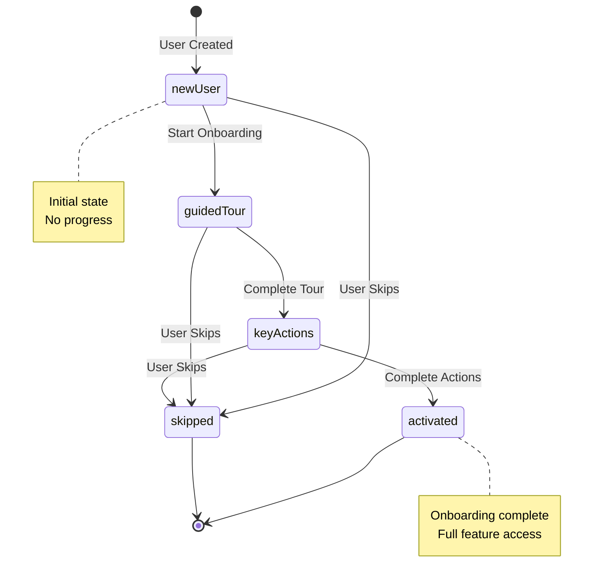
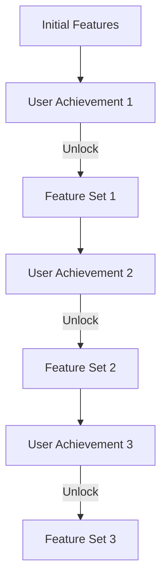

# Architecture: Onboarding

Technical patterns, data models, and implementation approaches for building effective onboarding experiences.

## Contents

- [Onboarding State Machine](#onboarding-state-machine)
- [Step/Checklist Architecture](#stepchecklist-architecture)
- [Progressive Disclosure Implementation](#progressive-disclosure-implementation)
- [Onboarding Data Model](#onboarding-data-model)
- [Feature Flag Integration](#feature-flag-integration)
- [Analytics Integration](#analytics-integration)
- [Empty State Design](#empty-state-design)
- [B2B SaaS Considerations](#b2b-saas-considerations)
- [Server-Side Implementation](#server-side-implementation)

## Onboarding State Machine

Onboarding is fundamentally a state machine. Users move through states: `new` → `in-progress` → `completed` or `skipped`.

### Onboarding State Diagram



### User States

```typescript
enum OnboardingStatus {
  NEW = 'new',              // User hasn't started onboarding
  IN_PROGRESS = 'in-progress', // User is actively onboarding
  COMPLETED = 'completed',   // User finished onboarding
  SKIPPED = 'skipped'        // User explicitly skipped
}
```

### Persisting Progress

**Critical**: Onboarding progress must persist across sessions. Users refresh, close browsers, switch devices. If they lose progress, they'll abandon. Choosing the right persistence strategy depends on your requirements: multi-device support, analytics needs, and complexity.

#### Persistence Strategy Comparison

| Strategy | Multi-Device | Analytics | Complexity | Best For |
|----------|-------------|----------|------------|----------|
| **Backend/Database** | ✅ Yes | ✅ Full | High | Production, B2B SaaS |
| **localStorage** | ❌ No | ❌ Limited | Low | Prototypes, simple flows |
| **URL Parameters** | ⚠️ Partial | ⚠️ Partial | Low | Shareable flows, deep links |
| **Hybrid** | ✅ Yes | ✅ Full | Medium | Best of both worlds |

#### Strategy 1: Backend/Database Persistence (Recommended for Production)

**When to use:**
- Multi-device support required
- Need analytics on onboarding progress
- B2B SaaS applications
- Complex onboarding flows with conditional steps
- Team/organization-level onboarding

**Advantages:**
- ✅ Works across devices
- ✅ Full analytics capabilities
- ✅ Can resume from any device
- ✅ Server-side validation
- ✅ Can trigger backend events (emails, notifications)

**Disadvantages:**
- ❌ Requires backend implementation
- ❌ Network latency (though minimal)
- ❌ More complex than client-only

**Database schema:**
```sql
CREATE TABLE user_onboarding (
  user_id UUID PRIMARY KEY REFERENCES users(id),
  current_step VARCHAR(100),
  status VARCHAR(20) NOT NULL DEFAULT 'new',
  progress JSONB DEFAULT '{}', -- Flexible storage for step-specific data
  variant VARCHAR(50), -- For A/B testing
  started_at TIMESTAMP,
  completed_at TIMESTAMP,
  skipped_at TIMESTAMP,
  updated_at TIMESTAMP DEFAULT NOW(),
  
  -- Indexes for analytics queries
  INDEX idx_status (status),
  INDEX idx_started_at (started_at)
);

CREATE TABLE onboarding_step_completion (
  id UUID PRIMARY KEY DEFAULT gen_random_uuid(),
  user_id UUID REFERENCES users(id),
  step_id VARCHAR(100) NOT NULL,
  completed_at TIMESTAMP DEFAULT NOW(),
  time_spent_seconds INTEGER, -- How long user spent on step
  metadata JSONB, -- Step-specific completion data
  UNIQUE(user_id, step_id),
  
  INDEX idx_user_step (user_id, step_id),
  INDEX idx_step_id (step_id) -- For analytics
);
```

**Spring Boot implementation:**
```kotlin
@Service
@Transactional
class OnboardingPersistenceService(
  private val onboardingRepository: OnboardingRepository,
  private val stepCompletionRepository: StepCompletionRepository
) {
  
  fun saveProgress(
    userId: UUID,
    currentStep: String,
    completedSteps: List<String>,
    metadata: Map<String, Any>? = null
  ) {
    val onboarding = onboardingRepository.findByUserId(userId)
      ?: Onboarding(
        userId = userId,
        status = OnboardingStatus.IN_PROGRESS,
        startedAt = Instant.now()
      )
    
    onboarding.currentStep = currentStep
    onboarding.status = OnboardingStatus.IN_PROGRESS
    onboarding.updatedAt = Instant.now()
    onboarding.progress = metadata?.let { ObjectMapper().writeValueAsString(it) }
    
    onboardingRepository.save(onboarding)
    
    // Save step completions
    completedSteps.forEach { stepId ->
      if (!stepCompletionRepository.existsByUserIdAndStepId(userId, stepId)) {
        stepCompletionRepository.save(
          StepCompletion(
            userId = userId,
            stepId = stepId,
            completedAt = Instant.now()
          )
        )
      }
    }
  }
  
  fun getProgress(userId: UUID): OnboardingProgress? {
    val onboarding = onboardingRepository.findByUserId(userId) ?: return null
    
    val completedSteps = stepCompletionRepository
      .findByUserId(userId)
      .map { it.stepId }
      .toList()
    
    return OnboardingProgress(
      currentStep = onboarding.currentStep,
      status = onboarding.status,
      completedSteps = completedSteps,
      progress = onboarding.progress?.let { ObjectMapper().readValue(it, Map::class.java) }
    )
  }
}
```

**Frontend sync pattern:**
```typescript
// Vue 3 / Pinia: Sync with backend
export const useOnboardingStore = defineStore('onboarding', {
  state: () => ({
    status: 'new' as OnboardingStatus,
    currentStep: null as string | null,
    completedSteps: [] as string[],
    syncing: false
  }),
  
  actions: {
    async completeStep(stepId: string) {
      // Optimistic update
      this.completedSteps.push(stepId);
      this.currentStep = this.getNextStep(stepId);
      
      // Sync to backend
      try {
        this.syncing = true;
        await api.post('/onboarding/steps/complete', {
          stepId,
          currentStep: this.currentStep,
          completedSteps: this.completedSteps
        });
      } catch (error) {
        // Rollback on error
        this.completedSteps = this.completedSteps.filter(s => s !== stepId);
        throw error;
      } finally {
        this.syncing = false;
      }
    },
    
    async loadProgress() {
      try {
        const progress = await api.get('/onboarding/progress');
        this.status = progress.status;
        this.currentStep = progress.currentStep;
        this.completedSteps = progress.completedSteps;
      } catch (error) {
        // Handle error (user might not have onboarding record)
        console.error('Failed to load onboarding progress', error);
      }
    },
    
    // Periodic sync (for long-running onboarding)
    startPeriodicSync() {
      setInterval(() => {
        if (this.status === 'in-progress') {
          this.syncProgress();
        }
      }, 30000); // Sync every 30 seconds
    }
  }
});
```

#### Strategy 2: localStorage Persistence (Simple, Client-Only)

**When to use:**
- Prototypes and MVPs
- Simple onboarding flows
- Single-device applications
- No analytics requirements
- Consumer applications where multi-device isn't critical

**Advantages:**
- ✅ Simple implementation
- ✅ No backend required
- ✅ Fast (no network calls)
- ✅ Works offline

**Disadvantages:**
- ❌ Device-specific (doesn't sync across devices)
- ❌ Can be cleared by user
- ❌ Limited analytics (client-side only)
- ❌ No server-side validation

**Implementation:**
```typescript
// Vue 3 / Pinia: localStorage persistence
export const useOnboardingStore = defineStore('onboarding', {
  state: () => {
    // Load from localStorage on init
    const saved = localStorage.getItem('onboarding');
    if (saved) {
      try {
        return JSON.parse(saved);
      } catch {
        // Invalid JSON, use defaults
      }
    }
    
    return {
      status: 'new' as OnboardingStatus,
      currentStep: null as string | null,
      completedSteps: [] as string[]
    };
  },
  
  actions: {
    completeStep(stepId: string) {
      this.completedSteps.push(stepId);
      this.currentStep = this.getNextStep(stepId);
      this.persist();
    },
    
    persist() {
      // Save to localStorage on every change
      localStorage.setItem('onboarding', JSON.stringify({
        status: this.status,
        currentStep: this.currentStep,
        completedSteps: this.completedSteps,
        lastUpdated: new Date().toISOString()
      }));
    },
    
    clear() {
      localStorage.removeItem('onboarding');
      this.$reset();
    }
  }
});

// Watch for changes and auto-persist
watch(() => onboardingStore.$state, (state) => {
  localStorage.setItem('onboarding', JSON.stringify(state));
}, { deep: true });
```

**localStorage limitations to consider:**
- **Storage limits**: ~5-10MB per domain
- **Cleared on incognito**: Private browsing clears localStorage
- **User can clear**: Users can clear browser data
- **No expiration**: Data persists indefinitely unless cleared

#### Strategy 3: URL Parameters (Shareable, Deep Links)

**When to use:**
- Shareable onboarding flows
- Deep linking to specific steps
- Onboarding flows that should be bookmarkable
- When URL state is meaningful

**Advantages:**
- ✅ Shareable (users can share onboarding URL)
- ✅ Bookmarkable
- ✅ Deep linking support
- ✅ Browser back/forward works

**Disadvantages:**
- ❌ URL can get long with complex state
- ❌ Not secure for sensitive data
- ❌ Can be modified by user
- ❌ Doesn't persist across sessions (unless combined with other storage)

**Implementation:**
```typescript
// URL-based onboarding state
function useUrlOnboardingState() {
  const route = useRoute();
  const router = useRouter();
  
  // Read from URL
  const currentStep = computed(() => route.query.step as string || 'welcome');
  const completedSteps = computed(() => {
    const steps = route.query.completed as string;
    return steps ? steps.split(',') : [];
  });
  
  // Update URL
  function setStep(stepId: string, completed: string[] = []) {
    router.push({
      query: {
        ...route.query,
        step: stepId,
        completed: completed.join(',')
      }
    });
  }
  
  return { currentStep, completedSteps, setStep };
}

// Usage
const { currentStep, setStep } = useUrlOnboardingState();

function goToNextStep() {
  const nextStep = getNextStep(currentStep.value);
  setStep(nextStep, [...completedSteps.value, currentStep.value]);
}
```

#### Strategy 4: Hybrid Approach (Best of Both Worlds)

**When to use:**
- Need multi-device support AND fast local updates
- Want offline capability with server sync
- Complex applications with varying requirements

**Pattern**: Use localStorage for immediate updates, sync to backend periodically or on step completion.

**Implementation:**
```typescript
// Hybrid: localStorage + backend sync
export const useOnboardingStore = defineStore('onboarding', {
  state: () => {
    // Try to load from localStorage first (fast)
    const local = localStorage.getItem('onboarding');
    const localState = local ? JSON.parse(local) : null;
    
    return {
      status: localState?.status || 'new',
      currentStep: localState?.currentStep || null,
      completedSteps: localState?.completedSteps || [],
      synced: false, // Track if synced with backend
      syncing: false
    };
  },
  
  actions: {
    async completeStep(stepId: string) {
      // Optimistic update (localStorage)
      this.completedSteps.push(stepId);
      this.currentStep = this.getNextStep(stepId);
      this.persistLocal();
      
      // Sync to backend (async, non-blocking)
      this.syncToBackend();
    },
    
    persistLocal() {
      // Immediate localStorage save
      localStorage.setItem('onboarding', JSON.stringify({
        status: this.status,
        currentStep: this.currentStep,
        completedSteps: this.completedSteps,
        lastUpdated: new Date().toISOString()
      }));
    },
    
    async syncToBackend() {
      if (this.syncing) return; // Prevent concurrent syncs
      
      try {
        this.syncing = true;
        await api.post('/onboarding/progress', {
          currentStep: this.currentStep,
          completedSteps: this.completedSteps,
          status: this.status
        });
        this.synced = true;
      } catch (error) {
        // Sync failed, but local state is preserved
        console.error('Failed to sync onboarding progress', error);
        // Could queue for retry
      } finally {
        this.syncing = false;
      }
    },
    
    async loadFromBackend() {
      try {
        const progress = await api.get('/onboarding/progress');
        
        // Merge: backend takes precedence if more recent
        const local = localStorage.getItem('onboarding');
        const localState = local ? JSON.parse(local) : null;
        
        if (localState?.lastUpdated < progress.lastUpdated) {
          // Backend is newer, use it
          this.status = progress.status;
          this.currentStep = progress.currentStep;
          this.completedSteps = progress.completedSteps;
          this.persistLocal();
        } else {
          // Local is newer or same, sync to backend
          this.syncToBackend();
        }
      } catch (error) {
        // Backend unavailable, use local state
        console.warn('Backend unavailable, using local state', error);
      }
    }
  }
});

// On app load, try to sync
onMounted(() => {
  onboardingStore.loadFromBackend();
});
```

### Recommendation by Use Case

**B2B SaaS / Production**: Use **backend/database** persistence. Multi-device support and analytics are critical.

**Consumer Apps / MVPs**: Use **localStorage** for simplicity, migrate to backend when needed.

**Shareable Flows**: Use **URL parameters** combined with localStorage or backend.

**Complex Apps**: Use **hybrid** approach for best user experience and reliability.

### Resuming Interrupted Onboarding

When a user returns, check their onboarding status:

```typescript
// Spring Boot service example
@Service
public class OnboardingService {
  
  public OnboardingStatus getOnboardingStatus(UUID userId) {
    return onboardingRepository.findByUserId(userId)
      .map(Onboarding::getStatus)
      .orElse(OnboardingStatus.NEW);
  }
  
  public void resumeOnboarding(UUID userId) {
    Onboarding onboarding = onboardingRepository.findByUserId(userId)
      .orElseThrow();
    
    if (onboarding.getStatus() == OnboardingStatus.IN_PROGRESS) {
      // Return user to their last step
      return onboarding.getCurrentStep();
    }
  }
}
```

## Step/Checklist Architecture

Onboarding consists of discrete steps. Steps can be ordered (sequential) or unordered (checklist), and can be conditional based on user attributes.

### Ordered vs Unordered Steps

**Ordered (sequential):**
```typescript
const onboardingSteps = [
  'welcome',
  'profile-setup',
  'first-project',
  'invite-team',
  'explore-features'
];
// Users must complete in order
```

**Unordered (checklist):**
```typescript
const onboardingChecklist = [
  'complete-profile',
  'create-first-project',
  'invite-team-member',
  'connect-integration'
];
// Users can complete in any order
// Mark complete when all done
```

### Conditional Steps

Steps should appear based on user role, plan, or other attributes:

```typescript
// Vue 3 example with conditional steps
const getOnboardingSteps = (user: User) => {
  const baseSteps = ['welcome', 'profile-setup'];
  
  if (user.role === 'admin') {
    baseSteps.push('org-setup', 'team-invite');
  }
  
  if (user.plan === 'enterprise') {
    baseSteps.push('sso-setup', 'audit-log-config');
  }
  
  return baseSteps;
};
```

### Completion Tracking

Track which steps are completed:

```sql
CREATE TABLE onboarding_step_completion (
  id UUID PRIMARY KEY DEFAULT gen_random_uuid(),
  user_id UUID REFERENCES users(id),
  step_id VARCHAR(100) NOT NULL,
  completed_at TIMESTAMP DEFAULT NOW(),
  metadata JSONB, -- Step-specific completion data
  UNIQUE(user_id, step_id)
);
```

```typescript
// React example with step completion
const OnboardingContext = createContext();

function OnboardingProvider({ children }) {
  const [completedSteps, setCompletedSteps] = useState(new Set());
  
  const completeStep = async (stepId: string) => {
    await api.post(`/onboarding/steps/${stepId}/complete`);
    setCompletedSteps(prev => new Set([...prev, stepId]));
  };
  
  return (
    <OnboardingContext.Provider value={{ completedSteps, completeStep }}>
      {children}
    </OnboardingContext.Provider>
  );
}
```

## Progressive Disclosure Implementation

Progressive disclosure means revealing features and complexity gradually, based on user readiness and context.

### Progressive Disclosure Flow

Features unlock progressively as users complete key achievements:



### Feature Gating by Onboarding Stage

Don't show advanced features until users complete foundational onboarding:

```typescript
// Vue 3 composable
export function useFeatureGate() {
  const onboardingStore = useOnboardingStore();
  
  const isFeatureAvailable = (feature: string) => {
    const requiredSteps = featureGates[feature] || [];
    return requiredSteps.every(step => 
      onboardingStore.completedSteps.includes(step)
    );
  };
  
  return { isFeatureAvailable };
}

// Usage in component
const { isFeatureAvailable } = useFeatureGate();
if (!isFeatureAvailable('advanced-analytics')) {
  return <OnboardingPrompt feature="advanced-analytics" />;
}
```

### Guided Tour Implementation Patterns

Guided tours come in three main patterns, each suited to different onboarding scenarios. Understanding when to use which pattern is critical for effective onboarding.

#### Pattern 1: Tooltip Tours (Spotlight + Tooltip)

**Description**: Highlights specific UI elements with tooltips that appear next to or over elements. User clicks "Next" to advance through steps.

**Best for:**
- Feature discovery (showing where features are located)
- Orientation tours (helping users understand layout)
- Highlighting non-obvious features
- Quick, informational guidance

**Characteristics:**
- Non-blocking (user can interact with other UI, though overlay may dim background)
- Sequential (steps in order)
- Visual spotlight on target element
- Tooltip contains explanation text

**Implementation with react-joyride:**
```typescript
// React: Tooltip tour pattern
import Joyride, { CallBackProps, STATUS } from 'react-joyride';

const tooltipTourSteps = [
  {
    target: '[data-testid="project-list"]',
    content: 'Your projects appear here. This is where you\'ll manage all your work.',
    placement: 'bottom',
    disableBeacon: true, // Don't show beacon before tour starts
  },
  {
    target: '[data-testid="create-project-button"]',
    content: 'Click here to create a new project. Projects help you organize your work.',
    placement: 'right',
  },
  {
    target: '[data-testid="filters"]',
    content: 'Use filters to find specific projects quickly.',
    placement: 'top',
  },
  {
    target: '[data-testid="search"]',
    content: 'Search across all your projects and tasks.',
    placement: 'bottom',
  }
];

function TooltipTour() {
  const [run, setRun] = useState(false);
  const onboardingStore = useOnboardingStore();
  
  useEffect(() => {
    // Show tour if user hasn't seen it and is on relevant page
    if (onboardingStore.shouldShowTour('feature-discovery') && 
        window.location.pathname === '/projects') {
      setRun(true);
    }
  }, []);
  
  const handleTourCallback = (data: CallBackProps) => {
    const { status, type } = data;
    
    if (status === STATUS.FINISHED || status === STATUS.SKIPPED) {
      setRun(false);
      onboardingStore.completeStep('feature-tour');
      
      // Track analytics
      analytics.track('onboarding_tour_completed', {
        tour_type: 'tooltip',
        status: status === STATUS.FINISHED ? 'completed' : 'skipped',
        steps_completed: data.index + 1
      });
    }
  };
  
  return (
    <Joyride
      steps={tooltipTourSteps}
      run={run}
      continuous={true}
      showProgress={true}
      showSkipButton={true}
      disableOverlayClose={false} // Allow clicking overlay to close
      callback={handleTourCallback}
      styles={{
        options: {
          primaryColor: '#3b82f6',
          zIndex: 10000, // Above modals
        },
        tooltip: {
          borderRadius: '8px',
        },
        spotlight: {
          borderRadius: '8px',
        }
      }}
    />
  );
}
```

**Implementation with Shepherd.js (framework-agnostic):**
```typescript
// Shepherd.js: Tooltip tour
import Shepherd from 'shepherd.js';

function createTooltipTour() {
  const tour = new Shepherd.Tour({
    useModalOverlay: true,
    defaultStepOptions: {
      cancelIcon: { enabled: true },
      classes: 'shepherd-theme-custom',
      scrollTo: { behavior: 'smooth', block: 'center' }
    }
  });
  
  tour.addStep({
    id: 'project-list',
    text: 'Your projects appear here. This is where you\'ll manage all your work.',
    attachTo: {
      element: '[data-testid="project-list"]',
      on: 'bottom'
    },
    buttons: [
      { text: 'Skip', action: tour.cancel },
      { text: 'Next', action: tour.next }
    ]
  });
  
  tour.addStep({
    id: 'create-button',
    text: 'Click here to create a new project.',
    attachTo: {
      element: '[data-testid="create-project-button"]',
      on: 'right'
    },
    buttons: [
      { text: 'Back', action: tour.back },
      { text: 'Skip', action: tour.cancel },
      { text: 'Next', action: tour.next }
    ]
  });
  
  tour.on('complete', () => {
    onboardingService.completeStep('feature-tour');
  });
  
  tour.on('cancel', () => {
    onboardingService.skipStep('feature-tour');
  });
  
  return tour;
}
```

#### Pattern 2: Modal Tours (Full-Screen Overlay)

**Description**: Full-screen modal overlays that guide users through multi-step processes. More immersive than tooltip tours.

**Best for:**
- Complex multi-step workflows
- Critical first actions (create first project, set up account)
- When you need user's full attention
- Processes that require user to complete actions

**Characteristics:**
- Blocking (user must interact with modal)
- Can include forms or interactive elements
- More immersive experience
- Better for longer, more detailed guidance

**Implementation:**
```vue
<!-- Vue 3: Modal tour pattern -->
<template>
  <Modal
    v-if="showModalTour"
    :closable="true"
    @close="handleSkip"
    class="onboarding-modal-tour"
  >
    <div class="modal-tour-content">
      <!-- Progress indicator -->
      <div class="tour-progress">
        <div 
          class="progress-bar"
          :style="{ width: `${(currentStepIndex + 1) / steps.length * 100}%` }"
        />
        <span class="progress-text">
          Step {{ currentStepIndex + 1 }} of {{ steps.length }}
        </span>
      </div>
      
      <!-- Step content -->
      <div class="step-content">
        <h2>{{ currentStep.title }}</h2>
        <p>{{ currentStep.description }}</p>
        
        <!-- Interactive element (if step requires action) -->
        <component 
          v-if="currentStep.component"
          :is="currentStep.component"
          @complete="handleStepComplete"
        />
        
        <!-- Illustration or screenshot -->
        
      </div>
      
      <!-- Navigation -->
      <div class="tour-actions">
        <Button 
          v-if="currentStepIndex > 0"
          variant="secondary"
          @click="goToPreviousStep"
        >
          Back
        </Button>
        <Button 
          variant="secondary"
          @click="handleSkip"
        >
          Skip Tour
        </Button>
        <Button 
          v-if="!isLastStep"
          variant="primary"
          @click="goToNextStep"
        >
          Next
        </Button>
        <Button 
          v-else
          variant="primary"
          @click="handleComplete"
        >
          Get Started
        </Button>
      </div>
    </div>
  </Modal>
</template>

<script setup lang="ts">
import { ref, computed } from 'vue';

const props = defineProps<{
  steps: ModalTourStep[];
  show: boolean;
}>();

const currentStepIndex = ref(0);

const currentStep = computed(() => props.steps[currentStepIndex.value]);
const isLastStep = computed(() => currentStepIndex.value === props.steps.length - 1);

const goToNextStep = () => {
  if (!isLastStep.value) {
    currentStepIndex.value++;
    // Scroll to top of modal
    document.querySelector('.modal-tour-content')?.scrollTo(0, 0);
  }
};

const goToPreviousStep = () => {
  if (currentStepIndex.value > 0) {
    currentStepIndex.value--;
  }
};

const handleStepComplete = () => {
  // If step requires action completion, validate before proceeding
  if (currentStep.value.requiresAction) {
    goToNextStep();
  }
};

const handleComplete = () => {
  onboardingService.completeStep('modal-tour');
  emit('complete');
};

const handleSkip = () => {
  onboardingService.skipStep('modal-tour');
  emit('skip');
};
</script>
```

#### Pattern 3: Coachmarks (Spotlight Only, No Tooltip)

**Description**: Visual highlights (spotlights) on UI elements without explanatory tooltips. Minimal, non-intrusive guidance.

**Best for:**
- Subtle feature discovery
- When UI is self-explanatory
- Power users who don't need text explanations
- Mobile interfaces (tooltips harder on small screens)

**Characteristics:**
- Minimal text (or none)
- Visual highlight only
- Non-intrusive
- Can be dismissed easily

**Implementation:**
```typescript
// Coachmark pattern (minimal guidance)
function createCoachmark(elementSelector: string, duration: number = 3000) {
  const element = document.querySelector(elementSelector);
  if (!element) return;
  
  // Add spotlight effect
  const spotlight = document.createElement('div');
  spotlight.className = 'coachmark-spotlight';
  spotlight.style.cssText = `
    position: absolute;
    border: 3px solid #3b82f6;
    border-radius: 8px;
    box-shadow: 0 0 0 9999px rgba(0, 0, 0, 0.5);
    pointer-events: none;
    z-index: 9999;
    animation: pulse 2s infinite;
  `;
  
  // Position spotlight around element
  const rect = element.getBoundingClientRect();
  spotlight.style.left = `${rect.left - 3}px`;
  spotlight.style.top = `${rect.top - 3}px`;
  spotlight.style.width = `${rect.width + 6}px`;
  spotlight.style.height = `${rect.height + 6}px`;
  
  document.body.appendChild(spotlight);
  
  // Auto-dismiss after duration
  setTimeout(() => {
    spotlight.remove();
  }, duration);
  
  // Dismiss on click
  document.addEventListener('click', function dismissCoachmark() {
    spotlight.remove();
    document.removeEventListener('click', dismissCoachmark);
  }, { once: true });
}

// Usage: Show coachmark for new features
if (isFirstTimeUser() && !hasSeenCoachmark('new-feature')) {
  createCoachmark('[data-testid="new-feature-button"]', 5000);
  markCoachmarkSeen('new-feature');
}
```

### Choosing the Right Tour Pattern

**Use Tooltip Tours when:**
- Users need explanations of what features do
- Features are not self-explanatory
- You want to guide users through discovery
- Desktop/web interfaces

**Use Modal Tours when:**
- Process is complex and requires focus
- Users need to complete actions during tour
- You want immersive, step-by-step guidance
- Critical first-time experiences

**Use Coachmarks when:**
- UI is self-explanatory
- You just want to highlight location
- Mobile interfaces (tooltips awkward)
- Power users who don't need explanations

### Tour Step Configuration

Define tour steps with metadata for analytics and conditional logic:

```typescript
interface TourStep {
  id: string;
  target: string; // CSS selector or data-testid
  content: string;
  placement: 'top' | 'bottom' | 'left' | 'right' | 'center';
  type: 'tooltip' | 'modal' | 'coachmark';
  
  // Conditional display
  condition?: (user: User, context: any) => boolean;
  
  // Action requirements
  requiresAction?: boolean; // User must complete action to proceed
  actionValidator?: () => boolean; // Validate action completion
  
  // Analytics
  analyticsEvent?: string; // Custom event to track
  
  // Mobile handling
  mobileTarget?: string; // Different selector for mobile
  mobilePlacement?: 'top' | 'bottom' | 'left' | 'right';
}

// Example: Conditional tour step
const conditionalTourSteps: TourStep[] = [
  {
    id: 'admin-features',
    target: '[data-testid="admin-menu"]',
    content: 'Admin features are available here.',
    placement: 'right',
    type: 'tooltip',
    condition: (user) => user.role === 'admin' // Only show for admins
  },
  {
    id: 'create-project',
    target: '[data-testid="create-project-button"]',
    content: 'Create your first project.',
    placement: 'bottom',
    type: 'modal', // Modal for first project creation
    requiresAction: true,
    actionValidator: () => {
      // Check if project was created
      return document.querySelector('[data-testid="project-list"]')?.children.length > 0;
    }
  }
];
```

### Contextual Help

Show help when users reach relevant features, not all upfront:

```typescript
// Vue 3: Show tooltip when user first hovers over feature
const showContextualTip = (feature: string) => {
  const hasSeenTip = localStorage.getItem(`tip-seen-${feature}`);
  if (!hasSeenTip && isFirstTimeUser()) {
    showTooltip(feature);
    localStorage.setItem(`tip-seen-${feature}`, 'true');
  }
};
```

## Onboarding Data Model

### Core Tables

```sql
-- User onboarding status
CREATE TABLE user_onboarding (
  user_id UUID PRIMARY KEY REFERENCES users(id),
  current_step VARCHAR(100),
  status VARCHAR(20) NOT NULL DEFAULT 'new',
  variant VARCHAR(50), -- For A/B testing
  started_at TIMESTAMP,
  completed_at TIMESTAMP,
  skipped_at TIMESTAMP,
  updated_at TIMESTAMP DEFAULT NOW()
);

-- Step completion tracking
CREATE TABLE onboarding_step_completion (
  id UUID PRIMARY KEY DEFAULT gen_random_uuid(),
  user_id UUID REFERENCES users(id),
  step_id VARCHAR(100) NOT NULL,
  completed_at TIMESTAMP DEFAULT NOW(),
  metadata JSONB,
  UNIQUE(user_id, step_id)
);

-- Onboarding configuration (A/B variants)
CREATE TABLE onboarding_config (
  id UUID PRIMARY KEY DEFAULT gen_random_uuid(),
  name VARCHAR(100) NOT NULL,
  variant_key VARCHAR(50) UNIQUE NOT NULL,
  steps JSONB NOT NULL, -- Array of step definitions
  target_audience JSONB, -- Role, plan, etc.
  is_active BOOLEAN DEFAULT true,
  created_at TIMESTAMP DEFAULT NOW()
);
```

### Spring Boot Entity Example

```kotlin
@Entity
@Table(name = "user_onboarding")
data class UserOnboarding(
  @Id
  val userId: UUID,
  
  @Column(name = "current_step")
  var currentStep: String? = null,
  
  @Enumerated(EnumType.STRING)
  @Column(name = "status", nullable = false)
  var status: OnboardingStatus = OnboardingStatus.NEW,
  
  @Column(name = "variant")
  var variant: String? = null,
  
  @Column(name = "started_at")
  var startedAt: Instant? = null,
  
  @Column(name = "completed_at")
  var completedAt: Instant? = null,
  
  @Column(name = "skipped_at")
  var skippedAt: Instant? = null,
  
  @Column(name = "updated_at")
  var updatedAt: Instant = Instant.now()
)
```

## Feature Flag Integration

Use feature flags to control onboarding rollout and A/B testing:

```typescript
// LaunchDarkly integration example
import * as LaunchDarkly from 'launchdarkly-js-client-sdk';

const client = LaunchDarkly.initialize('YOUR_CLIENT_ID', user);

client.on('ready', () => {
  const onboardingVariant = client.variation('onboarding-variant', 'default');
  const showNewOnboarding = client.variation('new-onboarding-flow', false);
  
  if (showNewOnboarding) {
    startOnboardingFlow(onboardingVariant);
  }
});
```

**Graduated rollout:**
1. 10% of new users → measure activation
2. 50% of new users → compare metrics
3. 100% if metrics improve

## Analytics Integration

Track every onboarding interaction to understand drop-off and optimize:

```typescript
// Analytics event tracking
function trackOnboardingEvent(event: string, properties?: Record<string, any>) {
  // Segment, Mixpanel, PostHog, or custom
  analytics.track('onboarding_' + event, {
    userId: user.id,
    step: currentStep,
    timestamp: new Date().toISOString(),
    ...properties
  });
}

// Track step completion
trackOnboardingEvent('step_completed', {
  step_id: 'profile-setup',
  time_spent: 120, // seconds
  skipped: false
});

// Track drop-off
trackOnboardingEvent('step_abandoned', {
  step_id: 'team-invite',
  time_spent: 45,
  reason: 'user_closed_modal'
});
```

**Funnel analysis:**
```sql
-- Query drop-off rates
SELECT 
  step_id,
  COUNT(*) as started,
  COUNT(completed_at) as completed,
  COUNT(*) - COUNT(completed_at) as dropped_off,
  ROUND(100.0 * (COUNT(*) - COUNT(completed_at)) / COUNT(*), 2) as dropoff_rate
FROM onboarding_step_completion
GROUP BY step_id
ORDER BY step_order;
```

## Empty State Design

Every empty list, dashboard, or section is an onboarding opportunity. But not all empty states are the same—understanding the **type** of empty state determines the appropriate onboarding response.

### Empty State Types

**1. First-Time Empty State** (User has never created anything)
- **Context**: User is new, hasn't interacted with this feature yet
- **Goal**: Guide user to create their first item
- **Onboarding approach**: Show creation guide, offer to start onboarding flow
- **Example**: "No projects yet. Create your first project to get started."

**2. No-Data Empty State** (User has data elsewhere, but not here)
- **Context**: User understands the product, but this specific view is empty
- **Goal**: Help user understand why it's empty, offer relevant actions
- **Onboarding approach**: Contextual tip, not full onboarding flow
- **Example**: "No archived projects. Archived projects will appear here."

**3. Error/Filtered Empty State** (Data exists but filters hide it)
- **Context**: User applied filters or search that returned no results
- **Goal**: Help user adjust filters, not create new items
- **Onboarding approach**: No onboarding—just help with filters
- **Example**: "No projects match your filters. Try adjusting your search."

**4. Permission Empty State** (User can't see data due to permissions)
- **Context**: User lacks permission to view/create items
- **Goal**: Explain permissions, suggest requesting access
- **Onboarding approach**: Permission education, not creation guidance
- **Example**: "You don't have permission to view projects. Contact your admin."

### First-Time Empty State Implementation

First-time empty states should trigger onboarding flows:

```vue
<!-- Vue 3: First-time empty state with onboarding -->
<template>
  <div class="empty-state" :class="{ 'first-time': isFirstTime }">
    <Icon name="project" size="64" class="empty-icon" />
    <h2>No projects yet</h2>
    <p v-if="isFirstTime">
      Create your first project to get started with project management
    </p>
    <p v-else>
      Create a new project to get started
    </p>
    
    <!-- First-time: Trigger onboarding -->
    <Button 
      v-if="isFirstTime"
      data-testid="create-project-onboarding"
      variant="primary"
      @click="startOnboardingStep('create-project')"
    >
      Create Your First Project
    </Button>
    
    <!-- Returning: Direct action -->
    <Button 
      v-else
      data-testid="create-project"
      variant="primary"
      @click="showCreateModal"
    >
      Create Project
    </Button>
    
    <a 
      v-if="isFirstTime"
      href="#"
      @click.prevent="skipOnboarding"
      class="skip-link"
    >
      I'll do this later
    </a>
  </div>
</template>

<script setup lang="ts">
import { computed } from 'vue';
import { useOnboardingStore } from '@/stores/onboarding';

const props = defineProps<{
  items: any[];
}>();

const onboardingStore = useOnboardingStore();

const isFirstTime = computed(() => {
  // Check if user has never created this type of item
  return props.items.length === 0 && 
         !onboardingStore.hasSeenEmptyState('projects') &&
         onboardingStore.status === 'new';
});

const startOnboardingStep = (stepId: string) => {
  onboardingStore.startStep(stepId);
  // This triggers guided tour or interactive walkthrough
};

const skipOnboarding = () => {
  onboardingStore.markEmptyStateSeen('projects');
};
</script>
```

### Empty State Detection Logic

Determine empty state type before showing onboarding:

```typescript
// Empty state type detection
enum EmptyStateType {
  FIRST_TIME = 'first-time',
  NO_DATA = 'no-data',
  FILTERED = 'filtered',
  PERMISSION = 'permission',
  ERROR = 'error'
}

function getEmptyStateType(
  items: any[],
  hasFilters: boolean,
  userPermissions: Permissions,
  isFirstTimeUser: boolean
): EmptyStateType {
  // Permission check first
  if (!userPermissions.canView) {
    return EmptyStateType.PERMISSION;
  }
  
  // Filtered check
  if (hasFilters && items.length === 0) {
    return EmptyStateType.FILTERED;
  }
  
  // First-time check
  if (items.length === 0 && isFirstTimeUser) {
    return EmptyStateType.FIRST_TIME;
  }
  
  // No data (user has used product but not this feature)
  if (items.length === 0) {
    return EmptyStateType.NO_DATA;
  }
  
  // Shouldn't show empty state if items exist
  throw new Error('Items exist, should not show empty state');
}

// Render appropriate empty state
function renderEmptyState(type: EmptyStateType) {
  switch (type) {
    case EmptyStateType.FIRST_TIME:
      return <FirstTimeEmptyState triggerOnboarding={true} />;
    case EmptyStateType.NO_DATA:
      return <NoDataEmptyState showTip={true} />;
    case EmptyStateType.FILTERED:
      return <FilteredEmptyState showFilterHelp={true} />;
    case EmptyStateType.PERMISSION:
      return <PermissionEmptyState showRequestAccess={true} />;
  }
}
```

### Empty States as Onboarding Triggers

Map empty states to onboarding flows:

```typescript
// Empty state → onboarding step mapping
const emptyStateOnboardingMap = {
  'projects': {
    step: 'create-project',
    onboardingType: 'interactive-walkthrough', // User creates project with guidance
    cta: 'Create Your First Project'
  },
  'team': {
    step: 'invite-team',
    onboardingType: 'guided-tour', // Show team invitation flow
    cta: 'Invite Your First Team Member'
  },
  'dashboard': {
    step: 'setup-dashboard',
    onboardingType: 'checklist', // Show dashboard setup checklist
    cta: 'Set Up Your Dashboard'
  },
  'integrations': {
    step: 'connect-integration',
    onboardingType: 'contextual-tip', // Show integration connection tip
    cta: 'Connect Your First Integration'
  }
};

// Trigger onboarding from empty state
function handleEmptyStateClick(emptyStateType: string) {
  const config = emptyStateOnboardingMap[emptyStateType];
  if (config) {
    startOnboardingFlow(config.step, config.onboardingType);
  }
}
```

**Key principle**: First-time empty states should offer onboarding. Other empty states should provide contextual help, not full onboarding flows.

## B2B SaaS Considerations

Multi-tenant architectures require fundamentally different onboarding patterns than consumer applications. B2B SaaS onboarding has two distinct levels that operate independently, with different goals, timelines, and success metrics.

### B2B vs Consumer Onboarding: Core Differences

**Consumer onboarding** focuses on individual user activation—getting one person to their "aha!" moment quickly. **B2B onboarding** must activate both the organization (admin setup) and individual users (feature adoption), often with longer sales cycles and higher stakes.

**Key differences:**

| Aspect | Consumer | B2B SaaS |
|--------|----------|----------|
| **Timeline** | Minutes to hours | Days to weeks |
| **Stakeholders** | Single user | Admin + multiple users |
| **Value demonstration** | Immediate personal value | Team/organizational value |
| **Skip tolerance** | High (users can explore freely) | Lower (org setup often required) |
| **Success metric** | Individual activation | Org activation + user adoption |
| **Complexity** | Simple, linear | Multi-path, conditional |

**Why this matters**: B2B users have different expectations. They're evaluating a tool for their team, not just themselves. Onboarding must demonstrate organizational value, not just personal utility.

### Org-Level Onboarding (Admin Path)

Admin onboarding focuses on **organizational configuration**—setting up the foundation that enables team productivity. This is fundamentally different from end-user onboarding.

**Admin onboarding goals:**
1. **Configure organization** (company details, domain verification, branding)
2. **Establish team structure** (invite members, assign roles, set permissions)
3. **Integrate systems** (SSO, APIs, webhooks, data imports)
4. **Set up billing** (subscription, payment methods, usage limits)
5. **Configure security** (compliance settings, audit logs, access controls)

**Admin onboarding characteristics:**
- **Sequential and required**: Steps often depend on previous steps (can't invite team before org exists)
- **Higher completion pressure**: Admins are evaluating the product for their team
- **Longer duration**: May take hours or days, not minutes
- **Context switching**: Admins may pause and resume as they gather information
- **Success = org ready for team**: Completion means team can start using the product

```typescript
// Org onboarding steps (sequential, admin-only)
const orgOnboardingSteps = [
  {
    id: 'company-details',
    title: 'Company Information',
    required: true,
    estimatedTime: '5 min',
    // Admin must complete before proceeding
  },
  {
    id: 'domain-verification',
    title: 'Verify Domain',
    required: true,
    estimatedTime: '10 min',
    // Blocks team invitation until verified
  },
  {
    id: 'invite-team',
    title: 'Invite Your Team',
    required: false, // Can skip, but recommended
    estimatedTime: '15 min',
    // Conditional: only if org has verified domain
  },
  {
    id: 'configure-sso',
    title: 'Set Up SSO',
    required: false,
    conditional: (org) => org.plan === 'enterprise',
    // Only shown for enterprise plans
  },
  {
    id: 'setup-billing',
    title: 'Billing Information',
    required: true,
    estimatedTime: '5 min',
  }
];
```

**Admin onboarding state tracking:**
```sql
CREATE TABLE org_onboarding (
  org_id UUID PRIMARY KEY REFERENCES organizations(id),
  admin_user_id UUID REFERENCES users(id),
  current_step VARCHAR(100),
  status VARCHAR(20) NOT NULL DEFAULT 'in-progress',
  completed_steps JSONB DEFAULT '[]',
  started_at TIMESTAMP,
  completed_at TIMESTAMP,
  paused_at TIMESTAMP, -- Admins often pause
  metadata JSONB -- Org-specific onboarding data
);
```

**Admin onboarding resumption:**
Admins frequently pause org setup (waiting for domain verification, gathering team emails, etc.). The system must:
- Remember where they left off
- Show progress clearly
- Allow resumption from any step
- Not block invited users (they can start user onboarding even if org setup incomplete)

```kotlin
// Spring Boot: Admin onboarding resumption
@Service
class OrgOnboardingService {
  
  fun resumeOrgOnboarding(orgId: UUID): OrgOnboardingStatus {
    val onboarding = orgOnboardingRepository.findByOrgId(orgId)
      ?: throw OrgOnboardingNotFoundException()
    
    // Return to last incomplete step
    return OrgOnboardingStatus(
      currentStep = onboarding.currentStep,
      completedSteps = onboarding.completedSteps,
      canInviteTeam = onboarding.completedSteps.contains("domain-verification"),
      nextStep = getNextIncompleteStep(onboarding)
    )
  }
  
  fun canInviteTeam(orgId: UUID): Boolean {
    // Team invitation requires domain verification
    val onboarding = orgOnboardingRepository.findByOrgId(orgId) ?: return false
    return onboarding.completedSteps.contains("domain-verification")
  }
}
```

### User-Level Onboarding (End-User Path)

End-user onboarding happens **within an organization context**. Users joining an existing org need different guidance than users creating a new org.

**User onboarding goals:**
1. **Welcome to organization** (understand their role, what the org uses the product for)
2. **Discover features** (role-specific feature tours)
3. **Complete first action** (activation within org context)
4. **Learn collaboration** (how to work with team members)

**User onboarding characteristics:**
- **Context-aware**: Different if joining existing org vs. creating new org
- **Role-specific**: Admin users see different steps than regular users
- **Shorter duration**: Focused on feature discovery, not configuration
- **Can skip**: Users can explore freely (unlike admin setup which may be required)
- **Success = personal activation**: User completes their first meaningful action

```typescript
// User onboarding (context-aware)
function getUserOnboardingSteps(user: User, org: Organization): OnboardingStep[] {
  const baseSteps: OnboardingStep[] = [];
  
  // Context: New org vs existing org
  if (org.isNew) {
    baseSteps.push({
      id: 'welcome-new-org',
      title: 'Welcome! You\'re setting up a new organization',
      content: 'Let\'s get you started...'
    });
  } else {
    baseSteps.push({
      id: 'welcome-existing-org',
      title: `Welcome to ${org.name}`,
      content: `${org.adminName} invited you. Here's what ${org.name} uses this for...`
    });
  }
  
  // Role-specific steps
  if (user.role === 'admin') {
    baseSteps.push({
      id: 'admin-features',
      title: 'Admin Features',
      content: 'As an admin, you can manage...'
    });
  } else {
    baseSteps.push({
      id: 'your-role',
      title: `Your Role: ${user.role}`,
      content: `As a ${user.role}, you can...`
    });
  }
  
  // Feature discovery (role-based)
  const roleFeatures = getRoleFeatures(user.role);
  baseSteps.push(...roleFeatures.map(feature => ({
    id: `feature-${feature.id}`,
    title: feature.name,
    content: feature.description
  })));
  
  // Activation step
  baseSteps.push({
    id: 'first-action',
    title: 'Complete Your First Action',
    content: 'Create your first project/item to get started'
  });
  
  return baseSteps;
}
```

**Key distinction**: When an admin completes org onboarding, that doesn't mean invited users are onboarded. Each user needs their own onboarding experience. In fact, users invited to an existing org may need **more** guidance because they're joining a product already in use.

**User onboarding in existing org:**
```typescript
// User joining existing org needs context
const existingOrgUserOnboarding = {
  step1: {
    id: 'org-context',
    content: `You've been invited to ${org.name}. Here's what they use this product for:`,
    orgData: {
      primaryUseCase: org.primaryUseCase,
      activeFeatures: org.activeFeatures,
      teamSize: org.teamSize
    }
  },
  step2: {
    id: 'your-permissions',
    content: `As a ${user.role}, you can:`,
    permissions: user.permissions
  },
  step3: {
    id: 'get-started',
    content: 'Ready to get started? Here are the key features for you...'
  }
};
```

### Two-Level Onboarding State Management

Track both org-level and user-level onboarding independently:

```sql
-- Org-level onboarding (one per organization)
CREATE TABLE org_onboarding (
  org_id UUID PRIMARY KEY,
  admin_user_id UUID REFERENCES users(id),
  status VARCHAR(20),
  current_step VARCHAR(100),
  completed_steps JSONB,
  completed_at TIMESTAMP
);

-- User-level onboarding (one per user)
CREATE TABLE user_onboarding (
  user_id UUID PRIMARY KEY,
  org_id UUID REFERENCES organizations(id),
  status VARCHAR(20),
  current_step VARCHAR(100),
  completed_steps JSONB,
  context VARCHAR(50), -- 'new-org' | 'existing-org'
  completed_at TIMESTAMP
);
```

**Critical**: A user can have `user_onboarding.status = 'completed'` while their org has `org_onboarding.status = 'in-progress'`. These are independent states.

### B2B Onboarding Analytics: What to Measure

B2B onboarding requires different metrics than consumer onboarding:

**Org-level metrics:**
- **Org activation rate**: % of orgs that complete org setup
- **Time to org activation**: How long from signup to org ready for team
- **Org setup completion rate**: % of orgs that complete all required steps
- **Team invitation rate**: % of orgs that invite at least one team member
- **SSO adoption rate**: % of enterprise orgs that configure SSO

**User-level metrics:**
- **User activation rate**: % of invited users who activate (within org context)
- **Time to first action**: How long from user invite to first meaningful action
- **Feature discovery rate**: % of users who discover key features within 30 days
- **Role-based activation**: Activation rates by user role (admin vs. user)

**Funnel analysis:**
```sql
-- B2B onboarding funnel
SELECT 
  -- Org-level funnel
  COUNT(DISTINCT o.id) as orgs_created,
  COUNT(DISTINCT CASE WHEN oo.status = 'completed' THEN o.id END) as orgs_activated,
  COUNT(DISTINCT CASE WHEN oo.completed_steps @> '["invite-team"]' THEN o.id END) as orgs_invited_team,
  
  -- User-level funnel
  COUNT(DISTINCT u.id) as users_invited,
  COUNT(DISTINCT CASE WHEN uo.status = 'completed' THEN u.id END) as users_activated,
  
  -- Conversion rates
  ROUND(100.0 * COUNT(DISTINCT CASE WHEN oo.status = 'completed' THEN o.id END) / 
        COUNT(DISTINCT o.id), 2) as org_activation_rate,
  ROUND(100.0 * COUNT(DISTINCT CASE WHEN uo.status = 'completed' THEN u.id END) / 
        COUNT(DISTINCT u.id), 2) as user_activation_rate
FROM organizations o
LEFT JOIN org_onboarding oo ON o.id = oo.org_id
LEFT JOIN users u ON u.org_id = o.id
LEFT JOIN user_onboarding uo ON u.id = uo.user_id
WHERE o.created_at >= NOW() - INTERVAL '30 days';
```

**Drop-off analysis:**
Track where orgs and users abandon:
- Which org setup step has highest drop-off?
- Do users abandon before or after team invitation?
- What's the correlation between org setup completion and user activation?

## Server-Side Implementation

### Spring Boot Onboarding Service

```kotlin
@Service
class OnboardingService(
  private val onboardingRepository: OnboardingRepository,
  private val eventPublisher: ApplicationEventPublisher
) {
  
  fun startOnboarding(userId: UUID, variant: String? = null): Onboarding {
    val onboarding = Onboarding(
      userId = userId,
      status = OnboardingStatus.IN_PROGRESS,
      variant = variant,
      startedAt = Instant.now()
    )
    
    val saved = onboardingRepository.save(onboarding)
    eventPublisher.publishEvent(OnboardingStartedEvent(userId, variant))
    return saved
  }
  
  fun completeStep(userId: UUID, stepId: String, metadata: Map<String, Any>? = null) {
    val onboarding = onboardingRepository.findByUserId(userId)
      ?: throw OnboardingNotFoundException(userId)
    
    // Save step completion
    stepCompletionRepository.save(
      StepCompletion(userId, stepId, metadata)
    )
    
    // Update current step
    onboarding.currentStep = getNextStep(onboarding, stepId)
    onboardingRepository.save(onboarding)
    
    // Publish event for analytics
    eventPublisher.publishEvent(
      OnboardingStepCompletedEvent(userId, stepId, metadata)
    )
  }
  
  fun completeOnboarding(userId: UUID) {
    val onboarding = onboardingRepository.findByUserId(userId)
      ?: throw OnboardingNotFoundException(userId)
    
    onboarding.status = OnboardingStatus.COMPLETED
    onboarding.completedAt = Instant.now()
    onboardingRepository.save(onboarding)
    
    eventPublisher.publishEvent(OnboardingCompletedEvent(userId))
  }
}
```

### REST Endpoints

```kotlin
@RestController
@RequestMapping("/api/onboarding")
class OnboardingController(
  private val onboardingService: OnboardingService
) {
  
  @GetMapping("/status")
  fun getStatus(@AuthenticationPrincipal user: User): OnboardingStatusResponse {
    return onboardingService.getStatus(user.id)
  }
  
  @PostMapping("/start")
  fun startOnboarding(
    @AuthenticationPrincipal user: User,
    @RequestBody request: StartOnboardingRequest
  ): OnboardingStatusResponse {
    return onboardingService.startOnboarding(user.id, request.variant)
  }
  
  @PostMapping("/steps/{stepId}/complete")
  fun completeStep(
    @AuthenticationPrincipal user: User,
    @PathVariable stepId: String,
    @RequestBody metadata: Map<String, Any>?
  ) {
    onboardingService.completeStep(user.id, stepId, metadata)
  }
  
  @PostMapping("/skip")
  fun skipOnboarding(@AuthenticationPrincipal user: User) {
    onboardingService.skipOnboarding(user.id)
  }
}
```

### Event Publishing for Analytics

```kotlin
// Spring Boot events
data class OnboardingStepCompletedEvent(
  val userId: UUID,
  val stepId: String,
  val metadata: Map<String, Any>?
) : ApplicationEvent(userId)

@Component
class OnboardingAnalyticsListener {
  
  @EventListener
  fun handleStepCompleted(event: OnboardingStepCompletedEvent) {
    analyticsService.track(
      event = "onboarding_step_completed",
      userId = event.userId,
      properties = mapOf(
        "step_id" to event.stepId,
        "metadata" to event.metadata
      )
    )
  }
}
```
