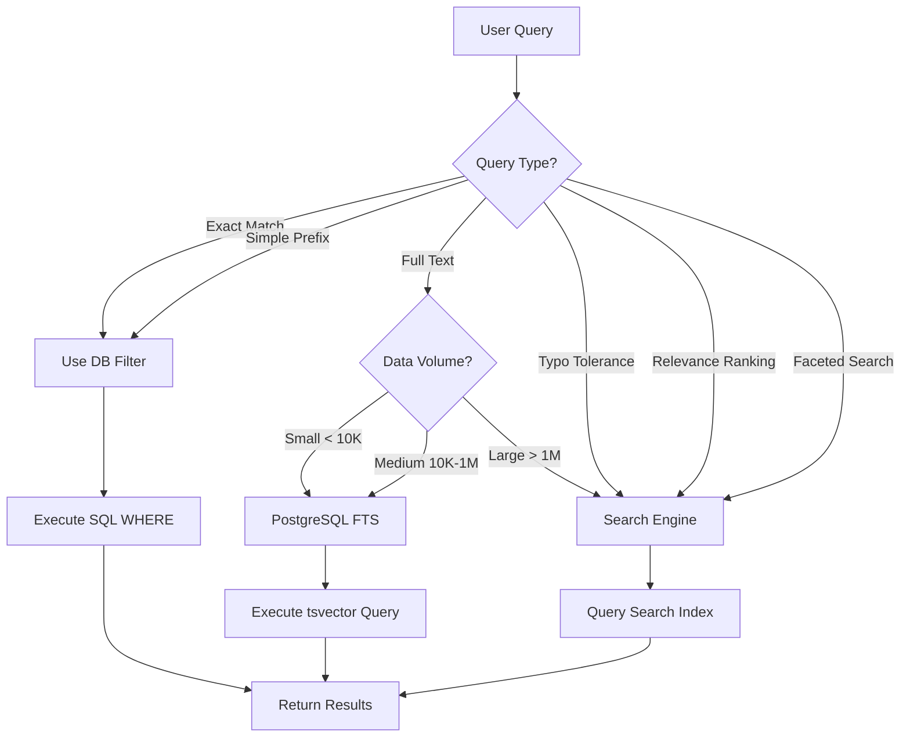
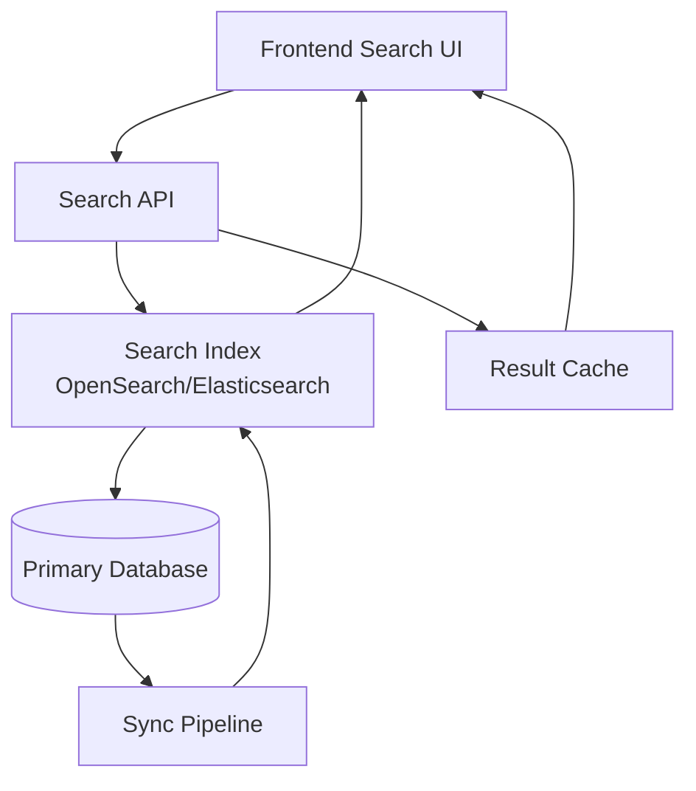

# Search & Discovery -- Architecture

## Contents

- [The Search Implementation Spectrum](#the-search-implementation-spectrum)
- [Data Synchronization Patterns](#data-synchronization-patterns)
- [Search Architecture Patterns](#search-architecture-patterns)
- [Autocomplete/Type-Ahead Architecture](#autocompletetype-ahead-architecture)
- [Faceted Search](#faceted-search)
- [Cross-Service Search](#cross-service-search)
- [Performance Considerations](#performance-considerations)
- [Integration with API Design](#integration-with-api-design)
- [Integration with Data Persistence](#integration-with-data-persistence)

## The Search Implementation Spectrum

Search capabilities exist on a spectrum from simple database queries to dedicated search infrastructure. Choose the right level based on your requirements, data volume, and user expectations.

### Search vs Filter Decision Flow



### Level 1: Database Filtering

**What it is**: Standard SQL WHERE clauses with query parameters, potentially with LIKE or ILIKE for text matching.

**When it's enough**:
- Small datasets (<10,000 records)
- Exact match or simple prefix matching is sufficient
- Users search by known identifiers (IDs, codes, exact names)
- No need for typo tolerance or relevance ranking
- Simple filtering needs (status, date ranges, categories)

**When it's not enough**:
- Users expect Google-like search behavior
- Need to search across multiple fields simultaneously
- Require typo tolerance or fuzzy matching
- Need relevance ranking (most important results first)
- Full-text search across long documents or descriptions
- Autocomplete/type-ahead requirements

**Implementation**: Standard Spring Boot endpoints with JPA/Hibernate queries. Frontend passes query parameters, backend applies filters.

```kotlin
// Example: Simple filtering endpoint
@GetMapping("/products")
fun getProducts(
    @RequestParam(required = false) name: String?,
    @RequestParam(required = false) category: String?,
    @RequestParam(required = false) minPrice: BigDecimal?
): List<Product> {
    // Build dynamic WHERE clauses based on provided parameters
}
```

### Level 2: PostgreSQL Full-Text Search

**What it is**: PostgreSQL's built-in full-text search using `tsvector` and `tsquery`, with GIN indexes for performance.

**When it's enough**:
- Medium datasets (10,000 - 1M records)
- Need full-text search across multiple columns
- Want relevance ranking without external infrastructure
- Already using PostgreSQL (no new dependencies)
- Moderate typo tolerance needs (can use trigram similarity)
- Autocomplete possible with prefix matching

**When it's not enough**:
- Very large datasets (>1M records) where search performance degrades
- Need advanced features: faceted search, aggregations, highlighting
- Require distributed search across multiple data sources
- Need real-time search index updates (PostgreSQL FTS requires manual refresh)

**Implementation**: 
- Create `tsvector` columns (or computed columns) for searchable text
- Build GIN indexes on `tsvector` columns
- Use `ts_rank()` or `ts_rank_cd()` for relevance scoring
- Combine with regular WHERE clauses for filtering

```kotlin
// Example: PostgreSQL full-text search
@Query("""
    SELECT p, ts_rank(p.search_vector, plainto_tsquery(:query)) as rank
    FROM Product p
    WHERE p.search_vector @@ plainto_tsquery(:query)
    ORDER BY rank DESC
    LIMIT :limit
""")
fun searchProducts(@Param("query") query: String, @Param("limit") limit: Int): List<Product>
```

**Data Synchronization**: Update `tsvector` columns on INSERT/UPDATE via database triggers or application-level logic.

### Level 3: Dedicated Search Engine

**What it is**: Separate search infrastructure optimized for search workloads. OpenSearch (recommended), Elasticsearch, Meilisearch, or Typesense.

**When it's enough** (and often necessary):
- Large datasets (>1M records)
- Need advanced features: faceted search, aggregations, highlighting, typo tolerance
- Require real-time or near-real-time search index updates
- Need distributed search across multiple services/data sources
- Complex relevance tuning requirements
- High search query volume requiring dedicated infrastructure

**When it might be overkill**:
- Small datasets where PostgreSQL FTS is sufficient
- Simple exact-match or filtering use cases
- Team lacks expertise to operate search infrastructure
- Budget constraints (though open-source options help)

**Architecture Pattern**: Search index as a read model, synchronized from primary database via events or CDC.

## Data Synchronization Patterns

Keeping search indexes in sync with source data is critical. Choose based on your consistency requirements and infrastructure.

### Event-Driven Indexing

**Pattern**: Domain events trigger search index updates asynchronously.

**Pros**:
- Decoupled from primary database transactions
- Can handle high write volumes
- Natural fit for event-sourced architectures
- Can batch updates for efficiency

**Cons**:
- Eventual consistency (small delay between data change and search availability)
- Requires event infrastructure
- Must handle event processing failures

**Implementation**: 
- Emit domain events on data changes (e.g., `ProductCreated`, `ProductUpdated`)
- Event handler updates search index
- Use idempotent handlers to handle duplicate events

```kotlin
// Example: Event-driven indexing
@EventListener
fun handleProductCreated(event: ProductCreatedEvent) {
    searchService.indexProduct(event.product)
}

@EventListener
fun handleProductUpdated(event: ProductUpdatedEvent) {
    searchService.updateProduct(event.product)
}
```

### Change Data Capture (CDC)

**Pattern**: Capture database changes (INSERT/UPDATE/DELETE) and stream to search index.

**Pros**:
- No application code changes required
- Captures all changes, including direct database updates
- Works with any application framework

**Cons**:
- Requires CDC infrastructure (e.g., Debezium)
- More complex setup and monitoring
- Must handle schema changes

**Implementation**: Debezium captures PostgreSQL WAL changes, streams to Kafka, consumer updates search index.

### Scheduled Reindex

**Pattern**: Periodic batch job rebuilds search index from source data.

**Pros**:
- Simple to implement
- No real-time infrastructure required
- Can optimize index structure during rebuild

**Cons**:
- Stale data between runs (minutes to hours)
- Full reindex can be expensive for large datasets
- Not suitable for real-time requirements

**Implementation**: Scheduled Spring Boot job queries database and updates search index. Run hourly or daily depending on freshness requirements.

### Hybrid Approach

Combine patterns: event-driven for real-time updates, scheduled reindex for consistency checks and recovery.

## Search Architecture Patterns

### Search Architecture Overview



**Pattern**: Dedicated `/search` endpoint separate from list/filter endpoints.

**Pros**:
- Clear separation of concerns
- Can optimize specifically for search (caching, indexing)
- Different pagination/ranking strategies

**Cons**:
- Two code paths to maintain
- Frontend must choose between search and list endpoints

**When to use**: When search behavior is meaningfully different from filtering (relevance ranking, typo tolerance, cross-field search).

### Enhanced List Endpoint

**Pattern**: Existing list endpoint accepts optional `q` parameter for search.

**Pros**:
- Single endpoint for frontend
- Simpler API surface
- Consistent pagination/filtering behavior

**Cons**:
- May not optimize well for both use cases
- Can become complex with many parameters

**When to use**: When search is essentially "smart filtering" and results can use same structure as filtered lists.

### Search Index as Read Model

**Pattern**: Search index is a denormalized read model optimized for queries, synchronized from transactional database.

**Pros**:
- Optimize search index structure independently
- Don't impact transactional database performance
- Can combine data from multiple sources

**Cons**:
- Data duplication and synchronization complexity
- Eventual consistency considerations

**When to use**: With dedicated search engines or when search needs differ significantly from transactional queries.

## Autocomplete/Type-Ahead Architecture

Autocomplete provides suggestions as users type, improving UX and reducing query errors.

### Prefix Queries

**Pattern**: Query search index for documents matching prefix of user input.

**Implementation**: 
- User types "inv" → query for documents starting with "inv"
- Use search engine prefix queries or PostgreSQL `LIKE 'inv%'` with index
- Limit results (e.g., top 10 suggestions)

**Pros**: Simple, works with any search backend

**Cons**: Doesn't handle typos, requires exact prefix match

### Edge N-grams

**Pattern**: Index terms broken into n-grams (e.g., "invoice" → "in", "inv", "invo", "invoi", "invoic", "invoice").

**Implementation**: 
- Index time: tokenize and create n-gram tokens
- Query time: match n-grams from user input
- Search engine handles this automatically with appropriate analyzers

**Pros**: Handles partial word matches, works well for autocomplete

**Cons**: Larger index size, more complex configuration

### Completion Suggester (OpenSearch/Elasticsearch)

**Pattern**: Special data structure optimized for autocomplete with fast prefix matching.

**Implementation**: 
- Build completion suggester field in search index
- Query using completion suggester API
- Returns suggestions ranked by relevance/frequency

**Pros**: Very fast, designed specifically for autocomplete, handles large datasets

**Cons**: Requires OpenSearch/Elasticsearch, separate from main search index

**Recommendation**: Use completion suggester for dedicated search engines, edge n-grams for PostgreSQL FTS.

## Faceted Search

Faceted search allows users to filter results by categories, attributes, or dimensions while seeing result counts. This enables users to narrow down large result sets progressively.

### Architecture Overview

**Pattern**: Search returns both results and aggregations/facets computed from matching documents.

**Data Flow**:
1. User performs search (with or without existing filters)
2. Backend executes search query + aggregation queries
3. Returns results + facet data (values and counts)
4. Frontend displays facets with counts
5. User selects facet → adds to filters → new search with filters
6. Facet counts update (reflect filtered result set)

**Example Response**:
```json
{
  "results": [
    {"id": "1", "title": "Backup Tool", "category": "Software", "price": 50},
    {"id": "2", "title": "Storage Drive", "category": "Hardware", "price": 75}
  ],
  "facets": {
    "category": [
      {"value": "Software", "count": 45, "selected": false},
      {"value": "Hardware", "count": 23, "selected": false}
    ],
    "priceRange": [
      {"value": "$0-$50", "count": 30, "selected": false},
      {"value": "$50-$100", "count": 38, "selected": false}
    ],
    "status": [
      {"value": "Active", "count": 60, "selected": false},
      {"value": "Inactive", "count": 8, "selected": false}
    ]
  },
  "totalResults": 68
}
```

### Backend Implementation

**OpenSearch/Elasticsearch Aggregations**:
```json
{
  "query": {
    "match": { "title": "backup" }
  },
  "aggs": {
    "categories": {
      "terms": {
        "field": "category.keyword",
        "size": 20  // Limit facet values
      }
    },
    "priceRanges": {
      "range": {
        "field": "price",
        "ranges": [
          {"to": 50},
          {"from": 50, "to": 100},
          {"from": 100}
        ]
      }
    }
  }
}
```

**PostgreSQL Implementation**:
```sql
-- Get results
SELECT p.* FROM products p 
WHERE p.search_vector @@ plainto_tsquery('english', :query)
LIMIT 20;

-- Get facet counts (category)
SELECT category, COUNT(*) as count
FROM products
WHERE search_vector @@ plainto_tsquery('english', :query)
GROUP BY category
ORDER BY count DESC
LIMIT 20;

-- Get facet counts (price ranges)
SELECT 
  CASE 
    WHEN price < 50 THEN '$0-$50'
    WHEN price < 100 THEN '$50-$100'
    ELSE '$100+'
  END as price_range,
  COUNT(*) as count
FROM products
WHERE search_vector @@ plainto_tsquery('english', :query)
GROUP BY price_range
ORDER BY count DESC;
```

**Spring Data Elasticsearch Example**:
```kotlin
@Query("""
{
  "query": {"match": {"title": "?0"}},
  "aggs": {
    "categories": {
      "terms": {"field": "category.keyword", "size": 20}
    }
  }
}
""")
fun searchWithFacets(query: String): SearchHits<Product>

// Or use native client
fun searchWithFacets(query: String): SearchResponse {
    val searchRequest = SearchRequest("products").apply {
        source(SearchSourceBuilder().apply {
            query(QueryBuilders.matchQuery("title", query))
            aggregations(
                AggregationBuilders.terms("categories")
                    .field("category.keyword")
                    .size(20)
            )
        })
    }
    return elasticsearchClient.search(searchRequest, RequestOptions.DEFAULT)
}
```

### Facet Filtering Logic

**AND Logic (Most Common)**:
- Multiple facet selections combine with AND
- Example: Category="Software" AND Price="$0-$50" → results matching both
- Facet counts reflect current filter state (exclude selected facets from counts)

**OR Logic (Less Common)**:
- Multiple selections within same facet use OR
- Example: Category="Software" OR Category="Hardware"
- Different facets still use AND

**Implementation**:
```kotlin
// AND logic: all selected facets must match
fun buildFilterQuery(selectedFacets: Map<String, List<String>>): BoolQueryBuilder {
    val boolQuery = QueryBuilders.boolQuery()
    
    selectedFacets.forEach { (facetName, values) ->
        val facetQuery = QueryBuilders.termsQuery("${facetName}.keyword", values)
        boolQuery.must(facetQuery)  // AND
    }
    
    return boolQuery
}

// Facet counts exclude selected facets
fun buildFacetAggregation(selectedFacets: Map<String, List<String>>): AggregationBuilder {
    // Build aggregation that excludes selected values
    // This ensures facet counts reflect what's available after filtering
}
```

### Facet Count Calculation

**Important**: Facet counts should reflect the filtered result set, not all documents.

**Correct Behavior**:
- User searches "backup" → Category facet shows: Software (45), Hardware (23)
- User selects "Software" → Results filtered, Category facet shows: Software (45 selected), Hardware (15) ← counts updated
- Hardware count decreased because some Hardware products don't match "backup" + "Software" filter

**Incorrect Behavior**:
- Facet counts don't update after filtering (shows all documents, not filtered set)
- Users confused: "Why does it say 23 Hardware but I only see 15 results?"

**Implementation**:
- Facet aggregations run on filtered query (after user's facet selections)
- Exclude selected facet values from counts (or mark as selected)
- This is default behavior in OpenSearch/Elasticsearch aggregations

### High-Cardinality Facets

**The Problem**: Facets with many unique values (user IDs, timestamps, unique tags) are expensive to compute and slow down queries.

**Solutions**:

**1. Avoid High-Cardinality Facets**:
- Don't facet on unique identifiers (IDs, emails, timestamps)
- Use low-cardinality fields (categories, status, price ranges)
- Prefer binned/ranged facets for high-cardinality data

**2. Limit Facet Values**:
- Return only top N facet values (e.g., top 20 categories)
- Use `size` parameter in aggregations
- Show "Show more" link for additional values

**3. Approximate Counts**:
- Use approximate aggregations (faster, less accurate)
- OpenSearch: `cardinality` aggregation with precision threshold
- Acceptable for large datasets where exact counts aren't critical

**4. Pre-compute Popular Facets**:
- Cache facet counts for common filter combinations
- Update cache periodically (not real-time)
- Good for relatively static facets (categories, product types)

**5. Lazy-Load Facets**:
- Load facets only when user expands facet section
- Reduces initial query time
- Good for many facets or expensive facets

**6. Separate Facet Endpoint**:
- Load search results first (fast)
- Load facets separately (can be slower)
- Better perceived performance (results appear first)

### Faceted Search Performance

**Optimization Strategies**:

**1. Field Types**:
- Use `keyword` type for exact-match facets (categories, status)
- Use `text` + `keyword` multi-field for searchable + facetable fields
- Avoid faceting on `text` fields (use `keyword` sub-field)

**2. Aggregation Caching**:
- Cache facet aggregations (they change less frequently than results)
- Invalidate cache on data updates
- Use appropriate TTL (5-10 minutes for dynamic data)

**3. Facet Ordering**:
- Order facets by count (most common first)
- Or alphabetically for better UX
- Consider user preferences (recently used facets first)

**4. Parallel Aggregations**:
- Compute multiple facets in parallel (if search engine supports)
- Reduces total query time
- OpenSearch/Elasticsearch compute aggregations in parallel by default

**5. Monitor Performance**:
- Track facet computation time separately from search time
- Alert on slow facets
- Consider removing or optimizing slow facets

### Frontend Facet Display Patterns

**Filter Panel Design**:
- Sidebar or top section with collapsible facet groups
- Clear visual hierarchy (facet name, values, counts)
- Easy to scan (consistent spacing, typography)
- Mobile-responsive (accordion or drawer on mobile)

**Active Filter Display**:
- Show selected facets as chips/badges above results
- Easy to remove (X button on each chip)
- "Clear all" button to remove all filters
- Visual distinction (different color/style for active filters)

**Facet Count Display**:
- Show counts next to each facet value: "Software (45)"
- Update counts dynamically as filters change
- Gray out or hide facet values with 0 count (or show as disabled)
- Indicate selected state (checkmark, different color)

**Facet Interaction**:
- Click to toggle (add/remove filter)
- Multiple selections within facet (OR logic)
- Multiple facets combine (AND logic)
- URL reflects filter state (for shareability, bookmarking)

**Example UI Pattern**:
```
[Search: backup                    ] [Search]

Active Filters: [Software ×] [Price: $0-$50 ×] [Clear All]

Results (68 found)

Filters:
▼ Category
  ☑ Software (45)
  ☐ Hardware (23)
  ☐ Services (12)

▼ Price Range
  ☐ $0-$50 (30)
  ☑ $50-$100 (38)
  ☐ $100+ (12)

▼ Status
  ☐ Active (60)
  ☐ Inactive (8)
```

**Best Practices**:
- Show facet counts (users need to know how many results per filter)
- Update counts when filters change (reflects filtered set)
- Make it easy to remove filters (one-click removal)
- Preserve filter state in URL (shareable, bookmarkable)
- Mobile-friendly (touch targets, responsive layout)

## Cross-Service Search

When search spans multiple bounded contexts or services:

**Pattern**: Federated search or unified search index.

**Federated Search**:
- Query multiple services in parallel
- Merge and rank results client-side or via aggregator service
- Pros: Services remain independent
- Cons: Complex ranking, potential inconsistency

**Unified Search Index**:
- Each service publishes searchable data to shared search index
- Single search endpoint queries unified index
- Pros: Consistent ranking, single query
- Cons: Cross-service coupling, synchronization complexity

**Recommendation**: Start with federated search for independence, move to unified index if search becomes core to user experience.

## Search Relevance Tuning

Relevance tuning determines which results appear first and how well they match user intent. This is critical for user satisfaction—poor relevance erodes trust and increases search abandonment.

### Field Weighting and Boosting

**The Problem**: Not all fields are equally important. A match in a product title should rank higher than a match in a tag or description.

**Field Boosting**:
- Assign higher weights to important fields (title, name, primary identifier)
- Lower weights for secondary fields (description, tags, comments)
- Typical boost ratios: title 3-5x, name 2-3x, description 1x, tags 0.5x

**OpenSearch/Elasticsearch Implementation**:
```json
{
  "query": {
    "multi_match": {
      "query": "backup solution",
      "fields": [
        "title^3",      // Title matches weighted 3x
        "name^2",       // Name matches weighted 2x
        "description",  // Description matches weighted 1x (default)
        "tags^0.5"      // Tags weighted 0.5x
      ],
      "type": "best_fields"
    }
  }
}
```

**PostgreSQL FTS Implementation**:
```sql
-- Weight different fields differently
SELECT 
  p.*,
  (
    ts_rank(setweight(to_tsvector('english', p.title), 'A'), query) * 3 +
    ts_rank(setweight(to_tsvector('english', p.name), 'B'), query) * 2 +
    ts_rank(setweight(to_tsvector('english', p.description), 'C'), query) * 1
  ) as rank
FROM products p, plainto_tsquery('english', :query) query
WHERE p.search_vector @@ query
ORDER BY rank DESC;
```

**Why Field Weighting Matters**:
- Users expect exact matches in titles/names to appear first
- Prevents irrelevant results from ranking high due to keyword stuffing in descriptions
- Improves search-to-click rate by showing most relevant results first
- Balances multiple signals (title match vs. description match)

**Common Mistakes**:
- Equal weighting across all fields (description matches rank same as title matches)
- Over-boosting title (ignores relevant content in descriptions)
- Not considering user context (some fields matter more in certain contexts)

### Synonym Handling

**The Problem**: Users search with different terms than content uses. "Invoice" vs "Bill", "Customer" vs "Client", "Backup" vs "Data Protection".

**Synonym Configuration**:
- Define synonym mappings (invoice → bill, receipt)
- Handle bidirectional synonyms (invoice ↔ bill) vs. one-way (backup → data protection)
- Consider context (backup can mean data backup or system backup)

**OpenSearch/Elasticsearch Synonyms**:
```json
{
  "settings": {
    "analysis": {
      "filter": {
        "synonym_filter": {
          "type": "synonym",
          "synonyms": [
            "invoice, bill, receipt",
            "customer, client, account",
            "backup, data protection, disaster recovery"
          ]
        }
      },
      "analyzer": {
        "synonym_analyzer": {
          "tokenizer": "standard",
          "filter": ["lowercase", "synonym_filter"]
        }
      }
    }
  }
}
```

**PostgreSQL FTS Synonyms**:
- Use `thesaurus` dictionaries or application-level synonym expansion
- Create custom text search configuration with synonym mappings
- Or handle in application layer (expand query terms before search)

**Synonym Best Practices**:
- Start with domain-specific synonyms (business terms, product categories)
- Monitor search analytics to identify synonym gaps (users searching for terms that don't match content)
- Test synonym impact on relevance (don't over-expand queries)
- Consider user context (synonyms may differ by user role or domain)

### Stop Words

**The Problem**: Common words ("the", "a", "an", "and", "or") add noise to search without improving relevance. They can also slow down queries.

**Stop Word Lists**:
- Language-specific stop word lists (English, Spanish, etc.)
- Domain-specific stop words (common terms in your domain that don't add value)
- Balance: removing too many stop words can break phrase matching

**OpenSearch/Elasticsearch Stop Words**:
```json
{
  "settings": {
    "analysis": {
      "filter": {
        "english_stop": {
          "type": "stop",
          "stopwords": "_english_"
        },
        "custom_stop": {
          "type": "stop",
          "stopwords": ["inc", "ltd", "corp"]  // Domain-specific
        }
      }
    }
  }
}
```

**PostgreSQL FTS Stop Words**:
- Built-in stop word lists per language configuration
- Customize via text search configuration
- Use `CREATE TEXT SEARCH CONFIGURATION` to override defaults

**When to Customize Stop Words**:
- Domain-specific terms that are common but meaningless ("inc", "ltd" in company names)
- Product categories that appear everywhere (too generic to be useful)
- But be careful: removing stop words can break phrase queries ("to be or not to be")

### Multi-Field Matching Strategies

**Best Fields Strategy**:
- Query matches across multiple fields, uses highest-scoring field match
- Good for: queries matching different fields (title OR description)
- Example: "enterprise backup" matches title in one product, description in another

**Cross Fields Strategy**:
- Treats multiple fields as one big field
- Good for: queries where terms should match across fields ("John" in name, "Smith" in email)
- Example: "John Smith" where John is in name field, Smith is in email field

**Most Fields Strategy**:
- Scores based on how many fields match
- Good for: boosting results matching multiple fields
- Example: Product matching "backup" in title AND description ranks higher

**Implementation Choice**:
- Choose strategy based on user query patterns
- Test different strategies with real user queries
- May need different strategies for different query types

### Recency and Popularity Boosting

**Recency Boosting**:
- Boost recently created/updated content
- Decay function: newer content gets higher boost, boost decreases over time
- Balance: don't over-boost recency at expense of relevance

**Popularity Boosting**:
- Boost frequently accessed, highly rated, or popular content
- Metrics: view count, click count, rating, purchase count
- Balance: popular but irrelevant content shouldn't rank above relevant but less popular

**Combining Signals**:
- Relevance score (field matching) + recency boost + popularity boost
- Weight each signal appropriately (relevance usually primary)
- Test combinations to find optimal balance

**OpenSearch/Elasticsearch Function Score**:
```json
{
  "query": {
    "function_score": {
      "query": { "match": { "title": "backup" } },
      "functions": [
        {
          "gauss": {
            "created_at": {
              "origin": "now",
              "scale": "30d",
              "decay": 0.5
            }
          }
        },
        {
          "field_value_factor": {
            "field": "view_count",
            "factor": 0.1,
            "modifier": "log1p"
          }
        }
      ],
      "score_mode": "multiply",
      "boost_mode": "multiply"
    }
  }
}
```

### Relevance Tuning Process

**1. Baseline Measurement**:
- Measure current relevance metrics (search-to-click rate, time-to-first-click)
- Identify problem queries (high zero-result rate, low click-through)
- Document current ranking behavior

**2. Hypothesis Formation**:
- Analyze problem queries: why are results poor?
- Form hypotheses: "Title matches should rank higher", "Recent content should boost", "Synonyms needed for X terms"

**3. Implement Changes**:
- Make incremental changes (don't change everything at once)
- Test changes in isolation to measure impact
- Use feature flags for gradual rollout

**4. Measure Impact**:
- A/B test relevance changes
- Measure: click-through rate, time-to-first-click, zero-result rate, user satisfaction
- Compare metrics before/after changes

**5. Iterate**:
- Keep changes that improve metrics
- Roll back changes that degrade metrics
- Continue iterating based on user feedback and analytics

**Common Pitfalls**:
- Tuning based on developer intuition instead of user behavior
- Over-tuning for edge cases at expense of common cases
- Making too many changes at once (can't measure individual impact)
- Ignoring user feedback and analytics

## Search Indexing Strategies

Keeping search indexes synchronized with source data requires careful strategy. Different approaches balance consistency, performance, and operational complexity.

### Real-Time Indexing

**Pattern**: Update search index immediately when data changes (within milliseconds to seconds).

**Implementation**:
- Event-driven: Domain events trigger immediate index updates
- Synchronous: Update index in same transaction (risky, can slow down writes)
- Async but immediate: Queue index update, process immediately

**Pros**:
- Minimal lag (data appears in search almost instantly)
- Best user experience (users find content immediately after creating it)
- Critical for real-time applications

**Cons**:
- Can slow down write operations if synchronous
- More complex error handling (what if index update fails?)
- Higher infrastructure costs (more frequent index operations)
- Can overwhelm search infrastructure during bulk operations

**When to Use**:
- Search is critical to user workflow (users create content and immediately search for it)
- Low write volume (can handle synchronous or near-synchronous updates)
- High user expectations for freshness
- Content creation is primary use case

**Best Practices**:
- Use async event processing (don't block writes)
- Implement retry logic with exponential backoff
- Monitor index lag (alert if lag exceeds threshold)
- Handle failures gracefully (dead-letter queues, manual reindex capability)

### Batch Indexing

**Pattern**: Collect changes and update search index in batches (periodic or size-based).

**Implementation**:
- Scheduled batches: Run every N minutes/hours, process all changes since last run
- Size-based batches: Process when queue reaches N items
- Time + size: Process when queue reaches size OR time threshold

**Pros**:
- More efficient (fewer index operations, can optimize batch updates)
- Lower infrastructure costs
- Handles bulk operations well (many changes processed together)
- Simpler error handling (retry entire batch)

**Cons**:
- Stale data between batches (minutes to hours)
- Users may not find recently created content
- Batch failures affect more records
- Less responsive to individual changes

**When to Use**:
- Acceptable lag (minutes to hours) is fine
- High write volume (batch processing more efficient)
- Cost-sensitive (want to minimize index operations)
- Content freshness less critical

**Best Practices**:
- Choose batch frequency based on freshness requirements
- Monitor batch processing time and success rate
- Handle batch failures (retry, partial success handling)
- Consider hybrid: real-time for critical updates, batch for bulk operations

### Partial Updates

**Pattern**: Update only changed fields in search index, not entire document.

**Implementation**:
- OpenSearch/Elasticsearch: Use `update` API with `doc` parameter (partial document)
- PostgreSQL FTS: Update only `tsvector` column for changed text fields
- Application layer: Track which fields changed, update only those

**Pros**:
- Faster than full document reindex
- Lower network and processing overhead
- Better for frequent small updates

**Cons**:
- More complex (must track field changes)
- Risk of inconsistency if partial update fails
- Some search engines don't support true partial updates (reindex entire document internally)

**When to Use**:
- Documents have many fields, only few change frequently
- Want to minimize index update overhead
- Search engine supports efficient partial updates

**Best Practices**:
- Use when only specific fields change (e.g., status updates, view counts)
- Full reindex for structural changes (new fields, analyzer changes)
- Monitor partial update performance vs. full reindex
- Test partial update behavior (ensure all fields stay consistent)

### Index Aliases for Zero-Downtime Reindexing

**The Problem**: Reindexing large datasets can take hours. During reindex, you can't update the index (or updates go to old index). How do you reindex without downtime?

**Index Alias Pattern**:
- Create new index (e.g., `products_v2`)
- Reindex data from source to new index (can take hours)
- When complete, atomically swap alias from `products_v1` to `products_v2`
- Old index can be deleted after verification

**OpenSearch/Elasticsearch Implementation**:
```bash
# 1. Create new index
PUT /products_v2
{ "mappings": { ... }, "settings": { ... } }

# 2. Reindex data (can take hours)
POST /_reindex
{
  "source": { "index": "products_v1" },
  "dest": { "index": "products_v2" }
}

# 3. Update alias atomically (zero downtime)
POST /_aliases
{
  "actions": [
    { "remove": { "index": "products_v1", "alias": "products" } },
    { "add": { "index": "products_v2", "alias": "products" } }
  ]
}

# 4. Delete old index after verification
DELETE /products_v1
```

**Why This Works**:
- Applications query via alias (`products`), not index name
- Alias swap is atomic (no downtime)
- Can roll back quickly if issues (swap alias back)
- Old index remains available during transition

**Best Practices**:
- Always use aliases for production indexes (never query index name directly)
- Test reindex process in staging first
- Monitor new index during reindex (verify data correctness)
- Have rollback plan (keep old index until verified)
- Consider blue-green deployment pattern (run both indexes, switch traffic)

**When to Reindex**:
- Schema changes (new fields, analyzer changes)
- Analyzer configuration changes (requires reindex for existing data)
- Data corruption or consistency issues
- Performance optimization (changing index settings)

### Incremental Reindexing

**Pattern**: Reindex only changed documents, not entire dataset.

**Implementation**:
- Track last reindex timestamp or version
- Query source data for records modified since last reindex
- Update only those records in search index
- Periodic full reindex for consistency (weekly/monthly)

**Pros**:
- Faster than full reindex (only process changes)
- Less load on source database
- Can run more frequently

**Cons**:
- More complex (must track what's changed)
- Risk of missing changes if tracking fails
- Still need periodic full reindex for consistency

**When to Use**:
- Large datasets where full reindex is expensive
- Frequent small changes (most documents unchanged)
- Want to keep index fresh without full reindex overhead

**Best Practices**:
- Use database timestamps or version columns to track changes
- Periodic full reindex to catch any missed changes
- Monitor incremental reindex coverage (verify all changes captured)
- Handle deleted records (soft deletes vs. hard deletes)

## OpenSearch vs Elasticsearch: Practical Differences

Both OpenSearch and Elasticsearch are powerful search engines with similar capabilities, but there are important practical differences for decision-making.

### Licensing and Cost

**Elasticsearch**:
- Elastic License 2.0 (ELv2) - source available but with restrictions
- Commercial features require Elastic Cloud subscription or Enterprise license
- Some advanced features (ML, security) are commercial-only
- Cost: Free for basic features, paid for advanced features and support

**OpenSearch**:
- Apache 2.0 license - fully open source, no restrictions
- All features included (no commercial-only features)
- Community-driven development (AWS maintains, but open governance)
- Cost: Free (infrastructure costs only)

**Decision Factor**: If you need advanced ML features or enterprise support, Elasticsearch may be worth the cost. If you want full open-source with no restrictions, OpenSearch is better.

### Feature Parity and Compatibility

**Current State (2024)**:
- OpenSearch forked from Elasticsearch 7.10.2 (2021)
- Core search features are nearly identical (query DSL, aggregations, indexing)
- OpenSearch has added new features (some not in Elasticsearch)
- Elasticsearch has continued evolving independently

**API Compatibility**:
- Query DSL is largely compatible (same JSON structure)
- Most Elasticsearch queries work in OpenSearch with minimal changes
- Some advanced Elasticsearch features may not be available in OpenSearch
- OpenSearch-specific features won't work in Elasticsearch

**Migration Considerations**:
- Migrating from Elasticsearch 7.x to OpenSearch: Relatively straightforward (same data format)
- Migrating from Elasticsearch 8.x to OpenSearch: May require data migration (format changes)
- Migrating from OpenSearch to Elasticsearch: Generally compatible but may need query adjustments

**Decision Factor**: If you're starting new, either works. If migrating from Elasticsearch 7.x, OpenSearch is easier. If you need latest Elasticsearch 8.x features, stick with Elasticsearch.

### Spring Data Integration

**Spring Data Elasticsearch**:
- Official Spring Data module for Elasticsearch
- Mature, well-documented, actively maintained
- Supports Elasticsearch 7.x and 8.x
- Rich repository abstractions, query methods, entity mapping

**Spring Data OpenSearch**:
- Community-maintained fork of Spring Data Elasticsearch
- Compatible API (same annotations, repository patterns)
- Supports OpenSearch 1.x and 2.x
- May lag behind Spring Data Elasticsearch in features

**Implementation Example** (Both are similar):
```kotlin
// Works with both Elasticsearch and OpenSearch
@Document(indexName = "products")
data class Product(
    @Id val id: String,
    @Field(type = FieldType.Text) val title: String,
    @Field(type = FieldType.Keyword) val category: String
)

interface ProductRepository : ElasticsearchRepository<Product, String> {
    fun findByTitleContaining(title: String): List<Product>
    
    @Query("{\"match\": {\"title\": \"?0\"}}")
    fun searchByTitle(query: String): List<Product>
}
```

**Configuration Differences**:
```yaml
# Elasticsearch
spring:
  elasticsearch:
    uris: http://localhost:9200
    username: elastic
    password: changeme

# OpenSearch (same configuration, different default port)
spring:
  elasticsearch:
    uris: http://localhost:9200  # OpenSearch default is 9200 too
    # Note: Spring Data Elasticsearch works with OpenSearch
    # But you may want to use OpenSearch-specific client
```

**Decision Factor**: Spring Data Elasticsearch works with OpenSearch, but for best compatibility use OpenSearch client libraries. Both have similar developer experience.

### Operational Differences

**Cluster Management**:
- Both use similar cluster concepts (nodes, shards, replicas)
- OpenSearch: Simpler defaults, good for getting started
- Elasticsearch: More configuration options, steeper learning curve

**Monitoring and Observability**:
- Elasticsearch: Built-in monitoring (requires license for advanced features)
- OpenSearch: OpenSearch Dashboards (fork of Kibana) included, fully open source
- Both support Prometheus metrics, APM integration

**Security**:
- Elasticsearch: Advanced security features (commercial license required)
- OpenSearch: Security plugin included (authentication, authorization, encryption)
- Both support TLS, basic auth, role-based access control

**Decision Factor**: For most use cases, operational differences are minimal. Choose based on licensing, feature needs, and team expertise.

### Community and Ecosystem

**Elasticsearch**:
- Larger ecosystem (more plugins, integrations, tutorials)
- More Stack Overflow answers, blog posts, examples
- Enterprise support available
- Larger talent pool (more developers familiar with it)

**OpenSearch**:
- Growing community (smaller but active)
- AWS backing provides stability and resources
- Open governance (community-driven roadmap)
- Fewer third-party plugins (but core features are solid)

**Decision Factor**: If you need extensive ecosystem and community support, Elasticsearch may be better. If you prefer open-source governance and AWS backing, OpenSearch is good choice.

### Recommendation

**Choose OpenSearch if**:
- You want fully open-source with no licensing restrictions
- You're starting new or migrating from Elasticsearch 7.x
- You prefer Apache 2.0 license and open governance
- AWS ecosystem integration is valuable
- Cost is a concern (no commercial license fees)

**Choose Elasticsearch if**:
- You need latest Elasticsearch 8.x features
- You require enterprise support and commercial features
- You need extensive ecosystem and third-party plugins
- Your team has deep Elasticsearch expertise
- You're already heavily invested in Elasticsearch ecosystem

**For Most Teams**: OpenSearch is a solid choice—it's fully open-source, has all core features, and Spring Data integration works well. Start with OpenSearch unless you have specific Elasticsearch requirements.

## Performance Considerations

**Indexing Performance**:
- Batch index updates for efficiency
- Use async processing to avoid blocking user requests
- Monitor index lag (time between data change and search availability)
- Use partial updates when possible (update only changed fields)
- Consider index aliases for zero-downtime reindexing

**Query Performance**:
- Cache frequent queries (with appropriate invalidation)
- Limit result sets and use pagination
- Optimize search index structure (analyzers, field types)
- Monitor query latency (p95, p99)
- Use appropriate query types (match vs. term vs. bool queries)

**Scalability**:
- Search engines can scale horizontally (add nodes)
- PostgreSQL FTS may require read replicas for high query volume
- Consider search result caching at CDN/edge for public content
- Monitor index size and shard distribution (avoid oversized shards)

## Integration with API Design

See [API Design facet](../../facets/api-design/) for:
- Search endpoint design patterns
- Pagination strategies for search results
- Filter parameter conventions
- API versioning considerations for search

## Integration with Data Persistence

See [Data Persistence facet](../../facets/data-persistence/) for:
- Database indexing strategies for search
- PostgreSQL full-text search configuration
- Transactional considerations when updating search indexes
