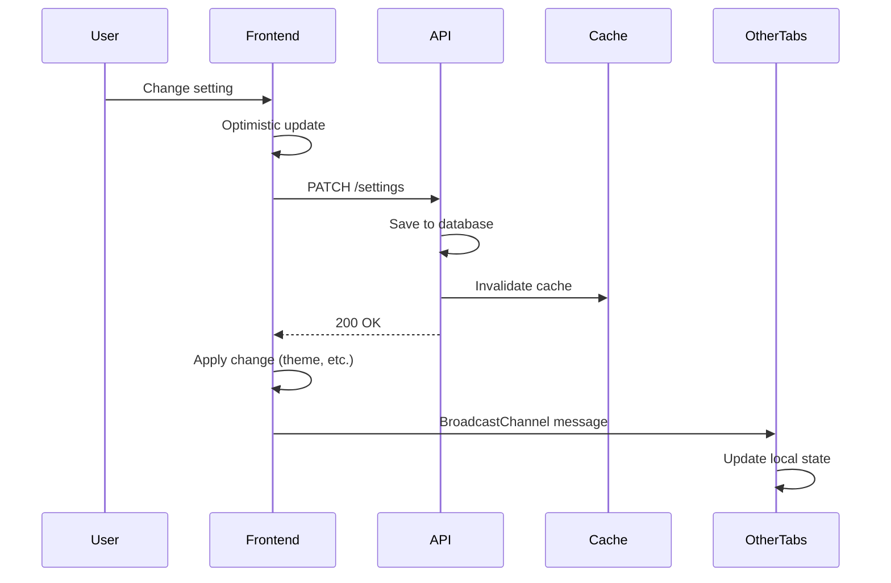
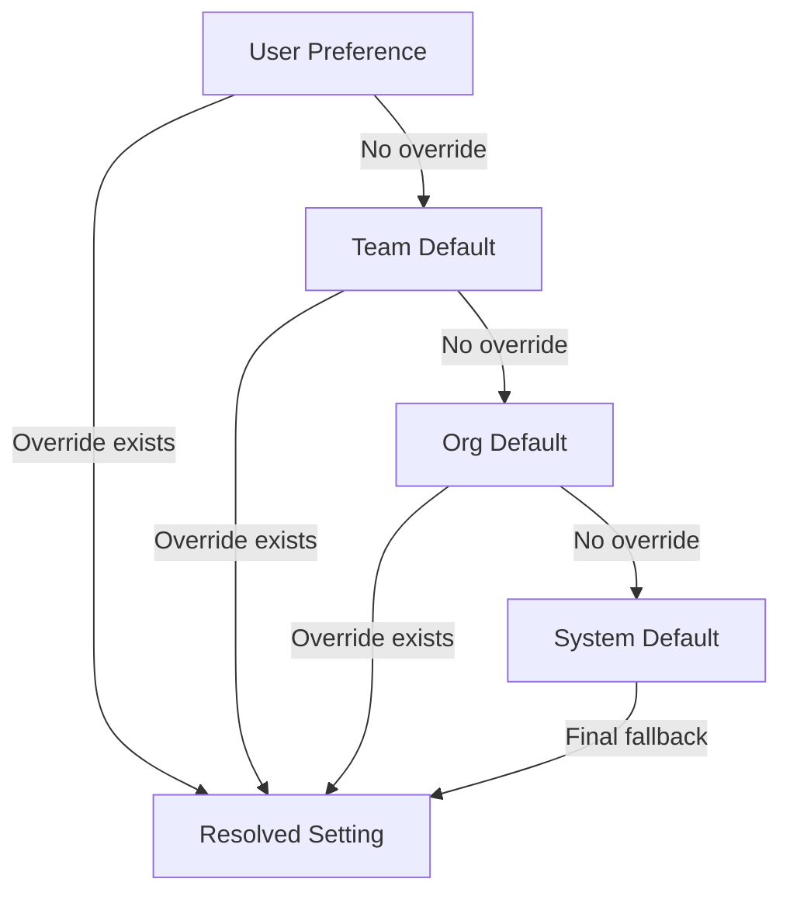

# Architecture: Settings & Preferences

## Contents

- [Settings Storage Patterns](#settings-storage-patterns)
- [Settings API Design](#settings-api-design)
- [Real-Time Settings Propagation](#real-time-settings-propagation)
- [Settings Hierarchy](#settings-hierarchy)
- [Settings Migration](#settings-migration)
- [Feature Flag Integration](#feature-flag-integration)
- [Caching Strategy](#caching-strategy)
- [Server-Side Configuration](#server-side-configuration)

## Settings Storage Patterns

### Per-User Settings in Database

Store user-specific settings in PostgreSQL using either **JSONB columns** or **dedicated tables**, depending on query patterns and schema stability.

**JSONB Approach** (flexible, good for frequently-changing schemas):
```sql
CREATE TABLE user_preferences (
    user_id UUID PRIMARY KEY REFERENCES users(id),
    preferences JSONB NOT NULL DEFAULT '{}',
    updated_at TIMESTAMP NOT NULL DEFAULT NOW()
);

CREATE INDEX idx_user_prefs_gin ON user_preferences USING GIN (preferences);
```

**Dedicated Tables** (type-safe, better for complex queries):
```sql
CREATE TABLE user_appearance_settings (
    user_id UUID PRIMARY KEY REFERENCES users(id),
    theme VARCHAR(20) NOT NULL DEFAULT 'system',
    density VARCHAR(20) NOT NULL DEFAULT 'comfortable',
    language VARCHAR(10) NOT NULL DEFAULT 'en',
    updated_at TIMESTAMP NOT NULL DEFAULT NOW()
);

CREATE TABLE user_notification_settings (
    user_id UUID PRIMARY KEY REFERENCES users(id),
    email_enabled BOOLEAN NOT NULL DEFAULT true,
    push_enabled BOOLEAN NOT NULL DEFAULT true,
    digest_frequency VARCHAR(20) NOT NULL DEFAULT 'realtime',
    updated_at TIMESTAMP NOT NULL DEFAULT NOW()
);
```

**When to use JSONB**: Settings schema changes frequently, settings are rarely queried directly, you need flexible nested structures.

**When to use dedicated tables**: Settings are queried/filtered frequently, you need strong type safety, settings are part of business logic.

### Per-Org/Tenant Settings

Organization-level defaults that users can override:

```sql
CREATE TABLE org_settings (
    org_id UUID PRIMARY KEY REFERENCES organizations(id),
    default_theme VARCHAR(20) NOT NULL DEFAULT 'light',
    default_language VARCHAR(10) NOT NULL DEFAULT 'en',
    sso_enabled BOOLEAN NOT NULL DEFAULT false,
    data_retention_days INTEGER NOT NULL DEFAULT 365,
    updated_at TIMESTAMP NOT NULL DEFAULT NOW(),
    updated_by UUID REFERENCES users(id)
);
```

### Browser localStorage for Transient Preferences

Use localStorage for UI-only preferences that don't need server sync:

```typescript
// Vue 3 example
import { ref, watch } from 'vue'

const sidebarCollapsed = ref(
  localStorage.getItem('sidebarCollapsed') === 'true'
)

watch(sidebarCollapsed, (newVal) => {
  localStorage.setItem('sidebarCollapsed', String(newVal))
})
```

**Use localStorage for**: UI state (sidebar collapsed, column widths, table sort), temporary preferences (dismissed banners), client-side only features.

**Don't use localStorage for**: Security-sensitive settings, settings that need to sync across devices, settings that affect server behavior.

## Settings API Design

### PATCH Semantics for Partial Updates

Use PATCH endpoints that accept partial updates and merge with existing settings:

```kotlin
// Spring Boot example
@PatchMapping("/api/settings/appearance")
fun updateAppearanceSettings(
    @RequestBody updates: Map<String, Any>,
    authentication: Authentication
): ResponseEntity<AppearanceSettings> {
    val userId = authentication.principal as UserPrincipal
    val current = settingsService.getAppearanceSettings(userId.id)
    val merged = mergeSettings(current, updates)
    val updated = settingsService.saveAppearanceSettings(userId.id, merged)
    return ResponseEntity.ok(updated)
}

private fun mergeSettings(
    current: AppearanceSettings,
    updates: Map<String, Any>
): AppearanceSettings {
    // Use Jackson @JsonMerge or manual merging
    return current.copy(
        theme = updates["theme"] as? String ?: current.theme,
        density = updates["density"] as? String ?: current.density,
        language = updates["language"] as? String ?: current.language
    )
}
```

### Granular vs Bulk Endpoints

**Granular endpoints** (`/settings/notifications`, `/settings/appearance`) provide better separation of concerns and allow different permission checks:

```kotlin
@PatchMapping("/api/settings/notifications")
@PreAuthorize("hasPermission(#userId, 'NOTIFICATION_SETTINGS')")
fun updateNotifications(userId: UUID, @RequestBody updates: NotificationSettings)

@PatchMapping("/api/settings/appearance")
fun updateAppearance(userId: UUID, @RequestBody updates: AppearanceSettings)
```

**Bulk endpoint** (`/settings`) is convenient for updating multiple categories at once but requires careful permission handling:

```kotlin
@PatchMapping("/api/settings")
fun updateSettings(
    userId: UUID,
    @RequestBody updates: Map<String, Map<String, Any>>
): ResponseEntity<Map<String, Any>> {
    val results = mutableMapOf<String, Any>()
    
    updates["appearance"]?.let {
        results["appearance"] = updateAppearance(userId, it)
    }
    updates["notifications"]?.let {
        results["notifications"] = updateNotifications(userId, it)
    }
    
    return ResponseEntity.ok(results)
}
```

**Recommendation**: Provide both granular endpoints (for focused updates) and bulk endpoint (for initial load or multi-category updates).

### Optimistic Updates on Frontend

Update UI immediately, then sync with server:

```typescript
// React example with React Query
const useAppearanceSettings = () => {
  const queryClient = useQueryClient()
  
  const updateMutation = useMutation({
    mutationFn: (updates: Partial<AppearanceSettings>) =>
      api.patch('/settings/appearance', updates),
    onMutate: async (updates) => {
      // Cancel outgoing refetches
      await queryClient.cancelQueries(['appearance-settings'])
      
      // Snapshot previous value
      const previous = queryClient.getQueryData(['appearance-settings'])
      
      // Optimistically update
      queryClient.setQueryData(['appearance-settings'], (old: any) => ({
        ...old,
        ...updates
      }))
      
      // Apply theme change immediately
      if (updates.theme) {
        applyTheme(updates.theme)
      }
      
      return { previous }
    },
    onError: (err, updates, context) => {
      // Rollback on error
      queryClient.setQueryData(['appearance-settings'], context?.previous)
    },
    onSettled: () => {
      queryClient.invalidateQueries(['appearance-settings'])
    }
  })
  
  return updateMutation
}
```

## Real-Time Settings Propagation

### Settings Propagation Flow

When a user changes a setting, the change propagates through the system to update caches and notify other browser tabs:



### Applying Theme Changes Without Page Refresh

Use CSS custom properties (CSS variables) for runtime theme switching:

```css
:root {
  --color-bg-primary: #ffffff;
  --color-text-primary: #000000;
}

[data-theme="dark"] {
  --color-bg-primary: #1a1a1a;
  --color-text-primary: #ffffff;
}

.component {
  background-color: var(--color-bg-primary);
  color: var(--color-text-primary);
  transition: background-color 0.2s, color 0.2s;
}
```

```typescript
// Vue 3 example
const applyTheme = (theme: string) => {
  const root = document.documentElement
  if (theme === 'system') {
    const prefersDark = window.matchMedia('(prefers-color-scheme: dark)').matches
    root.setAttribute('data-theme', prefersDark ? 'dark' : 'light')
  } else {
    root.setAttribute('data-theme', theme)
  }
}

watch(settings.theme, (newTheme) => {
  applyTheme(newTheme)
}, { immediate: true })
```

### Cross-Tab Synchronization with BroadcastChannel API

Synchronize settings changes across browser tabs:

```typescript
// React example
const useCrossTabSync = () => {
  useEffect(() => {
    const channel = new BroadcastChannel('settings-sync')
    
    channel.onmessage = (event) => {
      if (event.data.type === 'SETTINGS_UPDATED') {
        // Update local state without triggering save
        updateLocalSettings(event.data.settings)
        applyTheme(event.data.settings.theme)
      }
    }
    
    return () => channel.close()
  }, [])
  
  const notifyOtherTabs = (settings: Settings) => {
    const channel = new BroadcastChannel('settings-sync')
    channel.postMessage({
      type: 'SETTINGS_UPDATED',
      settings
    })
    channel.close()
  }
  
  return { notifyOtherTabs }
}
```

### WebSocket for Real-Time Org Setting Changes

When org admins change org-wide defaults, notify affected users:

```kotlin
// Spring Boot WebSocket example
@Component
class SettingsWebSocketHandler : TextWebSocketHandler() {
    
    @Autowired
    lateinit var orgSettingsService: OrgSettingsService
    
    override fun afterConnectionEstablished(session: WebSocketSession) {
        val userId = extractUserId(session)
        val orgId = getUserOrgId(userId)
        
        // Subscribe to org settings changes
        session.attributes["orgId"] = orgId
    }
    
    fun broadcastOrgSettingsChange(orgId: UUID, changes: Map<String, Any>) {
        sessions.filter { it.attributes["orgId"] == orgId }
            .forEach { session ->
                session.sendMessage(
                    TextMessage(
                        objectMapper.writeValueAsString(
                            mapOf(
                                "type" to "ORG_SETTINGS_CHANGED",
                                "changes" to changes
                            )
                        )
                    )
                )
            }
    }
}
```

## Settings Hierarchy

### Settings Storage Hierarchy

Settings resolution follows a hierarchical fallback chain from user preferences down to system defaults:



### Resolution Logic: System → Org → User

Settings resolution follows a clear precedence chain:

```kotlin
data class ResolvedSettings(
    val theme: String,
    val language: String,
    val density: String
)

class SettingsResolver(
    private val systemDefaults: SystemDefaults,
    private val orgSettingsService: OrgSettingsService,
    private val userSettingsService: UserSettingsService
) {
    fun resolveSettings(userId: UUID, orgId: UUID): ResolvedSettings {
        val system = systemDefaults.getDefaults()
        val org = orgSettingsService.getOrgSettings(orgId)
        val user = userSettingsService.getUserSettings(userId)
        
        return ResolvedSettings(
            theme = user.theme ?: org.defaultTheme ?: system.theme,
            language = user.language ?: org.defaultLanguage ?: system.language,
            density = user.density ?: org.defaultDensity ?: system.density
        )
    }
}
```

### Fallback Chain Behavior

**When user has override**: Use user setting, ignore org and system defaults.

**When user removes override**: Fall back to org default (if exists), then system default.

**When org admin changes default**: Users without overrides see new default immediately. Users with overrides are unaffected until they remove their override.

**Explicit vs implicit overrides**: Store `null` for "use parent default" vs storing the actual default value. This allows org defaults to change without requiring user settings updates.

```kotlin
// Good: null means "inherit from parent"
data class UserAppearanceSettings(
    val theme: String? = null,  // null = use org default
    val density: String? = null
)

// Bad: storing actual default value
data class UserAppearanceSettings(
    val theme: String = "light",  // Can't distinguish user choice from default
    val density: String = "comfortable"
)
```

## Settings Migration

### Schema Evolution Strategies

When settings schema changes (new fields, renamed fields, removed fields), plan for backward compatibility:

```kotlin
// Versioned settings schema
data class AppearanceSettingsV1(
    val theme: String,
    val language: String
)

data class AppearanceSettingsV2(
    val theme: String,
    val language: String,
    val density: String  // New field
)

class SettingsMigrationService {
    fun migrateV1ToV2(v1: AppearanceSettingsV1): AppearanceSettingsV2 {
        return AppearanceSettingsV2(
            theme = v1.theme,
            language = v1.language,
            density = "comfortable"  // Sensible default for new field
        )
    }
    
    fun migrateSettings(userId: UUID) {
        val raw = userSettingsRepository.getRawSettings(userId)
        when (raw.version) {
            1 -> {
                val v1 = objectMapper.readValue<AppearanceSettingsV1>(raw.json)
                val v2 = migrateV1ToV2(v1)
                userSettingsRepository.saveSettings(userId, v2, version = 2)
            }
            2 -> {
                // Already migrated
            }
        }
    }
}
```

### Data Migration Strategies

**Lazy migration**: Migrate settings when user accesses them. Low upfront cost, but requires migration logic in read path.

**Eager migration**: Background job migrates all user settings. Higher upfront cost, but cleaner read path.

**Hybrid**: Migrate on read for active users, background job for inactive users.

```kotlin
@Service
class SettingsService {
    fun getUserSettings(userId: UUID): AppearanceSettings {
        val raw = repository.getRawSettings(userId)
        
        // Lazy migration
        if (raw.version < CURRENT_VERSION) {
            val migrated = migrationService.migrate(raw)
            repository.saveSettings(userId, migrated, CURRENT_VERSION)
            return migrated
        }
        
        return raw.settings
    }
}
```

## Feature Flag Integration

Settings that only appear when a feature toggle is enabled:

```typescript
// Frontend: Conditionally render settings
const SettingsPage = () => {
  const { isEnabled } = useFeatureFlags()
  
  return (
    <SettingsLayout>
      <AppearanceSection />
      <NotificationSection />
      {isEnabled('advanced-integrations') && (
        <IntegrationSection />
      )}
      {isEnabled('beta-themes') && (
        <ThemeCustomizationSection />
      )}
    </SettingsLayout>
  )
}
```

```kotlin
// Backend: Filter settings based on feature flags
@Service
class SettingsService {
    @Autowired
    lateinit var featureFlagService: FeatureFlagService
    
    fun getAvailableSettings(userId: UUID): Map<String, Any> {
        val base = getBaseSettings(userId)
        val flags = featureFlagService.getFlagsForUser(userId)
        
        if (flags["advanced-integrations"] == true) {
            base["integrations"] = getIntegrationSettings(userId)
        }
        
        return base
    }
}
```

### Subscription Tier Gating

Settings tied to subscription tier:

```kotlin
@Service
class SettingsService {
    fun updateSettings(userId: UUID, updates: Map<String, Any>) {
        val user = userRepository.findById(userId)
        val tier = subscriptionService.getTier(userId)
        
        // Validate tier restrictions
        if (updates.containsKey("customTheme") && tier != Tier.ENTERPRISE) {
            throw ForbiddenException("Custom themes require Enterprise tier")
        }
        
        // Apply updates
        settingsRepository.save(userId, updates)
    }
}
```

## Caching Strategy

### Redis for Frequently-Read Settings

Cache resolved settings in Redis to reduce database load:

```kotlin
@Service
class CachedSettingsService {
    @Autowired
    lateinit var redisTemplate: RedisTemplate<String, Any>
    
    @Autowired
    lateinit var settingsResolver: SettingsResolver
    
    fun getResolvedSettings(userId: UUID, orgId: UUID): ResolvedSettings {
        val cacheKey = "settings:resolved:$userId"
        
        val cached = redisTemplate.opsForValue().get(cacheKey)
        if (cached != null) {
            return cached as ResolvedSettings
        }
        
        val resolved = settingsResolver.resolveSettings(userId, orgId)
        redisTemplate.opsForValue().set(cacheKey, resolved, Duration.ofHours(1))
        
        return resolved
    }
    
    fun invalidateCache(userId: UUID) {
        redisTemplate.delete("settings:resolved:$userId")
        // Also invalidate org-level cache if org settings changed
    }
}
```

### Cache Invalidation on Update

Invalidate cache when settings change:

```kotlin
@PatchMapping("/api/settings/appearance")
fun updateAppearance(
    userId: UUID,
    @RequestBody updates: Map<String, Any>
): ResponseEntity<AppearanceSettings> {
    settingsService.saveAppearanceSettings(userId, updates)
    
    // Invalidate cache
    cachedSettingsService.invalidateCache(userId)
    
    // If org settings changed, invalidate all user caches in org
    if (updates.containsKey("orgDefault")) {
        val orgId = userService.getOrgId(userId)
        cachedSettingsService.invalidateOrgCache(orgId)
    }
    
    return ResponseEntity.ok(settingsService.getAppearanceSettings(userId))
}
```

### TTL Strategies

**Short TTL (5-15 minutes)**: Frequently-changing settings, org defaults that affect many users.

**Medium TTL (1 hour)**: User-specific settings that change infrequently.

**Long TTL (24 hours)**: System defaults that never change.

**No TTL (invalidate on write)**: Critical settings where stale data causes issues.

## Server-Side Configuration

### Spring @ConfigurationProperties for Application Settings

Use `@ConfigurationProperties` for application-level configuration (not user preferences):

```kotlin
@ConfigurationProperties(prefix = "app.settings")
data class ApplicationSettings(
    val defaultTheme: String = "light",
    val defaultLanguage: String = "en",
    val maxApiKeysPerUser: Int = 10,
    val sessionTimeoutMinutes: Int = 30
)

@Configuration
@EnableConfigurationProperties(ApplicationSettings::class)
class SettingsConfiguration
```

### User Preference Service Pattern

Encapsulate settings logic in a service layer:

```kotlin
@Service
class UserPreferenceService(
    private val repository: UserSettingsRepository,
    private val orgSettingsService: OrgSettingsService,
    private val resolver: SettingsResolver,
    private val cache: CachedSettingsService
) {
    fun getResolvedSettings(userId: UUID): ResolvedSettings {
        return cache.getResolvedSettings(userId, getUserOrgId(userId))
    }
    
    fun updateSetting(
        userId: UUID,
        category: String,
        key: String,
        value: Any
    ): ResolvedSettings {
        repository.updateSetting(userId, category, key, value)
        cache.invalidateCache(userId)
        return getResolvedSettings(userId)
    }
    
    fun resetToOrgDefault(userId: UUID, category: String, key: String) {
        repository.removeOverride(userId, category, key)
        cache.invalidateCache(userId)
    }
}
```
