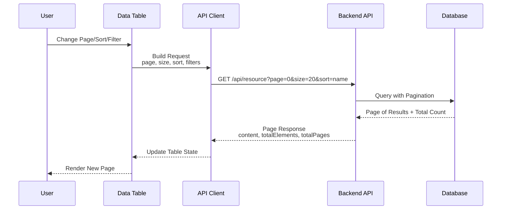
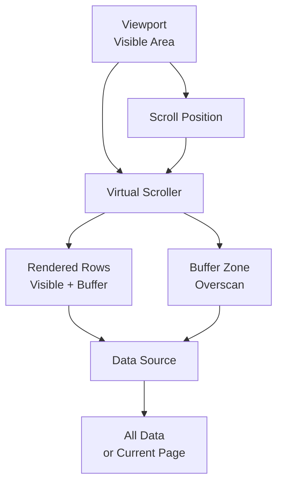

# Architecture: Tables & Data Grids

## Contents

- [Table Rendering Approaches](#table-rendering-approaches)
- [Data Fetching Patterns](#data-fetching-patterns)
- [Sorting Architecture](#sorting-architecture)
- [Filtering Architecture](#filtering-architecture)
- [Column Management](#column-management)
- [Inline Editing](#inline-editing)
- [Row Selection and Bulk Actions](#row-selection-and-bulk-actions)
- [Virtual Scrolling](#virtual-scrolling)
- [Export Architecture](#export-architecture)
- [Server-Side Integration](#server-side-integration)
- [URL State Management](#url-state-management)

## Table Rendering Approaches

### Native HTML Tables

The simplest approach uses semantic HTML `<table>`, `<thead>`, `<tbody>`, `<tr>`, `<th>`, `<td>` elements. This provides excellent accessibility out of the box and works well for simple, static tables.

```vue
<template>
  <table>
    <thead>
      <tr>
        <th>Name</th>
        <th>Email</th>
        <th>Status</th>
      </tr>
    </thead>
    <tbody>
      <tr v-for="user in users" :key="user.id">
        <td>{{ user.name }}</td>
        <td>{{ user.email }}</td>
        <td>{{ user.status }}</td>
      </tr>
    </tbody>
  </table>
</template>
```

**Pros**: Semantic, accessible, simple, no dependencies  
**Cons**: Limited interactivity, harder to style complex layouts

### CSS Grid-Based Tables

Use CSS Grid to create table-like layouts with more styling flexibility, useful for responsive designs that stack on mobile.

```css
.table-grid {
  display: grid;
  grid-template-columns: 1fr 2fr 1fr;
  gap: 1px;
  background: #e0e0e0;
}

.table-header {
  background: #f5f5f5;
  font-weight: bold;
  padding: 12px;
}

.table-cell {
  background: white;
  padding: 12px;
}
```

**Pros**: Flexible layouts, easier responsive design  
**Cons**: Less semantic, requires ARIA roles for accessibility

### Virtual Scrolling

For large datasets (10K+ rows), render only visible rows in the viewport and recycle DOM elements as the user scrolls. Libraries like TanStack Virtual handle this efficiently.

```vue
<script setup>
import { useVirtualizer } from '@tanstack/vue-virtual'

const parentRef = ref()
const virtualizer = useVirtualizer({
  count: items.length,
  getScrollElement: () => parentRef.value,
  estimateSize: () => 50,
  overscan: 5
})
</script>

<template>
  <div ref="parentRef" style="height: 600px; overflow: auto">
    <div :style="{ height: `${virtualizer.getTotalSize()}px` }">
      <div
        v-for="virtualRow in virtualizer.getVirtualItems()"
        :key="virtualRow.key"
        :style="{ transform: `translateY(${virtualRow.start}px)` }"
      >
        {{ items[virtualRow.index].name }}
      </div>
    </div>
  </div>
</template>
```

**Pros**: Handles millions of rows efficiently, smooth scrolling  
**Cons**: Complex implementation, accessibility challenges (screen readers)

## Data Fetching Patterns

### Server-Side Pagination Flow



The standard approach for datasets > 100 rows. Spring Data provides `Pageable` interface and `Page<T>` response wrapper.

**Backend (Spring Boot/Kotlin)**:

```kotlin
@RestController
@RequestMapping("/api/users")
class UserController(
    private val userRepository: UserRepository
) {
    @GetMapping
    fun getUsers(
        @PageableDefault(size = 20, sort = ["name"]) pageable: Pageable
    ): ResponseEntity<Page<UserDto>> {
        val page = userRepository.findAll(pageable)
        return ResponseEntity.ok(page.map { it.toDto() })
    }
}
```

**Frontend (Vue 3)**:

```vue
<script setup>
import { ref, onMounted } from 'vue'

const users = ref([])
const page = ref(0)
const size = ref(20)
const totalElements = ref(0)

async function fetchUsers() {
  const response = await fetch(
    `/api/users?page=${page.value}&size=${size.value}`
  )
  const data = await response.json()
  users.value = data.content
  totalElements.value = data.totalElements
}

onMounted(fetchUsers)
</script>
```

**Frontend (React)**:

```tsx
import { useState, useEffect } from 'react'

function UserTable() {
  const [users, setUsers] = useState([])
  const [page, setPage] = useState(0)
  const [size] = useState(20)
  const [totalElements, setTotalElements] = useState(0)

  useEffect(() => {
    fetch(`/api/users?page=${page}&size=${size}`)
      .then(res => res.json())
      .then(data => {
        setUsers(data.content)
        setTotalElements(data.totalElements)
      })
  }, [page, size])

  return (
    // Table JSX
  )
}
```

### Cursor-Based Pagination

For very large datasets where offset pagination becomes slow, use cursor-based pagination with a unique, sortable field (typically an ID or timestamp).

**Backend**:

```kotlin
@GetMapping("/api/users/cursor")
fun getUsersCursor(
    @RequestParam(required = false) cursor: Long?,
    @RequestParam(defaultValue = "20") limit: Int
): ResponseEntity<CursorPage<UserDto>> {
    val users = if (cursor == null) {
        userRepository.findFirstNOrderedById(limit)
    } else {
        userRepository.findAfterCursor(cursor, limit)
    }
    val nextCursor = users.lastOrNull()?.id
    return ResponseEntity.ok(CursorPage(users, nextCursor))
}
```

**Frontend**:

```vue
<script setup>
const users = ref([])
const nextCursor = ref(null)
const loading = ref(false)

async function loadMore() {
  if (loading.value || !nextCursor.value) return
  loading.value = true
  const response = await fetch(
    `/api/users/cursor?cursor=${nextCursor.value}&limit=20`
  )
  const data = await response.json()
  users.value.push(...data.items)
  nextCursor.value = data.nextCursor
  loading.value = false
}
</script>
```

### Infinite Scroll

Load more data automatically as the user scrolls near the bottom. Combine with cursor-based or offset pagination.

```vue
<script setup>
import { onMounted, onUnmounted } from 'vue'

const loadMore = async () => {
  if (loading.value || !hasMore.value) return
  await fetchNextPage()
}

const handleScroll = () => {
  const scrollTop = window.innerHeight + window.scrollY
  const documentHeight = document.documentElement.scrollHeight
  if (scrollTop >= documentHeight - 100) {
    loadMore()
  }
}

onMounted(() => window.addEventListener('scroll', handleScroll))
onUnmounted(() => window.removeEventListener('scroll', handleScroll))
</script>
```

### Client-Side Pagination

Only for small datasets (< 100 rows). Load all data once, paginate in memory.

```vue
<script setup>
const allUsers = ref([])
const page = ref(0)
const size = ref(20)

const paginatedUsers = computed(() => {
  const start = page.value * size.value
  return allUsers.value.slice(start, start + size.value)
})

const totalPages = computed(() => 
  Math.ceil(allUsers.value.length / size.value)
)
</script>
```

## Sorting Architecture

### Single-Column Sort

Most common pattern: clicking a column header toggles between ascending, descending, and unsorted.

**Backend (Spring Data)**:

```kotlin
@GetMapping
fun getUsers(
    @RequestParam(required = false) sort: String?,
    pageable: Pageable
): ResponseEntity<Page<UserDto>> {
    val pageRequest = if (sort != null) {
        val direction = if (sort.startsWith("-")) {
            Sort.Direction.DESC
        } else {
            Sort.Direction.ASC
        }
        val property = sort.removePrefix("-")
        PageRequest.of(
            pageable.pageNumber,
            pageable.pageSize,
            Sort.by(direction, property)
        )
    } else {
        pageable
    }
    return ResponseEntity.ok(userRepository.findAll(pageRequest).map { it.toDto() })
}
```

**Frontend**:

```vue
<script setup>
const sortField = ref(null)
const sortDirection = ref(null)

const handleSort = (field) => {
  if (sortField.value === field) {
    if (sortDirection.value === 'asc') {
      sortDirection.value = 'desc'
    } else {
      sortField.value = null
      sortDirection.value = null
    }
  } else {
    sortField.value = field
    sortDirection.value = 'asc'
  }
  fetchUsers()
}

const sortParam = computed(() => {
  if (!sortField.value) return ''
  const prefix = sortDirection.value === 'desc' ? '-' : ''
  return `&sort=${prefix}${sortField.value}`
})
</script>
```

### Multi-Column Sort

Allow sorting by multiple columns (e.g., sort by status, then by date). Spring Data supports this via `Sort.by()` with multiple properties.

```kotlin
val sort = Sort.by(
    Sort.Order.desc("status"),
    Sort.Order.asc("createdDate")
)
val pageable = PageRequest.of(page, size, sort)
```

### Client-Side Sorting

Only for small datasets loaded entirely client-side.

```vue
<script setup>
const sortedUsers = computed(() => {
  if (!sortField.value) return users.value
  return [...users.value].sort((a, b) => {
    const aVal = a[sortField.value]
    const bVal = b[sortField.value]
    const modifier = sortDirection.value === 'asc' ? 1 : -1
    return aVal.localeCompare(bVal) * modifier
  })
})
</script>
```

## Filtering Architecture

### Server-Side Filters (Spring Data Specification)

Use Spring Data JPA Specifications for dynamic, type-safe filtering.

**Backend**:

```kotlin
@Entity
class User(
    @Id val id: Long,
    val name: String,
    val email: String,
    val status: UserStatus,
    val createdAt: LocalDateTime
)

interface UserRepository : JpaRepository<User, Long>, JpaSpecificationExecutor<User>

class UserSpecifications {
    companion object {
        fun hasName(name: String?): Specification<User> {
            return Specification { root, _, cb ->
                name?.let { cb.like(cb.lower(root.get("name")), "%${it.lowercase()}%") }
                    ?: cb.conjunction()
            }
        }

        fun hasStatus(status: UserStatus?): Specification<User> {
            return Specification { root, _, cb ->
                status?.let { cb.equal(root.get<UserStatus>("status"), it) }
                    ?: cb.conjunction()
            }
        }

        fun createdAfter(date: LocalDateTime?): Specification<User> {
            return Specification { root, _, cb ->
                date?.let { cb.greaterThanOrEqualTo(root.get("createdAt"), it) }
                    ?: cb.conjunction()
            }
        }
    }
}

@GetMapping
fun getUsers(
    @RequestParam(required = false) name: String?,
    @RequestParam(required = false) status: UserStatus?,
    @RequestParam(required = false) @DateTimeFormat(iso = DateTimeFormat.ISO.DATE_TIME) createdAfter: LocalDateTime?,
    pageable: Pageable
): ResponseEntity<Page<UserDto>> {
    val spec = UserSpecifications.hasName(name)
        .and(UserSpecifications.hasStatus(status))
        .and(UserSpecifications.createdAfter(createdAfter))
    
    return ResponseEntity.ok(
        userRepository.findAll(spec, pageable).map { it.toDto() }
    )
}
```

**Frontend**:

```vue
<script setup>
const filters = ref({
  name: '',
  status: null,
  createdAfter: null
})

const buildQueryParams = () => {
  const params = new URLSearchParams()
  if (filters.value.name) params.set('name', filters.value.name)
  if (filters.value.status) params.set('status', filters.value.status)
  if (filters.value.createdAfter) {
    params.set('createdAfter', filters.value.createdAfter.toISOString())
  }
  params.set('page', page.value.toString())
  params.set('size', size.value.toString())
  return params.toString()
}

const fetchUsers = async () => {
  const response = await fetch(`/api/users?${buildQueryParams()}`)
  // ...
}
</script>
```

### Filter Persistence (URL Params)

Encode filters in URL query parameters for shareable, bookmarkable filtered views.

```vue
<script setup>
import { useRoute, useRouter } from 'vue-router'

const route = useRoute()
const router = useRouter()

const filters = ref({
  name: route.query.name?.toString() || '',
  status: route.query.status?.toString() || null
})

const applyFilters = () => {
  router.push({
    query: {
      ...route.query,
      ...filters.value,
      page: 0 // Reset to first page when filters change
    }
  })
  fetchUsers()
}

watch(() => route.query, (newQuery) => {
  filters.value.name = newQuery.name?.toString() || ''
  filters.value.status = newQuery.status?.toString() || null
  page.value = parseInt(newQuery.page?.toString() || '0')
  fetchUsers()
}, { immediate: true })
</script>
```

### Filter Presets / Saved Views

Allow users to save filter combinations for quick access.

```kotlin
@Entity
class SavedTableView(
    @Id val id: Long,
    val userId: Long,
    val name: String,
    val filters: Map<String, String>, // JSON serialized
    val sortField: String?,
    val sortDirection: String?
)
```

## Column Management

### User-Configurable Visible Columns

Store column visibility preferences per user.

**Backend**:

```kotlin
@Entity
class UserColumnPreferences(
    @Id val id: Long,
    val userId: Long,
    val tableName: String,
    val visibleColumns: List<String>,
    val columnOrder: List<String>,
    val columnWidths: Map<String, Int>
)
```

**Frontend**:

```vue
<script setup>
const columns = ref([
  { id: 'name', label: 'Name', visible: true },
  { id: 'email', label: 'Email', visible: true },
  { id: 'status', label: 'Status', visible: false }
])

const toggleColumn = (columnId) => {
  const column = columns.value.find(c => c.id === columnId)
  if (column) column.visible = !column.visible
}

const visibleColumns = computed(() => 
  columns.value.filter(c => c.visible)
)
</script>
```

### Column Width Management

Support fixed, auto, and resizable column widths.

```vue
<template>
  <th
    v-for="col in columns"
    :key="col.id"
    :style="{ width: col.width || 'auto', minWidth: col.minWidth }"
    @mousedown="startResize(col)"
  >
    {{ col.label }}
    <div class="resize-handle" />
  </th>
</template>

<script setup>
const startResize = (column) => {
  const handleMouseMove = (e) => {
    column.width = `${e.clientX - columnStartX}px`
  }
  // ... resize logic
}
</script>
```

## Inline Editing

### Cell-Level Editing

Allow editing individual cells with validation and optimistic updates.

**Frontend (Vue 3)**:

```vue
<template>
  <td @dblclick="startEdit(cell)">
    <input
      v-if="editingCell === cell"
      v-model="editValue"
      @blur="saveEdit(cell)"
      @keyup.enter="saveEdit(cell)"
      @keyup.esc="cancelEdit"
    />
    <span v-else>{{ cell.value }}</span>
  </td>
</template>

<script setup>
const editingCell = ref(null)
const editValue = ref('')

const startEdit = (cell) => {
  editingCell.value = cell
  editValue.value = cell.value
}

const saveEdit = async (cell) => {
  try {
    // Optimistic update
    cell.value = editValue.value
    
    // Server update
    await fetch(`/api/users/${cell.rowId}`, {
      method: 'PATCH',
      body: JSON.stringify({ [cell.field]: editValue.value })
    })
    
    editingCell.value = null
  } catch (error) {
    // Revert on error
    editValue.value = cell.value
    showError('Failed to save')
  }
}
</script>
```

**Backend**:

```kotlin
@PatchMapping("/{id}")
fun updateUser(
    @PathVariable id: Long,
    @RequestBody updates: Map<String, Any>
): ResponseEntity<UserDto> {
    val user = userRepository.findById(id).orElseThrow()
    updates.forEach { (field, value) ->
        when (field) {
            "name" -> user.name = value as String
            "email" -> user.email = value as String
            // ... other fields
        }
    }
    return ResponseEntity.ok(userRepository.save(user).toDto())
}
```

### Conflict Detection

Use optimistic locking to detect concurrent edits.

```kotlin
@Entity
class User(
    @Id val id: Long,
    val name: String,
    @Version val version: Long // Optimistic lock version
)

@PatchMapping("/{id}")
fun updateUser(
    @PathVariable id: Long,
    @RequestBody dto: UpdateUserDto,
    @RequestHeader("If-Match") expectedVersion: Long?
): ResponseEntity<UserDto> {
    val user = userRepository.findById(id).orElseThrow()
    
    if (expectedVersion != null && user.version != expectedVersion) {
        throw OptimisticLockingFailureException("User was modified by another user")
    }
    
    user.name = dto.name
    return ResponseEntity.ok(userRepository.save(user).toDto())
}
```

## Row Selection and Bulk Actions

### Selection State Management

Track selected rows across pagination.

```vue
<script setup>
const selectedRows = ref(new Set())

const toggleRow = (rowId) => {
  if (selectedRows.value.has(rowId)) {
    selectedRows.value.delete(rowId)
  } else {
    selectedRows.value.add(rowId)
  }
}

const toggleSelectAll = () => {
  if (selectedRows.value.size === currentPageRows.value.length) {
    selectedRows.value.clear()
  } else {
    currentPageRows.value.forEach(row => {
      selectedRows.value.add(row.id)
    })
  }
}

const selectedCount = computed(() => selectedRows.value.size)
</script>
```

### Bulk Actions

Perform actions on selected rows.

```vue
<script setup>
const bulkDelete = async () => {
  if (!confirm(`Delete ${selectedRows.value.size} items?`)) return
  
  try {
    await fetch('/api/users/bulk', {
      method: 'DELETE',
      body: JSON.stringify({ ids: Array.from(selectedRows.value) })
    })
    selectedRows.value.clear()
    fetchUsers()
  } catch (error) {
    showError('Bulk delete failed')
  }
}
</script>
```

**Backend**:

```kotlin
@DeleteMapping("/bulk")
fun bulkDelete(@RequestBody request: BulkDeleteRequest): ResponseEntity<Void> {
    userRepository.deleteAllById(request.ids)
    return ResponseEntity.noContent().build()
}
```

## Virtual Scrolling

For datasets with 10K+ rows, virtual scrolling renders only visible rows.

### Virtual Scrolling Architecture



```vue
<script setup>
import { useVirtualizer } from '@tanstack/vue-virtual'

const parentRef = ref()
const rows = ref([]) // All rows (or current page if server-side paginated)

const virtualizer = useVirtualizer({
  count: rows.value.length,
  getScrollElement: () => parentRef.value,
  estimateSize: () => 50,
  overscan: 10
})

const virtualRows = computed(() => virtualizer.value.getVirtualItems())
</script>

<template>
  <div ref="parentRef" class="table-container">
    <table>
      <thead class="sticky-header">
        <!-- Header -->
      </thead>
      <tbody :style="{ height: `${virtualizer.getTotalSize()}px` }">
        <tr
          v-for="virtualRow in virtualRows"
          :key="virtualRow.key"
          :style="{ transform: `translateY(${virtualRow.start}px)` }"
        >
          <!-- Row content -->
        </tr>
      </tbody>
    </table>
  </div>
</template>
```

## Export Architecture

### Client-Side CSV Export

For small datasets (< 1000 rows), generate CSV in the browser.

```vue
<script setup>
const exportToCSV = () => {
  const headers = columns.value.map(c => c.label).join(',')
  const rows = filteredUsers.value.map(user => 
    columns.value.map(c => `"${user[c.id]}"`).join(',')
  ).join('\n')
  
  const csv = `${headers}\n${rows}`
  const blob = new Blob([csv], { type: 'text/csv' })
  const url = URL.createObjectURL(blob)
  const a = document.createElement('a')
  a.href = url
  a.download = 'users.csv'
  a.click()
}
</script>
```

### Server-Side Export

For large datasets, generate export on the server.

**Backend**:

```kotlin
@GetMapping("/export")
fun exportUsers(
    @RequestParam(required = false) name: String?,
    @RequestParam(required = false) status: UserStatus?,
    response: HttpServletResponse
) {
    val spec = UserSpecifications.hasName(name)
        .and(UserSpecifications.hasStatus(status))
    
    val users = userRepository.findAll(spec)
    
    response.contentType = "text/csv"
    response.setHeader("Content-Disposition", "attachment; filename=users.csv")
    
    val writer = response.writer
    writer.println("Name,Email,Status")
    users.forEach { user ->
        writer.println("${user.name},${user.email},${user.status}")
    }
}
```

### Async Export with Notification

For very large exports, process asynchronously and notify when ready.

```kotlin
@Service
class ExportService {
    fun exportUsersAsync(filters: Map<String, String>, userId: Long): String {
        val exportId = UUID.randomUUID().toString()
        
        // Queue async job
        exportJobQueue.enqueue(ExportJob(exportId, filters, userId))
        
        return exportId
    }
}

@GetMapping("/export/status/{exportId}")
fun getExportStatus(@PathVariable exportId: String): ResponseEntity<ExportStatus> {
    val status = exportService.getStatus(exportId)
    return ResponseEntity.ok(status)
}
```

## Server-Side Integration

### Spring Data Pageable

Spring Data provides `Pageable` interface and `Page<T>` response wrapper.

```kotlin
@GetMapping
fun getUsers(pageable: Pageable): ResponseEntity<Page<UserDto>> {
    val page = userRepository.findAll(pageable)
    return ResponseEntity.ok(page.map { it.toDto() })
}
```

**Request**: `GET /api/users?page=0&size=20&sort=name,asc`

**Response**:
```json
{
  "content": [...],
  "totalElements": 150,
  "totalPages": 8,
  "size": 20,
  "number": 0,
  "first": true,
  "last": false
}
```

### Total Count Performance

`COUNT(*)` queries on large tables can be slow. Consider:

1. **Estimated counts** for very large tables
2. **Cached counts** that update periodically
3. **Skip count** when not needed (use `Slice<T>` instead of `Page<T>`)

```kotlin
@GetMapping
fun getUsers(pageable: Pageable): ResponseEntity<Slice<UserDto>> {
    // Slice doesn't include total count (faster)
    val slice = userRepository.findAll(pageable)
    return ResponseEntity.ok(slice.map { it.toDto() })
}
```

## URL State Management

Encode table state (page, sort, filters) in URL parameters for shareable, bookmarkable views.

```vue
<script setup>
import { useRoute, useRouter } from 'vue-router'

const route = useRoute()
const router = useRouter()

const tableState = computed(() => ({
  page: parseInt(route.query.page?.toString() || '0'),
  size: parseInt(route.query.size?.toString() || '20'),
  sort: route.query.sort?.toString() || null,
  filters: {
    name: route.query.name?.toString() || '',
    status: route.query.status?.toString() || null
  }
}))

const updateTableState = (updates) => {
  router.push({
    query: {
      ...route.query,
      ...updates
    }
  })
}

// Example: changing page
const goToPage = (newPage) => {
  updateTableState({ page: newPage.toString() })
}
</script>
```

**URL Example**: `/users?page=2&size=50&sort=-createdDate&status=ACTIVE&name=john`

This URL is shareable and bookmarkable, allowing users to share filtered/sorted table views.
