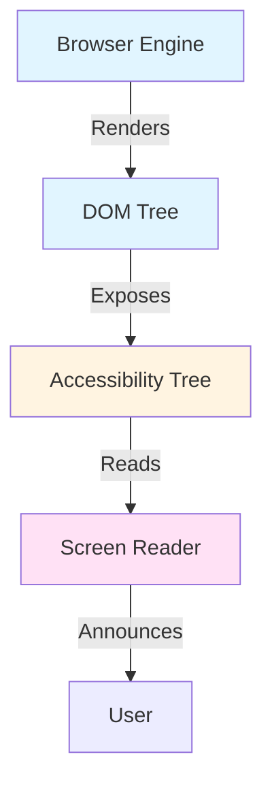
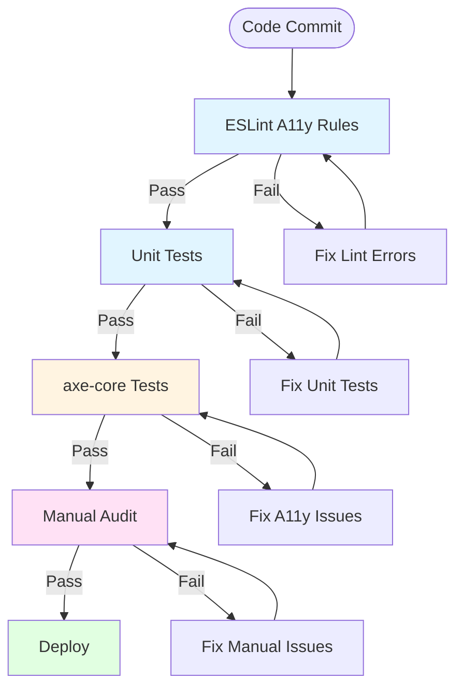

# Accessibility: Architecture

## Contents

- [WCAG 2.1 Principles: POUR Framework](#wcag-21-principles-pour-framework)
- [Semantic HTML: The Foundation of Accessibility](#semantic-html-the-foundation-of-accessibility)
- [ARIA: Accessible Rich Internet Applications](#aria-accessible-rich-internet-applications)
- [Keyboard Navigation Architecture](#keyboard-navigation-architecture)
- [Color and Visual Design](#color-and-visual-design)
- [Component Patterns for Accessibility](#component-patterns-for-accessibility)

## WCAG 2.1 Principles: POUR Framework

The Web Content Accessibility Guidelines (WCAG) 2.1 organizes accessibility requirements around four foundational principles, remembered by the acronym POUR: Perceivable, Operable, Understandable, and Robust. These principles form the architectural foundation for accessible design.

**WCAG 2.1 Level AA** is the minimum standard for most applications. It provides meaningful accessibility improvements while remaining achievable. Level A is insufficient for most production applications, while Level AAA is often impractical due to design constraints.

**Commonly Missed WCAG 2.1 AA Success Criteria**:

- **SC 1.4.3 Contrast (Minimum)**: 4.5:1 for normal text, 3:1 for large text. Frequently missed: focus indicators, disabled states, placeholder text, icons on colored backgrounds.

- **SC 1.4.11 Non-text Contrast**: 3:1 for UI components and graphical objects. Frequently missed: form field borders, focus indicators, icons, charts and graphs.

- **SC 2.1.1 Keyboard**: All functionality available via keyboard. Frequently missed: custom components without keyboard support, drag-and-drop without keyboard alternative, mouse-only interactions.

- **SC 2.1.2 No Keyboard Trap**: Users can navigate away from all components. Frequently missed: modals that don't trap focus correctly, custom components that trap focus unintentionally.

- **SC 2.4.3 Focus Order**: Focus order follows logical sequence. Frequently missed: visually reordered content (flexbox/grid), modals that don't move focus, dynamically inserted content.

- **SC 2.4.7 Focus Visible**: Keyboard focus indicators are visible. Frequently missed: removed focus outlines without replacement, focus indicators that don't meet contrast requirements.

- **SC 3.2.1 On Focus**: Changing focus doesn't change context. Frequently missed: auto-submitting forms, auto-opening dropdowns, focus moving unexpectedly.

- **SC 3.2.2 On Input**: Changing input doesn't change context unexpectedly. Frequently missed: auto-submitting forms, auto-navigating on selection, unexpected page changes.

- **SC 4.1.2 Name, Role, Value**: All UI components have accessible name, role, and state. Frequently missed: icon-only buttons without labels, custom components without proper ARIA, dynamic state not communicated.

- **SC 4.1.3 Status Messages**: Status messages are programmatically determinable. Frequently missed: error messages not associated with fields, success messages not announced, loading states not communicated.

### Perceivable

Information and user interface components must be presentable to users in ways they can perceive. This means that content cannot be invisible to all of a user's senses. For users who cannot see, visual information must have text alternatives. For users who cannot hear, audio information must have captions or transcripts. For users who cannot distinguish colors, information must not rely solely on color.

Text alternatives for images ensure that screen reader users understand the content and purpose of images. Decorative images that add no information should have empty alt attributes. Informative images need descriptive alt text that conveys the same information the image provides to sighted users. Complex images like charts and diagrams may need longer descriptions provided through aria-describedby or visible text.

Captions and transcripts make audio and video content accessible to deaf and hard-of-hearing users. Captions should be synchronized with the audio and include speaker identification and sound effects. Transcripts provide a text alternative that can be read at the user's pace.

Color contrast requirements ensure that text is readable for users with low vision or color vision deficiencies. WCAG AA requires a contrast ratio of at least 4.5:1 for normal text and 3:1 for large text (18pt or 14pt bold). This contrast must be maintained across all text-background combinations, including in both light and dark themes.

Text resizing ensures that users with low vision can enlarge text without losing functionality. Content must remain usable when text is resized up to 200% using browser zoom or user preferences. This requires using relative units (rem, em, %) rather than absolute units (px) for font sizes and ensuring layouts reflow appropriately.

### Operable

User interface components and navigation must be operable by all users. This means that users must be able to interact with all interface elements regardless of their input method. Keyboard accessibility is fundamental—if functionality works with a keyboard, it typically works with assistive technology.

Keyboard accessibility requires that all interactive elements are reachable and usable via keyboard input. Users must be able to navigate to every button, link, form control, and custom component using the Tab key. The focus order must follow a logical sequence that matches the visual layout. Custom keyboard shortcuts should follow established patterns (arrow keys for menus, Escape to close dialogs, Enter to activate).

Sufficient time must be provided for users to read and interact with content. Auto-updating content must have controls to pause, stop, or hide updates. Time limits must be adjustable, extendable, or removable. This accommodates users who need more time to read or interact due to cognitive disabilities or motor impairments.

Seizure and physical reaction triggers must be avoided. Content must not flash more than three times per second, as rapid flashing can trigger photosensitive epilepsy. This applies to animations, transitions, and any content that changes rapidly.

Navigation must be clear and consistent. Users need multiple ways to find content: navigation menus, site maps, search functionality, and clear page structure. Skip links allow keyboard users to bypass repetitive navigation and jump directly to main content. Consistent navigation patterns across pages reduce cognitive load.

### Understandable

Information and the operation of user interface components must be understandable. This means that content must be readable and that interface behavior must be predictable.

Readable content uses clear, simple language appropriate for the audience. Technical jargon should be explained, and abbreviations should be expanded on first use. Reading level should be appropriate for the content's purpose. For general audiences, aim for an 8th-grade reading level.

Predictable interfaces behave consistently across pages and components. Navigation elements should appear in the same locations. Functionality should work the same way in similar contexts. Unexpected changes of context (like automatic form submission or page navigation) should only occur when initiated by the user or when the user is warned in advance.

Input assistance helps users avoid and correct mistakes. Form labels must be clear and associated with their inputs. Error messages must be specific, understandable, and suggest corrections. Required fields must be clearly indicated. Validation should occur at appropriate times and provide clear feedback.

### Robust

Content must be robust enough to be interpreted reliably by a wide variety of user agents, including assistive technologies. This means using valid HTML, proper ARIA attributes, and following web standards.

Valid HTML ensures that browsers and assistive technologies can parse content correctly. Invalid HTML may be interpreted differently by different tools, leading to inconsistent experiences. HTML validation should be part of the development workflow.

ARIA attributes enhance semantic meaning when native HTML elements are insufficient. ARIA roles define what an element is, ARIA states communicate dynamic state, and ARIA properties provide additional context. ARIA must be used correctly—incorrect ARIA is worse than no ARIA, as it provides false information to assistive technologies.

Compatibility with current and future tools requires following web standards and avoiding proprietary or deprecated features. Content should work with current versions of screen readers, browser extensions, and other assistive technologies, and should be structured to work with future tools as well.

## Assistive Technology Stack

The accessibility stack consists of multiple layers that work together to make web content accessible to users with disabilities. Understanding this stack helps developers create content that integrates properly with assistive technologies.



The browser engine renders HTML into a DOM tree. The DOM tree is then transformed into an accessibility tree that contains semantic information and ARIA attributes. Screen readers consume the accessibility tree and announce content to users. This architecture ensures that semantic HTML and ARIA attributes are properly exposed to assistive technologies.

## Semantic HTML: The Foundation of Accessibility

Semantic HTML uses HTML elements that convey meaning about the content they contain. Semantic elements have built-in accessibility features: keyboard support, focus management, and screen reader announcements. Using semantic HTML is the most effective way to build accessible interfaces.

### Native HTML Elements

Native HTML elements provide accessibility by default. A `<button>` element has built-in keyboard support (Enter and Space activate it), focus management, and screen reader announcement ("button"). A `<div>` with an onclick handler has none of these features and requires custom implementation of keyboard handlers, focus management, and ARIA attributes.

Use `<button>` for all interactive elements that trigger actions, not `<div>` or `<span>` with click handlers. Buttons are focusable, keyboard accessible, and announced correctly by screen readers. Use `<a>` for navigation links, not `<span>` with click handlers. Links are keyboard accessible and can be opened in new tabs. Use form elements (`<input>`, `<select>`, `<textarea>`) for data collection, not custom div-based components.

Form elements have built-in labels, validation states, and keyboard support. Native form controls work with screen readers without additional ARIA. Custom form components require extensive ARIA and keyboard handling to match native functionality.

### Heading Hierarchy

Headings create a navigable document outline for screen reader users. Screen readers provide a headings list that users can navigate to quickly understand page structure and jump to sections of interest. Proper heading hierarchy is essential for accessibility.

Use headings in order: `<h1>` for the main page title, `<h2>` for major sections, `<h3>` for subsections, and so on. Never skip heading levels—don't jump from `<h1>` to `<h3>` without an `<h2>` in between. Skipping levels creates confusion for screen reader users navigating the headings list.

There should be exactly one `<h1>` per page, representing the main topic or purpose of the page. Multiple `<h1>` elements break the document outline and confuse screen reader users about the page's primary content.

Headings should describe the content that follows them. Screen reader users often navigate by headings, so descriptive headings help users understand what content is in each section. Avoid generic headings like "Section" or "Content"—use specific, descriptive headings.

### Landmarks and Page Structure

HTML5 semantic elements create navigable landmarks that screen reader users can jump between. These landmarks provide structure and navigation shortcuts, significantly improving the experience for screen reader users.

The `<nav>` element creates a navigation landmark. Use it for primary navigation menus, breadcrumbs, and pagination. Multiple `<nav>` elements are allowed if they serve different purposes. Each should have an accessible name (via aria-label) if there are multiple nav elements.

The `<main>` element identifies the primary content of the page. There should be exactly one `<main>` element per page. This landmark allows screen reader users to jump directly to the main content, bypassing navigation and other repetitive elements.

The `<header>` element typically contains site-wide header content like logos and primary navigation. The `<footer>` element contains footer content like copyright information and links. The `<aside>` element contains complementary content like sidebars and callouts.

The `<article>` element represents a self-contained piece of content that could be distributed independently. Use it for blog posts, news articles, or forum posts. The `<section>` element represents a thematic grouping of content, typically with a heading.

Screen reader users can navigate between these landmarks using keyboard shortcuts, making it easy to understand page structure and jump to relevant sections. Always provide accessible names for landmarks when there are multiple instances of the same landmark type.

### Lists

Lists provide important structural information to screen reader users. When screen readers encounter a list, they announce "list, X items" and then read each item. This context helps users understand that items are related and part of a group.

Use `<ul>` for unordered lists (bulleted lists), `<ol>` for ordered lists (numbered lists), and `<dl>` for description lists (term-definition pairs). Never use plain `<div>` elements styled to look like lists—screen readers won't announce them as lists, and users lose important structural context.

List items must be properly nested within list containers. Each `<li>` must be a direct child of `<ul>` or `<ol>`. Don't use CSS to create list-like appearances without using actual list elements.

## ARIA: Accessible Rich Internet Applications

ARIA (Accessible Rich Internet Applications) is a set of attributes that enhance the accessibility of HTML when native elements are insufficient. ARIA provides additional semantic information to assistive technologies, communicates dynamic state changes, and enables accessible custom components.

### ARIA Roles

ARIA roles define what an element is or does. Roles communicate the purpose and behavior of elements to screen readers. Common roles include `dialog` for modal dialogs, `tab` for tab interfaces, `menu` for menus, `alert` for important messages, and `region` for distinct page sections.

Use roles when native HTML elements don't convey the correct semantics. For example, a custom dropdown built with divs needs `role="combobox"` to communicate that it's a dropdown. A custom checkbox built with divs needs `role="checkbox"` to communicate its state.

The first rule of ARIA is: don't use ARIA if a native HTML element provides the same semantics. A `<button>` is always better than `<div role="button">` because the button has built-in keyboard support and focus management. Only use ARIA roles when you cannot use a native element.

### ARIA States

ARIA states communicate the current condition of elements. States change as users interact with components, and screen readers announce these changes. Common states include `aria-expanded` (for collapsible sections), `aria-selected` (for selected items), `aria-checked` (for checkboxes), `aria-disabled` (for disabled elements), and `aria-hidden` (for hiding decorative content from screen readers).

States must be updated dynamically as component state changes. When a dropdown opens, set `aria-expanded="true"`. When an item is selected, set `aria-selected="true"`. Screen readers announce these state changes, keeping users informed about interface state.

Boolean states use `true` or `false` values. Tristate attributes like `aria-checked` can also use `"mixed"` for indeterminate states. Always use string values, not boolean JavaScript values, in HTML attributes.

### ARIA Properties

ARIA properties provide additional context and relationships between elements. Properties help screen readers understand how elements relate to each other and provide descriptive information.

`aria-label` provides an accessible name when the visible text is insufficient or when there is no visible text. Use it for icon-only buttons, decorative images that need context, or when the visible label doesn't fully describe the element's purpose.

`aria-labelledby` references the ID of another element that serves as the label. Use it when a visible label exists elsewhere in the DOM. This creates an explicit relationship between the label and the labeled element.

`aria-describedby` references elements that provide additional descriptive information, such as help text or error messages. Screen readers read the description after the label, providing context without cluttering the primary announcement.

`aria-required` indicates that a form field is required. This is important for screen reader users who may not see visual required indicators. Use it in addition to visual indicators, not as a replacement.

`aria-live` regions announce dynamic content changes to screen reader users. Use `aria-live="polite"` for non-urgent updates like search results loading. Use `aria-live="assertive"` for urgent updates like error messages. Screen readers will interrupt their current announcement to read assertive live regions.

## Keyboard Navigation Architecture

Keyboard navigation is the foundation of accessibility. If functionality works with a keyboard, it typically works with assistive technology. Designing for keyboard navigation ensures that users who cannot use a mouse can fully access all functionality.

### Focus Management

Focus management ensures that keyboard users can navigate to all interactive elements and that focus moves logically through the interface. The Tab key moves focus forward through focusable elements, and Shift+Tab moves focus backward. The focus order should follow the visual layout and reading order.

All interactive elements must be focusable. Native interactive elements (buttons, links, form controls) are focusable by default. Custom interactive elements must have `tabindex="0"` to be included in the tab order. Use `tabindex="-1"` to make elements programmatically focusable but not in the tab order (useful for managing focus programmatically).

Focus indicators must be visible. Browsers provide default focus outlines, but these are often removed for aesthetic reasons. Never remove focus indicators entirely—keyboard users need to see where focus is. Use `:focus-visible` to show focus indicators only for keyboard navigation, not mouse clicks. This provides focus visibility for keyboard users while maintaining clean aesthetics for mouse users.

### Custom Keyboard Shortcuts

Complex components need custom keyboard shortcuts to be efficiently navigable. These shortcuts should follow established patterns that users expect. Arrow keys navigate within components like menus, tabs, and dropdowns. Enter and Space activate buttons and select items. Escape closes dialogs and cancels operations. Tab moves focus into and out of component groups.

Document custom keyboard shortcuts so users know they exist. Provide a way to discover shortcuts, such as a help dialog or keyboard shortcut reference. Consider providing a way to disable or customize shortcuts for users who may conflict with assistive technology shortcuts.

### Focus Trapping

Modals and dialogs must trap focus within themselves. When a dialog opens, focus moves to the dialog. When the user presses Tab at the last focusable element in the dialog, focus should move to the first focusable element in the dialog, not to elements behind the dialog. This prevents keyboard users from accidentally interacting with background content.

Focus trapping requires managing the tab order programmatically. When the dialog opens, store a reference to the element that triggered it. When the dialog closes, return focus to that element. This ensures keyboard users can continue their workflow seamlessly.

### Skip Links

Skip links allow keyboard users to bypass repetitive navigation and jump directly to main content. A "Skip to main content" link appears at the top of the page when it receives focus (typically hidden visually until focused). This saves keyboard users from tabbing through dozens of navigation items on every page load.

Skip links should be the first focusable element on the page. They should be visually hidden by default and become visible when focused. Use CSS like `sr-only` class (visually hidden but accessible to screen readers) combined with `:focus` styles to show the link when focused.

## Color and Visual Design

Visual design choices significantly impact accessibility. Color contrast, text sizing, and layout reflow determine whether content is perceivable and usable for users with visual disabilities.

### Color Contrast Requirements

WCAG AA requires a contrast ratio of at least 4.5:1 for normal text (smaller than 18pt or 14pt bold) and 3:1 for large text. Contrast ratio measures the difference in luminance between text and background colors. Higher contrast ratios are better—WCAG AAA requires 7:1 for normal text.

**WCAG 2.1 Success Criteria**: SC 1.4.3 (Contrast Minimum) requires 4.5:1 for normal text, 3:1 for large text. SC 1.4.11 (Non-text Contrast) requires 3:1 for UI components and graphical objects.

**Commonly Missed Contrast Issues**:
- **Focus indicators**: Focus outlines must meet 3:1 contrast against adjacent colors. Default browser outlines often fail on colored backgrounds
- **Disabled states**: Disabled buttons with gray text on gray backgrounds frequently fail contrast—use opacity or borders instead
- **Error states**: Red error text on white backgrounds may pass, but red on light gray backgrounds often fails
- **Placeholder text**: Light gray placeholders typically fail contrast—they're decorative, not informational
- **Icons**: Icon-only buttons need sufficient contrast. Icons with thin strokes need higher contrast than solid shapes
- **Borders**: Form field borders used as the only visual indicator need 3:1 contrast

**Focus Indicator Contrast**:
```css
/* Default focus outline may not meet contrast on colored backgrounds */
button:focus-visible {
  outline: 2px solid #0066cc; /* Ensure sufficient contrast */
  outline-offset: 2px;
}

/* Custom focus styles must also meet contrast */
.custom-button:focus-visible {
  box-shadow: 0 0 0 3px rgba(0, 102, 204, 0.5); /* 3:1 contrast required */
}
```

**Disabled State Contrast**:
```css
/* Bad: Gray text on gray background fails contrast */
button:disabled {
  background-color: #e0e0e0;
  color: #b0b0b0; /* Fails contrast */
}

/* Good: Use opacity or borders for disabled state */
button:disabled {
  background-color: #e0e0e0;
  color: #333333; /* Maintains contrast */
  opacity: 0.6; /* Visual indication of disabled */
}

/* Alternative: Border-based disabled state */
button:disabled {
  border: 2px solid #999999; /* 3:1 contrast required */
  background-color: transparent;
}
```

**Error State Contrast**:
```css
/* Ensure error text meets contrast on all backgrounds */
.error-message {
  color: #d32f2f; /* Red that meets 4.5:1 on white */
  background-color: #ffebee; /* Light red background */
  border-left: 4px solid #d32f2f; /* Border meets 3:1 */
}

/* Error states on colored backgrounds need careful validation */
.error-on-dark {
  color: #ff6b6b; /* Lighter red for dark backgrounds */
  background-color: #2d3436;
}
```

Contrast must be validated for all text-background combinations, including hover states, focus states, disabled states, and both light and dark themes. Design system color palettes should be validated for contrast compliance. Tailwind CSS utility classes should be checked to ensure accessible color combinations.

**Testing Contrast**:
- Use browser DevTools contrast checker (Chrome, Firefox)
- Validate with WebAIM Contrast Checker or Colour Contrast Analyser
- Test in both light and dark themes if supported
- Verify focus indicators meet 3:1 on all backgrounds
- Check disabled states don't rely solely on reduced contrast

Contrast checkers like WebAIM Contrast Checker or Colour Contrast Analyser can validate contrast ratios. Automated tools can check contrast in component tests, but manual verification is important for complex designs and custom color combinations.

### Color as Information

Never use color alone to convey information. Approximately 8% of males have color vision deficiencies and cannot distinguish certain color combinations. Red and green are particularly problematic—many users cannot distinguish these colors.

Always provide additional visual indicators alongside color. Error states should include icons (like an X or warning symbol) in addition to red color. Success states should include checkmarks in addition to green color. Chart data should use different patterns or shapes in addition to different colors. Status indicators should include text labels in addition to color coding.

### Text Resizing and Reflow

Content must remain usable when text is resized up to 200% using browser zoom or user preferences. This requires using relative units (rem, em, %) for font sizes rather than absolute units (px). Relative units scale with user preferences, while absolute units do not.

Layouts must reflow appropriately when text is enlarged. Content should not require horizontal scrolling at 200% zoom. This requires responsive design principles: flexible layouts, relative sizing, and avoiding fixed widths.

At 400% zoom on a 1280px viewport (equivalent to 320px width), content must reflow without horizontal scrolling. This is a WCAG requirement that ensures content is usable on small screens and with high zoom levels. Use responsive breakpoints and flexible layouts to meet this requirement.

## Accessibility Testing Pipeline

A comprehensive accessibility testing pipeline ensures issues are caught early and fixed before reaching production. Multiple testing gates provide defense in depth.



The pipeline starts with linting rules that catch common accessibility mistakes during development. Unit tests verify keyboard interactions and ARIA state management. Automated axe-core tests scan rendered components for WCAG violations. Finally, manual audits catch issues that automated tools miss, such as color contrast in complex designs or logical focus order.

## Component Patterns for Accessibility

Accessible component patterns follow consistent interaction models that users expect. These patterns ensure that custom components work with keyboards and screen readers.

### Accordions

Accordions require proper ARIA attributes and keyboard support. The accordion header has `role="button"` and `aria-expanded` indicating whether the panel is open. The panel has `aria-hidden` when collapsed and `aria-labelledby` pointing to the header.

**WCAG 2.1 Success Criteria**: Accordions must meet SC 2.1.1 (Keyboard) for all functionality, SC 4.1.2 (Name, Role, Value) for proper ARIA state communication, and SC 2.4.7 (Focus Visible) for focus indicators.

**Common Gotchas**:
- Missing `aria-expanded` causes screen readers to not announce accordion state
- Not updating `aria-hidden` on panels causes screen readers to read hidden content
- Missing `aria-controls` linking headers to panels makes relationships unclear
- Arrow keys should expand/collapse, not navigate between accordions (use Tab for that)

**Vue 3 Implementation**:
```vue
<template>
  <div class="accordion">
    <button
      v-for="item in items"
      :key="item.id"
      :id="`header-${item.id}`"
      :aria-expanded="item.isOpen"
      :aria-controls="`panel-${item.id}`"
      :aria-disabled="item.disabled"
      @click="toggle(item.id)"
      @keydown.enter.prevent="toggle(item.id)"
      @keydown.space.prevent="toggle(item.id)"
    >
      {{ item.title }}
    </button>
    <div
      v-for="item in items"
      :key="`panel-${item.id}`"
      :id="`panel-${item.id}`"
      :aria-labelledby="`header-${item.id}`"
      :hidden="!item.isOpen"
      role="region"
    >
      {{ item.content }}
    </div>
  </div>
</template>

<script setup lang="ts">
import { ref } from 'vue'

const items = ref([
  { id: '1', title: 'Section 1', content: '...', isOpen: false },
  { id: '2', title: 'Section 2', content: '...', isOpen: false }
])

function toggle(id: string) {
  const item = items.value.find(i => i.id === id)
  if (item) {
    item.isOpen = !item.isOpen
  }
}
</script>
```

**React Implementation with Radix UI**:
```tsx
import * as Accordion from '@radix-ui/react-accordion'

function AccessibleAccordion() {
  return (
    <Accordion.Root type="single" collapsible>
      <Accordion.Item value="item-1">
        <Accordion.Header>
          <Accordion.Trigger>Section 1</Accordion.Trigger>
        </Accordion.Header>
        <Accordion.Content>Content for section 1</Accordion.Content>
      </Accordion.Item>
    </Accordion.Root>
  )
}
```

Radix UI Accordion handles ARIA attributes, keyboard navigation, and focus management automatically. Consider using established libraries rather than building custom implementations.

### Modals and Dialogs

Modals require focus trapping, keyboard support, and proper ARIA attributes. When a modal opens, focus moves to the modal (typically the first focusable element or the modal container with `tabindex="-1"`). The modal has `role="dialog"` and `aria-modal="true"` to communicate its purpose. The modal has an accessible name via `aria-labelledby` pointing to a heading or `aria-label`.

Escape key closes the modal. Tab key is trapped within the modal. When the modal closes, focus returns to the element that triggered it. The background is hidden from screen readers using `aria-hidden="true"` on the backdrop.

**WCAG 2.1 Success Criteria**: Modals must meet SC 2.4.3 (Focus Order) for logical focus management, SC 2.1.2 (No Keyboard Trap) for focus trapping, and SC 4.1.3 (Status Messages) for focus announcements.

**Common Gotchas**: 
- Forgetting to restore focus to the trigger element causes keyboard users to lose their place
- Not trapping focus allows users to tab into background content, breaking the modal pattern
- Missing `aria-modal="true"` causes screen readers to not understand the modal context
- Background content must be hidden with `aria-hidden="true"`, not just visually hidden

**Vue 3 Implementation**:
```vue
<template>
  <Teleport to="body">
    <div
      v-if="isOpen"
      ref="modalRef"
      role="dialog"
      aria-modal="true"
      :aria-labelledby="titleId"
      tabindex="-1"
      @keydown.esc="close"
    >
      <h2 :id="titleId">{{ title }}</h2>
      <button @click="close">Close</button>
      <!-- Modal content -->
    </div>
  </Teleport>
</template>

<script setup lang="ts">
import { ref, watch, nextTick } from 'vue'

const props = defineProps<{ isOpen: boolean; title: string }>()
const emit = defineEmits<{ 'update:isOpen': [value: boolean] }>()

const modalRef = ref<HTMLElement>()
const titleId = `modal-title-${Math.random().toString(36).substr(2, 9)}`
let triggerElement: HTMLElement | null = null

function close() {
  emit('update:isOpen', false)
  triggerElement?.focus()
}

watch(() => props.isOpen, async (isOpen) => {
  if (isOpen) {
    triggerElement = document.activeElement as HTMLElement
    await nextTick()
    modalRef.value?.focus()
    // Trap focus: prevent tabbing outside modal
    const focusableElements = modalRef.value?.querySelectorAll(
      'button, [href], input, select, textarea, [tabindex]:not([tabindex="-1"])'
    )
    const firstElement = focusableElements?.[0] as HTMLElement
    const lastElement = focusableElements?.[focusableElements.length - 1] as HTMLElement
    
    const trapFocus = (e: KeyboardEvent) => {
      if (e.key === 'Tab') {
        if (e.shiftKey && document.activeElement === firstElement) {
          e.preventDefault()
          lastElement?.focus()
        } else if (!e.shiftKey && document.activeElement === lastElement) {
          e.preventDefault()
          firstElement?.focus()
        }
      }
    }
    modalRef.value?.addEventListener('keydown', trapFocus)
  }
})
</script>
```

**React Implementation**:
```tsx
import { useEffect, useRef, useState } from 'react'
import { createPortal } from 'react-dom'

interface ModalProps {
  isOpen: boolean
  title: string
  onClose: () => void
  children: React.ReactNode
}

function Modal({ isOpen, title, onClose, children }: ModalProps) {
  const modalRef = useRef<HTMLDivElement>(null)
  const triggerElementRef = useRef<HTMLElement | null>(null)
  const titleId = `modal-title-${Math.random().toString(36).substr(2, 9)}`

  useEffect(() => {
    if (isOpen) {
      triggerElementRef.current = document.activeElement as HTMLElement
      modalRef.current?.focus()
      
      const focusableElements = modalRef.current?.querySelectorAll(
        'button, [href], input, select, textarea, [tabindex]:not([tabindex="-1"])'
      )
      const firstElement = focusableElements?.[0] as HTMLElement
      const lastElement = focusableElements?.[focusableElements.length - 1] as HTMLElement
      
      const trapFocus = (e: KeyboardEvent) => {
        if (e.key === 'Tab') {
          if (e.shiftKey && document.activeElement === firstElement) {
            e.preventDefault()
            lastElement?.focus()
          } else if (!e.shiftKey && document.activeElement === lastElement) {
            e.preventDefault()
            firstElement?.focus()
          }
        }
      }
      
      modalRef.current?.addEventListener('keydown', trapFocus)
      return () => {
        modalRef.current?.removeEventListener('keydown', trapFocus)
        triggerElementRef.current?.focus()
      }
    }
  }, [isOpen])

  if (!isOpen) return null

  return createPortal(
    <div
      ref={modalRef}
      role="dialog"
      aria-modal="true"
      aria-labelledby={titleId}
      tabIndex={-1}
      onKeyDown={(e) => e.key === 'Escape' && onClose()}
    >
      <h2 id={titleId}>{title}</h2>
      <button onClick={onClose}>Close</button>
      {children}
    </div>,
    document.body
  )
}
```

In Vue 3, use `<Teleport>` to render modals outside the component tree for proper DOM order. In React, use Portals for the same purpose. Manage focus with template refs (Vue) or useRef (React) and lifecycle hooks.

### Tabs

Tab interfaces require arrow key navigation and proper ARIA. The tab list has `role="tablist"`. Each tab button has `role="tab"` and `aria-selected` indicating whether it's selected. The tab panel has `role="tabpanel"` and `aria-labelledby` pointing to its associated tab.

Arrow keys navigate between tabs (Left/Right for horizontal, Up/Down for vertical). Tab key moves focus into the tab panel content. When a tab is activated, `aria-selected` updates and focus moves to the tab panel. The previously selected tab has `aria-selected="false"`.

**WCAG 2.1 Success Criteria**: Tabs must meet SC 2.1.1 (Keyboard) for arrow key navigation, SC 2.4.3 (Focus Order) for logical tab order, and SC 4.1.2 (Name, Role, Value) for proper ARIA state communication.

**Common Gotchas**:
- Using `aria-selected="true"` on multiple tabs breaks screen reader announcements
- Not updating `aria-selected` on the previously selected tab causes state confusion
- Missing `aria-controls` linking tabs to panels makes relationships unclear
- Tab key should move focus into panel content, not cycle through tabs (use arrow keys for that)

**Vue 3 Implementation**:
```vue
<template>
  <div class="tabs">
    <div role="tablist" aria-label="Product information">
      <button
        v-for="(tab, index) in tabs"
        :key="tab.id"
        :id="`tab-${tab.id}`"
        role="tab"
        :aria-selected="activeTab === tab.id"
        :aria-controls="`panel-${tab.id}`"
        :tabindex="activeTab === tab.id ? 0 : -1"
        @click="selectTab(tab.id)"
        @keydown.left="navigateTabs(-1)"
        @keydown.right="navigateTabs(1)"
        @keydown.down.prevent="focusPanel(tab.id)"
      >
        {{ tab.label }}
      </button>
    </div>
    <div
      v-for="tab in tabs"
      :key="`panel-${tab.id}`"
      :id="`panel-${tab.id}`"
      role="tabpanel"
      :aria-labelledby="`tab-${tab.id}`"
      :hidden="activeTab !== tab.id"
      :tabindex="activeTab === tab.id ? 0 : -1"
    >
      {{ tab.content }}
    </div>
  </div>
</template>

<script setup lang="ts">
import { ref } from 'vue'

const tabs = ref([
  { id: 'description', label: 'Description', content: '...' },
  { id: 'specs', label: 'Specifications', content: '...' },
  { id: 'reviews', label: 'Reviews', content: '...' }
])

const activeTab = ref(tabs.value[0].id)

function selectTab(tabId: string) {
  activeTab.value = tabId
}

function navigateTabs(direction: number) {
  const currentIndex = tabs.value.findIndex(t => t.id === activeTab.value)
  const newIndex = (currentIndex + direction + tabs.value.length) % tabs.value.length
  selectTab(tabs.value[newIndex].id)
  nextTick(() => {
    document.getElementById(`tab-${tabs.value[newIndex].id}`)?.focus()
  })
}

function focusPanel(tabId: string) {
  document.getElementById(`panel-${tabId}`)?.focus()
}
</script>
```

**React Implementation with react-aria**:
```tsx
import { useTabList } from '@react-aria/tabs'
import { useTabListState } from '@react-stately/tabs'

function Tabs({ items }: { items: TabItem[] }) {
  const state = useTabListState({ items })
  const ref = useRef<HTMLDivElement>(null)
  const { tabListProps } = useTabList({}, state, ref)

  return (
    <div className="tabs">
      <div {...tabListProps} ref={ref} role="tablist">
        {[...state.collection].map((item) => (
          <Tab key={item.key} item={item} state={state} />
        ))}
      </div>
      <TabPanel key={state.selectedKey} state={state} />
    </div>
  )
}
```

**React Aria** and **Radix UI** provide accessible tab implementations that handle keyboard navigation, ARIA attributes, and focus management automatically. Consider using these libraries rather than building custom implementations.

### Dropdowns and Menus

Dropdowns and menus require arrow key navigation, Enter/Space to select, and Escape to close. The trigger button has `aria-expanded` indicating whether the menu is open. The menu has `role="menu"` or `role="listbox"` depending on the pattern. Menu items have `role="menuitem"` or `role="option"`.

Arrow keys navigate between menu items. Enter and Space activate the selected item. Escape closes the menu without selection. When the menu opens, focus moves to the first menu item. When it closes, focus returns to the trigger.

**WCAG 2.1 Success Criteria**: Dropdowns must meet SC 2.1.1 (Keyboard) for all functionality, SC 2.4.7 (Focus Visible) for focus indicators on menu items, and SC 4.1.2 (Name, Role, Value) for proper ARIA state communication.

**Pattern Selection**:
- Use `role="menu"` for action menus (file operations, context menus)
- Use `role="listbox"` for selection menus (country selector, category picker)
- Use `role="combobox"` for autocomplete/search dropdowns

**Common Gotchas**:
- Not updating `aria-expanded` causes screen readers to announce incorrect state
- Missing `aria-activedescendant` prevents screen readers from announcing which item has focus
- Focus moving to first item on open can be disorienting—consider moving to previously selected item
- Type-ahead navigation (typing letters to jump to items) significantly improves usability

**Vue 3 Implementation**:
```vue
<template>
  <div class="dropdown">
    <button
      ref="triggerRef"
      :aria-expanded="isOpen"
      :aria-haspopup="true"
      aria-controls="menu-id"
      @click="toggle"
      @keydown.enter.prevent="toggle"
      @keydown.space.prevent="toggle"
      @keydown.down.prevent="openAndFocusFirst"
    >
      {{ selectedLabel }}
    </button>
    <ul
      v-if="isOpen"
      id="menu-id"
      role="listbox"
      :aria-activedescendant="activeId"
      @keydown="handleKeydown"
    >
      <li
        v-for="(option, index) in options"
        :key="option.value"
        :id="`option-${index}`"
        role="option"
        :aria-selected="selected === option.value"
        :class="{ active: activeIndex === index }"
        @click="select(option.value)"
        @mouseenter="activeIndex = index"
      >
        {{ option.label }}
      </li>
    </ul>
  </div>
</template>

<script setup lang="ts">
import { ref, computed } from 'vue'

const props = defineProps<{ options: Array<{ value: string; label: string }> }>()
const emit = defineEmits<{ 'update:modelValue': [value: string] }>()

const isOpen = ref(false)
const activeIndex = ref(0)
const triggerRef = ref<HTMLElement>()

const selected = computed(() => props.options[activeIndex.value]?.value)
const selectedLabel = computed(() => props.options.find(o => o.value === selected.value)?.label)
const activeId = computed(() => `option-${activeIndex.value}`)

function toggle() {
  isOpen.value = !isOpen.value
  if (!isOpen.value) {
    triggerRef.value?.focus()
  }
}

function openAndFocusFirst() {
  isOpen.value = true
  activeIndex.value = 0
  nextTick(() => {
    document.getElementById(activeId.value)?.focus()
  })
}

function select(value: string) {
  emit('update:modelValue', value)
  isOpen.value = false
  triggerRef.value?.focus()
}

function handleKeydown(e: KeyboardEvent) {
  switch (e.key) {
    case 'ArrowDown':
      e.preventDefault()
      activeIndex.value = (activeIndex.value + 1) % props.options.length
      document.getElementById(activeId.value)?.focus()
      break
    case 'ArrowUp':
      e.preventDefault()
      activeIndex.value = (activeIndex.value - 1 + props.options.length) % props.options.length
      document.getElementById(activeId.value)?.focus()
      break
    case 'Enter':
    case ' ':
      e.preventDefault()
      select(props.options[activeIndex.value].value)
      break
    case 'Escape':
      e.preventDefault()
      isOpen.value = false
      triggerRef.value?.focus()
      break
    default:
      // Type-ahead: jump to option starting with typed letter
      if (e.key.length === 1 && /[a-zA-Z]/.test(e.key)) {
        const match = props.options.findIndex(
          opt => opt.label.toLowerCase().startsWith(e.key.toLowerCase())
        )
        if (match !== -1) {
          activeIndex.value = match
          document.getElementById(activeId.value)?.focus()
        }
      }
  }
}
</script>
```

### Toast Notifications

Toast notifications require aria-live regions to announce content to screen reader users. The notification container has `aria-live="polite"` for non-urgent notifications or `aria-live="assertive"` for urgent notifications. Each notification should have `role="alert"` or `role="status"` depending on its importance.

**WCAG 2.1 Success Criteria**: Toast notifications must meet SC 4.1.3 (Status Messages) for dynamic content announcements. Use `aria-live="assertive"` for errors that block user actions, `aria-live="polite"` for informational updates.

**Dynamic Content Announcement Patterns**:

**Route Changes in SPAs**: Single-page applications don't trigger full page reloads, so screen readers don't automatically detect navigation. This creates a critical accessibility gap—users may not realize they've navigated to a new page.

**Why This Matters**: Screen readers announce page loads, but SPAs change content without page loads. Without explicit announcements, users navigate to new routes but hear no indication that content has changed. This disorients users and breaks the mental model of navigation.

**Solutions**:
1. **Update `document.title`**: Screen readers announce title changes, providing navigation context. Update titles immediately on route change, not after content loads.
2. **ARIA live regions**: Use `aria-live="polite"` regions to announce route changes. Announcements should be concise: "Navigated to Products page" not "You have successfully navigated to the Products page where you can browse our catalog."
3. **Focus management**: Move focus to the main content area or page heading on route change. This ensures keyboard users and screen reader users start at the beginning of new content.

**Async Content Loading**: Content that loads after initial render (search results, infinite scroll, dynamic lists) must be announced. Screen readers read the DOM linearly and don't automatically detect DOM changes.

**Why This Matters**: Users trigger actions (search, filter, load more) but may not realize when results appear. Without announcements, users may think actions failed or may miss new content entirely.

**Patterns**:
- **Loading states**: Announce "Loading search results..." before async operations begin
- **Completion states**: Announce "5 results found" when content loads, not just render it
- **Error states**: Announce errors immediately with `aria-live="assertive"` to interrupt current reading
- **Empty states**: Announce "No results found" so users know the action completed but returned nothing

**Form Validation**: Validation errors must be announced when they appear, not just displayed visually. Users who can't see visual indicators need immediate feedback.

**Why This Matters**: Screen reader users may not realize fields are invalid until they attempt to submit. Late validation creates frustration and requires users to navigate back through the form to find errors.

**Patterns**:
- **Real-time validation**: Announce errors on blur (when field loses focus), not on every keystroke (too noisy)
- **Submit validation**: Announce all errors when form submission fails, providing a summary before individual field errors
- **Error association**: Use `aria-describedby` to link errors to fields, ensuring errors are announced when fields receive focus

**Search Results**: Search interfaces must announce when results load and provide context about result count and relevance.

**Why This Matters**: Users need confirmation that their search executed and information about what was found. Without announcements, users may wait indefinitely or miss that results have loaded.

**Patterns**:
- **Result count**: Announce "Found 15 results" when results load
- **Filter changes**: Announce when filters are applied ("15 results, filtered by category")
- **Sort changes**: Announce when sort order changes ("Results sorted by price, low to high")
- **Pagination**: Announce when new pages load ("Page 2 of 5, 15 results total")

**Vue 3 with vue-announcer**:

vue-announcer provides a composable that manages aria-live regions automatically, simplifying dynamic content announcements.

```vue
<script setup lang="ts">
import { useAnnouncer } from '@vue-a11y/announcer'
import { watch, nextTick } from 'vue'
import { useRoute } from 'vue-router'

const announcer = useAnnouncer()
const route = useRoute()
const mainContentRef = ref<HTMLElement>()

// Announce route changes for SPAs
watch(() => route.path, async (newPath) => {
  // Update document title first (screen readers announce this)
  document.title = `${route.meta.title || 'Page'} - My App`
  
  // Announce navigation after DOM updates
  await nextTick()
  announcer.set(`Navigated to ${route.meta.title || newPath}`, 'polite')
  
  // Move focus to main content for keyboard users
  mainContentRef.value?.focus()
}, { immediate: true })

// Announce async content loading with proper timing
async function loadSearchResults(query: string) {
  // Announce loading state
  announcer.set('Searching...', 'polite')
  
  try {
    const results = await searchAPI(query)
    
    // Announce completion with context
    if (results.length === 0) {
      announcer.set('No results found', 'polite')
    } else {
      announcer.set(`Found ${results.length} result${results.length === 1 ? '' : 's'}`, 'polite')
      // Move focus to results for keyboard users
      await nextTick()
      document.getElementById('search-results')?.focus()
    }
  } catch (error) {
    // Announce errors assertively to interrupt current reading
    announcer.set('Error loading search results. Please try again.', 'assertive')
  }
}

// Announce form validation errors
function validateField(fieldName: string, value: string) {
  const errors = validate(value)
  if (errors.length > 0) {
    // Announce first error assertively
    announcer.set(`${fieldName}: ${errors[0]}`, 'assertive')
  }
}
</script>

<template>
  <main ref="mainContentRef" tabindex="-1">
    <!-- Main content -->
  </main>
</template>
```

**Key Patterns**:
- **Timing**: Use `nextTick()` to ensure DOM updates complete before announcements
- **Focus management**: Move focus to new content areas on route change
- **Error handling**: Use `assertive` for errors that block actions, `polite` for status updates
- **Context**: Provide meaningful context in announcements (result counts, error details)

**React with ARIA live regions**:

React requires manual management of aria-live regions, but provides full control over announcement timing and content.

```tsx
import { useEffect, useState, useRef } from 'react'
import { useLocation, useNavigate } from 'react-router-dom'

function App() {
  const location = useLocation()
  const navigate = useNavigate()
  const [announcement, setAnnouncement] = useState('')
  const [announcementLevel, setAnnouncementLevel] = useState<'polite' | 'assertive'>('polite')
  const mainContentRef = useRef<HTMLElement>(null)

  useEffect(() => {
    // Update document title (screen readers announce this)
    const pageTitle = location.state?.title || location.pathname
    document.title = `${pageTitle} - My App`
    
    // Announce route changes after a brief delay to ensure DOM updates
    const timer = setTimeout(() => {
      setAnnouncement(`Navigated to ${pageTitle}`)
      setAnnouncementLevel('polite')
      
      // Move focus to main content for keyboard users
      mainContentRef.current?.focus()
    }, 100)
    
    return () => clearTimeout(timer)
  }, [location])

  // Custom hook for async content announcements
  function useAnnouncement() {
    return {
      announce: (message: string, level: 'polite' | 'assertive' = 'polite') => {
        setAnnouncement(message)
        setAnnouncementLevel(level)
        // Clear announcement after it's been read (prevents stale announcements)
        setTimeout(() => setAnnouncement(''), 1000)
      }
    }
  }

  return (
    <>
      {/* ARIA live region for announcements */}
      <div
        role="status"
        aria-live={announcementLevel}
        aria-atomic="true"
        className="sr-only"
      >
        {announcement}
      </div>
      
      {/* Main content with focus management */}
      <main ref={mainContentRef} tabIndex={-1}>
        {/* App content */}
      </main>
    </>
  )
}

// Usage in components
function SearchResults({ query }: { query: string }) {
  const { announce } = useAnnouncement()
  const [results, setResults] = useState([])
  const [loading, setLoading] = useState(false)
  const resultsRef = useRef<HTMLDivElement>(null)

  useEffect(() => {
    async function loadResults() {
      setLoading(true)
      announce('Searching...', 'polite')
      
      try {
        const data = await searchAPI(query)
        setResults(data)
        
        if (data.length === 0) {
          announce('No results found', 'polite')
        } else {
          announce(`Found ${data.length} result${data.length === 1 ? '' : 's'}`, 'polite')
          // Move focus to results
          setTimeout(() => resultsRef.current?.focus(), 100)
        }
      } catch (error) {
        announce('Error loading search results. Please try again.', 'assertive')
      } finally {
        setLoading(false)
      }
    }
    
    if (query) {
      loadResults()
    }
  }, [query, announce])

  return (
    <div ref={resultsRef} tabIndex={-1}>
      {loading && <span className="sr-only">Loading search results</span>}
      {results.map(result => (
        <div key={result.id}>{result.title}</div>
      ))}
    </div>
  )
}
```

**Key Patterns**:
- **State management**: Use React state to control announcement content and level
- **Timing**: Use `setTimeout` to ensure DOM updates complete before announcements
- **Cleanup**: Clear announcements after they're read to prevent stale content
- **Focus management**: Use refs to manage focus on new content areas
- **Custom hooks**: Encapsulate announcement logic in reusable hooks

**Common Gotchas**:
- Not announcing route changes in SPAs causes screen reader users to miss navigation
- Auto-dismissing notifications too quickly (less than 5 seconds) prevents screen reader users from hearing them
- Using `aria-live="assertive"` for non-urgent updates interrupts screen reader output unnecessarily
- Multiple aria-live regions competing can cause announcements to be cut off

Notifications should be dismissible with a close button. They should auto-dismiss after sufficient time (at least 5 seconds) for users to read them. Notifications should not disappear too quickly for screen reader users to hear the announcement.

### Data Tables

Data tables require proper markup for screen reader navigation. Use `<table>`, `<thead>`, `<tbody>`, and `<th>` elements. Each `<th>` should have a `scope` attribute (`scope="col"` for column headers, `scope="row"` for row headers). Complex tables may need `headers` attributes on `<td>` elements to associate cells with their headers.

Tables should have a `<caption>` or `aria-label` describing their purpose. Screen reader users can navigate tables cell by cell, with headers announced for context. Proper markup makes this navigation meaningful.
