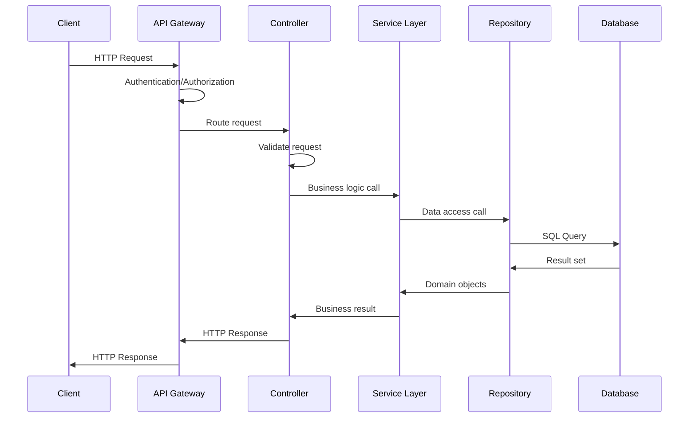
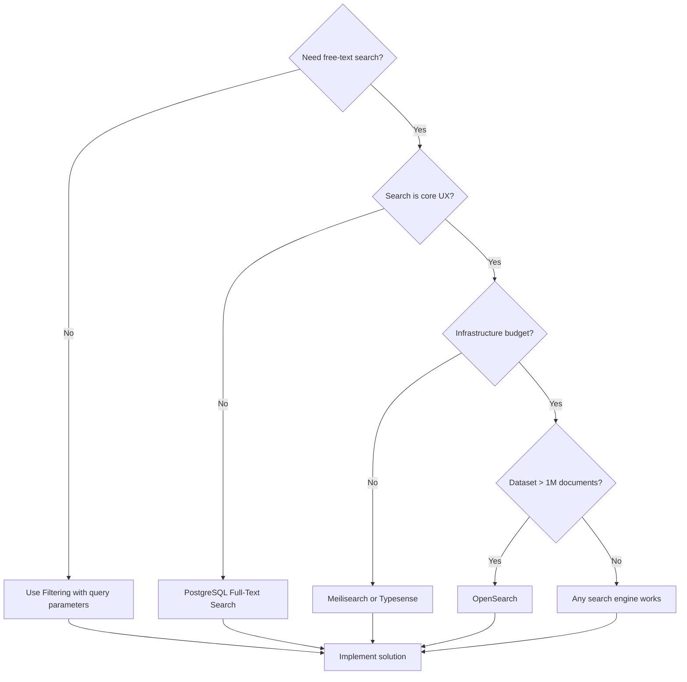
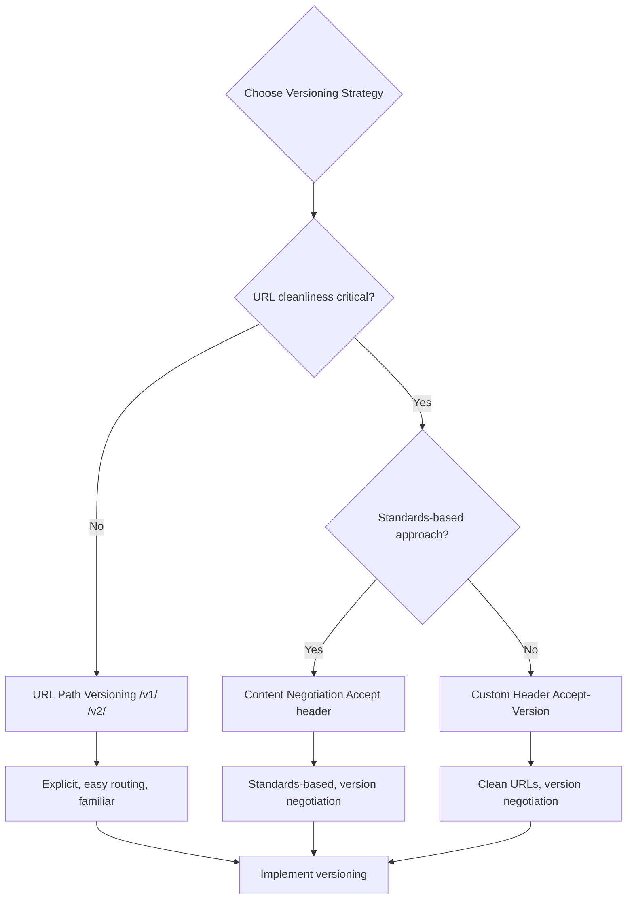

# API Design -- Architecture

API architecture encompasses the protocols, patterns, and infrastructure that enable service communication. Choose patterns that match your use case, performance requirements, and consumer needs.

## Contents

- [REST](#rest)
- [GraphQL](#graphql)
- [gRPC](#grpc)
- [Pagination Patterns](#pagination-patterns)
- [Filtering and Sorting](#filtering-and-sorting)
- [Search vs Filtering](#search-vs-filtering)
- [API Gateway Patterns](#api-gateway-patterns)
- [Versioning Strategies](#versioning-strategies)

## REST

REST (Representational State Transfer) is a resource-oriented architecture using HTTP methods and status codes.



### Resource Modeling

REST models APIs around resources (nouns), not actions (verbs):

- ✅ `/users`, `/orders`, `/products` (resources)
- ❌ `/getUser`, `/createOrder`, `/deleteProduct` (actions)

Resources should be:
- **Nouns**: Represent entities in your domain
- **Plural**: Collections use plural nouns (`/users`, not `/user`)
- **Hierarchical**: Related resources nest naturally (`/users/{userId}/orders`)

### HTTP Methods and Semantics

HTTP methods define operations on resources:

- **GET**: Retrieve a resource (idempotent, safe, cacheable)
- **POST**: Create a new resource or perform an action (not idempotent, not safe)
- **PUT**: Replace a resource entirely (idempotent, not safe)
- **PATCH**: Partially update a resource (idempotent, not safe)
- **DELETE**: Remove a resource (idempotent, not safe)

**Idempotency**: GET, PUT, DELETE are naturally idempotent (calling multiple times has the same effect). POST is not—use idempotency keys for non-idempotent POST operations.

**Safety**: GET is safe (no side effects). Other methods may have side effects.

### HTTP Status Codes

Status codes communicate request outcomes:

**Success (2xx)**:
- **200 OK**: Generic success. Use for GET, PUT, PATCH responses.
- **201 Created**: Resource created successfully. Include `Location` header with resource URL.
- **204 No Content**: Success with no response body. Use for DELETE or PUT/PATCH that returns nothing.

**Client Error (4xx)**:
- **400 Bad Request**: Malformed request (syntax error, invalid JSON).
- **401 Unauthorized**: Missing or invalid authentication credentials.
- **403 Forbidden**: Authenticated but not authorized for this operation.
- **404 Not Found**: Resource doesn't exist.
- **409 Conflict**: Resource state conflict (e.g., duplicate creation).
- **422 Unprocessable Entity**: Valid syntax but semantic validation failed (preferred over 400 for validation errors).
- **429 Too Many Requests**: Rate limit exceeded.

**Server Error (5xx)**:
- **500 Internal Server Error**: Unexpected server error.
- **502 Bad Gateway**: Upstream service error.
- **503 Service Unavailable**: Service temporarily unavailable (maintenance, overload).

Use 422 for validation errors (field-level errors), 400 for malformed requests (syntax errors).

### Content Negotiation

Content negotiation allows clients to request specific response formats:

- **Accept**: `Accept: application/json` or `Accept: application/xml`
- **Accept-Language**: `Accept-Language: en-US, en`
- **Accept-Encoding**: `Accept-Encoding: gzip, deflate`

Support JSON by default. XML, CSV, or other formats are optional based on consumer needs.

### HATEOAS (Hypermedia as the Engine of Application State)

HATEOAS is a REST constraint where responses include links that describe available actions:

```json
{
  "id": "123",
  "status": "pending",
  "_links": {
    "self": { "href": "/orders/123" },
    "cancel": { "href": "/orders/123", "method": "DELETE" },
    "payment": { "href": "/orders/123/payment", "method": "POST" }
  }
}
```

**Reality check**: HATEOAS is theoretically elegant but rarely adopted in practice. Most teams find that well-documented, stable APIs don't benefit from dynamic link discovery. The overhead of generating and consuming hypermedia links is seldom justified.

**When HATEOAS genuinely helps**:
- APIs with complex state machines where available actions change based on resource state
- Public APIs consumed by generic clients that need to discover capabilities
- APIs where URL structures change frequently (links decouple clients from URLs)

**When to skip HATEOAS (most cases)**:
- Internal APIs where consumers are known and tightly coupled
- Simple CRUD APIs with stable, well-documented endpoints
- Teams without Spring HATEOAS experience (the learning curve isn't worth it for most projects)

**Practical alternative**: Include relevant resource IDs and let clients construct URLs from documented patterns. This gives 80% of the navigability benefit with far less complexity.

## GraphQL

GraphQL is a query language for APIs that lets clients request exactly the data they need.

### Schema Design

GraphQL schemas define types, queries, mutations, and subscriptions:

**Types**: Define data structures
```graphql
type User {
  id: ID!
  email: String!
  orders: [Order!]!
}

type Order {
  id: ID!
  total: Float!
  items: [OrderItem!]!
}
```

**Queries**: Read operations
```graphql
type Query {
  user(id: ID!): User
  orders(userId: ID!): [Order!]!
}
```

**Mutations**: Write operations
```graphql
type Mutation {
  createOrder(input: CreateOrderInput!): Order!
  cancelOrder(id: ID!): Order!
}
```

**Subscriptions**: Real-time updates
```graphql
type Subscription {
  orderStatusChanged(orderId: ID!): Order!
}
```

### Resolver Patterns

Resolvers fetch data for each field. Organize resolvers to avoid N+1 queries:

- **Field resolvers**: Resolve individual fields (may cause N+1)
- **DataLoader**: Batch and cache database queries
- **Root resolvers**: Fetch complete objects, let field resolvers access cached data

### N+1 Query Prevention

GraphQL's flexibility can cause N+1 queries:

```graphql
query {
  users {
    orders {  # N+1: one query per user
      items {  # N+1: one query per order
        product { name }
      }
    }
  }
}
```

**Solutions**:
- **DataLoader**: Batch database queries, cache results within a request
- **Eager loading**: Fetch related data in root resolvers
- **Query complexity limits**: Reject queries that would cause excessive database load

### Schema Stitching and Federation

**Schema stitching**: Combine multiple GraphQL schemas into one:
- Useful when services expose GraphQL independently
- Stitching layer merges schemas and routes queries

**Federation**: Distributed GraphQL across services:
- Each service defines its schema
- Gateway composes schemas and routes queries
- Services resolve their portion of the query

Federation enables microservices architectures where each service owns part of the GraphQL schema.

### When GraphQL Shines

GraphQL excels when:
- **Complex data relationships**: Clients need related data from multiple sources
- **Multiple consumers with different needs**: Mobile needs minimal fields, web needs full details
- **Reducing over-fetching**: Clients request only needed fields
- **Rapid frontend iteration**: Frontend can request new fields without backend changes

### When GraphQL is Overkill

GraphQL adds complexity when:
- **Simple CRUD**: REST is simpler for basic create/read/update/delete
- **Simple data needs**: Clients always need the same fields
- **Caching is critical**: HTTP caching is easier with REST
- **Team lacks GraphQL expertise**: Learning curve and tooling overhead

## gRPC

gRPC is a high-performance RPC framework using Protocol Buffers for serialization.

### Protocol Buffers

Protocol Buffers (protobuf) define service contracts:

```protobuf
service OrderService {
  rpc GetOrder(GetOrderRequest) returns (Order);
  rpc CreateOrder(CreateOrderRequest) returns (Order);
  rpc StreamOrders(StreamOrdersRequest) returns (stream Order);
}

message Order {
  string id = 1;
  float total = 2;
  repeated OrderItem items = 3;
}
```

Protobuf provides:
- **Binary serialization**: Smaller payloads than JSON
- **Strong typing**: Compile-time type checking
- **Code generation**: Generate client and server code from `.proto` files
- **Backward compatibility**: Field numbers enable safe schema evolution

### Service Definitions

gRPC services define RPC methods:
- **Unary**: Single request, single response (like REST)
- **Server streaming**: Single request, stream of responses
- **Client streaming**: Stream of requests, single response
- **Bidirectional streaming**: Stream of requests, stream of responses

### Streaming

Streaming enables real-time data transfer:

**Server streaming**: Server pushes updates to client
```protobuf
rpc WatchOrders(WatchOrdersRequest) returns (stream OrderUpdate);
```

**Client streaming**: Client sends stream, server processes and responds
```protobuf
rpc BulkCreateOrders(stream CreateOrderRequest) returns (BulkCreateResponse);
```

**Bidirectional**: Both sides stream (chat, real-time collaboration)
```protobuf
rpc Chat(stream ChatMessage) returns (stream ChatMessage);
```

### Code Generation

gRPC generates client and server code from `.proto` files:
- **Server stubs**: Implement the service interface
- **Client code**: Call remote methods like local functions
- **Type definitions**: Strongly-typed request/response objects

Code generation ensures clients and servers stay in sync with the contract.

### When gRPC Excels

gRPC is ideal for:
- **Internal service-to-service**: High performance, strong typing, code generation
- **High throughput**: Binary serialization, HTTP/2 multiplexing
- **Streaming**: Real-time data, long-lived connections
- **Polyglot environments**: Generate clients in multiple languages from one `.proto`

### When gRPC is Not Appropriate

Avoid gRPC for:
- **Browser clients**: Limited browser support (requires gRPC-Web proxy)
- **Simple CRUD**: REST is simpler and more familiar
- **Public APIs**: REST/GraphQL have better tooling and developer familiarity
- **Firewall constraints**: Some firewalls don't handle HTTP/2 well

## Pagination Patterns

Never return unbounded collections. Always paginate.

### Offset-Based Pagination

Uses `LIMIT` and `OFFSET`:

```
GET /users?page=2&pageSize=20
```

**Strengths**:
- Simple to implement and understand
- Supports jump-to-page (direct navigation to page 5)
- Easy to show "Page X of Y"

**Weaknesses**:
- Breaks with concurrent writes (items shift between pages)
- Expensive for deep pages (OFFSET 10000 requires scanning 10000 rows)
- Inconsistent results (same item may appear on multiple pages)

**When to use**: Small datasets, user-facing pagination with page numbers, when consistency isn't critical.

#### Spring Data Pageable (Offset Implementation)

In the Spring ecosystem, offset-based pagination is most commonly implemented using Spring Data's `Pageable` / `Page<T>` / `PageRequest` pattern. This is the de facto standard for Spring Boot APIs and provides a standardized response envelope without needing HATEOAS.

**Request**:
```
GET /users?page=0&size=20&sort=createdAt,desc
```

**Controller**:
```kotlin
@GetMapping
fun listUsers(pageable: Pageable): Page<User> {
    return userRepository.findAll(pageable)
}
```

**Response** (`Page<T>` serialized):
```json
{
  "content": [
    { "id": "123", "email": "user@example.com" }
  ],
  "pageable": {
    "pageNumber": 0,
    "pageSize": 20,
    "sort": { "sorted": true, "unsorted": false }
  },
  "totalElements": 150,
  "totalPages": 8,
  "number": 0,
  "size": 20,
  "first": true,
  "last": false,
  "numberOfElements": 20
}
```

**Why Spring Data Pageable is widely used**:
- Zero boilerplate: Spring auto-resolves `Pageable` from query parameters
- Standardized response: `Page<T>` gives consistent pagination metadata across all endpoints
- Sorting built in: `?sort=field,direction` handled automatically
- Repository integration: `findAll(Pageable)` works out of the box with Spring Data JPA
- No HATEOAS dependency: Rich pagination metadata without the complexity of hypermedia links

**Trade-offs**:
- Spring-specific: response format is tied to Spring Data's `Page<T>` structure
- Still offset-based: inherits all offset pagination weaknesses (deep page performance, concurrent write issues)
- Opinionated structure: the response envelope is fixed -- if you need a custom format, you'll need to map from `Page<T>`

For most Spring Boot APIs, Spring Data Pageable is the recommended starting point. Consider cursor-based or keyset pagination only when you hit the offset limitations (large datasets, high write volumes).

### Cursor-Based Pagination

Uses opaque cursor tokens:

```
GET /users?cursor=eyJpZCI6IjEyMyJ9&limit=20
Response: { "data": [...], "nextCursor": "eyJpZCI6IjE0NSJ9" }
```

**Strengths**:
- Consistent with concurrent writes (cursor points to specific position)
- Efficient (no OFFSET, uses indexed WHERE clause)
- Works well for large datasets

**Weaknesses**:
- No jump-to-page (must traverse sequentially)
- Cursor format is opaque (harder to debug)
- Requires sortable unique field

**When to use**: Large datasets, APIs with high write volume, when consistency matters.

### Keyset Pagination

Uses WHERE clause on sorted unique key:

```
GET /users?lastId=123&limit=20
-- SQL: WHERE id > 123 ORDER BY id LIMIT 20
```

**Strengths**:
- Database-friendly (uses index efficiently)
- Consistent with concurrent writes
- Simple cursor format (just the key value)

**Weaknesses**:
- Requires sortable unique key
- No jump-to-page
- Only works for forward pagination (backward requires different query)

**When to use**: When you have a sortable unique key (ID, timestamp), internal APIs, high-performance requirements.

### Pagination Comparison

| Pattern | Jump-to-Page | Concurrent Writes | Deep Page Performance | Complexity |
|---------|--------------|-------------------|----------------------|------------|
| Offset | ✅ Yes | ❌ Breaks | ❌ Slow | Low |
| Cursor | ❌ No | ✅ Consistent | ✅ Fast | Medium |
| Keyset | ❌ No | ✅ Consistent | ✅ Fast | Low |

**Recommendation**: Use cursor-based or keyset pagination for APIs. Reserve offset pagination for user-facing UIs with small datasets.

## Filtering and Sorting

### Query Parameter Conventions (REST)

REST APIs use query parameters for filtering and sorting:

```
GET /users?status=active&role=admin&sort=createdAt&order=desc&limit=20
```

Common conventions:
- **Filtering**: `?field=value` or `?field[operator]=value` (e.g., `?age[gte]=18`)
- **Sorting**: `?sort=field` or `?sort=field1,field2` with `?order=asc,desc`
- **Multiple values**: `?tags=tag1&tags=tag2` or `?tags[]=tag1&tags[]=tag2`

### Standardized Query Languages

For complex queries, use a standardized query language:

**Lucene-style** (as used in `rest-query` library):
```
GET /users?q=status:active AND role:admin AND createdAt:[2024-01-01 TO *]
```

**Benefits**:
- Expressive query syntax
- Consistent across endpoints
- Familiar to developers (Lucene is widely used)

**Operators**: `AND`, `OR`, `NOT`, `>`, `<`, `>=`, `<=`, `:`, `[TO]`, `*` (wildcard)

### Filter Operators

Support common filter operators:
- **Equality**: `field=value`
- **Inequality**: `field[ne]=value`
- **Comparison**: `field[gt]=value`, `field[gte]=value`, `field[lt]=value`, `field[lte]=value`
- **Contains**: `field[contains]=substring`
- **In**: `field[in]=value1,value2,value3`

### Sort Direction

Support explicit sort direction:
- `?sort=createdAt&order=asc` or `?sort=createdAt&order=desc`
- `?sort=createdAt,updatedAt&order=desc,asc` (multiple fields)
- Default to ascending if not specified

## Search vs Filtering

One of the most common architectural mistakes is trying to make a paginated filter endpoint serve as a search engine. These are fundamentally different concerns with different infrastructure needs.

### The Spectrum

| Level | What It Is | Infrastructure | When to Use |
|-------|-----------|---------------|-------------|
| **Filtering** | Exact-match query parameters on a paginated endpoint | Database queries (WHERE clauses) | Known-value lookups: status, role, date ranges |
| **Basic Search** | Text matching within your existing database | PostgreSQL full-text search (`tsvector`/`tsquery`) | Moderate search needs, no extra infrastructure budget |
| **Full Search Engine** | Dedicated search infrastructure with relevance scoring | OpenSearch, Meilisearch, Typesense | Search is a core user experience, fuzzy matching, autocomplete |

### Level 1: Filtering (Database Queries)

Standard query parameters on paginated endpoints:

```
GET /users?status=active&role=admin&createdAfter=2024-01-01
```

**Appropriate for**:
- Filtering by known values (enums, IDs, date ranges)
- Sorting by specific fields
- Simple equality and comparison operators

**Not appropriate for**:
- Free-text search across multiple fields
- Fuzzy matching (typo tolerance)
- Relevance-ranked results
- Autocomplete / type-ahead suggestions

### Level 2: PostgreSQL Full-Text Search

PostgreSQL has built-in full-text search capabilities using `tsvector` and `tsquery`:

```sql
SELECT * FROM products
WHERE to_tsvector('english', name || ' ' || description) @@ plainto_tsquery('english', 'wireless headphones')
ORDER BY ts_rank(to_tsvector('english', name || ' ' || description), plainto_tsquery('english', 'wireless headphones')) DESC;
```

**Strengths**:
- No additional infrastructure (uses your existing PostgreSQL database)
- Supports language-aware stemming and stop words
- Configurable text search dictionaries
- GIN indexes for performance
- Ranking and relevance scoring

**Weaknesses**:
- Limited fuzzy matching (no typo tolerance by default)
- No built-in autocomplete
- Performance degrades with very large datasets
- Less sophisticated relevance algorithms than dedicated search engines
- Query syntax is less flexible than Lucene-style queries

**When to use**: You need search beyond simple filtering, your dataset is moderate (< 1M documents), and you don't want to maintain additional infrastructure.

### Level 3: Dedicated Search Engine

For applications where search is a core user experience:

#### OpenSearch (Recommended Open Source)

OpenSearch is an open-source fork of Elasticsearch, fully compatible with the Elasticsearch API.

**Strengths**:
- Full-featured: fuzzy matching, faceted search, autocomplete, aggregations
- Relevance scoring with BM25 and custom boosting
- Horizontal scaling for large datasets
- Rich query DSL (boolean queries, range queries, nested queries)
- Near real-time indexing
- Active open-source community (Apache 2.0 license)

**Weaknesses**:
- Requires separate infrastructure (cluster management, monitoring)
- Data synchronization between primary database and search index
- Operational complexity (index management, shard configuration)
- Memory-intensive (JVM-based)
- Not a primary data store (eventual consistency with source of truth)

**When to use**: Search is a core feature, large datasets, need fuzzy matching / autocomplete / faceted search / relevance tuning.

#### Lightweight Alternatives

| Engine | Best For | Language | License |
|--------|---------|---------|---------|
| **Meilisearch** | Simple search with great defaults, fast setup | Rust | MIT |
| **Typesense** | Typo-tolerant search, easy to operate | C++ | GPL-3.0 |

These are simpler to operate than OpenSearch but have fewer features (less flexible aggregations, smaller ecosystems).

### Architecture Pattern: Search Alongside Filtering

A common pattern is to have both:

```
GET /products?category=electronics&status=active    → Filtering (database)
GET /products/search?q=wireless+headphones          → Search (search engine)
```

**Data synchronization**: Keep the search index in sync with the primary database:
- **Event-driven**: Publish domain events on data changes, consumer updates search index
- **Change Data Capture (CDC)**: Stream database changes to search index (Debezium)
- **Scheduled reindex**: Periodic full reindex (simple but has latency)

Event-driven synchronization is preferred as it provides near real-time updates without tight coupling. See [Event-Driven Architecture](../event-driven-architecture/architecture.md).

### Decision Guide



```
Do you need free-text search across multiple fields?
├── No → Use filtering (query parameters + database queries)
└── Yes
    ├── Is search a core user experience (autocomplete, fuzzy, facets)?
    │   ├── No → PostgreSQL full-text search
    │   └── Yes
    │       ├── Do you have budget for infrastructure?
    │       │   ├── Yes → OpenSearch
    │       │   └── No → Meilisearch or Typesense (simpler to operate)
    │       └── Is your dataset > 1M documents?
    │           ├── Yes → OpenSearch (scales horizontally)
    │           └── No → Any of the above works
```

See also: [Search & Discovery Experience](../../experiences/search-and-discovery/) for the UX perspective on search.

## API Gateway Patterns

API gateways sit between clients and services, providing cross-cutting concerns.

### Routing

Gateways route requests to backend services:
- **Path-based**: `/api/users` → user service, `/api/orders` → order service
- **Host-based**: `users.api.example.com` → user service
- **Content-based**: Route based on request headers or body

### Rate Limiting

Protect services from overload:
- **Per API key**: Limit requests per consumer
- **Per IP**: Limit requests per IP address
- **Per endpoint**: Different limits for different endpoints
- **Sliding window**: Smooth rate limiting vs fixed window

### Request Transformation

Transform requests before forwarding:
- **Header injection**: Add authentication headers, request IDs
- **Path rewriting**: `/api/v1/users` → `/users` (internal routing)
- **Request body transformation**: Convert between API versions

### Response Aggregation

Combine responses from multiple services:
- **Fan-out**: Single request triggers multiple backend calls
- **Response merging**: Combine results into single response
- **Error handling**: Partial failures, timeouts

### Authentication at the Gateway

Centralize authentication:
- **Token validation**: Validate JWT tokens before forwarding
- **API key validation**: Check API keys, inject user context
- **OAuth flows**: Handle OAuth redirects and token exchange

### Circuit Breaking

Protect services from cascading failures:
- **Failure threshold**: Open circuit after N failures
- **Timeout**: Open circuit after timeout period
- **Half-open**: Test if service recovered before closing circuit

## Versioning Strategies

### URL Path Versioning

Version in the URL path: `/v1/users`, `/v2/users`

**Strengths**:
- Explicit and visible
- Easy to route to different handlers
- Clear which version is being used

**Weaknesses**:
- Clutters URLs
- Requires updating all clients for new version

**Example**: `https://api.example.com/v1/users`

### Header Versioning

Version in custom header: `Accept-Version: v2`

**Strengths**:
- Clean URLs
- Version negotiation possible

**Weaknesses**:
- Less visible (harder to debug)
- Requires client awareness
- Caching complications (Vary header needed)

**Example**: `GET /users` with `Accept-Version: v2`

### Content Negotiation

Version in Accept header: `Accept: application/vnd.api.v1+json`

**Strengths**:
- Standards-based (HTTP content negotiation)
- Supports version negotiation

**Weaknesses**:
- Complex for clients
- Less common, unfamiliar to many developers

**Example**: `Accept: application/vnd.example.v1+json`

### Query Parameter Versioning

Version in query parameter: `/users?version=2`

**Strengths**:
- Simple
- Optional (can default to latest)

**Weaknesses**:
- Easy to forget
- Not RESTful (query params should be for filtering)
- Caching complications

**Example**: `GET /users?version=2`

### Trade-offs

| Strategy | Visibility | Routing | Caching | Adoption |
|----------|------------|---------|---------|----------|
| URL Path | High | Easy | Easy | High |
| Header | Low | Medium | Hard | Medium |
| Content Negotiation | Low | Medium | Hard | Low |
| Query Parameter | Medium | Easy | Hard | Medium |

**Recommendation**: Use URL path versioning (`/v1/`, `/v2/`) for most APIs. It's explicit, easy to route, and familiar to developers. Reserve header versioning for APIs where URL cleanliness is critical.


