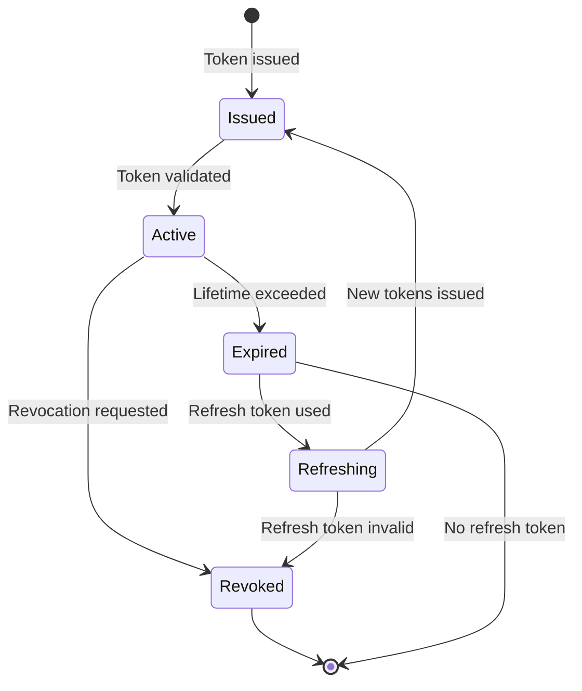
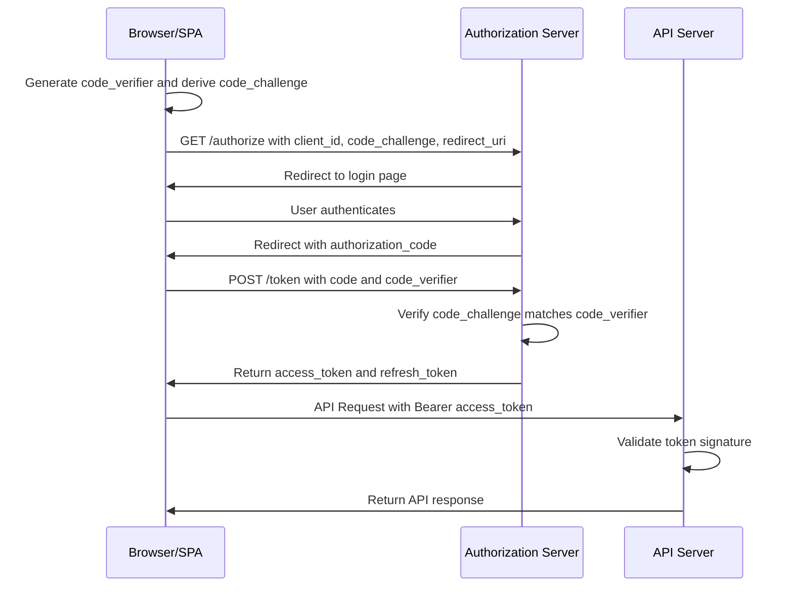
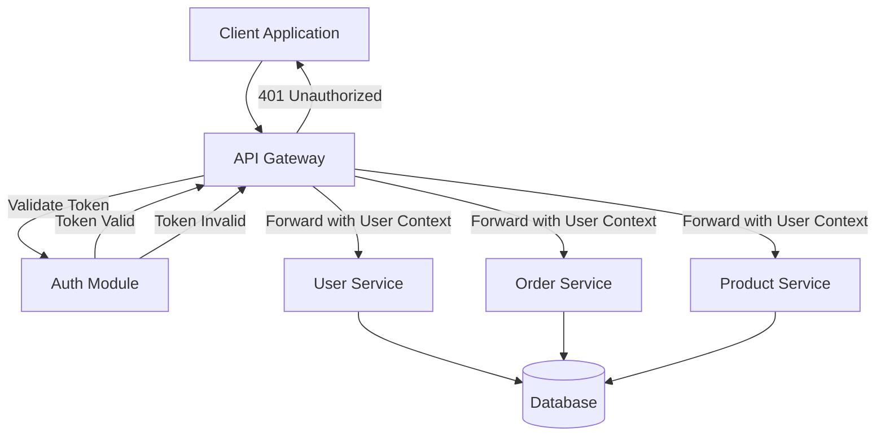
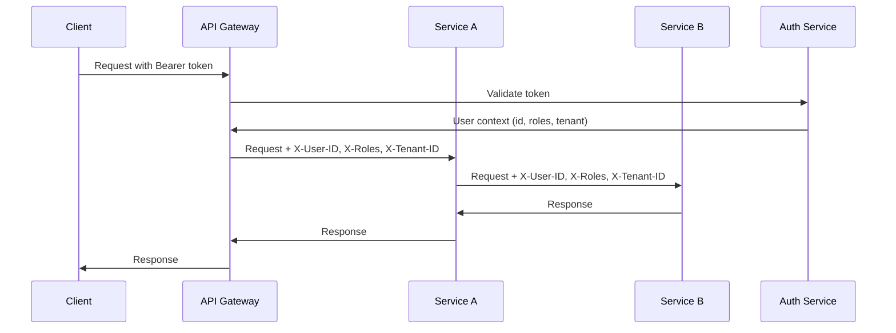

# Authentication & Authorization -- Architecture

Authentication architecture determines how identity is established, verified, and maintained across your application. Authorization architecture determines what authenticated users are permitted to do. These concerns span multiple layers: the network edge, API gateways, application services, and data stores. The chosen architecture impacts scalability, security, user experience, and operational complexity.

## Contents

- [Authentication Approaches](#authentication-approaches)
- [JWT Deep Dive](#jwt-deep-dive)
- [OAuth 2.0 / OIDC Flows](#oauth-20-oidc-flows)
- [Authorization Models](#authorization-models)
- [Architecture Patterns](#architecture-patterns)
- [Session Storage](#session-storage)
- [Comparison Table](#comparison-table)

## Authentication Approaches

### Session-Based Authentication

Session-based authentication uses server-side session storage to maintain authentication state. When a user logs in, the server creates a session record (typically in a database or Redis) and returns a session identifier (session ID) to the client, usually stored in an httpOnly cookie. Subsequent requests include the session ID cookie, and the server validates it against the session store to determine the authenticated user.

Sessions provide strong revocation capabilities (delete the session record to immediately invalidate access) and can store additional server-side state. However, they require server-side storage and can create scalability challenges if session data must be shared across multiple servers. Stateless load balancing requires sticky sessions or shared session storage (Redis cluster).

Session-based authentication is well-suited for traditional web applications where the server renders pages and manages state. It integrates naturally with server-side frameworks and provides fine-grained control over session lifecycle.

### Token-Based Authentication

Token-based authentication uses self-contained tokens (most commonly JWTs) that encode user identity and claims. The client stores the token (often in localStorage or memory) and includes it in requests, typically in the Authorization header as a Bearer token. The server validates the token signature and extracts user information without querying a database.

Tokens enable stateless authentication, simplifying horizontal scaling since any server can validate tokens without shared state. However, revocation is challenging with stateless tokens—you cannot "delete" a token that's already been issued. Token expiration provides some mitigation, but compromised tokens remain valid until expiration.

Token-based authentication works well for APIs, SPAs, and microservices architectures where statelessness is valuable. JWTs can include authorization claims (roles, permissions) reducing the need for additional database queries.

### Delegated Authentication (OAuth 2.0 / OpenID Connect)

Delegated authentication offloads identity verification to a trusted identity provider (IdP). Users authenticate with the IdP (e.g., Google, Microsoft, Okta), and the IdP issues tokens that your application trusts. Your application never sees user passwords, reducing security liability and simplifying compliance.

OAuth 2.0 provides authorization delegation (allowing applications to act on behalf of users), while OpenID Connect adds identity layer on top, providing standardized user information claims. This approach is essential for SSO scenarios and third-party integrations.

Delegated authentication requires integration with identity providers, handling redirect flows, and token validation. It's ideal when you want to leverage existing identity systems, support SSO, or enable third-party applications to access user data with user consent.

## JWT Deep Dive

### Anatomy of a JWT

A JWT consists of three Base64URL-encoded parts separated by dots: `header.payload.signature`.

The header specifies the signing algorithm (e.g., HS256, RS256) and token type. The payload contains claims—statements about the user and additional data. Claims include standard registered claims (iss, sub, exp, iat) and custom claims (roles, permissions, tenant_id). The signature ensures token integrity and authenticity. For RS256 (asymmetric), the IdP signs with a private key and your application validates with the public key.

### Access Tokens vs Refresh Tokens

Access tokens are short-lived (15 minutes to 1 hour) and included in every API request. They contain user identity and authorization claims. Refresh tokens are long-lived (days to weeks) and used solely to obtain new access tokens. Refresh tokens should be stored securely (httpOnly cookies) and rotated on each use to detect theft.

The separation enables security (short-lived access tokens limit exposure if compromised) while maintaining usability (refresh tokens enable seamless re-authentication). When an access token expires, the client uses the refresh token to obtain a new access token without user interaction.

### Token Rotation Strategies

Refresh token rotation issues a new refresh token each time it's used, invalidating the old one. This detects token theft—if an attacker uses a stolen refresh token, the legitimate client's next refresh will fail, alerting to compromise. Rotation requires server-side tracking of refresh tokens, moving toward a hybrid stateless/stateful model.

Alternative strategies include refresh token reuse detection (alerting when the same token is used from different locations) and binding refresh tokens to device fingerprints or IP addresses.

### Token Storage

**httpOnly Cookies**: The most secure option for web applications. Cookies marked httpOnly cannot be accessed by JavaScript, preventing XSS attacks from stealing tokens. Secure flag ensures cookies are only sent over HTTPS. SameSite attribute prevents CSRF attacks.

**localStorage**: Convenient for SPAs but vulnerable to XSS attacks. Any JavaScript running on your domain can access localStorage, making it unsuitable for sensitive tokens. If you must use localStorage, keep token lifetimes very short and implement robust XSS prevention.

**Memory**: Storing tokens only in JavaScript variables provides protection against XSS persistence but tokens are lost on page refresh, requiring re-authentication. This is acceptable for highly sensitive applications where security outweighs convenience.

**Recommendation**: Prefer httpOnly cookies for refresh tokens and access tokens in traditional web apps. For SPAs, consider httpOnly cookies with CORS configuration, or accept the risk of localStorage with short token lifetimes and strong XSS prevention.

### Token Revocation Challenges

Stateless JWTs cannot be revoked without maintaining a revocation list (blacklist), which undermines statelessness. Common approaches include:

- Short token lifetimes with refresh token rotation (compromised tokens expire quickly)
- Maintaining a token blacklist in Redis (checked on each request)
- Including a token version or nonce in the token and maintaining a revocation list keyed by user ID and version
- Using stateful refresh tokens while keeping access tokens stateless

The choice depends on your revocation requirements, scale, and tolerance for additional database lookups.

## OAuth 2.0 / OIDC Flows

### Authorization Code Flow with PKCE

The Authorization Code flow is the most secure OAuth 2.0 flow for SPAs and native applications. The client redirects the user to the authorization server, the user authenticates and authorizes, and the authorization server redirects back with an authorization code. The client exchanges the code for tokens at the token endpoint.

PKCE (Proof Key for Code Exchange) adds security for public clients (SPAs, mobile apps) by requiring a code verifier and challenge. This prevents authorization code interception attacks. The client generates a random code verifier, derives a code challenge, includes the challenge in the authorization request, and provides the verifier when exchanging the code for tokens.

This flow is recommended for all OAuth 2.0 implementations, especially public clients. It provides strong security while supporting modern application architectures.

### Client Credentials Flow

The Client Credentials flow enables service-to-service authentication without user context. The client authenticates with client_id and client_secret (or a client assertion), and receives an access token representing the client application, not a user.

This flow is used for machine-to-machine communication, backend services calling APIs, and scheduled jobs. The access token includes scopes that define what the client application is authorized to do, independent of any user.

### Device Code Flow

The Device Code flow enables authentication on devices with limited input capabilities (smart TVs, IoT devices, CLI tools). The device displays a user code and verification URL. The user visits the URL on another device, enters the code, and authorizes. The device polls for completion and receives tokens.

This flow is essential for constrained devices but requires the user to have a secondary device available. It's commonly used for CLI tools and IoT device provisioning.

### Refresh Token Rotation

When using refresh tokens, rotate them on each use. Issue a new refresh token when exchanging an old one for a new access token, and invalidate the old refresh token. This detects token theft—if an attacker uses a stolen refresh token, the legitimate client's next refresh attempt will fail because the token was already consumed.

Implement refresh token rotation requires server-side state tracking refresh tokens, their status (active, used, revoked), and associated metadata (device, IP, last used timestamp).

## Authorization Models

### Role-Based Access Control (RBAC)

RBAC assigns users to roles, and roles have associated permissions. Authorization decisions check whether the user's role includes the required permission. RBAC is simple to understand and implement, making it suitable for many applications.

Roles can be hierarchical (admin inherits user permissions) or flat. Users can have multiple roles, and permissions are typically coarse-grained (read_users, write_invoices). RBAC works well when authorization needs align with organizational roles and when permission sets are relatively stable.

### Attribute-Based Access Control (ABAC)

ABAC makes authorization decisions based on attributes of the user, resource, action, and environment. Attributes include user properties (department, clearance level), resource properties (owner, classification), action properties (read, write), and environmental context (time of day, location, IP address).

ABAC provides fine-grained, context-aware authorization. Policies are expressed as rules evaluating attributes (e.g., "users can edit documents they own, or documents in their department if their clearance level is sufficient"). ABAC is more flexible than RBAC but requires more sophisticated policy engines and attribute management.

### Relationship-Based / Fine-Grained Authorization (ReBAC/FGA)

ReBAC models authorization as relationships between entities in a graph. Permissions are defined as relationships (user is member of organization, user is owner of document, organization contains document). Authorization checks traverse the relationship graph to determine access.

Fine-Grained Authorization (FGA) systems like OpenFGA and Zanzibar provide ReBAC capabilities with high performance and scale. They excel when authorization depends on complex relationships (team hierarchies, document sharing, multi-tenancy) and when permissions need to be checked frequently with low latency.

ReBAC/FGA is ideal for applications with rich relationship models, collaborative features, and complex sharing scenarios. It provides natural modeling for multi-tenant applications and hierarchical organizations.

### Policy Engines

Policy engines (Open Policy Agent/OPA, AWS Cedar, SpiceDB) externalize authorization logic from application code. Policies are written in domain-specific languages (Rego for OPA, Cedar for AWS) and evaluated by the engine. This enables consistent authorization across services, policy versioning, and non-developer policy management.

Policy engines support both RBAC and ABAC models. They integrate via APIs, allowing services to delegate authorization decisions. This is valuable in microservices architectures where consistent authorization is critical but difficult to maintain across multiple services.

## Architecture Patterns

### Gateway-Level Authentication

Authenticate once at the API gateway or edge, before requests reach application services. The gateway validates tokens or sessions, extracts user context, and forwards authenticated requests with user identity headers (X-User-ID, X-Roles) to downstream services. Downstream services trust the gateway and don't re-authenticate.

This pattern centralizes authentication logic, reduces duplication across services, and ensures consistent authentication enforcement. It requires a trusted gateway and secure communication between gateway and services. The gateway becomes a critical security component requiring high availability and careful access control.

### Per-Service Authorization

Each service enforces its own authorization rules, even if authentication happens at the gateway. Services receive user identity from the gateway but make independent authorization decisions based on their domain logic. This enables service-specific authorization rules and maintains service autonomy.

This pattern provides flexibility but requires consistent authorization patterns across services to avoid security gaps. Services must not trust user-provided authorization claims without validation.

### Middleware and Filter Chains

Authentication and authorization logic executes in middleware or filter chains before request handlers. Filters validate tokens, extract user context, check permissions, and either proceed or return 401/403 responses. This separates cross-cutting authentication concerns from business logic.

Spring Security's filter chain, Express middleware, and similar patterns in other frameworks enable this. Filters can be ordered, conditionally applied, and shared across routes. This pattern provides clean separation of concerns and reusable authentication logic.

### Auth Context Propagation

In microservices architectures, authenticated requests must carry user context across service boundaries. This context includes user ID, roles, permissions, tenant ID, and other claims. Services pass this context in headers, message metadata, or thread-local storage.

Context propagation must be secure (prevent tampering), complete (include all necessary claims), and efficient (minimal overhead). Services should validate that propagated context matches the authenticated identity to prevent context spoofing attacks.

## Session Storage

### Server-Side with Redis

Storing sessions in Redis provides scalable, distributed session storage. Redis offers high performance, expiration support, and clustering capabilities. Sessions can be shared across multiple application servers, enabling stateless load balancing.

Redis sessions support immediate revocation (delete the key), session metadata storage, and efficient session lookup. However, Redis becomes a critical dependency requiring high availability and backup strategies. Session data should be encrypted if it contains sensitive information.

### Stateless JWT

JWTs contain all necessary information in the token itself, requiring no server-side storage. This eliminates session storage infrastructure and enables true stateless scaling. However, revocation requires blacklisting mechanisms, and token size limits the amount of data that can be included.

Stateless JWTs are ideal when revocation requirements are minimal, token lifetimes are short, and scale requirements are high. They work well for APIs and microservices where statelessness is valuable.

### Hybrid Approach

A hybrid approach uses short-lived stateless access tokens (JWTs) for API requests and stateful refresh tokens stored server-side. Access tokens provide stateless request authentication, while refresh tokens enable revocation and rotation. This balances the benefits of stateless access tokens with the control of stateful refresh tokens.

The hybrid approach is recommended for most applications. It provides good security (short-lived access tokens, revocable refresh tokens), scalability (stateless access token validation), and user experience (seamless token refresh).

## Comparison Table

| Aspect | Session-Based | JWT (Stateless) | OAuth 2.0 / OIDC |
|--------|---------------|-----------------|-------------------|
| **Server Storage** | Required (Redis/DB) | None (stateless) | Depends on flow |
| **Revocation** | Immediate (delete session) | Challenging (blacklist or expiration) | Immediate (revoke refresh token) |
| **Scalability** | Requires shared storage | Excellent (stateless) | Excellent (stateless tokens) |
| **Token Size** | Small (session ID) | Larger (includes claims) | Varies by flow |
| **Use Case** | Traditional web apps | APIs, SPAs, microservices | SSO, third-party integrations |
| **Complexity** | Low | Medium | High (IdP integration) |
| **User Experience** | Seamless (httpOnly cookies) | Varies (storage choice) | Excellent (SSO) |
| **Security** | Strong (httpOnly cookies) | Depends on storage | Strong (delegated to IdP) |
