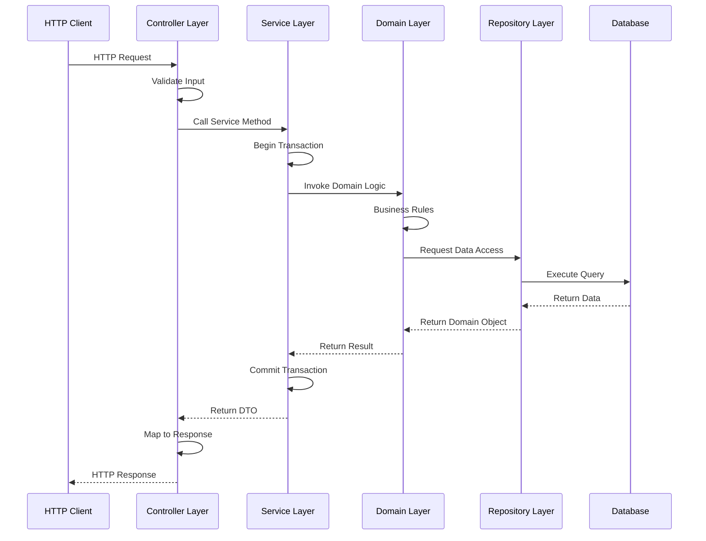
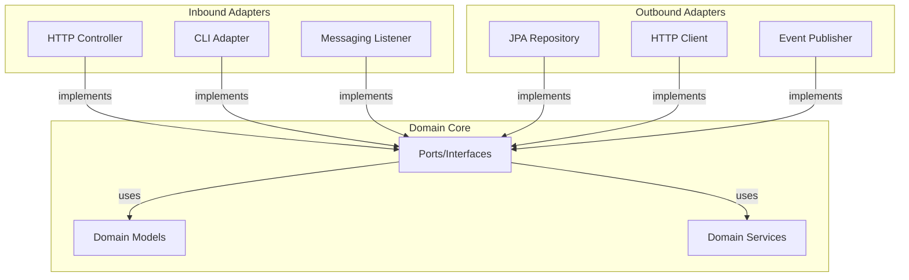
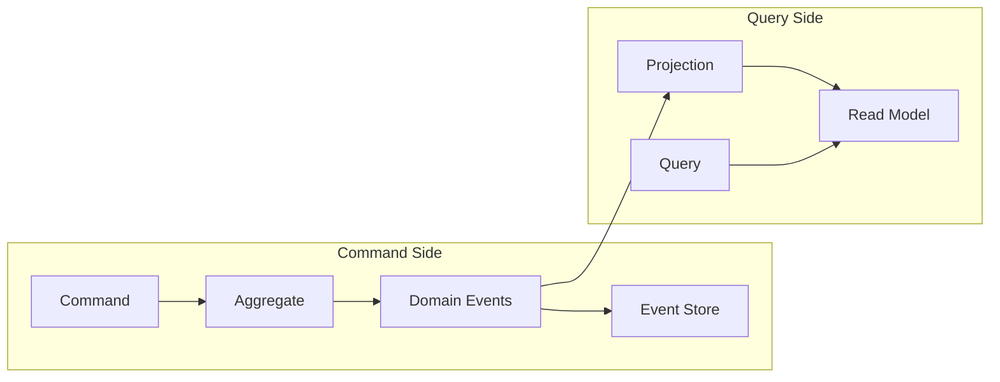
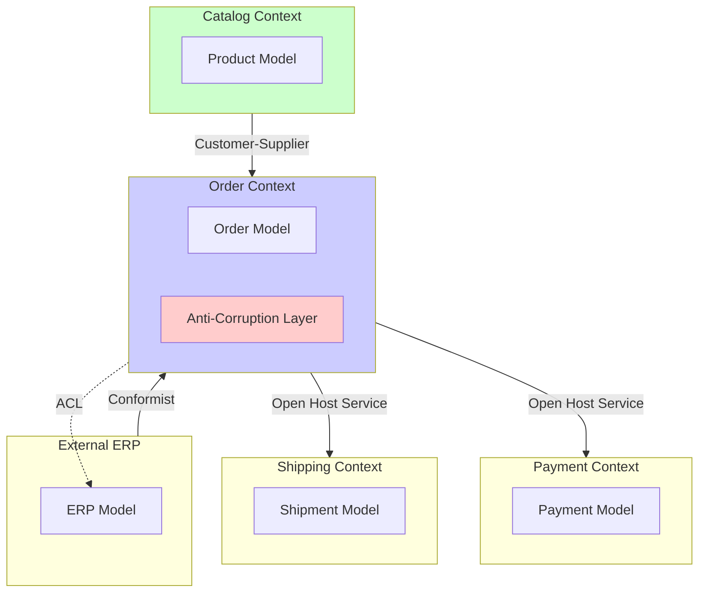
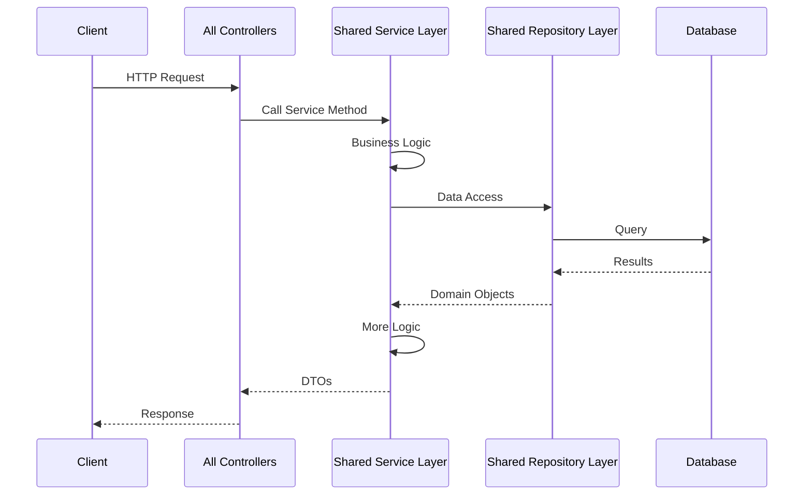
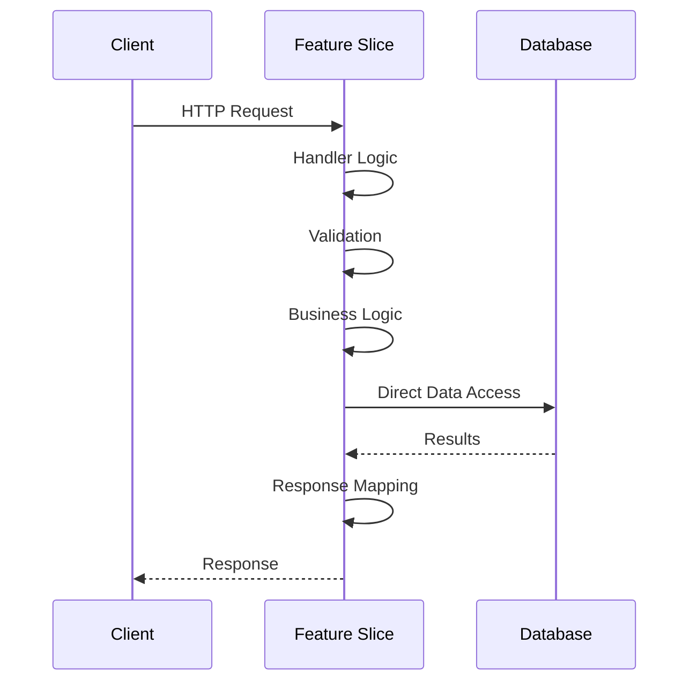

# Backend Architecture -- Architecture

Backend architecture encompasses both deployment architecture (how code is packaged and deployed) and internal architecture (how code is organized within each deployment unit). These decisions are independent but complementary.

## Contents

- [Deployment Architectures](#deployment-architectures)
- [Internal Architecture Patterns](#internal-architecture-patterns)
- [Domain-Driven Design](#domain-driven-design)
- [Vertical Slice Architecture](#vertical-slice-architecture)
- [Architecture Evolution](#architecture-evolution)

## Deployment Architectures

### Monolith

A monolith is a single deployment unit containing all application code in one codebase. All features share the same database, runtime, and deployment pipeline. This simplicity makes monoliths ideal for small teams and early-stage products.

**When It's Right**: Small teams (typically 2-5 developers), early product development, tight coupling between features, simple operational requirements, rapid iteration needs.

**Package Structure**: Two common approaches exist:

**Package-by-Layer** (traditional):
```
com.company.product/
├── controller/
│   ├── UserController.kt
│   └── OrderController.kt
├── service/
│   ├── UserService.kt
│   └── OrderService.kt
├── repository/
│   ├── UserRepository.kt
│   └── OrderRepository.kt
└── domain/
    ├── User.kt
    └── Order.kt
```

**Package-by-Feature** (preferred):
```
com.company.product/
├── user/
│   ├── UserController.kt
│   ├── UserService.kt
│   ├── UserRepository.kt
│   └── User.kt
└── order/
    ├── OrderController.kt
    ├── OrderService.kt
    ├── OrderRepository.kt
    └── Order.kt
```

Package-by-feature groups related code together, making features easier to understand and extract later. It also naturally enforces some boundaries—code in the `user` package shouldn't directly reference `order` package internals.

**Shared Database**: All features share the same database schema. This enables ACID transactions across features but creates coupling. Schema changes require coordination, and data access patterns can't be optimized per feature.

### Modular Monolith (Modulith)

A modular monolith maintains a single deployment unit but enforces strict module boundaries. Modules communicate through well-defined internal APIs rather than direct class references. This provides architectural benefits of microservices without operational complexity.

**Module Boundaries**: Each module exposes a public API (interfaces or public classes) while keeping implementation details package-private. Modules can't directly access each other's internals, forcing explicit contracts.

**Package Structure**:
```
com.company.product/
├── user/
│   ├── api/
│   │   └── UserService.kt          // Public API
│   ├── internal/
│   │   ├── UserServiceImpl.kt      // Implementation (package-private)
│   │   ├── UserRepository.kt
│   │   └── User.kt
│   └── UserModule.kt                // Module configuration
├── order/
│   ├── api/
│   │   └── OrderService.kt
│   ├── internal/
│   │   ├── OrderServiceImpl.kt
│   │   ├── OrderRepository.kt
│   │   └── Order.kt
│   └── OrderModule.kt
└── application/
    └── ProductApplication.kt        // Spring Boot application
```

**Boundary Enforcement**: Use ArchUnit to enforce module boundaries:

```kotlin
@ArchTest
val modulesShouldNotAccessOtherModulesInternals = 
    noClasses()
        .that().resideInAPackage("..user.internal..")
        .should().accessClassesThat()
        .resideInAPackage("..order.internal..")
```

**Spring Modulith**: Spring Modulith provides runtime support for modular monoliths, including module events, application module tests, and documentation generation. It enforces boundaries at runtime and provides tooling for module interaction analysis.

**Database Schema**: Each module should own its database schema (separate schemas or tables with clear prefixes). This enables future extraction to microservices without data migration.

**When to Use**: Teams of 5-15 developers, need for team autonomy without operational complexity, preparing for future microservices extraction, want to avoid distributed system complexity.

### Microservices

Microservices decompose applications into independently deployable services, each owning a bounded context and its data. Services communicate through well-defined APIs (REST, gRPC, or messaging) and maintain independent databases.

**Service Boundaries**: Each service represents a bounded context from Domain-Driven Design. Services own their data and expose operations through APIs. Changes to one service's database don't affect others.

**Service Discovery**: Services need to find each other. Options include:
- Service registry (Eureka, Consul)
- Kubernetes service discovery
- API Gateway with routing rules
- DNS-based discovery

**Independent Databases**: Each service has its own database (or database schema). This enables independent schema evolution and technology choices but requires careful handling of distributed transactions and data consistency.

**API Contracts**: Services communicate through versioned APIs. Breaking changes require coordination or versioning strategies. Contract testing (Pact, Spring Cloud Contract) ensures compatibility.

**Prerequisites**: Microservices require mature CI/CD pipelines, comprehensive observability (distributed tracing, metrics, logging), team experience with distributed systems, and platform teams to provide shared infrastructure.

**When to Use**: Large teams (15+ developers), need for independent scaling, different technology requirements per domain, mature DevOps practices, clear domain boundaries.

## Internal Architecture Patterns

These patterns apply within each service or module, regardless of deployment architecture.

### Layered Architecture

Layered architecture organizes code into horizontal layers: presentation, service/application, domain, and infrastructure. Each layer depends only on layers below it.

**Layer Responsibilities**:
- **Presentation**: HTTP controllers, request/response DTOs, input validation
- **Service/Application**: Use case orchestration, transaction boundaries, application-level validation
- **Domain**: Business logic, domain models, domain services
- **Infrastructure**: Database access, external service clients, messaging

**Request Flow Through Layers**:



**Package Structure** (Kotlin/Spring Boot):
```
com.company.product.user/
├── presentation/
│   ├── UserController.kt
│   └── dto/
│       ├── CreateUserRequest.kt
│       └── UserResponse.kt
├── service/
│   └── UserService.kt
├── domain/
│   ├── User.kt
│   ├── UserRepository.kt              // Interface
│   └── Email.kt                        // Value object
└── infrastructure/
    ├── JpaUserRepository.kt            // Implementation
    └── UserEntity.kt                   // JPA entity
```

**Strengths**: Simple, well-understood, easy to onboard new developers, works well for CRUD applications.

**Weaknesses**: Risk of anemic domain models (logic in service layer instead of domain), can lead to "god services" that orchestrate everything, layer boundaries can become porous.

**When to Use**: Simple CRUD applications, teams new to domain modeling, straightforward business logic.

### Hexagonal Architecture (Ports & Adapters)

Hexagonal architecture isolates the domain core from infrastructure concerns. The domain defines ports (interfaces) that infrastructure implements as adapters. This keeps domain logic pure and testable without infrastructure.

**Core Concepts**:
- **Domain Core**: Pure business logic, no framework dependencies
- **Ports**: Interfaces defined by the domain (inbound: use cases, outbound: repositories, external services)
- **Adapters**: Infrastructure implementations (inbound: controllers, outbound: JPA repositories, HTTP clients)

**Hexagonal Architecture Structure**:



**Package Structure** (Kotlin/Spring Boot):
```
com.company.product.user/
├── domain/
│   ├── model/
│   │   ├── User.kt                    // Aggregate root
│   │   └── Email.kt                   // Value object
│   ├── port/
│   │   ├── inbound/
│   │   │   └── CreateUserUseCase.kt  // Inbound port (use case)
│   │   └── outbound/
│   │       ├── UserRepository.kt     // Outbound port
│   │       └── EmailService.kt        // Outbound port
│   └── service/
│       └── UserDomainService.kt       // Domain service
├── application/
│   └── UserService.kt                 // Use case implementation
└── adapter/
    ├── inbound/
    │   └── web/
    │       └── UserController.kt      // Inbound adapter
    └── outbound/
        ├── persistence/
        │   └── JpaUserRepository.kt    // Outbound adapter
        └── messaging/
            └── KafkaUserEventPublisher.kt
```

**Dependency Direction**: Domain has no dependencies on Spring, JPA, or any framework. Adapters depend on domain ports. Application layer orchestrates domain logic through ports.

**Testing**: Domain logic can be tested without Spring or database. Adapters can be tested in isolation with mocks. Integration tests verify adapter implementations.

**When to Use**: Complex domain logic, need for framework independence, multiple infrastructure implementations (different databases, messaging systems), long-term maintainability focus.

### CQRS (Command Query Responsibility Segregation)

CQRS separates command (write) and query (read) models. Commands modify state through aggregates. Queries read from optimized read models (projections). This enables independent optimization of read and write paths.

**Command Side**: Commands are handled by aggregates that enforce business rules and emit domain events. Axon Framework provides `@Aggregate`, `@CommandHandler`, and `@EventSourcingHandler` annotations.

**Query Side**: Read models are built from events (event sourcing) or updated synchronously (traditional CQRS). Projections optimize for specific query patterns.

**CQRS Pattern Flow**:



**When to Use**: Different read/write patterns (many reads, few writes, or vice versa), complex read queries that would complicate write model, need for independent scaling of read/write, event sourcing adoption.

**Without Event Sourcing**: CQRS can be used with traditional databases. Write model updates database directly. Read model is updated synchronously or asynchronously. Simpler but loses event history.

**With Event Sourcing**: Commands produce events stored in event store. Read models built from events. Provides complete audit trail and time travel. Axon Framework provides event store (Axon Server) and projection building.

**Axon Framework Example**:
```kotlin
@Aggregate
class UserAggregate {
    @AggregateIdentifier
    private var userId: UserId? = null
    
    @CommandHandler
    fun handle(command: CreateUserCommand) {
        // Validate and emit event
        AggregateLifecycle.apply(UserCreatedEvent(command.userId, command.email))
    }
    
    @EventSourcingHandler
    fun on(event: UserCreatedEvent) {
        this.userId = event.userId
        // Rebuild state from event
    }
}
```

## Domain-Driven Design

Domain-Driven Design (DDD) provides both strategic and tactical patterns for modeling complex business domains. Strategic DDD helps identify boundaries and relationships between different parts of a system, while tactical DDD provides concrete patterns for implementing domain models.

### Strategic DDD

#### Bounded Contexts

A bounded context is an explicit boundary within which a domain model applies. Inside a bounded context, all terms have a specific meaning defined by the ubiquitous language. Outside the boundary, the same term might mean something different.

**Identifying Bounded Contexts**: Look for:
- Different teams using different terminology for the same concept
- Different data models for the same entity (e.g., "Customer" in Sales vs "Customer" in Shipping)
- Independent lifecycles (one context can change without affecting another)
- Different business capabilities

**Mapping to Microservices/Modules**: Each bounded context typically maps to:
- A microservice (in microservices architecture)
- A module (in modular monolith)
- A package/namespace (in monolith)

**Example**: An e-commerce system might have bounded contexts for:
- **Catalog**: Product information, categories, pricing
- **Order Management**: Order creation, order state, order history
- **Inventory**: Stock levels, reservations, fulfillment
- **Payment**: Payment processing, refunds, payment methods
- **Shipping**: Shipment tracking, delivery addresses, carriers

Each context has its own model of "Product" or "Order" tailored to its specific needs.

#### Context Mapping

Context mapping describes relationships between bounded contexts. Understanding these relationships helps design integration strategies and identify coupling points.

**Relationship Types**:

- **Shared Kernel**: Two contexts share a subset of the domain model. Changes require coordination. Use sparingly—only when the shared model is stable and small.

- **Customer-Supplier**: One context (supplier) provides services/data to another (customer). The customer depends on the supplier, but the supplier is independent. The supplier may prioritize customer needs.

- **Conformist**: One context conforms to another's model without influence. Often occurs when integrating with external systems or legacy systems where you can't change the model.

- **Anti-Corruption Layer (ACL)**: A translation layer between two contexts that prevents one context's model from corrupting another. The ACL translates between the two models, isolating the downstream context from upstream changes.

- **Open Host Service**: A context publishes a well-defined protocol/API that multiple other contexts consume. The protocol becomes a published language.

- **Published Language**: A well-documented, shared language (often a schema or API contract) used for communication between contexts. Reduces coupling by standardizing integration points.

**Context Map Diagram**:



#### Ubiquitous Language

The ubiquitous language is a shared vocabulary used by developers and domain experts within a bounded context. It should flow directly into code: class names, method names, event names, and variable names should use domain terms.

**Principles**:
- Use domain terms, not technical terms (e.g., `Order` not `OrderEntity`, `ShipOrder` not `ProcessOrder`)
- Avoid translation layers between domain experts and code
- When domain experts use a term, use that exact term in code
- If domain experts change terminology, update the code to match

**Example**: If domain experts say "we ship an order," the code should have a `ship()` method on `Order`, not `process()` or `fulfill()`. Domain events should be named `OrderShipped`, not `OrderProcessed`.

### Tactical DDD

#### Aggregates

An aggregate is a cluster of entities and value objects treated as a single unit. It has a single aggregate root (an entity) that serves as the entry point. The aggregate root enforces invariants and controls access to internal entities.

**Sizing Rules**:
- **Keep aggregates small**: Large aggregates lead to contention (multiple transactions trying to modify the same aggregate) and performance issues (loading entire aggregates into memory).
- **One aggregate per transaction**: Transactions should not span multiple aggregates. Use domain events for cross-aggregate coordination.
- **Reference by ID, not object**: Aggregates should reference other aggregates by ID, not by direct object reference. This prevents loading entire object graphs and maintains aggregate boundaries.

**Enforcing Invariants**: The aggregate root is responsible for ensuring business rules (invariants) are never violated. All modifications go through the aggregate root, which validates before applying changes.

**Example** (Kotlin):
```kotlin
@Aggregate
class Order private constructor() {
    @AggregateIdentifier
    private lateinit var orderId: OrderId
    
    private val items = mutableListOf<OrderItem>()
    private var status: OrderStatus = OrderStatus.DRAFT
    
    companion object {
        fun create(orderId: OrderId, customerId: CustomerId): Order {
            return Order().apply {
                this.orderId = orderId
                // Enforce invariant: order must have customer
                require(customerId != null) { "Order must have a customer" }
            }
        }
    }
    
    fun addItem(productId: ProductId, quantity: Int, price: Money) {
        require(status == OrderStatus.DRAFT) { "Can only add items to draft orders" }
        require(quantity > 0) { "Quantity must be positive" }
        
        items.add(OrderItem(productId, quantity, price))
        // Enforce invariant: order total must not exceed limit
        require(calculateTotal() <= Money(10000)) { "Order total exceeds limit" }
    }
    
    fun ship(shippingAddress: Address) {
        require(status == OrderStatus.CONFIRMED) { "Only confirmed orders can be shipped" }
        require(items.isNotEmpty()) { "Cannot ship empty order" }
        
        status = OrderStatus.SHIPPED
        // Emit domain event for other aggregates to react
        AggregateLifecycle.apply(OrderShippedEvent(orderId, shippingAddress))
    }
    
    private fun calculateTotal(): Money = items.sumOf { it.totalPrice }
}
```

#### Entities vs Value Objects

**Entities** have identity that persists over time, even if attributes change. Two entities are equal if their IDs match.

**Value Objects** are defined entirely by their attributes. They are immutable—changing an attribute creates a new value object. Two value objects are equal if all attributes match.

**When to Use Each**:
- Use **entities** for objects that have a lifecycle and identity (User, Order, Product).
- Use **value objects** for descriptive attributes (Email, Money, Address, DateRange).

**Immutability Patterns**:

**Kotlin** - Use `data class` for value objects:
```kotlin
data class Email(val value: String) {
    init {
        require(value.matches(EMAIL_REGEX)) { "Invalid email format" }
    }
}

data class Money(val amount: BigDecimal, val currency: Currency) {
    init {
        require(amount >= BigDecimal.ZERO) { "Amount cannot be negative" }
    }
    
    operator fun plus(other: Money): Money {
        require(currency == other.currency) { "Cannot add different currencies" }
        return Money(amount + other.amount, currency)
    }
}
```

**Java** - Use `record` for value objects (Java 14+):
```java
public record Email(String value) {
    public Email {
        if (!value.matches(EMAIL_REGEX)) {
            throw new IllegalArgumentException("Invalid email format");
        }
    }
}

public record Money(BigDecimal amount, Currency currency) {
    public Money {
        if (amount.compareTo(BigDecimal.ZERO) < 0) {
            throw new IllegalArgumentException("Amount cannot be negative");
        }
    }
}
```

#### Domain Events

Domain events represent something that happened in the domain that other parts of the system might care about. They are named in past tense (e.g., `OrderShipped`, `PaymentProcessed`, `InventoryReserved`).

**Naming Conventions**:
- Use past tense: `OrderShipped` not `ShipOrder`
- Include enough context: `OrderShipped` should include order ID, shipping address, timestamp
- Use domain language: `OrderShipped` not `OrderStatusChangedToShipped`

**Integration Events vs Domain Events**:
- **Domain Events**: Internal to a bounded context, used for aggregate coordination
- **Integration Events**: Published outside the bounded context, used for inter-service communication. May be derived from domain events.

**Example**:
```kotlin
data class OrderShippedEvent(
    val orderId: OrderId,
    val customerId: CustomerId,
    val shippingAddress: Address,
    val shippedAt: Instant
) : DomainEvent

// Integration event (published to other services)
data class OrderShippedIntegrationEvent(
    val orderId: String,
    val customerId: String,
    val trackingNumber: String,
    val estimatedDelivery: LocalDate
)
```

#### Repositories

Repositories provide an abstraction for aggregate persistence. They hide the details of data access behind a domain-oriented interface.

**Principles**:
- One repository per aggregate root, not per entity
- Repository interface is defined in the domain layer
- Repository implementation is in the infrastructure layer
- Repository methods work with aggregates, not entities or value objects

**Example**:
```kotlin
// Domain layer - interface
interface OrderRepository {
    fun findById(orderId: OrderId): Order?
    fun save(order: Order)
    fun findByCustomerId(customerId: CustomerId): List<Order>
}

// Infrastructure layer - implementation
@Repository
class JpaOrderRepository(
    private val jpaRepository: SpringDataOrderRepository
) : OrderRepository {
    override fun findById(orderId: OrderId): Order? {
        return jpaRepository.findById(orderId.value)
            ?.toDomain()
    }
    
    override fun save(order: Order) {
        val entity = order.toEntity()
        jpaRepository.save(entity)
    }
}
```

#### Domain Services

Domain services contain operations that don't naturally belong to a single aggregate. They are stateless and operate on domain objects.

**When to Use**:
- Cross-aggregate logic that doesn't fit in any single aggregate
- Complex calculations that involve multiple aggregates
- Domain logic that requires infrastructure (e.g., checking uniqueness across aggregates)

**Keep Stateless**: Domain services should not maintain state between calls. They receive domain objects, perform operations, and return results.

**Example**:
```kotlin
class OrderPricingService {
    fun calculateTotal(order: Order, customer: Customer, promotions: List<Promotion>): Money {
        var total = order.calculateSubtotal()
        
        // Apply customer-specific discounts
        total = total - customer.getDiscountAmount(total)
        
        // Apply applicable promotions
        promotions.forEach { promotion ->
            if (promotion.isApplicableTo(order)) {
                total = total - promotion.calculateDiscount(order)
            }
        }
        
        return total
    }
}
```

#### Application Services

Application services orchestrate use cases. They coordinate domain objects, manage transactions, and handle cross-cutting concerns (logging, authorization, event publishing).

**Responsibilities**:
- Load aggregates from repositories
- Invoke domain logic
- Manage transaction boundaries
- Publish domain events
- Handle application-level concerns (not business logic)

**Do NOT contain business logic**: Business rules belong in aggregates or domain services, not application services.

**Example**:
```kotlin
@Service
@Transactional
class OrderApplicationService(
    private val orderRepository: OrderRepository,
    private val customerRepository: CustomerRepository,
    private val eventPublisher: DomainEventPublisher
) {
    fun shipOrder(orderId: OrderId, shippingAddress: Address) {
        // Load aggregate
        val order = orderRepository.findById(orderId)
            ?: throw OrderNotFoundException(orderId)
        
        // Invoke domain logic (business rules are in Order.ship())
        order.ship(shippingAddress)
        
        // Persist changes
        orderRepository.save(order)
        
        // Publish events (infrastructure concern)
        order.domainEvents.forEach { eventPublisher.publish(it) }
        order.clearDomainEvents()
    }
}
```

#### Factories

Factories encapsulate complex aggregate creation logic. Use factories when aggregate construction involves multiple steps, validation, or coordination with other aggregates.

**Example**:
```kotlin
class OrderFactory(
    private val productRepository: ProductRepository,
    private val pricingService: OrderPricingService
) {
    fun createOrder(
        orderId: OrderId,
        customerId: CustomerId,
        items: List<OrderItemRequest>
    ): Order {
        // Validate products exist
        val products = items.map { item ->
            productRepository.findById(item.productId)
                ?: throw ProductNotFoundException(item.productId)
        }
        
        // Create order
        val order = Order.create(orderId, customerId)
        
        // Add items with pricing
        items.forEachIndexed { index, item ->
            val product = products[index]
            val price = pricingService.getPrice(product, customerId)
            order.addItem(product.id, item.quantity, price)
        }
        
        return order
    }
}
```

## Vertical Slice Architecture

Vertical Slice Architecture organizes code by feature or use case rather than by technical layer or pattern. Each vertical slice handles one request end-to-end: HTTP handler, validation, business logic, data access, and response mapping—all co-located in a single feature module.

### Core Concept

Instead of organizing code horizontally (all controllers together, all services together, all repositories together), vertical slice architecture groups everything needed for a feature together. A single request flows through a cohesive slice without crossing multiple layers or shared services.

**Layered Architecture Request Flow**:



**Vertical Slice Request Flow**:



### Key Characteristics

**No Shared Service Layer**: Each slice contains its own logic. There's no `UserService` that multiple controllers call—each feature has its own handler with its own logic.

**No Shared Repository Interfaces**: Slices access data directly (through repositories, but each slice may have its own repository implementation or query methods).

**Feature Isolation**: Features are isolated from each other. Changes to one feature don't affect others. Features can be deleted by deleting a single directory.

**Minimal Cross-Cutting Coupling**: Slices don't depend on each other. Shared concerns (authentication, logging) are handled through middleware or cross-cutting aspects, not through shared service classes.

### Benefits

- **Easy to Understand**: All code for a feature is in one place. A developer can understand a feature by reading one directory.
- **Easy to Delete**: Removing a feature means deleting one directory. No shared services to untangle.
- **Minimal Coupling**: Features don't share code, so changes are isolated.
- **Fast Development**: No need to navigate across multiple layers. Everything is co-located.
- **Natural Boundaries**: Each slice is naturally bounded, making it easier to extract to a microservice later.

### Trade-offs

- **Code Duplication**: Similar logic may be duplicated across slices. This is intentional—duplication is cheaper than wrong abstraction.
- **Harder Cross-Cutting Concerns**: Features like "audit all writes" require aspect-oriented programming or middleware rather than shared service methods.
- **Less Reuse**: Can't easily share business logic between features. This forces explicit decisions about what should be shared.

### When to Use

- **CRUD-Heavy Applications**: When most features are independent CRUD operations, vertical slices provide clear organization without unnecessary abstraction.
- **Feature Independence**: When features are largely independent and don't share complex business logic.
- **Rapid Feature Development**: When speed of feature delivery is more important than code reuse.
- **Simple Domains**: When domain logic is straightforward and doesn't require complex modeling (DDD/hexagonal may be over-engineering).

### When NOT to Use

- **Complex Shared Domain Logic**: When business rules are shared across many features, DDD with aggregates and domain services is better.
- **Need for Strong Domain Modeling**: When the domain is complex and requires careful modeling, hexagonal architecture with rich domain models is preferable.
- **Heavy Code Reuse Requirements**: When features share significant logic that must be consistent, layered or hexagonal architecture provides better reuse mechanisms.

### Example: Kotlin Vertical Slice

A complete vertical slice in a single file:

```kotlin
// Feature: CreateOrder
// File: features/order/CreateOrder.kt

@RestController
@RequestMapping("/api/orders")
class CreateOrderHandler(
    private val orderRepository: OrderRepository,
    private val customerRepository: CustomerRepository,
    private val productRepository: ProductRepository
) {
    @PostMapping
    fun createOrder(@RequestBody request: CreateOrderRequest): OrderResponse {
        // Validation
        require(request.customerId != null) { "Customer ID is required" }
        require(request.items.isNotEmpty()) { "Order must have at least one item" }
        
        // Load dependencies
        val customer = customerRepository.findById(request.customerId)
            ?: throw CustomerNotFoundException(request.customerId)
        
        // Business logic (simple, feature-specific)
        val orderId = OrderId.generate()
        val orderItems = request.items.map { item ->
            val product = productRepository.findById(item.productId)
                ?: throw ProductNotFoundException(item.productId)
            
            OrderItem(
                productId = product.id,
                quantity = item.quantity,
                price = product.price
            )
        }
        
        val total = orderItems.sumOf { it.price * it.quantity }
        
        // Persist
        val order = Order(
            id = orderId,
            customerId = customer.id,
            items = orderItems,
            total = total,
            status = OrderStatus.DRAFT,
            createdAt = Instant.now()
        )
        
        orderRepository.save(order)
        
        // Response mapping
        return OrderResponse(
            id = order.id.value,
            customerId = order.customerId.value,
            total = order.total.amount,
            status = order.status.name,
            items = order.items.map { item ->
                OrderItemResponse(
                    productId = item.productId.value,
                    quantity = item.quantity,
                    price = item.price.amount
                )
            }
        )
    }
}

// Request/Response DTOs in the same file or adjacent
data class CreateOrderRequest(
    val customerId: String,
    val items: List<OrderItemRequest>
)

data class OrderItemRequest(
    val productId: String,
    val quantity: Int
)

data class OrderResponse(
    val id: String,
    val customerId: String,
    val total: BigDecimal,
    val status: String,
    val items: List<OrderItemResponse>
)
```

### Spring Boot Package Structure

```
com.company.product/
├── features/
│   ├── order/
│   │   ├── CreateOrder.kt          // Handler + DTOs
│   │   ├── GetOrder.kt
│   │   ├── CancelOrder.kt
│   │   └── OrderRepository.kt      // Feature-specific repository
│   ├── customer/
│   │   ├── CreateCustomer.kt
│   │   ├── UpdateCustomer.kt
│   │   └── CustomerRepository.kt
│   └── product/
│       ├── CreateProduct.kt
│       ├── ListProducts.kt
│       └── ProductRepository.kt
├── shared/                          // Only truly shared code
│   ├── domain/                      // Shared value objects, if any
│   │   └── Money.kt
│   └── infrastructure/              // Database config, etc.
│       └── DatabaseConfig.kt
└── Application.kt
```

Each feature package is self-contained. The `shared` package should be minimal—only code that is genuinely shared and stable.

## Architecture Evolution

Start with a monolith or modulith. Enforce boundaries early (package structure, ArchUnit rules, module APIs). Extract to microservices when scaling triggers are reached: team size, deployment conflicts, independent scaling needs, or different technology requirements.

The key is recognizing when current architecture impedes progress and having a clear evolution path. Moduliths provide an excellent stepping stone, maintaining operational simplicity while preparing for future extraction.
