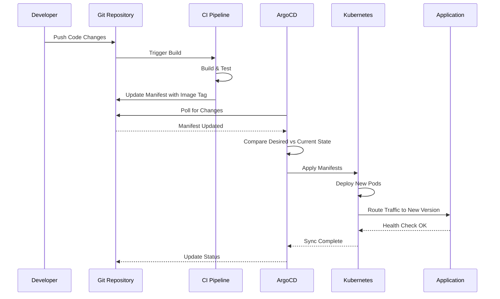
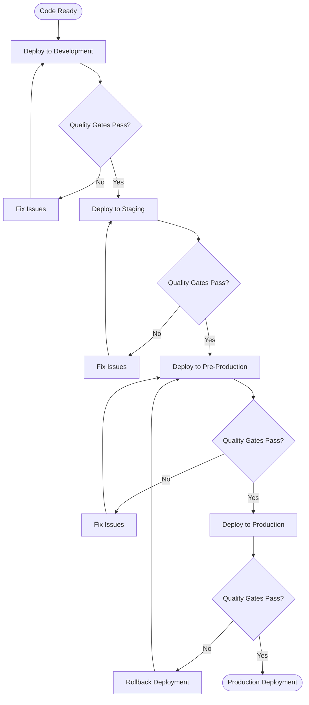

# CI/CD: Architecture

## Contents

- [Pipeline Architecture](#pipeline-architecture)
- [Build Strategies](#build-strategies)
- [Deployment Strategies](#deployment-strategies)
- [Branching Strategies](#branching-strategies)
- [Quality Gates](#quality-gates)
- [Artifact Management](#artifact-management)

## Pipeline Architecture

### CI Pipeline Stages

```mermaid
flowchart LR
    Start([Code Commit]) --> Checkout[Checkout Source Code]
    Checkout --> Install[Install Dependencies]
    Install --> Lint[Lint & Format Check]
    Lint --> Compile[Compile Source Code]
    Compile --> UnitTest[Run Unit Tests]
    UnitTest --> IntTest[Run Integration Tests]
    IntTest --> Security[Security Scanning]
    Security --> BuildArtifact[Build Artifact]
    BuildArtifact --> Publish[Publish Artifact]
    Publish --> DeployStaging[Deploy to Staging]
    DeployStaging --> SmokeTest[Smoke Tests]
    SmokeTest --> DeployProd[Deploy to Production]
    DeployProd --> HealthCheck[Health Checks]
    HealthCheck --> Monitor[Monitor & Alert]
    Monitor --> End([Deployment Complete])
    
    Lint -.->|Fail| Stop([Pipeline Stopped])
    UnitTest -.->|Fail| Stop
    IntTest -.->|Fail| Stop
    Security -.->|Critical| Stop
    SmokeTest -.->|Fail| Stop
    HealthCheck -.->|Fail| Rollback([Rollback])
```

A well-structured CI pipeline follows a logical sequence of stages, each building upon the previous stage's success. The pipeline begins with checkout, retrieving the source code from version control. This stage should be fast and reliable, using shallow clones when possible to reduce checkout time.

Dependency installation follows checkout. For backend services using Gradle, this involves downloading dependencies and populating the build cache. For frontend applications using npm, this involves installing node_modules. Both should leverage caching strategies to avoid redundant downloads. Gradle's dependency cache and npm's package cache can dramatically reduce installation time when properly configured.

Linting and formatting checks run early in the pipeline to provide fast feedback. These checks validate code style, identify potential bugs, and enforce consistency. ESLint for JavaScript/TypeScript, Detekt or ktlint for Kotlin, and similar tools catch issues that would otherwise require code review time. These checks should fail fast—if code doesn't meet style standards, there's no point running expensive compilation or test stages.

Compilation transforms source code into executable artifacts. For Gradle-based projects, this involves compiling Java or Kotlin source files, processing resources, and assembling JAR files. For frontend projects using Vite, this involves bundling JavaScript, processing CSS, and optimizing assets. Compilation should leverage incremental builds and build caches to avoid recompiling unchanged code.

Unit tests execute next, providing fast feedback on code correctness. These tests should run in parallel when possible, using JUnit's parallel execution for Java/Kotlin tests or Vitest's worker threads for frontend tests. Unit tests should be isolated, fast, and deterministic. They form the foundation of the testing pyramid and catch the majority of bugs.

Integration tests follow unit tests, validating interactions between components. These tests may involve databases, message queues, or external services. They run more slowly than unit tests but provide higher confidence. Integration tests should use test containers or mocked services to maintain isolation and determinism.

Security scanning occurs before artifact creation. Static Application Security Testing (SAST) tools like SonarQube analyze source code for vulnerabilities. Dependency scanning tools like Dependabot or OWASP Dependency-Check identify known vulnerabilities in dependencies. Secret scanning tools detect accidentally committed credentials. These scans should block merges on critical findings while allowing lower-severity issues to be tracked.

Artifact building creates deployable outputs. For backend services, this may involve creating a JAR file or building a Docker container image. For frontend applications, this involves creating optimized production bundles. Artifacts should be tagged with version identifiers—typically git SHA for traceability and semantic versions for releases.

Publishing stores artifacts in repositories for later retrieval. Container images go to container registries like ECR, GCR, or Docker Hub. JAR files may go to Maven repositories or artifact stores. Frontend bundles may be published to CDNs or storage buckets. Publishing should only occur after all quality gates pass.

### CD Pipeline Stages

Continuous Deployment pipelines take validated artifacts and deploy them to environments. The pipeline begins with deployment to staging, a production-like environment used for final validation. Staging deployments should use the same deployment mechanisms as production to catch environment-specific issues.

Smoke tests run immediately after staging deployment to verify basic functionality. These tests check critical paths: health endpoints respond correctly, authentication works, primary user flows complete successfully. Smoke tests should complete quickly—within minutes—to provide rapid feedback on deployment success.

Production deployment follows successful smoke tests. The deployment strategy—rolling, blue-green, or canary—depends on risk tolerance and infrastructure capabilities. Production deployments should be automated but may include manual approval gates for high-risk changes or during business-critical periods.

Health checks run after production deployment to verify service availability. These checks monitor application health endpoints, database connectivity, and external service availability. Health checks should run continuously during and after deployment to detect issues early.

Monitoring and alerting provide ongoing visibility into deployment success. Metrics, logs, and traces help teams understand how the new deployment performs compared to previous versions. Anomaly detection can automatically trigger alerts or rollbacks if key metrics deviate from expected patterns.

### Pipeline-as-Code

Modern CI/CD practices treat pipeline definitions as code. GitHub Actions workflows live in `.github/workflows/` directories, version controlled alongside application code. This approach provides several advantages: pipelines are reviewable through pull requests, auditable through git history, and testable through local execution tools.

Pipeline-as-code enables teams to apply software engineering practices to infrastructure. Code review catches configuration errors before they affect the pipeline. Version control provides a history of changes and the ability to roll back problematic updates. Testing ensures that pipeline changes work correctly before they're merged.

Reusability becomes possible through shared workflows and composite actions. Common patterns—building a Docker image, running security scans, deploying to Kubernetes—can be encapsulated in reusable components. This reduces duplication, ensures consistency, and makes it easier to adopt best practices across multiple projects.

### Parallel Execution

Independent pipeline stages should run in parallel to minimize total pipeline duration. Linting, unit tests, and security scans can often run simultaneously since they don't depend on each other. Only stages with dependencies should run sequentially.

Parallel execution requires careful consideration of resource constraints. CI runners have limited CPU and memory. Running too many parallel jobs can cause resource contention and actually slow down execution. Finding the optimal parallelism requires experimentation and monitoring.

Test parallelization deserves special attention. Large test suites can be split across multiple runners using sharding strategies. JUnit 5 supports parallel test execution within a single JVM. Playwright supports test sharding across multiple workers. Vitest uses worker threads to parallelize test execution. These strategies can reduce test execution time from hours to minutes.

### Caching Strategies

Effective caching dramatically reduces pipeline duration. Dependency caches store downloaded packages between pipeline runs. Gradle's build cache stores compiled classes and test results. Docker layer caches store image layers that haven't changed. npm caches node_modules between installs.

Cache keys must be carefully designed to balance hit rate with correctness. Caches should invalidate when dependencies change, which typically means including dependency lockfile hashes in cache keys. For Gradle, this means including `gradle.lockfile` in the cache key. For npm, this means including `package-lock.json` in the cache key.

Cache poisoning—corrupted or stale caches causing build failures—can be mitigated by providing cache busting mechanisms. Teams should be able to clear caches when mysterious failures occur. However, cache poisoning should be rare if cache keys properly reflect dependency changes.

Test container caches deserve special mention. Test containers often pull base images on first use, which can be slow. Caching these images in the CI environment prevents repeated downloads. Similarly, database migration containers can be cached to speed up integration test setup.

## Build Strategies

### Gradle Build Optimization

Gradle builds for backend services should leverage several optimization strategies. The build cache stores task outputs between builds, allowing Gradle to skip tasks when inputs haven't changed. The configuration cache stores the task graph, dramatically reducing configuration time for large projects.

Incremental compilation only recompiles changed source files and their dependencies. This requires proper task dependency declarations—tasks must declare their inputs and outputs so Gradle can determine what needs to run. Well-structured builds can reduce compilation time from minutes to seconds for incremental changes.

Parallel execution runs independent tasks simultaneously, utilizing available CPU cores. Gradle automatically determines task dependencies and parallelizes where safe. The `--parallel` flag enables this optimization, which is particularly effective for projects with multiple modules.

The Gradle wrapper ensures consistent Gradle versions across developers and CI environments. The wrapper script checks for the correct Gradle version and downloads it if necessary, eliminating version mismatch issues. The wrapper should be committed to version control.

Dependency locking prevents dependency resolution changes between builds. The `gradle.lockfile` records exact dependency versions, ensuring that `./gradlew build` produces identical results across environments. This is critical for reproducible builds and should be committed to version control.

### Frontend Build Optimization

Vite and npm-based frontend builds require different optimization strategies. `npm ci` should be used instead of `npm install` in CI environments. The `ci` command installs dependencies directly from `package-lock.json` without modifying it, ensuring reproducible installs. It also removes `node_modules` before installing, preventing inconsistencies from previous installs.

Bundle analysis helps identify optimization opportunities. Tools like `webpack-bundle-analyzer` or Vite's built-in analysis visualize bundle composition, highlighting large dependencies or duplicate code. Performance budgets enforce size limits, failing builds when bundles exceed thresholds.

Production builds should enable all optimizations: minification, tree-shaking, code splitting. Source maps should be generated for debugging but excluded from production bundles. Asset optimization—image compression, font subsetting—should be automated in the build process.

### Docker Multi-Stage Builds

Docker multi-stage builds separate build-time dependencies from runtime requirements. A build stage contains the full SDK—Gradle, npm, compilers—needed to create artifacts. A runtime stage contains only the JRE or nginx needed to run the application.

This separation creates smaller images, reducing pull times and storage costs. Smaller images also have a reduced attack surface—fewer packages mean fewer potential vulnerabilities. The build stage can include development tools and debuggers that shouldn't be present in production.

Layer ordering affects cache efficiency. Dependencies change less frequently than application code, so dependency installation should happen before copying source code. This allows Docker to reuse cached layers when only source code changes. The `.dockerignore` file prevents unnecessary files from being included in the build context, reducing context size and build time.

Runtime images should run as non-root users for security. The Dockerfile should create a dedicated user and switch to it before running the application. This follows the principle of least privilege and reduces the impact of potential container escapes.

### Container Image Tagging

Container images must be tagged consistently for traceability and deployment management. Git SHA tags provide immutable identifiers that link images to specific commits. Every successful build should tag images with the commit SHA, enabling precise rollbacks and audit trails.

Semantic version tags support release management. Images built from release branches or tags should receive version tags like `v1.2.3`. These tags enable teams to track which version is deployed in each environment and communicate clearly about releases.

The `:latest` tag should never be used in production. It's ambiguous—which commit does `latest` refer to? It's mutable—the same tag can point to different images over time. Production deployments should use explicit SHA or version tags that provide clear traceability.

## Deployment Strategies

### Rolling Deployment

Rolling deployments gradually replace old instances with new ones, maintaining service availability throughout the process. Kubernetes supports rolling deployments natively, gradually updating pods while ensuring a minimum number remain available.

The rolling strategy provides zero downtime and efficient resource usage—only one version runs at a time. However, it creates a period where mixed versions coexist. Applications must handle this gracefully, typically through backward-compatible APIs and database schemas.

Rolling deployments work well when new versions are backward compatible and rollback is straightforward. They're less suitable when versions have breaking changes or when instant rollback is required.

### Blue-Green Deployment

Blue-green deployments maintain two identical production environments. The blue environment runs the current version, while the green environment runs the new version. Once green is validated, traffic switches from blue to green instantly. If issues occur, traffic switches back to blue.

This strategy provides instant rollback and eliminates version mixing. However, it requires double infrastructure during deployment, increasing cost. It also requires careful state management—databases and caches must be compatible with both versions during the transition.

Blue-green deployments excel when rollback speed is critical or when versions have breaking changes. They're commonly used for database migrations or major version upgrades where backward compatibility isn't possible.

### Canary Deployment

Canary deployments route a small percentage of traffic to the new version while monitoring for errors and performance degradation. If metrics remain healthy, traffic gradually shifts to the new version. If SLO violations occur, traffic automatically reverts to the old version.

This strategy provides risk mitigation through gradual rollout and automatic rollback. It requires sophisticated traffic routing and monitoring capabilities. Canary deployments work best when applications expose rich metrics and have well-defined SLOs.

Canary deployments are ideal for high-risk changes or when validating performance characteristics. They enable data-driven deployment decisions based on real production traffic rather than staging environment simulations.

### Feature Flags

Feature flags decouple deployment from release, enabling trunk-based development practices. Code deploys to production disabled behind a flag, then enables gradually for specific users, percentages, or conditions. This allows incomplete features to merge to main without affecting users.

Feature flags require flag management infrastructure—storage, evaluation logic, and administration interfaces. They add complexity to code—every feature-flagged code path must handle both enabled and disabled states. However, they enable practices that would otherwise be impossible.

Feature flags support A/B testing, gradual rollouts, and emergency kill switches. They enable teams to deploy frequently while controlling feature exposure. See the feature-toggles facet for comprehensive coverage.

## Branching Strategies

### Trunk-Based Development

Trunk-based development keeps the main branch always deployable. Feature branches are short-lived—ideally less than one day—and merge to main frequently. Incomplete work hides behind feature flags, allowing merges without user impact.

This strategy minimizes merge conflicts, enables continuous integration, and supports high deployment frequency. It requires discipline—developers must keep branches short and use feature flags for incomplete work. It also requires robust CI/CD pipelines since main is deployed frequently.

Trunk-based development is recommended for high-performing teams seeking maximum velocity. It works best with comprehensive test coverage, feature flags, and automated deployment pipelines.

### GitHub Flow

GitHub Flow uses feature branches for all changes. Developers create branches from main, make changes, open pull requests, and merge after review. Main is always deployable, and deployments happen from main.

This strategy is simple and widely understood. It provides clear code review processes and maintains main branch stability. However, it can accumulate merge conflicts if branches live too long, and it doesn't explicitly support release management.

GitHub Flow works well for teams that want simplicity and have good CI/CD automation. It's suitable for SaaS applications with continuous deployment.

### GitFlow

GitFlow introduces multiple branch types: develop for integration, feature branches for new work, release branches for preparing releases, and hotfix branches for production fixes. This creates a more complex workflow with explicit release management.

This strategy supports formal release cycles and version management. However, it creates long-lived branches that accumulate conflicts and delay integration. The complexity can slow down delivery and reduce deployment frequency.

GitFlow is generally avoided for SaaS applications with continuous deployment. It may be suitable for products with formal release cycles or regulatory requirements, but even then, simpler strategies are often preferable.

## Quality Gates

Quality gates are automated checks that must pass before code merges or deploys. They enforce standards consistently, preventing human error and ensuring that only validated code reaches production.

Automated tests form the foundation of quality gates. Unit tests, integration tests, and end-to-end tests must pass before merge. Test coverage thresholds ensure that new code is tested. Coverage should be measured incrementally—require that coverage doesn't decrease rather than mandating an absolute threshold on day one.

Linting and formatting checks enforce code style and catch potential bugs. These checks should run early in the pipeline to provide fast feedback. They should be automatically fixable when possible—tools like Prettier or ktlint can auto-format code, reducing developer friction.

Security scans identify vulnerabilities before they reach production. SAST tools analyze source code, dependency scanners check for known vulnerabilities, and secret scanners detect accidentally committed credentials. Critical findings should block merges, while lower-severity issues can be tracked and addressed over time.

Code coverage thresholds ensure adequate testing, but thresholds should be set realistically. Requiring 80% coverage on day one may be unrealistic and counterproductive. Instead, require that coverage doesn't decrease—this ratchets quality upward over time without blocking current work.

Bundle size budgets prevent frontend bundles from growing unbounded. Performance budgets fail builds when bundles exceed size or load time thresholds. These budgets should be set based on real performance requirements and updated as applications evolve.

Branch protection rules enforce quality gates at the repository level. They require that status checks pass before merge, prevent force pushes to main, and require pull request reviews. These rules prevent bypassing quality gates and ensure that all changes go through proper review.

## Artifact Management

### Container Images

Container images should be pushed to registries after successful CI builds. Images must be tagged with identifiers that enable traceability—git SHA for every build, semantic versions for releases. Images should be scanned for vulnerabilities before pushing, with critical vulnerabilities blocking the push.

Image retention policies prevent registry bloat while maintaining necessary history. Development builds may be retained for shorter periods than release builds. Tagged releases should be retained longer to support rollbacks and audits.

### Build Artifacts

Gradle builds produce JAR files that may be published to Maven repositories or artifact stores. These artifacts should be versioned consistently and linked to source code commits. Frontend builds produce bundles that may be published to CDNs or storage buckets.

Artifact repositories provide versioning, access control, and retention policies. They enable teams to retrieve specific versions for deployment and maintain a history of releases.

### Deployment Manifests

Kubernetes deployments require YAML manifests or Helm charts that define desired state. These manifests should be version controlled and reviewed like application code. Environment-specific configuration should come from values files or ConfigMaps, not hardcoded in manifests.

Kustomize provides an alternative to Helm for managing Kubernetes configurations. It uses overlays to customize base configurations for different environments. Both approaches enable infrastructure-as-code practices and ensure that deployment configurations are auditable and reviewable.
