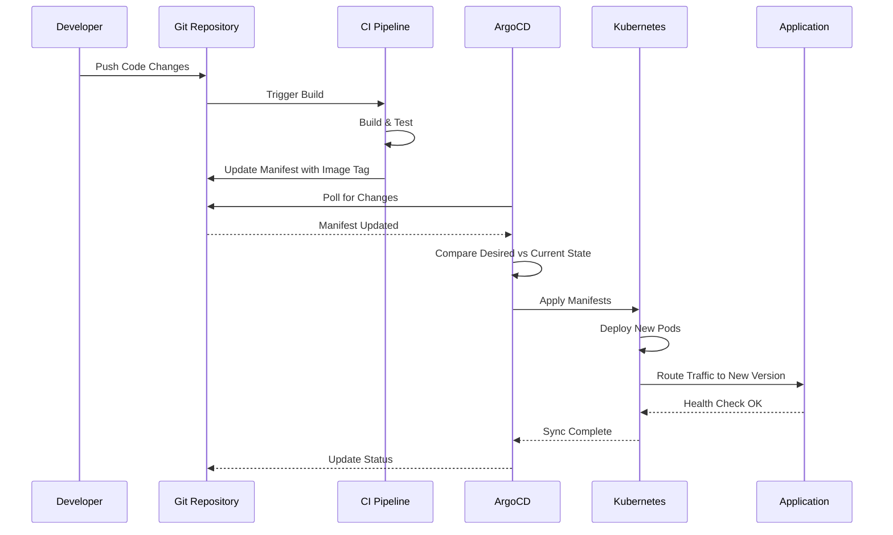

# CI/CD: Architecture

## Contents

- [Pipeline Architecture](#pipeline-architecture)
- [Build Strategies](#build-strategies)
- [Deployment Strategies](#deployment-strategies)
- [Branching Strategies](#branching-strategies)
- [Quality Gates](#quality-gates)
- [Artifact Management](#artifact-management)

## Pipeline Architecture

### CI Pipeline Stages


A well-structured CI pipeline follows a logical sequence of stages, each building upon the previous stage's success. The pipeline begins with checkout, retrieving the source code from version control. This stage should be fast and reliable, using shallow clones when possible to reduce checkout time.

Dependency installation follows checkout. For backend services using Gradle, this involves downloading dependencies and populating the build cache. For frontend applications using npm, this involves installing node_modules. Both should leverage caching strategies to avoid redundant downloads. Gradle's dependency cache and npm's package cache can dramatically reduce installation time when properly configured.

Linting and formatting checks run early in the pipeline to provide fast feedback. These checks validate code style, identify potential bugs, and enforce consistency. ESLint for JavaScript/TypeScript, Detekt or ktlint for Kotlin, and similar tools catch issues that would otherwise require code review time. These checks should fail fast—if code doesn't meet style standards, there's no point running expensive compilation or test stages.

Compilation transforms source code into executable artifacts. For Gradle-based projects, this involves compiling Java or Kotlin source files, processing resources, and assembling JAR files. For frontend projects using Vite, this involves bundling JavaScript, processing CSS, and optimizing assets. Compilation should leverage incremental builds and build caches to avoid recompiling unchanged code.

Unit tests execute next, providing fast feedback on code correctness. These tests should run in parallel when possible, using JUnit's parallel execution for Java/Kotlin tests or Vitest's worker threads for frontend tests. Unit tests should be isolated, fast, and deterministic. They form the foundation of the testing pyramid and catch the majority of bugs.

Integration tests follow unit tests, validating interactions between components. These tests may involve databases, message queues, or external services. They run more slowly than unit tests but provide higher confidence. Integration tests should use test containers or mocked services to maintain isolation and determinism.

Security scanning occurs before artifact creation. Static Application Security Testing (SAST) tools like SonarQube analyze source code for vulnerabilities. Dependency scanning tools like Dependabot or OWASP Dependency-Check identify known vulnerabilities in dependencies. Secret scanning tools detect accidentally committed credentials. These scans should block merges on critical findings while allowing lower-severity issues to be tracked.

Artifact building creates deployable outputs. For backend services, this may involve creating a JAR file or building a Docker container image. For frontend applications, this involves creating optimized production bundles. Artifacts should be tagged with version identifiers—typically git SHA for traceability and semantic versions for releases.

Publishing stores artifacts in repositories for later retrieval. Container images go to container registries like ECR, GCR, or Docker Hub. JAR files may go to Maven repositories or artifact stores. Frontend bundles may be published to CDNs or storage buckets. Publishing should only occur after all quality gates pass.

### CD Pipeline Stages

Continuous Deployment pipelines take validated artifacts and deploy them to environments. The pipeline begins with deployment to staging, a production-like environment used for final validation. Staging deployments should use the same deployment mechanisms as production to catch environment-specific issues.

Smoke tests run immediately after staging deployment to verify basic functionality. These tests check critical paths: health endpoints respond correctly, authentication works, primary user flows complete successfully. Smoke tests should complete quickly—within minutes—to provide rapid feedback on deployment success.

Production deployment follows successful smoke tests. The deployment strategy—rolling, blue-green, or canary—depends on risk tolerance and infrastructure capabilities. Production deployments should be automated but may include manual approval gates for high-risk changes or during business-critical periods.

Health checks run after production deployment to verify service availability. These checks monitor application health endpoints, database connectivity, and external service availability. Health checks should run continuously during and after deployment to detect issues early.

Monitoring and alerting provide ongoing visibility into deployment success. Metrics, logs, and traces help teams understand how the new deployment performs compared to previous versions. Anomaly detection can automatically trigger alerts or rollbacks if key metrics deviate from expected patterns.

### Environment Management

Environments serve different purposes in the software delivery lifecycle. Understanding each environment's role helps teams design effective deployment pipelines and quality gates.

**Development Environment**:
- **Purpose**: Developer workspace for active development and testing
- **Characteristics**: 
  - May have incomplete features (feature flags hide incomplete work)
  - May use mock services or simplified dependencies
  - Data may be synthetic or reset frequently
  - Performance characteristics may differ from production
- **Deployment Frequency**: Multiple times per day as developers push changes
- **Quality Gates**: Minimal—linting, compilation, unit tests
- **Stability**: Lower stability acceptable—developers expect some instability
- **Why It Exists**: Provides isolated environment for development without affecting other environments

**Staging Environment**:
- **Purpose**: Production-like environment for integration testing and final validation
- **Characteristics**:
  - Mirrors production configuration as closely as possible
  - Uses production-like data volumes and patterns
  - Includes all services and dependencies
  - Performance characteristics should match production
- **Deployment Frequency**: After successful development validation, before production
- **Quality Gates**: Comprehensive—all tests, security scans, performance checks
- **Stability**: High stability required—represents production readiness
- **Why It Exists**: Catches environment-specific issues before production. Validates that what works in development also works in production-like conditions.

**Pre-Production Environment**:
- **Purpose**: Final validation environment with production-like data and traffic patterns
- **Characteristics**:
  - Identical to production configuration
  - May use production data copies (sanitized)
  - Traffic patterns simulate production load
  - All production integrations active
- **Deployment Frequency**: Before production deployment, after staging validation
- **Quality Gates**: Production-level gates—zero critical vulnerabilities, SLO compliance
- **Stability**: Highest stability—must match production behavior exactly
- **Why It Exists**: Final confidence check before production. Some organizations skip this if staging is sufficiently production-like, but it provides an additional safety net.

**Production Environment**:
- **Purpose**: Live environment serving real users and business operations
- **Characteristics**:
  - Real user data and traffic
  - Production integrations and dependencies
  - Highest availability and performance requirements
  - Monitoring and alerting fully active
- **Deployment Frequency**: After successful pre-production validation
- **Quality Gates**: All gates plus post-deployment health checks and SLO monitoring
- **Stability**: Critical—downtime or errors affect real users and business
- **Why It Exists**: Delivers value to users. All other environments exist to ensure production deployments succeed.

**Environment Progression Strategy**:

Code should progress through environments sequentially: Development → Staging → Pre-Production → Production. Each environment validates different aspects:

1. **Development**: Validates code correctness and basic functionality
2. **Staging**: Validates integration and production-like behavior
3. **Pre-Production**: Validates production readiness and final checks
4. **Production**: Delivers value to users

**Why Sequential Progression Matters**: Each environment catches different types of issues. Development catches code bugs. Staging catches integration issues. Pre-production catches production-specific issues. Skipping environments increases risk of production incidents.

**Environment-Specific Configuration**:

Configuration must vary by environment while maintaining consistency in deployment mechanisms.

**Configuration Sources**:
- **Environment Variables**: Set per environment (API endpoints, feature flags)
- **ConfigMaps/Secrets**: Kubernetes ConfigMaps and Secrets for environment-specific config
- **Values Files**: Helm values files per environment (`values-dev.yaml`, `values-prod.yaml`)
- **External Configuration**: Configuration services or databases per environment

**Configuration Management Principles**:
- **Same Deployment Mechanism**: Use same deployment process across environments (same Helm charts, same Terraform)
- **Environment-Specific Values**: Only configuration values differ, not deployment process
- **No Hardcoded Environment Logic**: Code shouldn't contain `if (env === 'prod')` logic—use configuration instead
- **Secrets Management**: Use proper secrets management (Vault, AWS Secrets Manager) not hardcoded secrets

**Environment Promotion vs. Rebuild**:

**Promotion Strategy**: Build artifact once, promote through environments. Same artifact tested in staging is deployed to production. **Pros**: Ensures what's tested is what's deployed. **Cons**: Requires all environments to be compatible with same artifact.

**Rebuild Strategy**: Rebuild artifact for each environment with environment-specific configuration. **Pros**: Allows environment-specific optimizations. **Cons**: Risk that production artifact differs from tested artifact.

**Recommendation**: Use promotion strategy (immutable artifacts) to ensure consistency. Configuration differences come from environment variables or values files, not rebuilds.

### Pipeline-as-Code

Modern CI/CD practices treat pipeline definitions as code. GitHub Actions workflows live in `.github/workflows/` directories, version controlled alongside application code. This approach provides several advantages: pipelines are reviewable through pull requests, auditable through git history, and testable through local execution tools.

**Why Pipeline-as-Code Matters**: Manual pipeline configuration through web UIs creates several problems: configuration isn't version controlled, changes aren't reviewable, and pipelines can't be tested before deployment. Pipeline-as-code solves these problems by applying software engineering practices to infrastructure.

**Benefits of Pipeline-as-Code**:

1. **Version Control**: Pipeline changes are tracked in git, providing history and rollback capability
2. **Code Review**: Pipeline changes go through pull requests, catching errors before they affect CI
3. **Testing**: Pipelines can be tested locally or in staging before production use
4. **Reusability**: Common patterns can be extracted into reusable workflows or actions
5. **Consistency**: Standardized pipeline patterns ensure consistent practices across projects
6. **Documentation**: Pipeline code serves as executable documentation of deployment processes

**Versioning Pipeline Definitions**:

Pipeline definitions should be versioned alongside application code. This ensures that pipeline changes are tested with code changes and that historical pipelines can be reproduced.

**Tagging Strategy**: Tag pipeline definitions with application versions or use semantic versioning for pipeline definitions themselves. This enables rolling back to previous pipeline versions if needed.

**Breaking Changes**: Pipeline changes that break compatibility should be versioned. For example, a workflow that changes required inputs should use a new version tag to avoid breaking existing usages.

Pipeline-as-code enables teams to apply software engineering practices to infrastructure. Code review catches configuration errors before they affect the pipeline. Version control provides a history of changes and the ability to roll back problematic updates. Testing ensures that pipeline changes work correctly before they're merged.



Reusability becomes possible through shared workflows and composite actions. Common patterns—building a Docker image, running security scans, deploying to Kubernetes—can be encapsulated in reusable components. This reduces duplication, ensures consistency, and makes it easier to adopt best practices across multiple projects.

**Reusable Workflows Example** (GitHub Actions):
```yaml
# .github/workflows/build-and-test.yml (reusable workflow)
name: Build and Test

on:
  workflow_call:
    inputs:
      service-path:
        required: true
        type: string

jobs:
  test:
    runs-on: ubuntu-latest
    steps:
      - uses: actions/checkout@v4
      - name: Run tests
        working-directory: ${{ inputs.service-path }}
        run: ./gradlew test

# Usage in service-specific workflow
name: Auth Service CI

on: [push, pull_request]

jobs:
  build-test:
    uses: ./.github/workflows/build-and-test.yml
    with:
      service-path: services/auth
```

### Parallel Execution

Independent pipeline stages should run in parallel to minimize total pipeline duration. Linting, unit tests, and security scans can often run simultaneously since they don't depend on each other. Only stages with dependencies should run sequentially.

Parallel execution requires careful consideration of resource constraints. CI runners have limited CPU and memory. Running too many parallel jobs can cause resource contention and actually slow down execution. Finding the optimal parallelism requires experimentation and monitoring.

Test parallelization deserves special attention. Large test suites can be split across multiple runners using sharding strategies. JUnit 5 supports parallel test execution within a single JVM. Playwright supports test sharding across multiple workers. Vitest uses worker threads to parallelize test execution. These strategies can reduce test execution time from hours to minutes.

### Monorepo CI Considerations

Monorepos—repositories containing multiple projects or services—require specialized CI strategies to avoid running unnecessary work and to optimize build times.

**Why Monorepo CI Differs**: In a monorepo, a change to one service shouldn't trigger builds and tests for unrelated services. Naive CI approaches rebuild everything on every change, wasting resources and slowing feedback. Effective monorepo CI only runs work for affected services.

**Affected Target Detection**:

Detecting which services are affected by a change requires understanding dependencies between services and which files changed.

**File-Based Detection**: 
- Identify changed files in a commit/PR
- Map files to services (e.g., `services/auth/**` → auth service)
- Run CI for affected services only
- **Pros**: Simple, works for most cases
- **Cons**: May miss transitive dependencies, requires explicit file-to-service mapping

**Dependency Graph Detection**:
- Build dependency graph of services (service A depends on service B)
- Identify changed services from file changes
- Include dependent services (if A changes, B may need retesting)
- **Pros**: Handles dependencies correctly, more accurate
- **Cons**: Requires maintaining dependency graph, more complex

**Tooling for Affected Detection**:
- **Nx**: Provides affected command (`nx affected:test`) that detects changed projects
- **Turborepo**: Caches builds and only runs affected tasks
- **Lerna**: Can detect changed packages
- **Custom Scripts**: Git-based detection using `git diff` to identify changed paths

**Example: Affected Service Detection**:
```yaml
# GitHub Actions workflow for monorepo
jobs:
  detect-changes:
    runs-on: ubuntu-latest
    outputs:
      auth: ${{ steps.changes.outputs.auth }}
      billing: ${{ steps.changes.outputs.billing }}
      frontend: ${{ steps.changes.outputs.frontend }}
    steps:
      - uses: actions/checkout@v4
      - uses: dorny/paths-filter@v2
        id: changes
        with:
          filters: |
            auth:
              - 'services/auth/**'
            billing:
              - 'services/billing/**'
            frontend:
              - 'apps/frontend/**'
              - 'packages/ui/**'  # Frontend depends on UI package

  test-auth:
    needs: detect-changes
    if: needs.detect-changes.outputs.auth == 'true'
    runs-on: ubuntu-latest
    steps:
      - uses: actions/checkout@v4
      - name: Test auth service
        run: cd services/auth && ./gradlew test

  test-billing:
    needs: detect-changes
    if: needs.detect-changes.outputs.billing == 'true'
    runs-on: ubuntu-latest
    steps:
      - uses: actions/checkout@v4
      - name: Test billing service
        run: cd services/billing && ./gradlew test
```

**Caching Strategies for Monorepos**:

Monorepo CI benefits significantly from intelligent caching. Services that haven't changed can reuse cached build outputs.

**Service-Level Caching**:
- Cache build outputs per service (e.g., `services/auth/build/`)
- Cache key includes service code hash and dependency versions
- Only rebuild services whose code or dependencies changed
- **Benefit**: Unchanged services skip builds entirely

**Dependency Caching**:
- Cache dependencies per service (e.g., `services/auth/.gradle/`)
- Cache key includes dependency lockfile hash
- Share dependency caches across services when possible
- **Benefit**: Faster dependency resolution for unchanged services

**Docker Layer Caching**:
- Cache Docker image layers per service
- Reuse layers when service code hasn't changed
- **Benefit**: Faster container image builds

**Example: Monorepo Caching**:
```yaml
# Cache Gradle dependencies per service
- name: Cache Gradle dependencies
  uses: actions/cache@v3
  with:
    path: services/auth/.gradle
    key: gradle-auth-${{ hashFiles('services/auth/gradle.lockfile') }}
    restore-keys: |
      gradle-auth-

# Cache build outputs
- name: Cache build outputs
  uses: actions/cache@v3
  with:
    path: services/auth/build
    key: build-auth-${{ hashFiles('services/auth/**/*.kt', 'services/auth/**/*.java') }}
    restore-keys: |
      build-auth-
```

**Parallelism in Monorepos**:

Monorepos enable greater parallelism since services are independent. Run tests and builds for multiple services simultaneously.

**Service Parallelism**:
- Run CI for each affected service in parallel
- Each service runs its own test suite independently
- **Benefit**: Total CI time equals slowest service, not sum of all services

**Cross-Service Testing**:
- Some tests may require multiple services running
- Use test containers or local service orchestration
- Run integration tests after all service tests pass
- **Benefit**: Fast feedback on service-level issues, comprehensive integration validation

**Resource Management**:
- Monorepo CI can consume many runners simultaneously
- Use runner pools or auto-scaling to handle peak loads
- Consider cost implications of high parallelism
- **Benefit**: Fast CI without manual runner management

**Common Monorepo CI Patterns**:

**Pattern 1: Affected Services Only**:
- Detect changed services
- Run CI only for affected services
- **Use When**: Services are independent, changes are isolated
- **Trade-off**: May miss integration issues if dependencies aren't tested

**Pattern 2: Affected + Dependents**:
- Detect changed services
- Include services that depend on changed services
- **Use When**: Services have dependencies, want to catch integration issues
- **Trade-off**: More CI work, but catches dependency-related issues

**Pattern 3: Always Test Shared Code**:
- Always test shared packages/libraries
- Only test services when they or shared code changes
- **Use When**: Shared code changes affect many services
- **Trade-off**: Shared code changes trigger more CI, but ensures compatibility

**Pattern 4: Scheduled Full Test Suite**:
- Run affected-only CI on PRs
- Run full test suite nightly or weekly
- **Use When**: Want fast PR feedback but comprehensive coverage periodically
- **Trade-off**: Balance between speed and coverage

**Monorepo CI Best Practices**:

1. **Maintain Dependency Graph**: Keep service dependencies documented and up-to-date for accurate affected detection
2. **Optimize Cache Keys**: Use stable cache keys (lockfile hashes) that invalidate when dependencies change
3. **Parallelize Aggressively**: Run independent services in parallel to minimize total CI time
4. **Test Integration Separately**: Run cross-service integration tests after service tests pass
5. **Monitor CI Costs**: High parallelism increases CI costs—monitor and optimize based on actual needs
6. **Document CI Strategy**: Make CI behavior clear to developers (which services run, when, why)

### Caching Strategies

Effective caching dramatically reduces pipeline duration. Dependency caches store downloaded packages between pipeline runs. Gradle's build cache stores compiled classes and test results. Docker layer caches store image layers that haven't changed. npm caches node_modules between installs.

Cache keys must be carefully designed to balance hit rate with correctness. Caches should invalidate when dependencies change, which typically means including dependency lockfile hashes in cache keys. For Gradle, this means including `gradle.lockfile` in the cache key. For npm, this means including `package-lock.json` in the cache key.

Cache poisoning—corrupted or stale caches causing build failures—can be mitigated by providing cache busting mechanisms. Teams should be able to clear caches when mysterious failures occur. However, cache poisoning should be rare if cache keys properly reflect dependency changes.

Test container caches deserve special mention. Test containers often pull base images on first use, which can be slow. Caching these images in the CI environment prevents repeated downloads. Similarly, database migration containers can be cached to speed up integration test setup.

## Build Strategies

### Gradle Build Optimization

Gradle builds for backend services should leverage several optimization strategies. The build cache stores task outputs between builds, allowing Gradle to skip tasks when inputs haven't changed. The configuration cache stores the task graph, dramatically reducing configuration time for large projects.

Incremental compilation only recompiles changed source files and their dependencies. This requires proper task dependency declarations—tasks must declare their inputs and outputs so Gradle can determine what needs to run. Well-structured builds can reduce compilation time from minutes to seconds for incremental changes.

Parallel execution runs independent tasks simultaneously, utilizing available CPU cores. Gradle automatically determines task dependencies and parallelizes where safe. The `--parallel` flag enables this optimization, which is particularly effective for projects with multiple modules.

The Gradle wrapper ensures consistent Gradle versions across developers and CI environments. The wrapper script checks for the correct Gradle version and downloads it if necessary, eliminating version mismatch issues. The wrapper should be committed to version control.

Dependency locking prevents dependency resolution changes between builds. The `gradle.lockfile` records exact dependency versions, ensuring that `./gradlew build` produces identical results across environments. This is critical for reproducible builds and should be committed to version control.

### Frontend Build Optimization

Vite and npm-based frontend builds require different optimization strategies. `npm ci` should be used instead of `npm install` in CI environments. The `ci` command installs dependencies directly from `package-lock.json` without modifying it, ensuring reproducible installs. It also removes `node_modules` before installing, preventing inconsistencies from previous installs.

Bundle analysis helps identify optimization opportunities. Tools like `webpack-bundle-analyzer` or Vite's built-in analysis visualize bundle composition, highlighting large dependencies or duplicate code. Performance budgets enforce size limits, failing builds when bundles exceed thresholds.

Production builds should enable all optimizations: minification, tree-shaking, code splitting. Source maps should be generated for debugging but excluded from production bundles. Asset optimization—image compression, font subsetting—should be automated in the build process.

### Docker Multi-Stage Builds

Docker multi-stage builds separate build-time dependencies from runtime requirements. A build stage contains the full SDK—Gradle, npm, compilers—needed to create artifacts. A runtime stage contains only the JRE or nginx needed to run the application.

This separation creates smaller images, reducing pull times and storage costs. Smaller images also have a reduced attack surface—fewer packages mean fewer potential vulnerabilities. The build stage can include development tools and debuggers that shouldn't be present in production.

Layer ordering affects cache efficiency. Dependencies change less frequently than application code, so dependency installation should happen before copying source code. This allows Docker to reuse cached layers when only source code changes. The `.dockerignore` file prevents unnecessary files from being included in the build context, reducing context size and build time.

Runtime images should run as non-root users for security. The Dockerfile should create a dedicated user and switch to it before running the application. This follows the principle of least privilege and reduces the impact of potential container escapes.

### Container Image Tagging

Container images must be tagged consistently for traceability and deployment management. Git SHA tags provide immutable identifiers that link images to specific commits. Every successful build should tag images with the commit SHA, enabling precise rollbacks and audit trails.

Semantic version tags support release management. Images built from release branches or tags should receive version tags like `v1.2.3`. These tags enable teams to track which version is deployed in each environment and communicate clearly about releases.

The `:latest` tag should never be used in production. It's ambiguous—which commit does `latest` refer to? It's mutable—the same tag can point to different images over time. Production deployments should use explicit SHA or version tags that provide clear traceability.

## Deployment Strategies

### Rolling Deployment

Rolling deployments gradually replace old instances with new ones, maintaining service availability throughout the process. Kubernetes supports rolling deployments natively, gradually updating pods while ensuring a minimum number remain available.

The rolling strategy provides zero downtime and efficient resource usage—only one version runs at a time. However, it creates a period where mixed versions coexist. Applications must handle this gracefully, typically through backward-compatible APIs and database schemas.

Rolling deployments work well when new versions are backward compatible and rollback is straightforward. They're less suitable when versions have breaking changes or when instant rollback is required.

### Blue-Green Deployment

Blue-green deployments maintain two identical production environments. The blue environment runs the current version, while the green environment runs the new version. Once green is validated, traffic switches from blue to green instantly. If issues occur, traffic switches back to blue.

**Why Blue-Green Matters**: Instant rollback capability is critical for high-risk deployments. When a deployment causes issues, switching traffic back to the previous version within seconds minimizes impact. This is especially valuable for breaking changes where rolling deployments aren't possible.

**Trade-offs**:

**Pros**:
- **Instant Rollback**: Traffic switches back to blue in seconds, minimizing incident duration
- **No Version Mixing**: Only one version serves traffic at a time, eliminating compatibility concerns
- **Clean Validation**: Green environment matches production exactly, providing high-confidence validation
- **Breaking Changes**: Supports deployments with breaking API or database changes

**Cons**:
- **Infrastructure Cost**: Requires double infrastructure during deployment (2x cost during transition)
- **State Management**: Databases and caches must be compatible with both versions simultaneously
- **Complexity**: More complex to implement than rolling deployments, requires sophisticated traffic routing
- **Validation Time**: Green environment must be validated before traffic switch, extending deployment time

**When to Use Blue-Green**:
- **Critical Systems**: Applications where downtime or errors have severe business impact
- **Breaking Changes**: Deployments with incompatible API or database schema changes
- **Database Migrations**: Major database migrations that can't be done incrementally
- **High-Risk Changes**: Changes with significant risk that need instant rollback capability

**When to Avoid Blue-Green**:
- **Cost Constraints**: Infrastructure costs are a primary concern
- **Stateless Applications**: Applications without shared state can use simpler rolling deployments
- **Frequent Deployments**: High deployment frequency makes double infrastructure cost prohibitive
- **Simple Applications**: Applications without complex state management don't need blue-green complexity

This strategy provides instant rollback and eliminates version mixing. However, it requires double infrastructure during deployment, increasing cost. It also requires careful state management—databases and caches must be compatible with both versions during the transition.

Blue-green deployments excel when rollback speed is critical or when versions have breaking changes. They're commonly used for database migrations or major version upgrades where backward compatibility isn't possible.

### Canary Deployment

Canary deployments route a small percentage of traffic to the new version while monitoring for errors and performance degradation. If metrics remain healthy, traffic gradually shifts to the new version. If SLO violations occur, traffic automatically reverts to the old version.

**Why Canary Deployments Matter**: Staging environments don't perfectly replicate production: traffic patterns differ, data volumes differ, and user behavior differs. Canary deployments validate changes with real production traffic, catching issues that staging tests miss. Gradual rollout limits blast radius—if 5% of traffic hits a bug, 95% of users are unaffected.

**Trade-offs**:

**Pros**:
- **Real Traffic Validation**: Validates changes with actual production traffic, not staging simulations
- **Gradual Risk Reduction**: Limits impact of issues by exposing only small percentage of traffic initially
- **Data-Driven Decisions**: Metrics-based decisions rather than assumptions about change safety
- **Automatic Rollback**: SLO violations trigger automatic rollback, minimizing manual intervention
- **A/B Testing**: Enables comparing new version performance against old version

**Cons**:
- **Complexity**: Requires sophisticated traffic routing (service mesh, load balancer configuration)
- **Monitoring Requirements**: Needs comprehensive metrics and well-defined SLOs for automatic decisions
- **Time to Full Rollout**: Gradual rollout takes time (hours to days), not suitable for urgent fixes
- **Version Mixing**: Both versions serve traffic simultaneously, requiring backward compatibility
- **Traffic Volume Requirements**: Low-traffic applications may not have enough traffic for meaningful canary validation

**When to Use Canary**:
- **High-Risk Changes**: Changes with significant risk that need validation with real traffic
- **Performance Validation**: Changes that may affect performance and need real-world validation
- **Rich Metrics**: Applications with comprehensive monitoring and well-defined SLOs
- **Gradual Rollout Acceptable**: Deployment timeline allows gradual rollout over hours or days

**When to Avoid Canary**:
- **Urgent Fixes**: Critical security fixes or urgent bug fixes need immediate full deployment
- **Low Traffic**: Applications with insufficient traffic for meaningful canary validation
- **Simple Changes**: Low-risk changes don't justify canary complexity
- **No Monitoring**: Applications without comprehensive metrics can't make data-driven canary decisions

**Canary Rollout Strategy**:

Typical canary progression: 5% → 25% → 50% → 100% over several hours or days. Each stage monitors metrics before proceeding. If metrics degrade, rollback occurs automatically.

**Metrics to Monitor**:
- **Error Rates**: HTTP 5xx errors, application exceptions
- **Latency**: p50, p95, p99 response times
- **Throughput**: Requests per second, transactions per second
- **Business Metrics**: Conversion rates, user engagement, revenue impact
- **Resource Usage**: CPU, memory, database connections

**SLO Violation Thresholds**:
- **Error Rate**: > 1% increase triggers rollback
- **Latency**: > 20% increase in p95 latency triggers rollback
- **Throughput**: > 10% decrease triggers investigation
- **Business Metrics**: Significant negative impact triggers rollback

This strategy provides risk mitigation through gradual rollout and automatic rollback. It requires sophisticated traffic routing and monitoring capabilities. Canary deployments work best when applications expose rich metrics and have well-defined SLOs.

Canary deployments are ideal for high-risk changes or when validating performance characteristics. They enable data-driven deployment decisions based on real production traffic rather than staging environment simulations.

### Feature Flags

Feature flags decouple deployment from release, enabling trunk-based development practices. Code deploys to production disabled behind a flag, then enables gradually for specific users, percentages, or conditions. This allows incomplete features to merge to main without affecting users.

Feature flags require flag management infrastructure—storage, evaluation logic, and administration interfaces. They add complexity to code—every feature-flagged code path must handle both enabled and disabled states. However, they enable practices that would otherwise be impossible.

Feature flags support A/B testing, gradual rollouts, and emergency kill switches. They enable teams to deploy frequently while controlling feature exposure. See the feature-toggles facet for comprehensive coverage.

## Branching Strategies

### Trunk-Based Development

Trunk-based development keeps the main branch always deployable. Feature branches are short-lived—ideally less than one day—and merge to main frequently. Incomplete work hides behind feature flags, allowing merges without user impact.

This strategy minimizes merge conflicts, enables continuous integration, and supports high deployment frequency. It requires discipline—developers must keep branches short and use feature flags for incomplete work. It also requires robust CI/CD pipelines since main is deployed frequently.

Trunk-based development is recommended for high-performing teams seeking maximum velocity. It works best with comprehensive test coverage, feature flags, and automated deployment pipelines.

### GitHub Flow

GitHub Flow uses feature branches for all changes. Developers create branches from main, make changes, open pull requests, and merge after review. Main is always deployable, and deployments happen from main.

This strategy is simple and widely understood. It provides clear code review processes and maintains main branch stability. However, it can accumulate merge conflicts if branches live too long, and it doesn't explicitly support release management.

GitHub Flow works well for teams that want simplicity and have good CI/CD automation. It's suitable for SaaS applications with continuous deployment.

### GitFlow

GitFlow introduces multiple branch types: develop for integration, feature branches for new work, release branches for preparing releases, and hotfix branches for production fixes. This creates a more complex workflow with explicit release management.

This strategy supports formal release cycles and version management. However, it creates long-lived branches that accumulate conflicts and delay integration. The complexity can slow down delivery and reduce deployment frequency.

GitFlow is generally avoided for SaaS applications with continuous deployment. It may be suitable for products with formal release cycles or regulatory requirements, but even then, simpler strategies are often preferable.

## Quality Gates


Quality gates are automated checks that must pass before code merges or deploys. They enforce standards consistently, preventing human error and ensuring that only validated code reaches production. Each gate should have a clear purpose: preventing a specific, likely failure. Gates that never block bad deployments don't provide value and should be removed or modified.

### Gate Criteria by Environment

**Development Environment Gates**:
- **Linting**: Code style compliance (ESLint, Detekt, ktlint)
- **Formatting**: Code formatting compliance (Prettier, ktlint)
- **Compilation**: Code compiles without errors
- **Unit Tests**: Unit tests pass (fast feedback)
- **Purpose**: Catch basic errors early, prevent broken code from entering repository

**Staging Environment Gates** (add to development gates):
- **Integration Tests**: Component integration works correctly
- **Security Scanning**: No critical vulnerabilities (SAST, dependency scanning)
- **Code Coverage**: Coverage doesn't decrease (incremental improvement)
- **Build Artifacts**: Artifacts build successfully
- **Purpose**: Validate integration and catch security issues before production-like environments

**Pre-Production Environment Gates** (add to staging gates):
- **End-to-End Tests**: Critical user journeys work correctly
- **Performance Budgets**: Bundle sizes and API latency within thresholds
- **Zero Critical Vulnerabilities**: All critical security issues resolved
- **No Snapshot Dependencies**: Production builds use released versions only
- **Smoke Tests**: Basic functionality verified after deployment
- **Purpose**: Final validation before production, ensure production-readiness

**Production Environment Gates** (add to pre-production gates):
- **Health Checks**: Services respond correctly after deployment
- **SLO Compliance**: Key metrics within acceptable ranges
- **Rollback Readiness**: Previous version available for instant rollback
- **Monitoring Active**: Alerts and monitoring configured and working
- **Purpose**: Ensure production stability, enable rapid recovery if issues occur

### Specific Gate Criteria

**Test Coverage Thresholds**:
- **Incremental Coverage**: Require that coverage doesn't decrease (ratchets quality upward)
- **New Code Coverage**: Require 80%+ coverage for new code (prevents coverage debt)
- **Critical Path Coverage**: Require 90%+ coverage for critical business logic
- **Coverage Measurement**: Use line coverage, branch coverage, or function coverage consistently
- **Why This Matters**: Coverage thresholds prevent untested code from reaching production. Incremental thresholds allow gradual improvement without blocking current work.

**Security Gate Criteria**:
- **Critical Vulnerabilities**: Block merge/deploy (CVSS 9.0-10.0)
- **High Vulnerabilities**: Block deploy to production, allow merge with tracking (CVSS 7.0-8.9)
- **Medium/Low Vulnerabilities**: Track but don't block (CVSS < 7.0)
- **Secret Detection**: Block merge if secrets detected in code
- **Dependency Vulnerabilities**: Block if critical vulnerabilities in dependencies
- **Container Image Vulnerabilities**: Block image push if critical vulnerabilities in base image
- **Why This Matters**: Security gates prevent vulnerabilities from reaching production. Critical vulnerabilities pose immediate risk and must be resolved before deployment.

**Performance Budget Criteria**:
- **Bundle Size**: Fail if JavaScript bundles exceed threshold (e.g., 500KB initial load)
- **API Latency**: Fail if p95 latency exceeds baseline by >20%
- **Lighthouse Score**: Fail if performance score drops below threshold (e.g., 90)
- **Time to Interactive**: Fail if TTI exceeds threshold (e.g., 3 seconds on 3G)
- **Why This Matters**: Performance budgets prevent performance regressions. Small regressions compound over time, making applications unusable.

**Dependency Quality Gates**:
- **No Snapshot Dependencies**: Production builds must use released versions (e.g., `1.2.3` not `1.2.3-SNAPSHOT`)
- **Dependency Updates**: Require updates for critical security vulnerabilities
- **License Compliance**: Block dependencies with incompatible licenses
- **Vulnerability Scanning**: Block dependencies with known critical vulnerabilities
- **Why This Matters**: Snapshot dependencies are mutable and break reproducibility. Released versions are immutable and provide stable builds.

**Code Quality Gates**:
- **Linting**: Zero linting errors (enforce with `--max-warnings=0`)
- **Type Checking**: Zero TypeScript/Kotlin type errors
- **Complexity**: Block if cyclomatic complexity exceeds threshold (e.g., 15)
- **Duplication**: Warn if code duplication exceeds threshold (e.g., 3%)
- **Why This Matters**: Code quality gates maintain codebase health. Poor quality code is harder to maintain and more prone to bugs.

### Gate Failure Handling

**Blocking Gates**: Fail the pipeline immediately, prevent merge/deploy. Use for critical issues: compilation errors, test failures, critical security vulnerabilities.

**Warning Gates**: Log warnings but allow pipeline to continue. Use for non-critical issues: code style suggestions, low-severity vulnerabilities, performance optimizations.

**Gating Strategy**: Start strict and relax based on data. If a gate never blocks bad deployments, it may be too strict or unnecessary. If a gate always passes, it may not be providing value. Review gate effectiveness regularly and adjust thresholds based on actual failure patterns.

Automated tests form the foundation of quality gates. Unit tests, integration tests, and end-to-end tests must pass before merge. Test coverage thresholds ensure that new code is tested. Coverage should be measured incrementally—require that coverage doesn't decrease rather than mandating an absolute threshold on day one.

Linting and formatting checks enforce code style and catch potential bugs. These checks should run early in the pipeline to provide fast feedback. They should be automatically fixable when possible—tools like Prettier or ktlint can auto-format code, reducing developer friction.

Security scans identify vulnerabilities before they reach production. SAST tools analyze source code, dependency scanners check for known vulnerabilities, and secret scanners detect accidentally committed credentials. Critical findings should block merges, while lower-severity issues can be tracked and addressed over time.

Code coverage thresholds ensure adequate testing, but thresholds should be set realistically. Requiring 80% coverage on day one may be unrealistic and counterproductive. Instead, require that coverage doesn't decrease—this ratchets quality upward over time without blocking current work.

Bundle size budgets prevent frontend bundles from growing unbounded. Performance budgets fail builds when bundles exceed size or load time thresholds. These budgets should be set based on real performance requirements and updated as applications evolve.

Branch protection rules enforce quality gates at the repository level. They require that status checks pass before merge, prevent force pushes to main, and require pull request reviews. These rules prevent bypassing quality gates and ensure that all changes go through proper review.

## Artifact Management

### Container Images

Container images should be pushed to registries after successful CI builds. Images must be tagged with identifiers that enable traceability—git SHA for every build, semantic versions for releases. Images should be scanned for vulnerabilities before pushing, with critical vulnerabilities blocking the push.

Image retention policies prevent registry bloat while maintaining necessary history. Development builds may be retained for shorter periods than release builds. Tagged releases should be retained longer to support rollbacks and audits.

### Build Artifacts

Gradle builds produce JAR files that may be published to Maven repositories or artifact stores. These artifacts should be versioned consistently and linked to source code commits. Frontend builds produce bundles that may be published to CDNs or storage buckets.

Artifact repositories provide versioning, access control, and retention policies. They enable teams to retrieve specific versions for deployment and maintain a history of releases.

### Deployment Manifests

Kubernetes deployments require YAML manifests or Helm charts that define desired state. These manifests should be version controlled and reviewed like application code. Environment-specific configuration should come from values files or ConfigMaps, not hardcoded in manifests.

Kustomize provides an alternative to Helm for managing Kubernetes configurations. It uses overlays to customize base configurations for different environments. Both approaches enable infrastructure-as-code practices and ensure that deployment configurations are auditable and reviewable.
