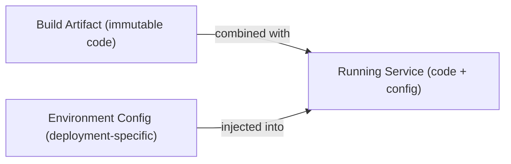
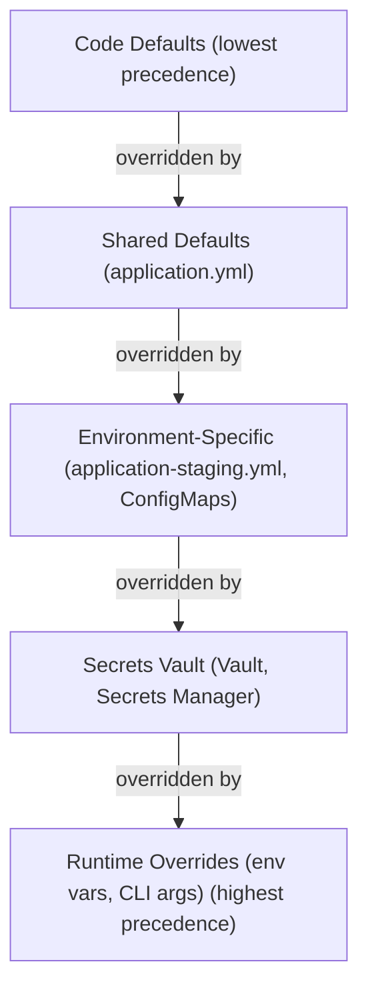
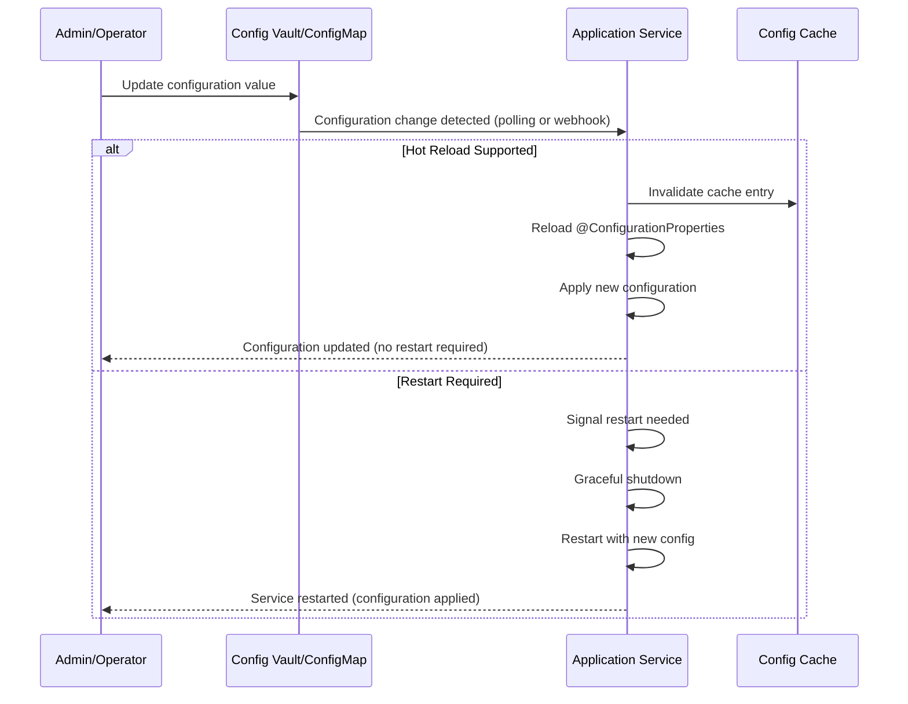

# Configuration Management: Architecture

## Contents

- [The Twelve-Factor App: Configuration](#the-twelve-factor-app-configuration)
- [Configuration Hierarchy and Precedence](#configuration-hierarchy-and-precedence)
- [Backend Configuration: Spring Boot](#backend-configuration-spring-boot)
- [Frontend Configuration: Vite and React/Vue](#frontend-configuration-vite-and-reactvue)
- [Kubernetes Configuration](#kubernetes-configuration)
- [Secrets Management](#secrets-management)
- [Configuration Patterns](#configuration-patterns)
- [Configuration Refresh and Hot Reloading](#configuration-refresh-and-hot-reloading)
- [Multi-Tenant Configuration](#multi-tenant-configuration)

Configuration management architecture determines how applications discover, load, validate, and use configuration data. The architecture must balance simplicity, flexibility, security, and operational requirements across diverse technology stacks and deployment environments.

## The Twelve-Factor App: Configuration

The Twelve-Factor App methodology establishes configuration as a first-class concern. The third factor states that configuration should be stored in the environment, not in code. Anything that varies between deployments—database URLs, API keys, feature flags, timeouts—is configuration and should be externalized.

This principle ensures that the same codebase can run in any environment by changing only configuration, not code. It enables environment parity, simplifies deployment, and reduces the risk of accidentally exposing production secrets in code repositories.

## Configuration Hierarchy and Precedence

Configuration systems must establish a clear hierarchy that determines which configuration source takes precedence when multiple sources provide values for the same property. The general principle is that more specific sources override less specific ones.

**Runtime Overrides** (highest precedence): Command-line arguments and environment variables set at process startup. These enable immediate changes without modifying files or redeploying.

**Environment-Specific Configuration**: Files or data sources specific to the current environment, such as `application-staging.yml` or Kubernetes ConfigMaps mounted for a specific namespace.

**Shared Defaults**: Base configuration files like `application.yml` that provide defaults for all environments.

**Code Defaults** (lowest precedence): Hardcoded fallback values in application code. These should be used sparingly and only for truly universal defaults that never change.

Understanding this hierarchy is critical for debugging configuration issues and ensuring that environment-specific overrides work as expected.

## Backend Configuration: Spring Boot

Spring Boot provides comprehensive configuration management through property files, profiles, and type-safe configuration classes.

### Property Files and Profiles

Spring Boot applications use `application.yml` or `application.properties` as the base configuration file. Profile-specific files like `application-local.yml`, `application-staging.yml`, and `application-production.yml` are automatically loaded when the corresponding profile is active.

Profiles are activated via the `spring.profiles.active` property, typically set as an environment variable or command-line argument. Multiple profiles can be active simultaneously, with later profiles overriding earlier ones.

The profile system enables environment-specific configuration while maintaining a single codebase. Each environment gets its own configuration file, but the structure remains consistent, supporting environment parity.

### Type-Safe Configuration with @ConfigurationProperties

Spring Boot's `@ConfigurationProperties` annotation enables type-safe, validated configuration classes. Instead of scattering `@Value` annotations throughout the codebase, related configuration properties are grouped into dedicated classes.

These classes provide IDE autocomplete, compile-time type checking, and runtime validation. The `@Validated` annotation enables Jakarta Bean Validation annotations like `@NotNull`, `@Min`, `@Max`, and `@Pattern` to validate configuration values at startup.

Configuration properties classes should be organized by domain or feature area. A `DatabaseProperties` class might contain all database-related configuration, while a `ApiClientProperties` class contains external API client settings. This organization makes configuration self-documenting and easier to maintain.

### Environment Variable Overrides

Spring Boot supports relaxed binding, allowing environment variables to override any property file value. The property `spring.datasource.url` can be overridden by the environment variable `SPRING_DATASOURCE_URL` or `SPRING_DATASOURCE_URL` (case-insensitive, with underscores or dots).

This enables containerized deployments where Kubernetes ConfigMaps and Secrets are injected as environment variables. The same application code works whether configuration comes from files or environment variables, providing deployment flexibility.

### Spring Cloud Config Server

For organizations with many microservices, Spring Cloud Config Server provides centralized configuration management. Configuration is stored in a Git repository, and services fetch their configuration from the Config Server at startup.

The Config Server supports profile-specific configuration, encryption of sensitive values, and runtime configuration refresh via Spring Boot Actuator endpoints. This enables changing configuration without redeploying services, though services must be designed to handle configuration changes gracefully.

The trade-off is additional infrastructure complexity. Organizations must operate and maintain the Config Server, handle its high availability, and manage the Git repository that stores configuration. For smaller deployments, environment variables and ConfigMaps may be simpler.

## Frontend Configuration: Vite and React/Vue

Frontend applications face unique configuration challenges. Configuration is baked into the JavaScript bundle at build time, making runtime changes difficult. Yet some configuration must be environment-specific, and some may need to change without rebuilding.

### Build-Time Configuration

Vite, the build tool for Vue 3 and React applications, supports environment variables through `.env` files. Variables prefixed with `VITE_` are exposed to client code via `import.meta.env`. Files like `.env`, `.env.local`, `.env.development`, and `.env.production` are loaded based on the build mode.

Build-time configuration is appropriate for values that rarely change: API base URLs, feature flag defaults, application metadata. These values are compiled into the bundle and cannot be changed without rebuilding.

The `.env.local` file should be in `.gitignore` and used for local development overrides. The `.env.example` file should be committed with placeholder values to document required configuration.

### Runtime Configuration

For configuration that must change without rebuilding, frontend applications can load configuration at runtime. A common pattern is to inject configuration into `index.html` as a JavaScript object during deployment, or to fetch configuration from a dedicated configuration endpoint.

Runtime configuration enables changing API endpoints, feature flags, or other values without rebuilding the frontend application. This is particularly valuable for microservices architectures where backend service URLs may change.

The trade-off is that runtime configuration adds complexity and a potential point of failure. Applications must handle configuration load failures gracefully, potentially falling back to build-time defaults.

### Security Considerations

Everything in the frontend bundle is visible to users. API keys, secrets, and authentication tokens must never be included in frontend configuration. If external APIs require authentication, use a backend-for-frontend pattern where the backend holds credentials and proxies requests.

Frontend configuration should only contain non-sensitive values: public API endpoints, feature flags, UI customization options. Any value that would be problematic if exposed to users should be kept in backend configuration.

## Kubernetes Configuration

Kubernetes provides native configuration management through ConfigMaps and Secrets, enabling configuration to be managed separately from application code and container images.

### ConfigMaps

ConfigMaps store non-sensitive configuration data as key-value pairs or files. They can be mounted into pods as environment variables or as files in the filesystem. ConfigMaps are namespace-scoped, enabling different configuration per environment when using separate namespaces.

ConfigMaps can be updated without redeploying pods, though pods must be restarted or the application must support configuration reloading for changes to take effect. This enables configuration changes with minimal disruption.

ConfigMaps should be version-controlled alongside application code. Helm charts or Kustomize overlays enable environment-specific ConfigMap values while maintaining a single source of truth for configuration structure.

### Secrets

Kubernetes Secrets store sensitive data like passwords, tokens, and certificates. They are base64 encoded but not encrypted by default—anyone with cluster access can decode them. Production clusters should enable encryption at rest for Secrets.

Secrets can be mounted similarly to ConfigMaps, as environment variables or files. They should never be committed to Git repositories, even if base64 encoded. Instead, use sealed-secrets for Git-stored encrypted secrets, or external-secrets-operator to sync from external secret stores like Vault or AWS Secrets Manager.

### Helm Values

Helm, the Kubernetes package manager, uses values files to parameterize chart templates. Environment-specific values files like `values-staging.yaml` and `values-production.yaml` enable consistent deployments across environments with different configuration values.

Helm values should be version-controlled and reviewed like code changes. The values files document what configuration differs between environments, making configuration drift visible and manageable.

## Secrets Management

Secrets require special handling beyond standard configuration. They must be encrypted at rest, access-controlled, auditable, and rotatable.

### HashiCorp Vault

Vault provides comprehensive secrets management with dynamic secrets, encryption as a service, and detailed audit logging. Vault can generate database credentials on demand with automatic rotation, eliminating long-lived credentials.

Vault's lease-based model ensures secrets are automatically revoked after a configured time period. Applications must renew leases to continue accessing secrets, enabling automatic cleanup of unused credentials.

Vault integrates with Kubernetes through the Vault Agent Injector, which automatically injects secrets into pods as environment variables or files. This enables applications to use Vault without Vault-specific client libraries.

### Cloud Provider Secrets Managers

AWS Secrets Manager and Azure Key Vault provide managed secrets services integrated with their respective cloud platforms. They offer automatic rotation for supported services like RDS databases and simplified IAM-based access control.

These services are simpler to operate than Vault but less flexible. They're ideal for organizations already heavily invested in a single cloud provider, where the managed service model reduces operational overhead.

### Kubernetes Secrets with External Tools

For simpler deployments, Kubernetes Secrets can be sufficient when combined with external tools. Sealed-secrets encrypts secrets for Git storage, enabling version-controlled secrets with encryption. External-secrets-operator syncs secrets from external stores into Kubernetes Secrets, providing a bridge between secret management systems and Kubernetes.

These approaches reduce the operational complexity of running a dedicated secrets management service while still providing better security than plain Kubernetes Secrets.

## Configuration Patterns

Several architectural patterns emerge in configuration management across different technology stacks.

### Externalize Everything That Varies

Any value that changes between environments should be externalized as configuration. This includes database URLs, API endpoints, feature flags, timeouts, retry counts, log levels, and any other parameter that might need adjustment without code changes.

Hardcoded values become technical debt. A timeout buried in code cannot be tuned for production without a code change and deployment. Externalizing these values enables operational tuning and faster incident response.

### Configuration Validation on Startup

Applications should validate all required configuration at startup and fail fast with clear error messages if configuration is missing or invalid. Discovering missing configuration at runtime when the first request hits a code path is too late.

Type-safe configuration classes with validation annotations enable this. Spring Boot's `@ConfigurationProperties` with `@Validated` validates configuration during application context initialization, before the application starts accepting requests.

### Configuration Documentation

Every configuration property should be documented with its description, type, default value, valid range, and example. This documentation should be accessible to developers and operators, ideally generated automatically from code annotations.

Spring Boot's configuration processor generates metadata from `@ConfigurationProperties` classes, enabling IDE autocomplete and documentation generation. Similar tooling exists for other frameworks.

### Configuration as Code

All non-secret configuration should be stored in version control. This includes Helm values files, Terraform variables, Kubernetes ConfigMaps (as YAML), and application property files. Configuration changes should go through the same review process as code changes.

Version-controlled configuration provides audit trails, enables rollback, and makes configuration drift visible through diff tools. It also enables infrastructure-as-code practices where configuration changes are tested and validated before deployment.

## Configuration Refresh and Hot Reloading

Some configuration can be changed at runtime without restarting the application. This requires careful design: applications must handle configuration changes gracefully, and not all configuration can be changed safely while the application is running.

Spring Boot Actuator provides configuration refresh endpoints that reload `@ConfigurationProperties` beans. This enables changing configuration via Spring Cloud Config Server or other external sources without full restarts.

The challenge is ensuring that configuration changes don't cause inconsistent state. A database connection pool size change might require draining existing connections before applying the new size. Applications must be designed to handle these transitions safely.

## Multi-Tenant Configuration

In multi-tenant applications, configuration may vary per tenant. This requires a configuration system that can resolve tenant-specific overrides while maintaining defaults for all tenants.

Patterns include tenant-specific property files, database-backed configuration with tenant context, or configuration services that resolve configuration based on tenant identity. The choice depends on the number of tenants, the frequency of configuration changes, and performance requirements.

Tenant-specific configuration should still follow the same externalization and validation principles as environment-specific configuration. The complexity of multi-tenancy shouldn't compromise configuration management practices.
