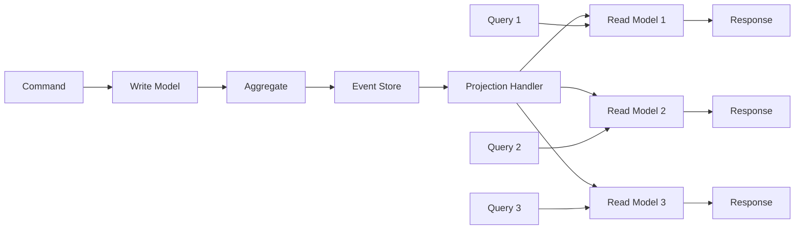
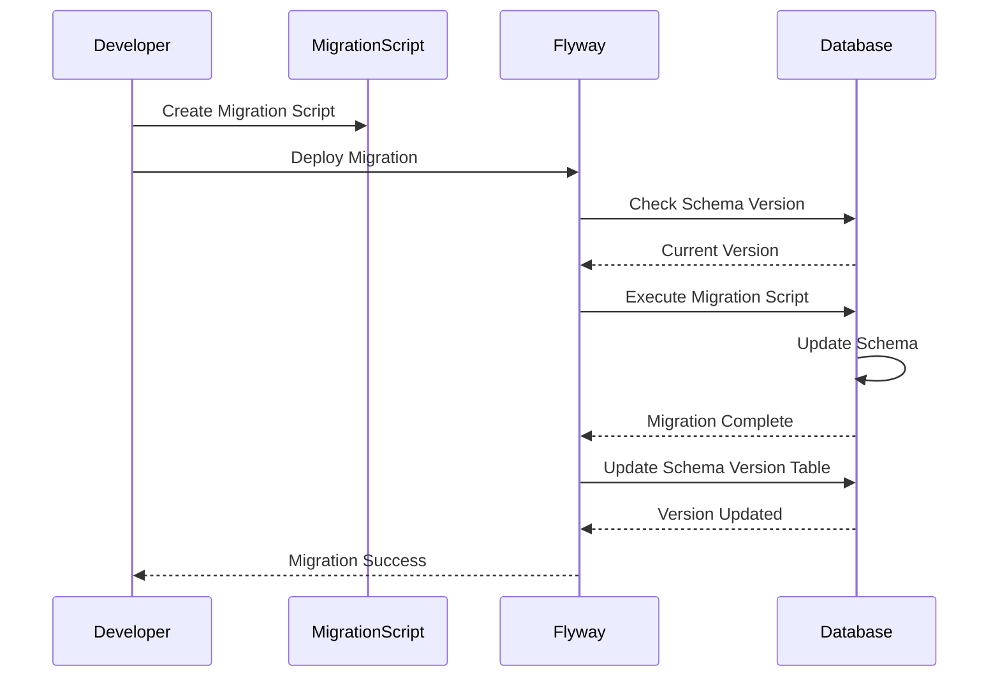
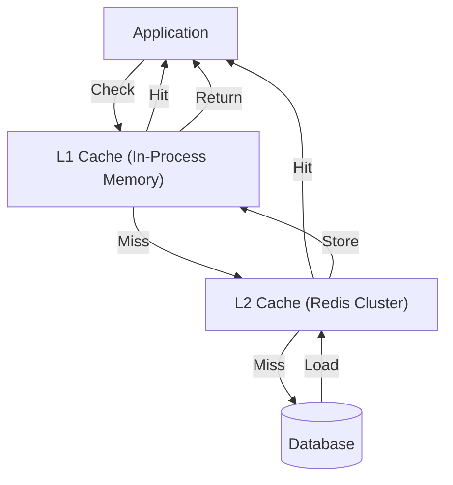

# Data Persistence -- Architecture

Data persistence architecture encompasses storage technology selection, data modeling, access patterns, caching strategies, and migration management. These decisions have long-lasting consequences -- data outlives applications, and changing a persistence strategy is one of the most expensive migrations a team can undertake.

## Contents

- [Relational Databases (PostgreSQL)](#relational-databases-postgresql)
- [NoSQL Options](#nosql-options)
- [Event Sourcing](#event-sourcing)
- [CQRS Read Models](#cqrs-read-models)
- [Database-per-Service Pattern](#database-per-service-pattern)
- [Migrations](#migrations)
- [Caching](#caching)

## Relational Databases (PostgreSQL)

PostgreSQL is the recommended default for structured data. It provides ACID transactions, rich data types, powerful indexing, and a mature ecosystem.

### Normalization

Normalize data to Third Normal Form (3NF) as a starting point:

- **1NF**: each column holds atomic values, no repeating groups
- **2NF**: all non-key columns depend on the entire primary key
- **3NF**: no non-key column depends on another non-key column (eliminate transitive dependencies)

**When to denormalize**: denormalize specific read-heavy paths after measuring performance. Common denormalization patterns include materialized views, summary tables, and JSONB columns for flexible nested data. Denormalization trades write complexity for read speed -- don't do it speculatively.

### Indexing Strategies

**B-tree indexes** (default): best for equality and range queries (`=`, `<`, `>`, `BETWEEN`, `ORDER BY`). Every foreign key column should have a B-tree index. Primary keys are automatically indexed.

**GIN indexes**: best for full-text search (`tsvector`), JSONB containment queries (`@>`), and array operations (`@>`, `&&`). GIN indexes are larger and slower to update than B-tree but support complex data type queries.

**Partial indexes**: index only rows matching a condition. Ideal for queries that filter on a common subset:

```sql
CREATE INDEX idx_active_users ON users (email) WHERE status = 'active';
```

This index is smaller and faster than indexing all users because it only includes active ones. Use partial indexes for status-filtered queries, soft-delete patterns, and tenant-scoped data.

**Composite indexes**: index multiple columns for queries that filter on combinations. Column order matters -- put the most selective column first, or the column used in equality conditions before range conditions.

```sql
CREATE INDEX idx_orders_status_created ON orders (status, created_at);
```

**When NOT to index**: don't index columns with very low cardinality (boolean columns, status columns with 2-3 values) unless combined with other columns. Don't index columns that are rarely queried. Each index slows down writes and consumes storage.

### Transactions and Isolation Levels

**READ COMMITTED** (PostgreSQL default): each statement sees only data committed before it started. Suitable for most operations. Prevents dirty reads.

**REPEATABLE READ**: the transaction sees a consistent snapshot from its start. Useful when a transaction reads data, does computation, and writes results that depend on the initial read.

**SERIALIZABLE**: transactions execute as if they ran one at a time. Required for financial operations where concurrent modifications could produce inconsistent results (double-spending, inventory overselling). Expect serialization failures that require retry logic.

Keep transactions short. Don't hold a transaction open while making HTTP calls or waiting for user input. Long transactions hold locks, block other operations, and increase the risk of deadlocks.

### Connection Pooling

**HikariCP** (Spring Boot default) manages a pool of database connections. Creating a new database connection is expensive (TCP handshake, authentication, SSL negotiation), so connection pooling amortizes this cost across requests.

**Sizing**: start with `maximumPoolSize = (core_count * 2) + effective_spindle_count` as a formula. For a 4-core server with SSD storage, this suggests ~10 connections. Monitor pool wait times (`HikariPoolMXBean`) and adjust.

**Don't set max too high**: each connection consumes memory on the database server (roughly 10MB per connection in PostgreSQL). 100 application instances each with 20 connections = 2,000 database connections, which can overwhelm the server.

**Connection validation**: HikariCP validates connections before returning them to the application. Configure `connectionTestQuery` or rely on JDBC 4's `Connection.isValid()`.

### Read Replicas

For read-heavy workloads, route read queries to a replica and write queries to the primary. This distributes load and can improve read performance.

**Replication lag**: replicas may be milliseconds to seconds behind the primary. If a user writes data and immediately reads it, they may not see their own write. Strategies:
- Route reads-after-writes to the primary for a short window
- Use session affinity to route a user's reads to the primary after a write
- Accept eventual consistency for non-critical reads (dashboards, reports)

**Spring configuration**: use `@Transactional(readOnly = true)` on query methods, then configure a routing DataSource that directs read-only transactions to the replica.

## NoSQL Options

PostgreSQL handles most use cases, including document-like data (JSONB), full-text search (tsvector), and key-value patterns (hstore). Consider NoSQL only when a specific pattern genuinely doesn't fit relational constraints.

### Document Stores (MongoDB)

**When it fits**: content management where each document has a different structure, user-generated data with varying schemas, prototyping where schema is evolving rapidly.

**When it doesn't fit**: data with strong relationships (use PostgreSQL with joins), transactional operations spanning multiple documents (MongoDB transactions exist but are less mature), data that benefits from normalization and referential integrity.

**Consider first**: PostgreSQL JSONB columns can store document-like data within a relational database, getting the flexibility of documents with the reliability of PostgreSQL.

### Key-Value Stores (Redis)

Redis excels as a caching layer, session store, rate limiter, and ephemeral data store. It is not a primary database.

**Common uses**: cache frequently accessed data (user profiles, configuration), store session data, implement distributed locks, rate limiting with sliding windows, sorted sets for leaderboards, pub/sub for lightweight event broadcasting.

**Not suitable for**: primary data storage (Redis persistence is a backup mechanism, not a database guarantee), complex queries, relational data.

### Graph Databases (Neo4j)

**When it fits**: data with deep, complex relationships (social networks, recommendation engines, access control graphs), queries that would require many joins in a relational database ("find all users within 3 degrees of connection").

**When it doesn't fit**: simple CRUD operations, tabular data, data without meaningful relationships.

## Event Sourcing

Instead of storing current state, store the sequence of events that led to the current state. The current state is derived by replaying events.

### Event Store

The event store is an append-only log of events. Events are immutable -- once written, they cannot be modified or deleted. Axon Server provides a purpose-built event store with built-in support for event streaming, snapshotting, and clustering.

**Event structure**: each event contains the aggregate identifier, sequence number, timestamp, event type, and payload. Events represent facts that have already happened ("OrderPlaced", "InvoicePaid", "UserEmailChanged").

### Projections

Projections are read models built by processing events. They transform the event stream into a queryable representation optimized for specific read patterns.

```kotlin
@EventHandler
fun on(event: InvoicePaid) {
    invoiceRepository.updateStatus(event.invoiceId, InvoiceStatus.PAID)
    invoiceRepository.updatePaidAt(event.invoiceId, event.paidAt)
}
```

Projections are eventually consistent with the write model. The delay is typically milliseconds but can be longer under load. Design the UI to communicate this (e.g., "payment processing" state).

Multiple projections can be built from the same event stream for different read patterns (list view, detail view, reporting, search index).

### Snapshots

Replaying hundreds or thousands of events on every aggregate load becomes slow. Snapshots capture the aggregate state at a point in time, so only events after the snapshot need to be replayed.

Configure snapshotting based on event count (e.g., every 100 events) or aggregate age. Monitor event stream lengths and snapshot freshness.

### Event Replay

Events can be replayed to rebuild projections from scratch. This is valuable for:
- Fixing bugs in projection logic (rebuild with corrected handler)
- Adding new projections to existing data (backfill a search index)
- Debugging (replay events to see exactly what happened)
- Auditing (complete temporal record of all changes)

### Event Versioning (Upcasting)

Event schemas evolve over time. When an event's structure changes, upcasters transform old events into the new format during replay. This preserves backward compatibility without rewriting historical events.

## CQRS Read Models

Separate the command (write) model from the query (read) model. The write model handles business logic and produces events. The read model is denormalized and optimized for specific query patterns.

### CQRS Read/Write Separation



**Write model**: aggregates enforce business rules, validate commands, produce events. Optimized for consistency and correctness.

**Read model**: projections consume events and build query-optimized views. Denormalized for fast reads. May use different storage (PostgreSQL for relational queries, OpenSearch for full-text search, Redis for fast lookups).

**When to use CQRS**: when read and write patterns differ significantly (complex domain logic for writes, multiple optimized views for reads), when read and write loads need to scale independently, when event sourcing is used (CQRS is a natural companion).

**When to skip CQRS**: simple CRUD applications where read and write models are essentially the same shape. Adding CQRS to a simple domain adds complexity without benefit.

## Database-per-Service Pattern

In a microservices architecture, each service owns its database. No service directly accesses another service's tables.

**Benefits**: services can evolve their schemas independently, use different database technologies if needed, scale independently, and deploy without coordinating schema changes.

**Challenges**: no cross-service joins (use API calls or data duplication), maintaining data consistency across services (use sagas or eventual consistency), data duplication and synchronization.

**Data synchronization strategies**: event-driven synchronization (service publishes events, other services build local copies of needed data), API calls for real-time needs, periodic sync jobs for non-critical data.

## Migrations

### Database Migration Pipeline



### Flyway

Flyway manages database schema evolution through versioned SQL migration scripts.

**Naming convention**: `V{version}__{description}.sql` for versioned migrations, `R__{description}.sql` for repeatable migrations (views, functions). Version numbers should be sequential (V1, V2, V3) or timestamp-based (V20260209120000).

**Zero-downtime migrations**: use the expand/contract pattern:
1. **Expand**: add the new column/table (deploy migration only)
2. **Migrate data**: backfill the new structure from existing data
3. **Transition**: update application code to use the new structure (deploy code)
4. **Contract**: remove the old column/table in a subsequent release (deploy migration)

This ensures that both old and new versions of the application code work with the database schema at every point during deployment.

**Backward-compatible rules**:
- Adding a column: always nullable or with a default value (no table lock)
- Renaming a column: add new column → copy data → update code → drop old column
- Dropping a column: remove from code first, drop column in next release
- Adding an index: use `CREATE INDEX CONCURRENTLY` to avoid table locks

## Caching

### Caching Layers



### Cache-Aside (Lazy Loading)

The application checks the cache first. On a miss, it loads from the database, writes the result to the cache, and returns it. On a hit, it returns the cached value directly.

```
Read: Cache → Hit? Return. Miss? → Database → Write to Cache → Return.
Write: Database → Invalidate Cache.
```

**Strengths**: simple to implement, cache only contains data that is actually requested, resilient to cache failures (falls back to database).

**Weaknesses**: first request for each key always hits the database (cold start), cache invalidation on write must be explicit.

### Write-Through

Writes go to the cache and database simultaneously. The cache is always up to date.

```
Write: Cache + Database (simultaneously).
Read: Cache → Hit? Return. Miss? → Database → Write to Cache → Return.
```

**Strengths**: cache is always consistent with the database, reads are always fast after the first write.

**Weaknesses**: higher write latency (two writes per operation), cache contains data that may never be read.

### TTL (Time to Live)

Every cached value has an expiration time. After the TTL expires, the next read triggers a database lookup and cache refresh.

**Short TTL** (seconds to minutes): for frequently changing data where slight staleness is acceptable (user session data, feature flags).

**Long TTL** (hours to days): for slowly changing data (product catalogs, configuration, reference data).

**No TTL**: for immutable data (historical events, published reports). Invalidate only when explicitly needed.

### Redis as Cache Layer

Redis supports rich data structures beyond simple key-value:

- **Strings**: simple key-value caching, counters
- **Hashes**: caching objects with field-level access (read one field without deserializing the entire object)
- **Sorted sets**: leaderboards, time-series data, priority queues
- **Lists**: queues, recent activity feeds
- **Sets**: tags, unique collections, set operations (intersection, union)

**Connection pooling**: use Lettuce (Spring Boot default) with connection pooling. Configure pool size based on application concurrency.

**Cluster mode**: for high availability and data partitioning. Data is automatically sharded across nodes. Be aware of multi-key operations that require all keys to be on the same shard (use hash tags for related keys).
