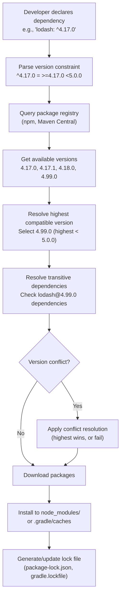
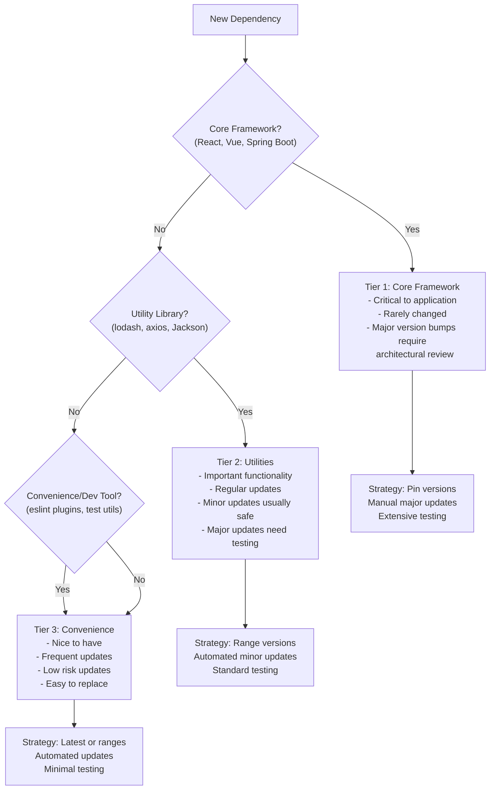
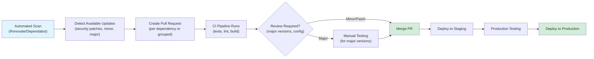

# Dependency Management -- Architecture

## Contents

- [Dependency Resolution: How Package Managers Work](#dependency-resolution-how-package-managers-work)
- [Lock Files: Ensuring Reproducible Builds](#lock-files-ensuring-reproducible-builds)
- [Dependency Tiers: Classifying Dependencies](#dependency-tiers-classifying-dependencies)
- [Version Strategies: Pinned, Ranges, and Latest](#version-strategies-pinned-ranges-and-latest)
- [Transitive Dependencies: The Hidden Tree](#transitive-dependencies-the-hidden-tree)
- [Monorepo Dependency Sharing](#monorepo-dependency-sharing)
- [Version Conflict Resolution](#version-conflict-resolution)

Dependency management architecture defines how applications resolve, version, and manage third-party libraries. Understanding dependency resolution algorithms, lock file mechanics, and version strategies enables teams to make informed decisions about dependency management and avoid common pitfalls.

## Dependency Resolution: How Package Managers Work

Package managers resolve dependencies by traversing dependency graphs, resolving version constraints, and downloading required packages. The resolution process starts with declared dependencies (in package.json, build.gradle.kts, etc.), then recursively resolves transitive dependencies (dependencies of dependencies) until the complete dependency tree is determined.

**npm Resolution**: npm uses a flat dependency tree by default (npm 3+), hoisting dependencies to the top level when possible to reduce duplication. When version conflicts occur, npm installs conflicting versions in nested node_modules directories. npm's resolution algorithm prefers the highest version that satisfies all constraints, but conflicts can result in multiple versions of the same package.

**Gradle Resolution**: Gradle uses a dependency resolution engine that considers version constraints, dependency substitutions, and conflict resolution strategies. Gradle's resolution is more configurable than npm's, allowing custom resolution strategies and dependency substitution rules. Gradle can use version catalogs to centralize version management across projects.

**Yarn Resolution**: Yarn uses a deterministic resolution algorithm that produces consistent dependency trees. Yarn's resolution is more predictable than npm's, making it easier to reason about dependency versions. Yarn PnP (Plug'n'Play) eliminates node_modules entirely, using a virtual file system to resolve dependencies.

## Lock Files: Ensuring Reproducible Builds

Lock files pin exact dependency versions, ensuring that builds are reproducible across environments and over time. Without lock files, dependency resolution might select different versions based on when packages are installed, leading to "works on my machine" problems and production incidents.

**package-lock.json (npm)**: Records the exact version of every package in the dependency tree, including transitive dependencies. npm generates package-lock.json automatically and uses it to install exact versions. Committing package-lock.json to version control ensures all developers and CI/CD use the same dependency versions.

**yarn.lock (Yarn)**: Similar to package-lock.json but uses Yarn's resolution algorithm. Yarn.lock is more deterministic than package-lock.json, making it easier to reason about dependency versions. Yarn requires yarn.lock to be committed to version control.

**gradle.lockfile (Gradle)**: Pins exact versions of dependencies and their transitive dependencies. Gradle's lockfile is generated when dependency locking is enabled and should be committed to version control. Gradle lockfiles support different lock modes (strict, lenient) that control how version updates are handled.

**When to Commit Lock Files**: Always commit lock files for applications (not libraries). Applications benefit from reproducible builds, while libraries need flexibility to work with different dependency versions. Lock files for applications ensure production deployments use tested dependency versions.

**Lock File Merge Conflicts**: Lock files can create merge conflicts when multiple developers update dependencies simultaneously. Resolving lock file conflicts requires regenerating the lock file by running the package manager (npm install, gradle dependencies --write-locks). Automated tools (Renovate, Dependabot) can reduce lock file conflicts by creating separate PRs for each dependency update.

## Dependency Tiers: Classifying Dependencies

Dependencies can be classified into tiers based on their importance, stability, and impact on the application. Tier classification helps prioritize dependency management efforts and understand upgrade risks.

**Tier 1: Core Frameworks**: Critical dependencies that define application architecture (React, Vue, Spring Boot, Express). These dependencies are rarely changed, and major version bumps require architectural review and extensive testing. Core frameworks should be pinned to specific versions to ensure stability.

**Tier 2: Utility Libraries**: Important functionality libraries (lodash, axios, Jackson, Guava) that provide core features but don't define architecture. These dependencies are updated more frequently, and minor version updates are usually safe. Utility libraries can use version ranges (^, ~) to allow minor updates while preventing major breaking changes.

**Tier 3: Convenience Libraries**: Development tools, testing utilities, and convenience libraries that provide nice-to-have features. These dependencies are updated frequently and can be updated with minimal risk. Convenience libraries can use latest versions or wide ranges, allowing automated updates.

## Version Strategies: Pinned, Ranges, and Latest

Version strategies determine how dependency versions are specified and updated. Different strategies balance stability, security, and maintenance burden.

**Pinned Versions** (e.g., `"lodash": "4.17.21"`): Specify exact versions, ensuring reproducible builds and preventing unexpected updates. Pinned versions provide maximum stability but require manual updates. Use pinned versions for production applications and core frameworks where stability is critical.

**Caret Ranges** (e.g., `"lodash": "^4.17.21"`): Allow updates that don't change the leftmost non-zero digit. `^4.17.21` allows `4.17.22`, `4.18.0`, but not `5.0.0`. Caret ranges provide a balance between stability and updates, allowing patch and minor updates while preventing major breaking changes.

**Tilde Ranges** (e.g., `"lodash": "~4.17.21"`): Allow updates that only change the patch version. `~4.17.21` allows `4.17.22` but not `4.18.0`. Tilde ranges are more restrictive than caret ranges, providing maximum stability while allowing security patches.

**Latest** (e.g., `"lodash": "latest"`): Always use the latest version, providing maximum updates but maximum risk. Latest versions can introduce breaking changes without warning. Avoid latest versions in production applications—use them only for development tools or when actively maintaining dependencies.

**Version Strategies by Context**: Production applications should pin dependencies or use narrow ranges (^) with lock files. Libraries should use ranges (^) to allow consumers flexibility. Development tools can use latest or wide ranges since they don't affect production.

## Transitive Dependencies: The Hidden Tree

Transitive dependencies (dependencies of dependencies) form the majority of an application's dependency tree. An application with 50 direct dependencies might have 500 transitive dependencies. Understanding transitive dependencies is essential for security scanning, license compliance, and dependency management.

**Inspecting Transitive Dependencies**: Use `npm ls` (npm), `gradle dependencies` (Gradle), or `yarn list` (Yarn) to view the full dependency tree. These commands show direct dependencies, transitive dependencies, and version conflicts. Understanding the dependency tree helps identify security vulnerabilities, license issues, and opportunities to reduce dependencies.

**Transitive Dependency Vulnerabilities**: Vulnerabilities in transitive dependencies affect applications even if they're not directly declared. Dependency scanning tools (Snyk, Dependabot) identify vulnerabilities in transitive dependencies and suggest fixes. Fixing transitive dependency vulnerabilities often requires updating direct dependencies that depend on vulnerable transitive dependencies.

**Overriding Transitive Dependencies**: Package managers allow overriding transitive dependency versions. npm uses `overrides` (package.json), Gradle uses `dependencySubstitution` or `resolutionStrategy`, and Yarn uses `resolutions`. Overrides should be used sparingly—prefer updating direct dependencies to fix transitive issues, as overrides can mask underlying problems.

**Bundling Transitive Dependencies**: Some packages bundle their transitive dependencies, increasing bundle size and creating security risks. Bundled dependencies might be outdated or vulnerable, and they can't be updated independently. Prefer packages that don't bundle dependencies, or use tools to detect and replace bundled dependencies.

## Monorepo Dependency Sharing

Monorepos (multiple packages in a single repository) require strategies for sharing dependencies across packages. Dependency sharing reduces duplication, ensures version consistency, and simplifies dependency management.

**Dependency Hoisting**: Package managers hoist dependencies to the root node_modules when versions are compatible, reducing duplication. Hoisting works automatically but can create issues when packages expect dependencies at specific locations. Workspace protocols (npm workspaces, Yarn workspaces, Gradle composite builds) provide explicit dependency sharing.

**Workspace Protocols**: Workspace protocols allow packages to reference other packages in the monorepo using special protocols (`workspace:*`, `workspace:^1.0.0`). Workspace protocols ensure packages use local versions during development and published versions in production. This enables testing changes across packages before publishing.

**Version Consistency**: Monorepos benefit from consistent dependency versions across packages. Version catalogs (Gradle) or shared package.json files can centralize version management. Consistent versions reduce conflicts, simplify upgrades, and ensure compatibility across packages.

**Dependency Isolation**: Some monorepo setups isolate dependencies per package to avoid version conflicts. Isolation prevents conflicts but increases duplication and maintenance burden. Prefer hoisting with conflict resolution over isolation when possible.

## Version Conflict Resolution

Version conflicts occur when multiple dependencies require different versions of the same package. Resolution strategies determine which version is selected when conflicts occur.

**Highest Version Wins**: Most package managers (npm, Gradle default) select the highest version that satisfies all constraints. If dependency A requires `lodash@^4.17.0` and dependency B requires `lodash@^4.18.0`, the resolver selects `lodash@4.18.0` or higher (satisfying both). This strategy works well when packages are compatible across minor versions.

**Fail on Conflict**: Some resolution strategies fail builds when version conflicts occur, forcing explicit resolution. Failing on conflicts ensures developers are aware of conflicts and make intentional decisions. However, failing on conflicts can be disruptive and may not be practical for large dependency trees.

**Force Resolution**: Package managers allow forcing specific versions to resolve conflicts. npm uses `overrides`, Gradle uses `resolutionStrategy.force()`, and Yarn uses `resolutions`. Force resolution should be used carefully—forcing incompatible versions can cause runtime errors. Prefer updating dependencies to compatible versions over forcing resolutions.

**Dependency Substitution**: Gradle supports dependency substitution, allowing replacement of one dependency with another. Substitution can replace vulnerable dependencies with patched versions or replace deprecated packages with alternatives. Substitution provides flexibility but requires careful configuration to avoid breaking changes.

Understanding dependency management architecture enables teams to make informed decisions about version strategies, lock files, and upgrade processes. The architecture provides the foundation for effective dependency management practices that balance stability, security, and maintainability.
