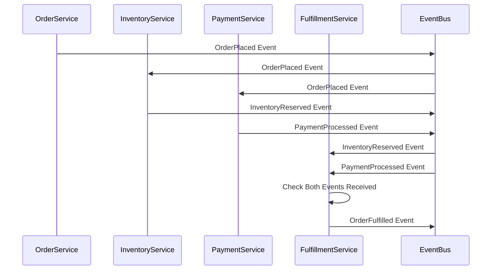
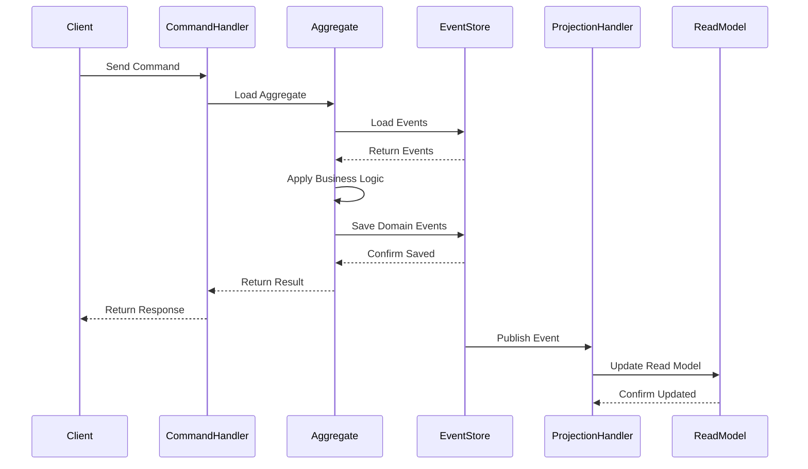

# Architecture: Event-Driven Systems

## Contents

- [Core Concepts](#core-concepts)
- [Messaging Patterns](#messaging-patterns)
- [Choreography vs Orchestration](#choreography-vs-orchestration)
- [Event Sourcing](#event-sourcing)
- [Message Broker Architectures](#message-broker-architectures)
- [Event Schema Management](#event-schema-management)
- [Delivery Guarantees](#delivery-guarantees)

## Core Concepts

### Events vs Commands vs Queries

Events represent facts that have already happened. They are immutable records of past occurrences, named in past tense: `OrderPlaced`, `PaymentProcessed`, `InventoryReserved`. Events are notifications, not requests. They inform consumers about state changes but don't request actions. Once published, events cannot be changed or retracted. They become part of the permanent history of the system.

Commands represent intentions to perform actions. They are requests, named in imperative mood: `PlaceOrder`, `ProcessPayment`, `ReserveInventory`. Commands are sent to specific handlers that decide whether to execute them. Commands can be rejected if business rules prevent execution. Commands are point-to-point—sent to a specific recipient.

Queries request current state without modifying it. They ask "what is" rather than "what happened" or "do this". Queries are typically synchronous and return data immediately. In CQRS architectures, queries read from optimized read models rather than the source of truth.

The distinction matters for event-driven design. Commands trigger state changes that produce events. Events notify consumers of state changes. Queries retrieve current state. Mixing these concepts creates confusion. Don't emit events that are really commands in disguise. Don't use events for queries that need immediate responses.

### Event Types

Domain events represent business-meaningful state changes within a bounded context. They capture what happened in business terms: `OrderPlaced`, `CustomerRegistered`, `InvoiceGenerated`. Domain events are the primary mechanism for event-driven architecture. They enable other parts of the system to react to business changes without tight coupling.

Integration events facilitate communication across bounded contexts or service boundaries. They translate domain events into formats that external systems understand. An internal `OrderCreated` domain event might become an `OrderIntegrationEvent` with additional context for external consumers. Integration events bridge different domain models and enable loose coupling between services.

Notification events trigger side effects that don't affect core business logic. `EmailSent`, `SmsDelivered`, `WebhookDispatched` are notification events. They inform systems about completed actions but don't represent business state changes. Distinguishing notification events from domain events helps with event sourcing—domain events belong in the event store, notification events might not.

## Messaging Patterns

### Publish/Subscribe

Publish/subscribe enables one-to-many communication. Producers publish events to topics without knowing who consumes them. Consumers subscribe to topics of interest. The messaging infrastructure routes events to all subscribers. This pattern enables loose coupling—producers and consumers don't know about each other.

Kafka implements publish/subscribe through topics. Producers write events to topics. Consumers subscribe to topics via consumer groups. Each consumer group receives all events from subscribed topics. Multiple consumer groups enable fan-out—the same event can trigger different workflows independently. Kafka topics are partitioned for parallelism. Events with the same partition key go to the same partition, maintaining order within partitions.

RabbitMQ implements publish/subscribe through exchanges and queues. Producers publish to exchanges. Exchanges route messages to queues based on routing rules. Consumers consume from queues. Topic exchanges enable pattern-based routing—consumers can subscribe to `order.*` to receive all order-related events. Fanout exchanges broadcast to all bound queues. Direct exchanges route based on exact routing keys.

Publish/subscribe scales horizontally. Adding consumers doesn't affect producers. Multiple consumers process events in parallel. Consumer groups enable load balancing—multiple instances in the same group share the workload. This pattern suits event-driven architectures where multiple systems need to react to the same events.

### Point-to-Point

Point-to-point messaging provides one-to-one communication. Each message is delivered to exactly one consumer. This pattern suits work distribution and task queues. Multiple workers consume from the same queue, but each message goes to only one worker. This enables load balancing and parallel processing.

RabbitMQ queues naturally implement point-to-point. Multiple consumers bind to the same queue. RabbitMQ distributes messages round-robin or based on consumer capacity. Once a consumer acknowledges a message, it's removed from the queue and won't be delivered to another consumer.

Kafka can simulate point-to-point using consumer groups with a single partition. All consumers in the group share the single partition, ensuring each message is processed once. However, Kafka's design favors publish/subscribe. For true point-to-point messaging, RabbitMQ is more appropriate.

Point-to-point suits task distribution. A job queue where workers process tasks independently benefits from point-to-point. Each task should be processed once. Multiple workers share the load. Failed tasks can be retried or moved to dead letter queues.

### Request/Reply

Request/reply enables asynchronous request-response over messaging. A producer sends a request message and expects a reply. The messaging infrastructure correlates requests and replies. This pattern should be used sparingly—if you need synchronous responses, use HTTP or gRPC instead. Request/reply over messaging adds complexity for marginal benefit.

RabbitMQ supports request/reply through reply-to queues and correlation IDs. The requester creates a temporary queue, sets it as the reply-to header, includes a correlation ID, and waits for the reply. The responder processes the request, publishes the reply to the reply-to queue with the same correlation ID. The requester matches correlation IDs to correlate requests and replies.

Kafka doesn't natively support request/reply. You can implement it using request and reply topics with correlation IDs, but this requires significant infrastructure. Prefer synchronous APIs for request-response patterns.

Request/reply suits scenarios where you need async communication but can't use synchronous APIs—perhaps due to network boundaries or long processing times. However, these scenarios are rare. Most systems should use synchronous APIs for request-response and events for notifications.

## Choreography vs Orchestration

### Choreography

Choreography distributes process logic across participating services. Each service reacts to events independently. There's no central coordinator. Services know their role in the process and react accordingly. This creates loose coupling—services don't depend on a central orchestrator.

In a choreographed order fulfillment process, the Order service emits `OrderPlaced`. The Inventory service reacts by emitting `InventoryReserved`. The Payment service reacts by emitting `PaymentProcessed`. The Fulfillment service reacts to both `InventoryReserved` and `PaymentProcessed` by emitting `OrderFulfilled`. Each service makes local decisions. No service knows the complete process flow.

Choreography's strengths include loose coupling and simple services. Each service focuses on its domain. Services can be developed and deployed independently. Adding new participants doesn't require modifying existing services. The system is resilient—if one service fails, others continue operating.

Choreography's weaknesses include difficulty understanding overall flows and debugging. There's no single place to see the complete process. Understanding what happens when an order is placed requires tracing events across multiple services. Debugging failures requires correlating events across services. There's no single view of process state—each service knows only its part.

Choreography suits simple flows with 2-3 steps and clear reactions. If the process is mostly linear with independent reactions, choreography is simpler than orchestration. However, as processes grow complex with error handling, compensating transactions, and conditional logic, choreography becomes difficult to manage.

### Orchestration (Sagas)

Orchestration centralizes process logic in a coordinator—a saga. The saga knows the complete process flow. It sends commands to participants and reacts to their events. The saga decides the next step based on the current state and received events. This provides clear process visibility and easier error handling.

In an orchestrated order fulfillment process, an OrderFulfillmentSaga coordinates the flow. It sends `ReserveInventory` command to Inventory, waits for `InventoryReserved` event, sends `ProcessPayment` command to Payment, waits for `PaymentProcessed` event, then sends `FulfillOrder` command to Fulfillment. The saga maintains process state and handles errors—if payment fails, it sends `ReleaseInventory` to compensate.

Axon Framework implements sagas through `@Saga` annotation. Saga classes contain `@SagaEventHandler` methods that react to events and `@CommandHandler` methods that send commands. The saga maintains association properties to correlate events to saga instances. `@EndSaga` marks completion. Axon Server manages saga state and ensures exactly-once processing.

Orchestration's strengths include clear process visibility and easier error handling. The saga is the single source of truth for process state. Developers can read the saga code to understand the complete flow. Error handling is centralized—the saga can implement compensating transactions, retries, and timeouts. Debugging is easier—inspect the saga state to see where the process is stuck.

Orchestration's weaknesses include the orchestrator as a single point of logic and potential complexity. The saga becomes a critical component—if it fails, the process stops. Complex processes create complex sagas that are hard to maintain. The saga must know about all participants, creating some coupling. However, this coupling is explicit and manageable compared to implicit coupling in choreography.

Orchestration suits complex multi-step processes with error handling, compensating transactions, and conditional logic. If the process involves 5+ steps with branches, retries, and compensation, a saga provides structure that choreography lacks. Financial transactions, distributed workflows, and long-running processes benefit from orchestration.

### Choosing Between Choreography and Orchestration

Prefer choreography for simple flows with 2-3 steps and independent reactions. If services can react independently without coordination, choreography is simpler. Each service remains focused on its domain. The system stays loosely coupled.

Prefer orchestration for complex flows with multiple steps, error handling, and conditional logic. If the process requires coordination, compensating transactions, or complex error handling, a saga provides structure. The explicit coordination is worth the coupling cost.

Many systems use both. Simple flows use choreography. Complex flows use orchestration. The key is recognizing when a flow has grown too complex for choreography and introducing a saga.

## Event Sourcing

Event sourcing stores state changes as a sequence of events in an append-only log. Instead of storing current state, systems store events that led to current state. Current state is derived by replaying events. This provides complete history, audit trails, and the ability to reconstruct state at any point in time.

### Event Sourcing Flow

Event sourcing naturally produces events that drive read model projections. As aggregates emit domain events, projection handlers consume these events to update read models. This creates a clean separation between write models (event-sourced aggregates) and read models (projections). The same events that represent state changes also drive integration with other systems.

Axon Server serves as both an event store and message router. It stores events from Axon aggregates in an event store. It also routes these events to projection handlers and other consumers. This dual role simplifies architecture—events flow from aggregates through Axon Server to projections and external systems without additional infrastructure.

Event sourcing requires careful design. Events must be immutable and versioned. Schema evolution must maintain backward compatibility. Replaying events must be deterministic. Projections must be idempotent to handle replays correctly. These requirements add complexity but provide significant benefits for systems that need complete history and audit trails.

The relationship between event sourcing and CQRS is symbiotic. Event sourcing provides the event stream that CQRS read models consume. CQRS provides the separation between write and read models that event sourcing enables. Together, they create systems with complete history, optimized read models, and loose coupling between write and read concerns.

## Message Broker Architectures

### Apache Kafka

Kafka is a distributed event log designed for high-throughput event streaming. Events are written to topics, which are partitioned for parallelism. Producers write to partitions based on partition keys. Consumers read from partitions via consumer groups. Each consumer group processes each partition independently, enabling horizontal scaling.

Kafka's log-based architecture provides long-term event retention. Events can be retained for days, weeks, or indefinitely. This enables replay—consumers can reprocess historical events. Analytics systems can replay events to train models or analyze trends. Debugging systems can replay events to reproduce issues.

Consumer groups enable load balancing and fan-out. Multiple consumers in the same group share partitions, distributing load. Multiple consumer groups enable fan-out—the same event triggers different workflows. Each consumer group processes all events independently.

Kafka provides exactly-once semantics with proper configuration. Idempotent producers prevent duplicate events. Transactions ensure atomic writes across multiple partitions. Consumer offsets track processing progress. Together, these features enable exactly-once processing, though achieving it end-to-end requires careful design.

Kafka suits event streaming, replay, and high-throughput scenarios. Systems that need to retain events for replay benefit from Kafka's log-based architecture. Systems with high event volumes benefit from Kafka's partitioning and horizontal scaling. Systems that need fan-out to multiple consumers benefit from consumer groups.

### RabbitMQ

RabbitMQ is a traditional message broker with flexible routing. Producers publish to exchanges. Exchanges route messages to queues based on routing rules. Consumers consume from queues. This provides fine-grained control over message routing and delivery.

RabbitMQ exchanges support multiple routing patterns. Direct exchanges route based on exact routing keys. Topic exchanges enable pattern-based routing with wildcards. Fanout exchanges broadcast to all bound queues. Headers exchanges route based on message headers. This flexibility suits complex routing requirements.

RabbitMQ provides lower latency for small messages compared to Kafka. Messages are delivered immediately rather than batched. This suits real-time systems that need immediate delivery. However, throughput is lower than Kafka for high-volume scenarios.

RabbitMQ queues support acknowledgments, dead letter exchanges, and message TTL. Consumers acknowledge messages after processing. Unacknowledged messages are redelivered. Messages that fail repeatedly can be routed to dead letter exchanges. Messages can expire after a TTL. These features provide fine-grained control over message lifecycle.

RabbitMQ suits task distribution, routing, and lower-latency point-to-point messaging. Systems that need flexible routing benefit from RabbitMQ exchanges. Systems that distribute work to multiple workers benefit from RabbitMQ queues. Systems that need immediate delivery for small messages benefit from RabbitMQ's lower latency.

### Choosing Between Kafka and RabbitMQ

Choose Kafka for event streaming, replay, and high-throughput scenarios. If you need to retain events for replay, Kafka's log-based architecture is ideal. If you have high event volumes, Kafka's partitioning provides better throughput. If you need fan-out to multiple consumers, Kafka's consumer groups enable this efficiently.

Choose RabbitMQ for task distribution, routing, and lower-latency point-to-point messaging. If you need flexible routing based on patterns or headers, RabbitMQ exchanges provide this. If you distribute work to multiple workers, RabbitMQ queues are designed for this. If you need immediate delivery for small messages, RabbitMQ's lower latency helps.

Many systems use both. Kafka for event streaming and replay. RabbitMQ for task queues and routing. The choice depends on use case rather than a one-size-fits-all solution.

## Event Schema Management

### Schema Evolution

Event schemas must evolve as systems change. New fields are added. Field types change. Fields are deprecated. Schema evolution must maintain compatibility to avoid breaking existing consumers. Backward-compatible changes allow old consumers to process new events. Forward-compatible changes allow new consumers to process old events.

Backward-compatible changes include adding optional fields, adding fields with default values, and removing required fields. Old consumers ignore new fields they don't understand. New fields don't break old consumers. This enables independent evolution—producers can add fields without coordinating with all consumers.

Forward-compatible changes include making required fields optional and adding new required fields only in new versions. New consumers can handle old events that lack new fields. Old events don't break new consumers. This enables gradual migration—consumers can upgrade independently.

Breaking changes require coordination. Changing field types, removing fields, or making optional fields required breaks compatibility. These changes require versioning—publish new event versions alongside old versions. Consumers migrate gradually. Old versions are deprecated and eventually removed.

### Schema Registry

Schema registries provide centralized schema management. Schemas are registered with versions. Compatibility checks ensure new schemas don't break existing consumers. Consumers fetch schemas to deserialize events. This provides schema governance and prevents breaking changes.

Confluent Schema Registry works with Kafka. Schemas are stored centrally. Producers register schemas before publishing. Consumers fetch schemas before consuming. Compatibility checks prevent breaking changes. Schema evolution is managed through versioning and compatibility rules.

Schema registries enable schema governance. Teams can't publish breaking changes accidentally. Compatibility checks catch issues before deployment. Schema versions enable gradual migration. Schema metadata provides documentation and discovery.

### Serialization Formats

JSON provides human-readable, flexible serialization. Events are easy to inspect and debug. Schema evolution is flexible—consumers can ignore unknown fields. However, JSON is verbose and lacks strong typing. Schema validation requires separate tools.

Avro provides compact, schema-evolution-friendly serialization. Schemas are stored with data, enabling efficient serialization. Schema evolution is built-in—Avro handles compatibility automatically. However, Avro requires schema registries and adds complexity.

Protobuf provides compact, strongly-typed serialization. Schemas define strong contracts between producers and consumers. Schema evolution is supported through field numbers and optional fields. However, Protobuf requires code generation and adds build-time complexity.

Choose JSON for flexibility and ease of debugging. Choose Avro for compactness and built-in schema evolution. Choose Protobuf for strong typing and performance. The choice depends on team preferences, tooling, and requirements.

## Delivery Guarantees

### At-Most-Once

At-most-once delivery provides fire-and-forget semantics. Messages are sent once. If delivery fails, the message is lost. There are no retries. This provides the lowest latency but risks message loss.

At-most-once suits non-critical notifications where loss is acceptable. Analytics events might use at-most-once—losing a single event doesn't affect correctness. However, most business events require stronger guarantees.

### At-Least-Once

At-least-once delivery retries until acknowledgment. If a consumer crashes before acknowledging, the message is redelivered. This ensures no message loss but risks duplicate processing. Consumers must be idempotent to handle duplicates correctly.

At-least-once is the default for most message brokers. Kafka and RabbitMQ both provide at-least-once by default. This suits most business events where duplicates are acceptable if handled idempotently.

Idempotent consumers are essential for at-least-once. Consumers must handle receiving the same event multiple times without incorrect side effects. Use idempotency keys, database constraints, or deduplication logic to ensure idempotency.

### Exactly-Once

Exactly-once delivery ensures each message is processed exactly once. This is difficult to achieve end-to-end. Kafka provides exactly-once semantics with idempotent producers and transactions, but achieving exactly-once across systems requires careful design.

Kafka's exactly-once semantics include idempotent producers that prevent duplicate events and transactions that ensure atomic writes across partitions. However, exactly-once is expensive—it reduces throughput and increases latency. Use it only when duplicates are unacceptable.

Most systems use at-least-once with idempotent consumers rather than exactly-once. This provides good enough guarantees with better performance. Exactly-once should be reserved for financial transactions and other scenarios where duplicates are unacceptable.
