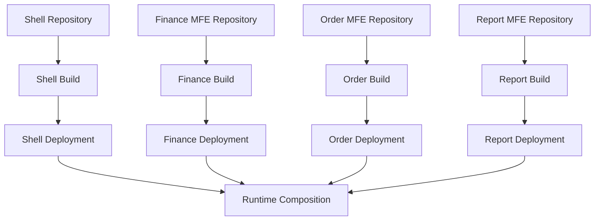
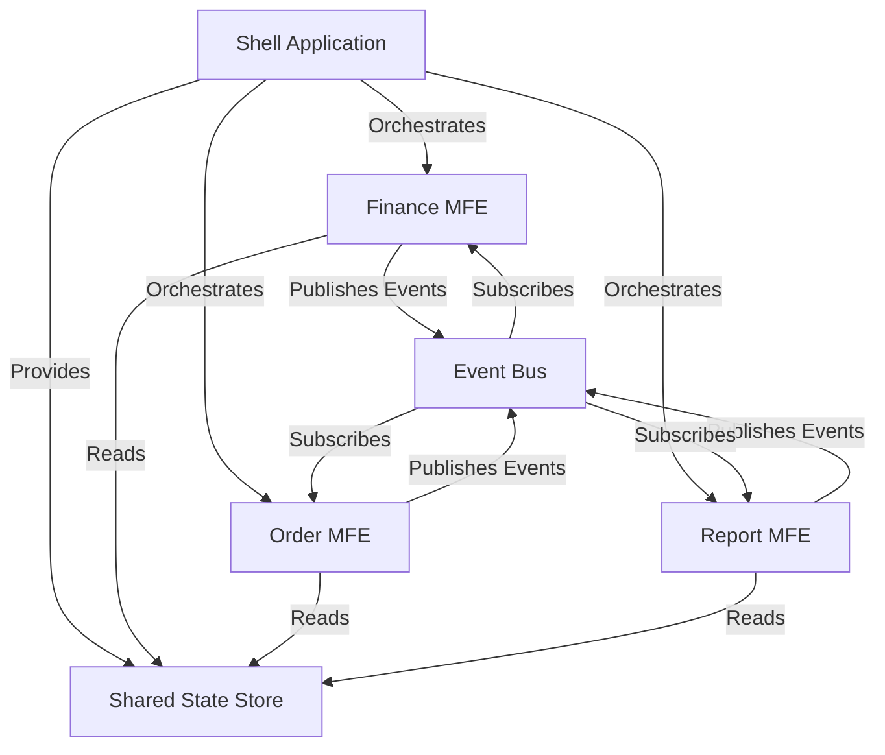
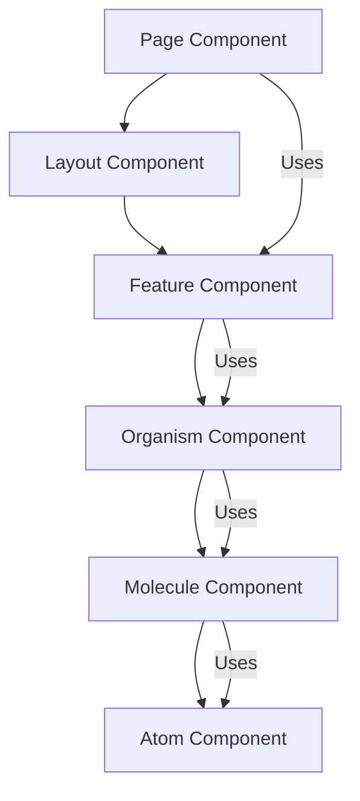

# Frontend Architecture -- Architecture Perspective

Frontend architecture encompasses the structural patterns that organize how applications are built, deployed, and composed. The choice between Single Page Applications (SPA), Micro-Frontends (MFE), or Server-Side Rendering (SSR) shapes everything from build tooling to routing strategies to component organization.

## Contents

- [Single Page Application (SPA)](#single-page-application-spa)
- [Multi-Page SPA](#multi-page-spa)
- [Micro-Frontend (MFE) Architecture](#micro-frontend-mfe-architecture)
- [Server-Side Rendering (SSR)](#server-side-rendering-ssr)
- [Component Architecture](#component-architecture)
- [Routing Patterns](#routing-patterns)

## Single Page Application (SPA)

A Single Page Application is a frontend architecture where a single JavaScript bundle manages the entire application lifecycle. The browser loads the application once, and subsequent navigation happens entirely on the client side through JavaScript routing. The server primarily serves static assets and provides API endpoints—it doesn't render HTML for each route.

### Architecture Characteristics

SPAs consist of a single deployment unit—one build process produces one bundle (or a set of code-split chunks) that represents the entire application. All routes, components, and features are part of the same codebase and deployed together. This creates a tight coupling between different parts of the application but simplifies deployment and ensures version consistency.

Client-side routing replaces traditional server-side navigation. Libraries like Vue Router or React Router intercept browser navigation events, match URLs to route configurations, and render the appropriate component tree without requesting new HTML from the server. The browser's history API maintains back/forward button functionality, and the URL bar reflects the current application state.

The application manages its own state lifecycle. When a user navigates from the dashboard to the orders page, the dashboard component unmounts, its state is cleaned up, and the orders component mounts with fresh state. State management libraries like Pinia (Vue) or Zustand (React) coordinate shared state across components, while component-local state handles UI-specific concerns.

### Code Splitting Strategies

Even within a monolithic SPA, code splitting improves performance by loading only the code needed for the current route. Route-based code splitting uses dynamic imports to load route components lazily. When a user navigates to `/orders`, the router dynamically imports the orders component, and the bundler creates a separate chunk that loads on demand.

Vue Router supports this through route-level dynamic imports: `component: () => import('./views/Orders.vue')`. React Router achieves the same with `React.lazy()`: `const Orders = React.lazy(() => import('./views/Orders'))`. The bundler (Vite, Webpack) automatically creates separate chunks for these dynamic imports.

Feature-based code splitting goes further by splitting heavy features or libraries. A reporting feature that includes charting libraries might be split into its own chunk, loaded only when users access reports. Component-level splitting can lazy-load heavy components like rich text editors or data visualization libraries.

### Routing Implementation

Vue Router uses a declarative route configuration where routes map to components. Nested routes enable parent-child component relationships—a layout component can contain child routes that render in named outlets. Route guards (beforeEnter, beforeRouteEnter) enable authentication checks, data prefetching, or redirects before navigation completes.

React Router follows a similar pattern but uses a component-based API where `<Route>` components define the routing structure. Nested routes are achieved through component composition, and route protection happens through wrapper components or custom hooks that check authentication state.

Both routers support route parameters (`/orders/:id`), query strings (`/orders?status=pending`), and programmatic navigation. They maintain browser history, support hash-based routing for static hosting, and can be configured for base paths in subdirectory deployments.

### State Management Integration

SPAs require careful state management because components share data across routes. A user's authentication state must persist across navigation. Shopping cart contents must remain available when moving between product browsing and checkout flows.

Pinia (Vue) and Zustand/TanStack Query (React) provide store patterns for shared state. Stores encapsulate business logic, handle async operations, and provide reactive state to components. Route-based state (URL parameters, query strings) complements store-based state, with the URL serving as the source of truth for navigable state.

## Multi-Page SPA

A Multi-Page SPA is a hybrid approach that maintains SPA characteristics—client-side routing, shared state, single codebase—but uses route-based code splitting so aggressively that each route feels like an independent page. The architecture remains a single deployment unit, but the performance characteristics approach those of a traditional multi-page application.

### Architecture Characteristics

The application is still built as a single bundle, but code splitting boundaries align with route boundaries. Each major route becomes its own chunk, loaded independently. The initial bundle contains only the shell—routing logic, shared layout components, and core utilities. Route-specific code loads on demand.

This approach provides many MFE benefits—faster initial load, independent optimization of route bundles—without the complexity of runtime composition. Teams can still work in parallel if routes align with team boundaries, but deployment remains coordinated.

### Route-Based Organization

The codebase organizes around routes rather than technical layers. A `/finance` route might have its own directory containing components, services, types, and utilities specific to that route. This feature-based organization improves code discoverability and enables teams to own entire routes even within a monolithic codebase.

Build tooling must support this pattern. Vite's route-based code splitting works seamlessly with dynamic imports. Webpack requires careful configuration to ensure route chunks are properly separated and shared dependencies are extracted into vendor bundles.

## Micro-Frontend (MFE) Architecture

Micro-Frontend architecture decomposes a frontend application into independently built and deployed applications that compose at runtime. Each MFE is a complete application with its own repository, build process, and deployment pipeline. A shell application (or host) orchestrates these MFEs, handling routing, authentication, shared layout, and loading the appropriate MFE for each route.

### Core Principles

MFEs are independently deployable. The finance team can deploy their MFE without coordinating with other teams. This requires careful contract design—MFEs must agree on shared interfaces, routing conventions, and communication patterns, but implementation details remain private to each MFE.

MFEs are technology-agnostic at the composition layer. While individual MFEs might use Vue 3, React, or even vanilla JavaScript, the shell application composes them through a common interface. This enables teams to choose the best technology for their domain while maintaining overall application coherence.

MFEs own their vertical slice. A finance MFE owns everything related to finance—components, API calls, routing within its domain, state management. This vertical ownership aligns with team boundaries and reduces cross-team dependencies.

### Build and Deploy Pipeline

Each MFE has an independent build and deployment pipeline, enabling teams to deploy changes without coordinating with other teams.

### Module Federation

Module Federation is a Webpack 5 and Vite feature that enables runtime sharing of JavaScript modules across independently built applications. The shell application and each MFE are separate builds, but they can share dependencies and expose modules to each other at runtime.

In a Module Federation setup, the shell application acts as the host, consuming remote modules from MFEs. Each MFE exposes entry points—components, routes, or entire feature modules—that the shell can load dynamically. Shared dependencies like React, Vue, or Propulsion components are marked as "shared" and loaded as singletons, preventing duplicate bundling.

The shell application declares which MFEs it consumes and which routes map to which MFE entry points. When a user navigates to `/finance/invoices`, the shell loads the finance MFE's remote entry, which exposes the invoices route component. The finance MFE's code executes within the shell's runtime, sharing the same React or Vue instance.

Module Federation requires careful version management. If the shell uses React 18.2 and a MFE uses React 18.3, Module Federation will load both versions unless React is marked as a shared singleton. Shared dependencies must have compatible versions, or the federation will fail or produce unexpected behavior.

Vite's Module Federation plugin provides similar capabilities to Webpack's native support. The configuration defines which modules to expose, which dependencies to share, and how to resolve remote entries. Both approaches enable the same architectural pattern with different build tooling.

### single-spa Framework

single-spa is a framework-agnostic micro-frontend orchestration library that doesn't rely on build-time module sharing. Instead, it defines a lifecycle API that any JavaScript application can implement, enabling composition of applications built with different frameworks or no framework at all.

Each MFE in a single-spa architecture implements lifecycle methods: `bootstrap`, `mount`, `unmount`, and optionally `update`. The shell application registers MFEs with routing configuration, and single-spa calls these lifecycle methods as users navigate. When a user navigates to a route owned by a MFE, single-spa calls that MFE's `mount` method, passing a DOM element where the MFE should render.

The `bootstrap` method runs once when the application first loads, performing one-time setup like initializing stores or loading configuration. The `mount` method renders the MFE into the provided DOM element. The `unmount` method cleans up when navigating away, ensuring proper memory management. The `update` method handles prop changes without full unmount/remount cycles.

single-spa's framework-agnostic approach means a Vue MFE, a React MFE, and an Angular MFE can all coexist in the same shell application. Each MFE uses its framework's rendering API within the lifecycle methods, and single-spa coordinates their execution. This flexibility comes at the cost of more manual integration work—each MFE must wrap its framework-specific code in single-spa lifecycle methods.

Routing in single-spa can be handled by the shell (root routing) or delegated to MFEs (sub-routing). Root routing means the shell owns all route definitions and MFEs are passive components. Sub-routing means MFEs register their own routes with single-spa, enabling more autonomy but requiring coordination to avoid route conflicts.

### Web Components

Web Components provide browser-native encapsulation through Custom Elements and Shadow DOM. MFEs built as Web Components are framework-agnostic at the composition layer—the shell application doesn't need to know whether a custom element uses Vue, React, or vanilla JavaScript internally.

A MFE exposes itself as a custom element, for example `<finance-invoices></finance-invoices>`. The shell application includes this element in its HTML, and the browser instantiates it. The custom element's implementation can use any framework internally, but the public API is the standard DOM element interface—attributes, properties, and events.

Shadow DOM provides style and DOM isolation. Styles defined within a Web Component's shadow DOM don't leak out, and external styles don't leak in (unless explicitly allowed). This solves CSS isolation challenges that plague other MFE composition strategies. However, Shadow DOM isolation can make it harder to apply global design system styles, requiring careful architecture of style distribution.

Web Components work well for widget-like MFEs that have clear boundaries and limited interaction with the shell. They're less ideal for MFEs that need deep integration with shell routing or shared state management, as the Web Components API doesn't provide built-in patterns for these concerns.

### Shell Application Responsibilities

The shell application (or host) orchestrates the entire micro-frontend architecture. It handles top-level concerns that span MFEs: authentication, routing, shared layout, error boundaries, and loading states.

Authentication in the shell ensures users are logged in before any MFE loads. The shell manages authentication state, token refresh, and redirects to login. MFEs receive authentication context through props, shared state, or events, but they don't implement authentication logic themselves.

Routing in the shell maps URL patterns to MFE entry points. When a user navigates to `/finance/invoices`, the shell determines that this route belongs to the finance MFE, loads that MFE if not already loaded, and delegates rendering to it. The shell maintains browser history and handles cross-MFE navigation.

Shared layout components—headers, sidebars, navigation—live in the shell to ensure consistency across MFEs. MFEs render into content areas defined by the shell's layout. This separation ensures visual consistency while allowing MFEs to focus on domain-specific functionality.

Error boundaries in the shell catch errors from MFEs, preventing one MFE's failure from crashing the entire application. The shell can display fallback UI, log errors, and allow users to navigate away from the failing MFE.

### Cross-MFE Communication

MFEs must communicate without tight coupling. Direct imports or shared mutable state create dependencies that break deployment independence. Instead, MFEs communicate through events, URL parameters, or shared but immutable configuration.

Custom events enable MFEs to publish and subscribe to domain events. When the order management MFE creates an order, it dispatches an `order-created` event. The finance MFE listens for this event and updates its invoice list. This event-driven communication maintains loose coupling while enabling coordination.

URL parameters serve as a communication channel for navigable state. When the finance MFE links to an order detail page in the order management MFE, it includes order ID in the URL. The order management MFE reads this parameter and displays the correct order. URL-based communication is visible, bookmarkable, and doesn't require direct MFE dependencies.

Shared configuration objects, distributed by the shell, provide immutable contracts. Authentication context, feature flags, and API endpoints can be provided to all MFEs without creating coupling. MFEs read this configuration but don't modify it, ensuring consistency without dependencies.

## Server-Side Rendering (SSR)

Server-Side Rendering generates HTML on the server for each request, sending fully-rendered pages to the browser. The browser receives HTML that's immediately renderable, then "hydrates" this HTML by attaching JavaScript event handlers and enabling client-side interactivity.

### Architecture Characteristics

SSR applications run on both server and client. The same component code executes in Node.js to generate initial HTML, then again in the browser to enable interactivity. This dual execution requires careful consideration of browser-only APIs, server-only logic, and code that must run in both environments.

The server receives a request, matches it to a route, renders the appropriate component tree to HTML, and sends the response. The HTML includes the rendered content plus a script tag that loads the client-side JavaScript bundle. When the JavaScript loads, it "hydrates" the existing HTML—attaching event listeners, initializing state, and enabling client-side navigation for subsequent requests.

Hydration must match the server-rendered HTML exactly. If the client renders different HTML than the server, React or Vue will warn about hydration mismatches and may recreate the DOM, losing performance benefits. This requires careful management of client-only state, browser APIs, and random values that differ between server and client renders.

### Nuxt (Vue) and Next.js (React)

Nuxt is a Vue 3 framework that provides SSR capabilities out of the box. It handles routing, code splitting, and server/client code organization automatically. Pages in the `pages/` directory become routes, and Nuxt generates the appropriate server and client bundles.

Next.js provides similar capabilities for React. The `pages/` or `app/` directory structure defines routes, and Next.js handles SSR, static site generation (SSG), and incremental static regeneration (ISR). Next.js's App Router introduces React Server Components, enabling more granular server/client component boundaries.

Both frameworks support hybrid rendering—some routes can be server-rendered while others are client-only SPAs. This enables teams to use SSR for SEO-critical pages (product listings, blog posts) while keeping interactive dashboards as client-side applications.

### When SSR Matters

SSR provides significant benefits for SEO because search engines receive fully-rendered HTML. Client-side rendered SPAs send empty HTML shells to crawlers, requiring JavaScript execution to see content. While modern crawlers execute JavaScript, SSR ensures content is immediately available without waiting for JavaScript bundles to load and execute.

Initial load performance improves with SSR because users see content immediately rather than waiting for JavaScript to download, parse, and execute. The First Contentful Paint (FCP) and Largest Contentful Paint (LCP) metrics improve significantly, especially on slower networks or devices.

SSR enables better social media sharing. When a link is shared on Twitter or Facebook, the platform's crawler receives fully-rendered HTML with proper meta tags, Open Graph images, and structured data. Client-side rendered SPAs often show generic metadata because the crawler doesn't execute JavaScript.

However, SSR adds complexity. Applications must run on both server and client, requiring careful code organization. Server rendering blocks the request until HTML generation completes, which can slow response times for complex pages. Caching strategies become more important to maintain performance under load.

## Component Architecture

Component architecture organizes how UI is decomposed into reusable, composable pieces. Regardless of whether you're building a SPA, MFE, or SSR application, component design patterns determine maintainability, testability, and developer experience.

### Atomic Design

Atomic Design organizes components into a hierarchy: atoms, molecules, organisms, templates, and pages. Atoms are the smallest building blocks—buttons, inputs, labels. Molecules combine atoms into functional units—a search form combines an input atom and a button atom. Organisms combine molecules and atoms into complex UI sections—a header organism contains navigation molecules and logo atoms.

Templates are page-level layouts that don't include real content—they define the structure where content will live. Pages are specific instances of templates with real content. This hierarchy creates a clear mental model for component relationships and encourages reusability.

In practice, atomic design works well for design systems. Propulsion components might be atoms and molecules, while feature-specific components are organisms. However, strict adherence to atomic design can create unnecessary abstraction layers. The goal is reusability and clarity, not rigid hierarchy.

### Feature-Based Organization

Feature-based organization groups code by business domain rather than technical layer. Instead of a `components/` folder containing all components, a `finance/` folder contains finance-specific components, services, types, and utilities. This organization aligns code with team ownership and makes features easier to discover and modify.

A feature folder might contain `components/`, `services/`, `types/`, `composables/` (Vue) or `hooks/` (React), and `utils/`. Everything related to that feature lives together, reducing the cognitive load of navigating a large codebase. Cross-feature dependencies are explicit imports, making coupling visible.

Feature-based organization works particularly well in MFE architectures where each MFE owns a feature domain. Even within a monolithic SPA, feature folders create clear boundaries and enable teams to own vertical slices of functionality.

### Smart vs Presentational Components

Smart components (container components) handle data fetching, state management, and business logic. They're connected to stores, make API calls, and manage complex state. Presentational components receive data through props and emit events—they're pure functions of their props with no side effects.

This separation improves testability because presentational components can be tested in isolation with mock props. Smart components require more setup—mocking stores, API calls, and routing—but contain the important business logic that must be tested.

In Vue 3, smart components might use composables for data fetching and state management, then pass data to presentational components. In React, custom hooks encapsulate smart component logic, and presentational components remain simple function components.

The boundary between smart and presentational isn't always clear. A component might start presentational but accumulate logic over time. Regular refactoring to extract logic into composables or hooks maintains the separation and keeps components focused.

### Composition Patterns

Component composition enables building complex UIs from simple pieces. Vue's slots and React's children prop allow components to accept and render arbitrary content. This creates flexible, reusable components that don't need to know their specific use case.

Render props in React and scoped slots in Vue enable even more sophisticated composition. A data table component might accept a render function that defines how each row renders, allowing the parent to customize rendering without the table component knowing about specific data structures.

Higher-order components (HOCs) in React wrap components to add functionality—authentication checks, data fetching, or styling. In Vue, similar patterns use composables or provide/inject. However, HOCs can create prop drilling and make component trees harder to understand, so they're used less frequently in modern React.

## Routing Patterns

Routing determines how URLs map to components and how navigation flows through the application. Different architectures require different routing strategies, but common patterns apply across frameworks.

### Client-Side Routing

Client-side routing intercepts browser navigation, matches URLs to route configurations, and renders components without full page reloads. Route configurations define path patterns, component mappings, route guards, and metadata like page titles or required permissions.

Nested routes enable parent-child component relationships. A `/dashboard` route might have child routes `/dashboard/overview` and `/dashboard/settings` that render in an outlet within the dashboard layout. This creates hierarchical UI structures that match information architecture.

Route guards enable authentication checks, authorization, data prefetching, or redirects before navigation completes. A guard might check if a user is authenticated, redirect to login if not, fetch required data, then allow navigation to proceed. Guards can be synchronous or asynchronous, enabling data loading during navigation.

Route-based code splitting integrates with routing to load route components lazily. The router configuration uses dynamic imports, and the bundler creates separate chunks. Navigation triggers chunk loading, with loading states displayed during the transition.

### Cross-MFE Routing Coordination

In MFE architectures, routing becomes more complex because multiple applications must coordinate. The shell application owns top-level routing and delegates sub-routes to MFEs. When a user navigates to `/finance/invoices/123`, the shell recognizes `/finance` as the finance MFE's domain and delegates `/invoices/123` to that MFE's internal router.

MFEs must register their route patterns with the shell to enable proper delegation. The shell's router configuration maps URL prefixes to MFE entry points. When navigation occurs, the shell determines which MFE owns the route, loads that MFE if needed, and passes the remaining path to the MFE's router.

Cross-MFE navigation requires careful URL design. Routes must be globally unique or namespaced by MFE domain. The finance MFE shouldn't claim `/orders` if the order management MFE owns that route. Route registries or naming conventions prevent conflicts.

Deep linking into MFE routes must work correctly. When a user bookmarks `/finance/invoices/123` or shares that URL, the shell must load the finance MFE and navigate to the correct internal route. This requires the shell to parse URLs and coordinate MFE loading before delegating routing.

## Shared Dependencies Strategy

Managing shared dependencies—React, Vue, Propulsion components, utility libraries—is critical in any frontend architecture but becomes especially important in MFE setups where duplicate dependencies inflate total bundle size.

### Externals Configuration

Marking dependencies as externals tells the bundler not to include them in the bundle. Instead, the application expects these dependencies to be available at runtime, typically loaded via script tags or provided by a CDN. This works well for large, stable dependencies like React or Vue.

In MFE architectures, the shell application can load shared dependencies and expose them to MFEs. Module Federation's shared configuration ensures MFEs use the same React instance rather than bundling their own copies. This requires version alignment—all MFEs must be compatible with the shared version.

### Shared Singleton Modules

Module Federation enables sharing modules as singletons across MFEs. When React is marked as shared, the first MFE to load provides the React instance, and subsequent MFEs use that same instance. This prevents duplicate bundling while maintaining framework functionality.

Shared modules must be compatible versions. If MFE A needs React 18.2 features and MFE B needs React 18.3 features, they can't share a singleton unless both versions are compatible. Version resolution strategies—using the highest compatible version or requiring exact matches—determine how conflicts are resolved.

### Version Alignment Strategies

Coordinated upgrades ensure all MFEs use the same dependency versions. When upgrading Propulsion from v2.1 to v2.2, all MFEs upgrade together in a coordinated release. This maintains compatibility but reduces deployment independence.

Alternatively, design systems can maintain backward compatibility guarantees, allowing MFEs to use different minor versions. Propulsion v2.1 and v2.2 might be compatible, enabling gradual upgrades. However, this requires careful API design and compatibility testing.

Dependency version monitoring becomes critical. Tools that detect version mismatches, analyze compatibility, and suggest alignment strategies help maintain shared dependency health. Automated checks in CI can prevent deployments that introduce incompatible versions.
