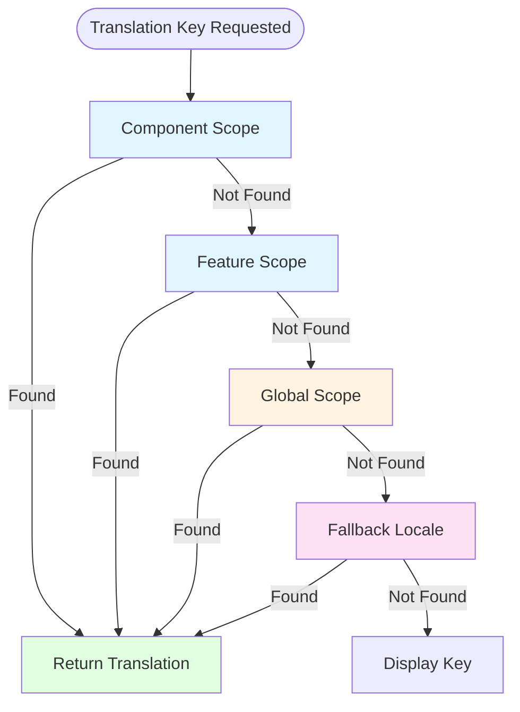
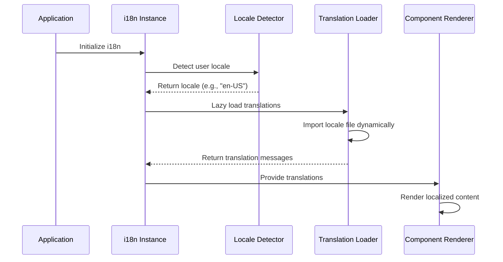

# Architecture: Internationalization

## Contents

- [i18n vs L10n](#i18n-vs-l10n)
- [Frontend i18n Architecture](#frontend-i18n-architecture)
- [Backend i18n Architecture](#backend-i18n-architecture)
- [Translation Workflow](#translation-workflow)
- [RTL Support](#rtl-support)

## i18n vs L10n

Internationalization (i18n) and localization (l10n) are distinct but related concepts. Internationalization is the technical work of making code and architecture support multiple languages and locales. It is done by developers as a one-time investment in the codebase structure. Localization is the process of adapting content for specific languages and locales. It is done by translators and is an ongoing effort that must be repeated for each new locale.

The relationship between i18n and l10n is that of foundation and content. i18n provides the infrastructure—message catalogs, locale resolution, formatting functions, pluralization support. l10n provides the actual translations and cultural adaptations that populate that infrastructure. You cannot localize without internationalization, but internationalization without localization simply means the infrastructure exists but only default-language content is available.

The separation of concerns is important. Developers focus on i18n architecture: ensuring all user-facing strings go through the i18n system, implementing locale resolution, setting up formatting functions, handling RTL support. Translators focus on l10n: creating accurate translations, adapting content for cultural context, ensuring consistency across the application. This division of labor allows each group to work efficiently within their expertise.

The cost structure differs significantly. i18n is a fixed cost—once the architecture is in place, it supports unlimited languages. l10n is a variable cost that scales with the number of languages and the frequency of content updates. Understanding this distinction helps with planning and budgeting. The i18n investment pays off as more languages are added, while l10n costs accumulate with each new locale.

## Frontend i18n Architecture

### Message Catalogs

Message catalogs are the foundation of frontend i18n. They store translations as key-value pairs, typically in JSON files organized by locale. Each locale has its own file: `en.json` for English, `de.json` for German, `fr.json` for French. The structure mirrors the application's feature organization, with namespaced keys like `common.save`, `billing.invoice.title`, `users.profile.editButton`.

### Message Resolution Chain

When a translation key is requested, the i18n system searches through multiple scopes in a specific order until a match is found.



The resolution chain starts with the most specific scope (component-level) and progressively falls back to broader scopes. If no translation is found in the current locale, the system checks the fallback locale (typically English). As a last resort, the key itself is displayed, making missing translations visible during development.

Key-based message lookup provides several advantages. Keys are stable identifiers that don't change when translations are updated. They serve as documentation, making it clear what content belongs to which feature. They enable fallback behavior—if a translation is missing, the key can be displayed or a default locale used. Keys also facilitate tooling for finding unused translations and identifying missing translations.

The message catalog structure should mirror the application's feature structure. If the codebase is organized by feature modules, the translation keys should follow the same organization. This makes it easy for developers to find relevant translations and for translators to understand context. Flat key structures with hundreds of keys become unmaintainable; hierarchical structures scale better.

Interpolation allows dynamic content within translated messages. Instead of concatenating strings like "Hello, " + name, use interpolation: "Hello, {name}". The i18n library replaces placeholders with actual values, and translators can reorder the sentence structure as needed for their language. This is critical because word order varies significantly between languages—what works in English may be grammatically incorrect in other languages.

### Vue 3 with vue-i18n

Vue 3 applications use vue-i18n for internationalization. The library integrates deeply with Vue's reactivity system and template compilation. In templates, use `$t('key')` to translate strings: `<button>{{ $t('common.save') }}</button>`. The `$t` function is available globally in all templates and automatically updates when the locale changes.

In the Composition API, use the `useI18n()` composable to access translation functions. This provides type safety and better integration with Vue's reactivity. The composable returns `t` for translations, `locale` for the current locale, and `availableLocales` for supported languages. Use it in setup functions: `const { t, locale } = useI18n()`.

Lazy loading locale files reduces initial bundle size. Instead of importing all translation files at startup, load only the active locale initially. When users switch languages, load the new locale file dynamically. vue-i18n supports this through `defineI18nLocale` and dynamic imports. The performance benefit is significant for applications with many languages or large translation files.

Locale switching without page reload is a key UX feature. vue-i18n updates translations reactively, so changing the locale immediately updates all displayed text without requiring a full page refresh. Store the user's locale preference in localStorage or a user profile, and restore it on subsequent visits. The locale change should be instant and seamless.

vue-i18n supports ICU message format for complex pluralization and formatting. Use it for messages with conditional logic based on counts or other variables. The library handles the complexity of plural rules across languages, so developers don't need to implement language-specific logic.

### React with react-intl or i18next

React applications have two primary i18n options: react-intl (part of FormatJS) and i18next. react-intl is specifically designed for React and provides excellent TypeScript support. i18next is framework-agnostic and has a larger ecosystem with plugins for various frameworks.

react-intl uses `<FormattedMessage>` components for translations in JSX. The component handles interpolation, pluralization, and formatting automatically. For imperative translations outside JSX, use the `useIntl()` hook which provides a `formatMessage` function. The hook integrates with React's context system, so locale changes propagate automatically to all components.

Message extraction is critical for React applications. The FormatJS CLI scans code for `<FormattedMessage>` components and `formatMessage` calls, extracting message IDs and default text into JSON files for translation. This ensures no translatable strings are missed and provides a single source of truth for what needs translation.

ICU message format is the standard for react-intl. It provides a rich syntax for pluralization, number formatting, date formatting, and conditional messages. The format is language-agnostic and handles the complexity of different languages' rules automatically. Learning ICU syntax is essential for effective React i18n.

i18next provides similar functionality with a different API. It uses `t()` function calls throughout the codebase and supports namespaces for organizing translations. The library has extensive plugin support for features like language detection, caching, and backend loading. i18next is a good choice for applications that may need to share i18n logic across React and other frameworks.

### Interpolation and Pluralization

Interpolation allows dynamic values within translated messages. The syntax varies by library but generally follows patterns like `{name}` or `{{name}}`. Translators can reorder placeholders as needed for their language's grammar. Never concatenate translated strings—word order differences will break the translation.

Pluralization is one of the most complex aspects of i18n. Different languages have different plural rules. English has two forms: singular and plural. Russian has three forms based on the number's ending digit. Arabic has six plural forms. Polish has complex rules involving the number's last two digits. Simple if/else logic cannot handle this complexity.

ICU message format solves pluralization with a standard syntax: `{count, plural, one {# item} other {# items}}`. The i18n library evaluates the count against the language's plural rules and selects the appropriate form. The `#` symbol represents the formatted number. This approach works across all languages without language-specific code.

Pluralization must be handled in the message itself, not in application logic. Don't write code like "if count === 1 then singular else plural"—this breaks in languages with more than two plural forms. Instead, use the i18n library's pluralization functions and let them handle the language-specific rules.

### Date, Number, and Currency Formatting

Format dates, numbers, and currencies on the frontend using the browser's Intl APIs. `Intl.DateTimeFormat` formats dates according to locale conventions. `Intl.NumberFormat` handles number and currency formatting. `Intl.DisplayNames` provides localized names for languages, regions, and other entities.

The backend should return data in locale-neutral formats: ISO 8601 dates, unformatted numbers, currency amounts with currency codes. The frontend formats these values for display based on the user's locale. This separation ensures consistency and allows the same API to serve users in different locales.

Don't send pre-formatted strings from the backend. Formatted strings cannot be reformatted for different locales, cannot be sorted or filtered correctly, and break the separation of concerns between data and presentation. Always format on the frontend where the user's locale is known.

Currency formatting requires the currency code, not just the symbol. The same symbol may represent different currencies (dollar sign for USD, CAD, AUD, etc.), and the positioning varies by locale. Use `Intl.NumberFormat` with the currency option and the appropriate currency code.

Date formatting must respect locale conventions for date order, separator characters, and whether to include time. Some locales use 24-hour time, others use 12-hour with AM/PM. Some locales include the day of the week, others don't. The Intl API handles all these variations automatically.

### Translation Loading Flow

The translation loading process begins at application initialization and continues through locale detection and lazy loading.



The flow starts when the application initializes the i18n instance. The locale detector determines the user's preferred language from browser settings, cookies, or user profile. The translation loader dynamically imports only the required locale file, reducing initial bundle size. Once loaded, translations are available to all components for rendering.

### Lazy Loading Locales

Loading all locale files at application startup increases bundle size unnecessarily. Most users only need one language, so loading translations for ten languages wastes bandwidth and slows initial load. Lazy loading loads only the active locale initially, then loads additional locales on demand when users switch languages.

Implement lazy loading using dynamic imports. When the application starts, import only the default locale. When a user switches languages, dynamically import the new locale file and update the i18n instance. Most i18n libraries support this pattern through configuration options or explicit loading functions.

Lazy loading requires handling loading states. While a new locale file loads, the application should show a loading indicator or continue displaying the previous locale until the new one is ready. The transition should be smooth and not disrupt the user experience.

Code splitting works well with lazy loading. Each locale file can be its own chunk, loaded only when needed. This reduces the initial bundle size and improves performance, especially for applications with many languages or large translation files.

## Backend i18n Architecture

### Spring MessageSource

Spring Boot applications use MessageSource for internationalization. MessageSource is an interface that provides message lookup based on locale. The most common implementation is ResourceBundleMessageSource, which loads messages from property files in the classpath.

Message files follow naming conventions: `messages.properties` for the default locale, `messages_de.properties` for German, `messages_fr.properties` for French. The files contain key-value pairs matching the frontend message catalogs. Spring loads the appropriate file based on the resolved locale.

Configure MessageSource as a Spring bean with basename and other properties. Set the basename to the base name of your message files (e.g., "messages" for files like `messages.properties`). Configure fallback behavior—whether to use the default locale if a translation is missing, or to display the message key.

MessageSource supports parameterized messages using Java's MessageFormat syntax. Use placeholders like `{0}` for the first parameter, `{1}` for the second, etc. This enables interpolation similar to frontend i18n libraries. MessageSource handles pluralization less elegantly than frontend libraries—often requiring separate message keys for singular and plural forms.

### Locale Resolution

Locale resolution determines which locale to use for a given request. Spring provides several LocaleResolver implementations, each using a different strategy. The choice of resolver depends on the application's requirements and user experience design.

AcceptHeaderLocaleResolver reads the `Accept-Language` HTTP header sent by the browser. This is the most automatic approach—users don't need to explicitly select a language, the application uses their browser's language preference. However, browser language settings may not reflect user preferences accurately, especially on shared devices.

CookieLocaleResolver stores the locale preference in a cookie. This allows users to explicitly select a language, and that choice persists across sessions. The cookie-based approach works well for applications where users can set preferences, but requires cookie support and may not work in all environments.

SessionLocaleResolver stores the locale in the HTTP session. This is similar to cookie-based resolution but uses server-side session storage instead of cookies. It works well for applications with user sessions but doesn't persist across sessions unless combined with user profile storage.

FixedLocaleResolver always uses a fixed locale, ignoring user preferences. This is useful for testing or applications that only support one language. It's not suitable for internationalized applications.

Custom locale resolvers can implement application-specific logic. For example, resolve locale based on user profile preferences stored in a database, or based on URL path patterns like `/en/products` or `/de/products`. Custom resolvers provide maximum flexibility but require more implementation effort.

The precedence order for locale resolution should be: explicit user selection (highest priority), user profile preference, URL path or subdomain, Accept-Language header, default locale (lowest priority). This ensures user choices are respected while providing sensible defaults.

### API Responses

API responses should be localized for user-facing content but locale-neutral for data. Error messages, validation messages, and user guidance should be translated. Dates, numbers, and other data should be returned in neutral formats for frontend formatting.

Return error messages in the user's locale. Use MessageSource to look up error messages based on the resolved locale. Include error codes or keys alongside translated messages so frontends can handle errors programmatically. This dual approach—human-readable translated messages and machine-readable error codes—provides the best of both worlds.

Validation messages must be localized. Spring's validation framework integrates with MessageSource, so validation error messages can be translated automatically. Configure validators to use MessageSource for message lookup, ensuring users see validation errors in their language.

Data should be returned in locale-neutral formats. Return dates as ISO 8601 strings, numbers as unformatted values, currencies as amounts with currency codes. The frontend formats these values for display based on the user's locale. This separation allows the same API to serve users in different locales without duplicating data formatting logic.

Exception: email and notification content should be localized on the backend. These are sent outside the web application context, so the frontend cannot format them. The backend must determine the recipient's locale (from user profile, email preferences, or Accept-Language header) and format content accordingly. Use MessageSource or a templating engine with i18n support for email content.

### Database Storage

Storing translatable content in databases requires careful schema design. Two primary approaches exist: separate translations table or JSONB columns for multilingual fields. Each has trade-offs in query complexity, performance, and flexibility.

The translations table approach uses a separate table with columns for entity ID, locale, field name, and translated value. This normalizes translations and makes it easy to add new languages without schema changes. However, queries become more complex, requiring joins to retrieve translated content, and performance can suffer with many translations.

JSONB columns store translations as JSON objects with locale keys. This denormalizes translations but simplifies queries—no joins required. JSONB provides good query performance and flexibility for adding languages. However, it's less normalized and may be harder to query across all locales for a specific field.

Choose the approach based on query patterns. If you frequently query translated content for a single locale, JSONB may be simpler. If you need to query or update translations across all locales, a translations table may be better. Many applications use a hybrid approach: JSONB for simple fields, translations table for complex multilingual content.

Consider full-text search requirements. If users need to search content in multiple languages, the storage approach affects search implementation. JSONB allows indexing translations, while translations tables may require separate search indexes per locale.

## Translation Workflow

The translation workflow spans from development through release. Understanding the complete workflow helps teams plan translation efforts, estimate timelines, and ensure quality. The workflow involves multiple stakeholders: developers who write code, translators who create translations, reviewers who validate quality, and release managers who coordinate deployment.

### Extraction Phase

Extraction is the process of identifying all translatable strings in code and generating message catalogs. This phase happens during development and before translation begins.

**How Extraction Works**:
1. **Code Scanning**: Tools scan source code for i18n function calls (`$t()`, `<FormattedMessage>`, `t()`)
2. **Key Identification**: Tools identify message keys and extract default text (typically English)
3. **Catalog Generation**: Tools generate or update message files (JSON, properties) with keys and default text
4. **Context Collection**: Advanced tools capture context: file location, component usage, screenshots

**Extraction Tools**:
- **Vue**: `vue-i18n-extract` scans `.vue` files for `$t()` calls and `useI18n()` usage
- **React**: `FormatJS CLI` scans JSX for `<FormattedMessage>` and `formatMessage()` calls
- **Spring Boot**: Message extraction plugins scan Java/Kotlin code for `MessageSource.getMessage()` calls

**Extraction Best Practices**:
- Run extraction regularly (daily or per feature) to catch new strings early
- Include context comments in message files to help translators understand usage
- Validate extraction completeness—missing strings create gaps in translations
- Track extraction metrics: new keys per release, total keys, keys without translations

**Common Extraction Issues**:
- **Dynamic keys**: Keys constructed at runtime aren't detected (`$t('msg.' + type)`)
- **Conditional usage**: Keys used conditionally may be missed if conditions aren't met during scanning
- **Template strings**: Keys in template literals may require special handling
- **Third-party components**: Strings in library components may not be extractable

### Translation Phase

Translation converts source language strings into target languages. This phase involves professional translators, translation agencies, or community contributors.

**Translation Channels**:

**Professional Translation Services**: 
- **Process**: Send message files to translation agency, receive translated files
- **Timeline**: 1-2 weeks for initial translation, 2-3 days for updates
- **Cost**: $0.10-$0.30 per word depending on language pair and complexity
- **Quality**: High quality with subject matter expertise
- **Best For**: Critical content, legal text, marketing copy, initial translations

**Translation Management Systems (TMS)**:
- **Process**: Upload message files to TMS platform, translators work in web interface, download translated files
- **Timeline**: Similar to professional services but with better workflow management
- **Cost**: TMS subscription ($50-$500/month) plus translation costs
- **Quality**: High quality with built-in quality assurance tools
- **Best For**: Ongoing translation needs, multiple languages, teams with dedicated translators

**TMS Workflow Example** (Crowdin/Phrase/Lokalise):
1. Developer pushes code, CI extracts strings and uploads to TMS
2. TMS notifies translators of new/updated strings
3. Translators work in TMS interface with context screenshots and glossary
4. Reviewers validate translations for accuracy and consistency
5. Approved translations are downloaded and committed to codebase
6. CI validates completeness and deploys with code

**Manual File Editing**:
- **Process**: Translators edit JSON/properties files directly or via pull requests
- **Timeline**: Varies based on translator availability
- **Cost**: Low (no platform costs) but higher coordination overhead
- **Quality**: Varies based on translator expertise
- **Best For**: Small projects, community translations, technical teams comfortable with file editing

**Machine Translation + Human Review**:
- **Process**: Generate initial translations with GPT/DeepL/Google Translate, human reviewers edit
- **Timeline**: Fast initial generation (hours), review adds 1-2 days
- **Cost**: Lower than full human translation ($0.01-$0.05 per word)
- **Quality**: Good for straightforward content, requires review for technical/cultural content
- **Best For**: Rapid expansion to many languages, non-critical content, technical documentation

### Review Phase

Review ensures translation quality through human validation. Automated checks catch some issues, but human review is essential for accuracy, consistency, and cultural appropriateness.

**Review Types**:

**Accuracy Review**: Native speakers verify that translations accurately convey the source meaning. This catches mistranslations, missing nuances, and incorrect technical terminology.

**Consistency Review**: Reviewers ensure consistent terminology across the application. Glossary management helps maintain consistency—terms like "invoice," "subscription," and "billing" should translate consistently everywhere.

**Cultural Appropriateness Review**: Reviewers verify that translations are culturally appropriate. This includes tone (formal vs. casual), imagery references, and cultural sensitivities. What works in one culture may be inappropriate in another.

**Automated Review Checks**:
- **Missing translations**: Ensure all keys have translations
- **Placeholder validation**: Verify interpolation placeholders match (`{name}` in all locales)
- **Length validation**: Flag translations significantly longer than source (may break layouts)
- **Terminology consistency**: Check glossary compliance
- **HTML/formatting validation**: Ensure HTML tags and formatting are preserved correctly

**Review Workflow**:
1. **Initial Review**: Native speaker reviews all new translations
2. **Consistency Check**: Terminology reviewer verifies glossary compliance
3. **Final Approval**: Subject matter expert or product owner approves for release
4. **Post-Release Review**: Monitor user feedback and update translations as needed

### Integration Phase

Integration merges translated files back into the codebase and validates completeness before release.

**Integration Methods**:

**Git-Based Integration**:
- Translators commit translated files via pull requests
- CI validates completeness and formatting
- Merge after review approval
- **Pros**: Full version control, code review process
- **Cons**: Requires technical knowledge, merge conflicts possible

**TMS Auto-Sync**:
- TMS platform commits translated files automatically via webhook
- CI validates and deploys
- **Pros**: Automated, no manual git work
- **Cons**: Less control, potential for automated commits to break things

**CI/CD Pipeline Integration**:
- Translations downloaded from TMS as part of build process
- Validated during CI, deployed with application code
- **Pros**: Always up-to-date, no manual sync needed
- **Cons**: Requires TMS API access, network dependency

**Completeness Validation**:
Before release, validate that all keys have translations:
- **Blocking**: Fail build if any key missing translation (strict)
- **Warning**: Warn but allow release with fallback to default locale (lenient)
- **Per-Locale**: Some locales may be incomplete while others are ready

**Missing Translation Handling**:
- **Display Key**: Show the message key (e.g., `common.save`) — visible but not user-friendly
- **Fallback Locale**: Use default locale (typically English) — better UX but may confuse users
- **Placeholder**: Show placeholder text ("Translation missing") — clear but unprofessional
- **Block Release**: Don't deploy until complete — safest but delays releases

### Release Phase

Release deploys updated translations with application code. Translation updates may happen independently of code releases or bundled together.

**Release Strategies**:

**Bundled Releases**: Translations deploy with code changes. This ensures translations match code features but requires coordinating translation completion with code releases.

**Independent Translation Releases**: Translations update independently via feature flags or hot-reload. This allows faster translation iteration but requires code to handle missing translations gracefully.

**Translation Versioning**: Version translations separately from code if they update independently. This enables tracking translation changes and rolling back translation updates without code changes.

**A/B Testing Translations**: Some applications test different translations to measure impact on user engagement. This requires infrastructure to serve different translations to different user segments and measure outcomes.

**Post-Release Monitoring**: Monitor user feedback, support tickets, and analytics to identify translation issues. Update translations based on feedback in subsequent releases.

## RTL Support

Right-to-left (RTL) languages like Arabic and Hebrew require special layout handling. Simply translating content into RTL languages without proper support creates a confusing, broken experience. RTL support must be built into the architecture from the start.

CSS logical properties are the foundation of RTL support. Use `margin-inline-start` instead of `margin-left`, `padding-inline-end` instead of `padding-right`. These properties automatically adapt to text direction—they become left margins/padding for LTR and right margins/padding for RTL. Physical properties like `left` and `right` don't adapt and break RTL layouts.

**Component-Level RTL Concerns**:

RTL support requires attention at the component level, not just CSS. Components must handle direction-aware positioning, icon mirroring, and interaction patterns that differ between LTR and RTL.

**Why Component-Level RTL Matters**: CSS `direction: rtl` alone doesn't solve all RTL issues. Components with JavaScript positioning logic, directional icons, and complex layouts need explicit RTL handling. Without component-level support, RTL layouts break in subtle ways that CSS alone cannot fix.

**Navigation Menus**:

Navigation menus must align to the start edge (left in LTR, right in RTL) and flow in the correct direction.

```css
/* Bad: Physical properties break RTL */
.nav-menu {
  float: left; /* Always floats left, even in RTL */
  margin-left: 1rem; /* Always left margin */
  padding-right: 1rem; /* Always right padding */
}

/* Good: Logical properties adapt */
.nav-menu {
  float: inline-start; /* Left in LTR, right in RTL */
  margin-inline-start: 1rem; /* Start margin adapts */
  padding-inline-end: 1rem; /* End padding adapts */
}

/* Navigation item alignment */
.nav-item {
  text-align: start; /* Not 'left' - adapts to direction */
  margin-inline-end: 1rem; /* Space between items */
}

/* Dropdown menu positioning */
.nav-dropdown {
  /* Menu should align to start edge of trigger */
  position: absolute;
  inset-inline-start: 0; /* Not 'left: 0' */
}
```

**Common Navigation RTL Issues**:
- **Logo positioning**: Logos typically appear at the start edge. Use `margin-inline-start: 0` not `margin-left: 0`
- **Menu item order**: Visual order should reverse, but DOM order typically stays the same (CSS handles visual reversal)
- **Active indicator**: Underlines or highlights should appear on the start edge, not always the left
- **Mobile menu**: Hamburger menu typically appears at start edge, menu slides in from start edge

**Form Layouts**:
```css
/* Form labels and inputs need RTL-aware alignment */
.form-group {
  display: flex;
  flex-direction: row;
  /* Labels should align to start (left in LTR, right in RTL) */
  label {
    text-align: start; /* Not 'left' */
    margin-inline-end: 0.5rem; /* Not 'margin-right' */
  }
}
```

**Icons and Images**:
```css
/* Directional icons should mirror in RTL */
.chevron-right {
  transform: scaleX(1);
}

[dir="rtl"] .chevron-right {
  transform: scaleX(-1); /* Mirror horizontally */
}

/* Or use CSS logical properties for positioning */
.icon {
  margin-inline-start: 0.5rem; /* Adapts to direction */
}
```

**Component-Level RTL Patterns**:

**Vue 3 RTL Component**:
```vue
<template>
  <div :dir="localeDirection">
    <nav class="navigation">
      <ul>
        <li v-for="item in navItems" :key="item.id">
          <a :href="item.href">{{ item.label }}</a>
        </li>
      </ul>
    </nav>
  </div>
</template>

<script setup lang="ts">
import { computed } from 'vue'
import { useI18n } from 'vue-i18n'

const { locale } = useI18n()

const rtlLocales = ['ar', 'he', 'fa', 'ur']
const localeDirection = computed(() => 
  rtlLocales.includes(locale.value) ? 'rtl' : 'ltr'
)
</script>

<style scoped>
.navigation {
  /* Use logical properties */
  padding-inline-start: 1rem;
  margin-inline-end: auto;
}

.navigation ul {
  display: flex;
  flex-direction: row;
  gap: 1rem;
}

.navigation a {
  text-align: start; /* Adapts to direction */
}
</style>
```

**React RTL Component**:
```tsx
import { useLocale } from 'react-intl'

function Navigation() {
  const { locale } = useLocale()
  const isRTL = ['ar', 'he', 'fa', 'ur'].includes(locale)

  return (
    <nav dir={isRTL ? 'rtl' : 'ltr'}>
      <ul>
        {items.map(item => (
          <li key={item.id}>
            <a href={item.href}>{item.label}</a>
          </li>
        ))}
      </ul>
    </nav>
  )
}
```

**Common RTL Component Issues**:

**Modals/Dialogs**: Close buttons and content alignment must adapt to RTL.

```css
/* Modal close button positioning */
.modal-close {
  position: absolute;
  inset-inline-end: 1rem; /* Right in LTR, left in RTL */
  inset-block-start: 1rem; /* Top in both directions */
}

/* Modal content alignment */
.modal-content {
  text-align: start; /* Adapts to direction */
  padding-inline-start: 2rem;
  padding-inline-end: 2rem;
}

/* Modal footer button order */
.modal-footer {
  display: flex;
  flex-direction: row;
  justify-content: flex-end; /* Buttons align to end */
  gap: 1rem;
}

/* In RTL, flex-direction: row-reverse may be needed for button order */
[dir="rtl"] .modal-footer {
  flex-direction: row-reverse; /* Primary button on right in RTL */
}
```

**Why This Matters**: Users expect close buttons in the top-right corner in LTR, but top-left in RTL. Misplaced close buttons confuse users and violate cultural expectations. Button order in footers also matters—primary actions typically appear on the right in LTR but left in RTL.

**Dropdowns**: Menu positioning logic must account for RTL to prevent menus from appearing off-screen.

```typescript
// Bad: Hardcoded left positioning
function positionDropdown(trigger: HTMLElement, menu: HTMLElement) {
  const rect = trigger.getBoundingClientRect()
  menu.style.left = `${rect.left}px` // Breaks in RTL
}

// Good: Direction-aware positioning
function positionDropdown(trigger: HTMLElement, menu: HTMLElement) {
  const rect = trigger.getBoundingClientRect()
  const isRTL = document.documentElement.dir === 'rtl'
  
  if (isRTL) {
    // Align to right edge of trigger in RTL
    menu.style.right = `${window.innerWidth - rect.right}px`
    menu.style.left = 'auto'
  } else {
    // Align to left edge of trigger in LTR
    menu.style.left = `${rect.left}px`
    menu.style.right = 'auto'
  }
  
  // Or use logical properties in CSS
  menu.style.insetInlineStart = `${rect.left}px`
}
```

**Tooltips**: Tooltip positioning must mirror for RTL to prevent tooltips from appearing off-screen or overlapping content incorrectly.

```typescript
// Tooltip positioning library (Popper.js, Floating UI) should handle RTL automatically
// But custom positioning logic must account for direction
function positionTooltip(trigger: HTMLElement, tooltip: HTMLElement, placement: string) {
  const isRTL = document.documentElement.dir === 'rtl'
  
  // Mirror placement in RTL
  const rtlPlacement = isRTL ? {
    'left': 'right',
    'right': 'left',
    'start': 'end',
    'end': 'start'
  }[placement] || placement : placement
  
  // Use rtlPlacement for positioning logic
}
```

**Carousels**: Swipe direction should feel natural in RTL—swiping right should go to the next item in LTR, but previous item in RTL.

```typescript
// Carousel swipe handling
function handleSwipe(direction: 'left' | 'right', currentIndex: number, items: any[]) {
  const isRTL = document.documentElement.dir === 'rtl'
  
  // Reverse swipe direction interpretation in RTL
  const effectiveDirection = isRTL 
    ? (direction === 'left' ? 'right' : 'left')
    : direction
    
  if (effectiveDirection === 'right') {
    return Math.min(currentIndex + 1, items.length - 1)
  } else {
    return Math.max(currentIndex - 1, 0)
  }
}
```

**Breadcrumbs**: Arrow direction should point in the reading direction—right in LTR, left in RTL.

```css
/* Breadcrumb separator */
.breadcrumb-separator::after {
  content: '→'; /* Right arrow in LTR */
}

[dir="rtl"] .breadcrumb-separator::after {
  content: '←'; /* Left arrow in RTL */
}

/* Or use CSS transform to mirror */
.breadcrumb-separator {
  display: inline-block;
}

[dir="rtl"] .breadcrumb-separator {
  transform: scaleX(-1); /* Mirror horizontally */
}
```

**Why These Details Matter**: RTL users have cultural expectations about interface behavior. Components that don't adapt feel broken and unprofessional. These adaptations aren't optional—they're essential for usable RTL interfaces.

Set the `dir` attribute on the HTML element based on the current locale. For RTL languages, set `dir="rtl"`. For LTR languages, set `dir="ltr"` or omit it (LTR is the default). The direction attribute affects text flow, layout, and interactive elements automatically when combined with logical properties.

**Setting Direction Dynamically**:
```typescript
// Vue 3
watch(locale, (newLocale) => {
  const isRTL = ['ar', 'he', 'fa', 'ur'].includes(newLocale)
  document.documentElement.dir = isRTL ? 'rtl' : 'ltr'
  document.documentElement.lang = newLocale
})

// React
useEffect(() => {
  const isRTL = ['ar', 'he', 'fa', 'ur'].includes(locale)
  document.documentElement.dir = isRTL ? 'rtl' : 'ltr'
  document.documentElement.lang = locale
}, [locale])
```

CSS frameworks like Tailwind CSS support RTL variants. Use classes like `rtl:ml-4` for RTL-specific styles. However, prefer logical properties over RTL variants—logical properties work for both directions without duplication.

**Tailwind RTL Support**:
```html
<!-- Use logical properties when possible -->
<div class="ms-4 me-2"> <!-- margin-start, margin-end -->
  Content
</div>

<!-- RTL variants when logical properties aren't available -->
<div class="rtl:ml-4 ltr:mr-4">
  Content
</div>
```

Bidirectional text occurs when LTR and RTL content mix in the same string. The Unicode bidirectional algorithm handles most cases automatically, but complex scenarios may require explicit directional markers. Use Unicode directional marks sparingly—they're usually unnecessary if the overall text direction is set correctly.

**Bidirectional Text Handling**:
```typescript
// Arabic text with English product name
const message = t('product.name', { 
  name: 'iPhone' // English name in Arabic text
})

// Unicode directional marks (use sparingly)
const mixedText = '\u202B' + arabicText + '\u202C' + englishText
// \u202B = Right-to-left embedding
// \u202C = Pop directional formatting
```

Test RTL support with actual RTL content, not just `dir="rtl"` on English text. English text in RTL mode doesn't reveal layout issues the same way Arabic or Hebrew text does. Use real translations or pseudo-localization that includes RTL characters to properly test RTL support.

Icon and image mirroring may be needed for RTL. Icons that imply direction (arrows, chevrons) should mirror in RTL. Decorative images usually don't need mirroring, but images with text or directional content may. Use CSS transforms or separate RTL image assets as needed.
