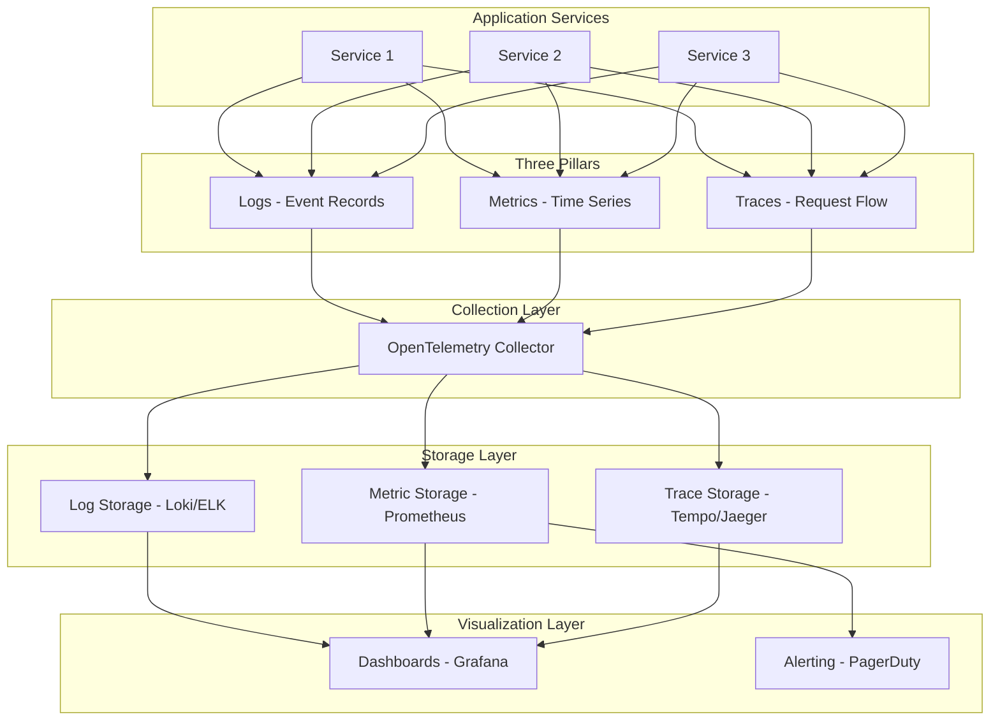
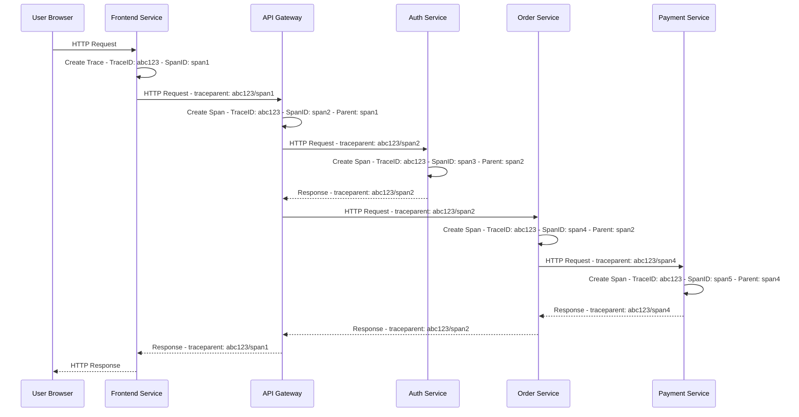

# Architecture: Observability

## Contents

- [The Three Pillars of Observability](#the-three-pillars-of-observability)
- [Logging Architecture](#logging-architecture)
- [Frontend Observability](#frontend-observability)
- [OpenTelemetry Architecture](#opentelemetry-architecture)
- [Alerting](#alerting)
- [Dashboards](#dashboards)

Observability architecture centers on three pillars: logs, metrics, and traces. Each pillar provides different insights, and together they enable comprehensive understanding of system behavior. Modern observability stacks integrate these pillars through standardized instrumentation and unified backends.

## The Three Pillars of Observability



## The Three Pillars of Observability

### Logs

Logs are structured records of discrete events. They capture what happened, when it happened, and in what context. Structured logging—using JSON format with consistent field names—enables querying and aggregation across services.

Every log entry should include:
- **Timestamp**: Precise time of the event, preferably in UTC with millisecond precision
- **Level**: ERROR (something failed, needs attention), WARN (something unexpected but handled), INFO (significant business events), DEBUG (detailed diagnostic info, not in production by default)
- **Message**: Human-readable description of the event
- **Service Name**: Identifies which service generated the log
- **Trace ID**: Links the log to a distributed trace
- **Span ID**: Identifies the specific operation within the trace
- **Correlation ID**: Business-level identifier (order ID, user ID, request ID) that enables tracking a business operation across services
- **Business Context**: Relevant domain data (user ID, tenant ID, order ID) that enables filtering logs by business entity

Structured logging with Logback and JSON encoding is standard in Spring Boot applications. The LogstashEncoder produces JSON-formatted logs with consistent structure. MDC (Mapped Diagnostic Context) allows adding trace IDs, correlation IDs, and other context to all log lines within a request scope, ensuring every log entry includes the necessary context for correlation.

Log aggregation centralizes logs from all services into a single searchable store. The ELK stack (Elasticsearch, Logstash, Kibana), Loki, or cloud-native solutions (CloudWatch Logs, Azure Monitor Logs) provide this capability. Centralized logging enables searching across services, correlating events, and identifying patterns that span multiple systems.

### Metrics

Metrics are numeric measurements over time. They aggregate events into time-series data, enabling trend analysis and alerting. Metrics fall into three categories:

- **Counters**: Monotonically increasing values (request count, error count, bytes transferred). Counters measure cumulative events and are typically used to calculate rates (requests per second).

- **Gauges**: Point-in-time values (queue depth, active connections, memory usage). Gauges represent the current state and can increase or decrease.

- **Histograms**: Distributions of values (request latency, response size). Histograms enable percentile calculations (p50, p95, p99) which are more meaningful than averages for understanding user experience.

Micrometer is Spring Boot's metrics abstraction layer. It provides annotations (@Timed, @Counted) and a programmatic API for recording metrics. Micrometer exports to multiple backends (Prometheus, Datadog, CloudWatch, InfluxDB) without changing application code, providing vendor portability.

RED metrics (Rate, Errors, Duration) should be applied to every service:
- **Rate**: Requests per second, measuring throughput
- **Errors**: Error rate as a percentage of total requests
- **Duration**: Latency distribution (p50, p95, p99)

USE metrics (Utilization, Saturation, Errors) apply to infrastructure resources:
- **Utilization**: Percentage of resource capacity used (CPU, memory, disk, network)
- **Saturation**: Degree of queuing or contention
- **Errors**: Error rate for the resource

Custom business metrics matter more than infrastructure metrics for business outcomes. Orders processed per minute, payment failures, user registrations, conversion rates—these metrics directly reflect business health. Infrastructure metrics indicate system health, but business metrics indicate user satisfaction.

### Traces

Traces capture end-to-end request flow across services. A trace contains multiple spans, each representing a unit of work (HTTP request, database query, message publish). Spans have parent-child relationships forming a tree structure that shows the complete request path.

Each span includes:
- **Trace ID**: Unique identifier for the entire request flow
- **Span ID**: Unique identifier for this specific operation
- **Parent Span ID**: Links to the parent operation
- **Operation Name**: What operation was performed (e.g., "GET /users/{id}")
- **Start Time and Duration**: When the operation started and how long it took
- **Tags**: Key-value pairs providing context (HTTP method, status code, database name)
- **Logs**: Events within the span (exceptions, important state changes)

OpenTelemetry is the vendor-neutral standard for distributed tracing (and metrics and logs). It provides auto-instrumentation for Spring Boot, HTTP clients, database drivers, and Kafka clients, capturing traces without manual code changes. Manual instrumentation enables adding custom spans for business logic operations.

Trace context propagation follows the W3C Trace Context standard. Trace ID and span ID are propagated via HTTP headers (traceparent) and message metadata (Kafka headers, AMQP properties). This enables correlating operations across service boundaries, message queues, and async boundaries.



Sampling is essential in high-throughput systems. Tracing every request generates massive volumes of data. Head-based sampling decides at request start whether to trace the request. Tail-based sampling decides after seeing all spans, keeping interesting traces (errors, slow requests) while sampling successful ones. Tail-based sampling is more sophisticated but requires buffering spans, which adds latency.

**Distributed Tracing Across Microservices and MFEs**

Distributed tracing enables end-to-end visibility across service boundaries. In microservices architectures, a single user request may traverse multiple services. Distributed tracing captures the complete request flow, showing which services are involved, how long each service takes, and where failures occur.

**Trace Context Propagation:**

Trace context (trace ID and span ID) must propagate across service boundaries:

- **HTTP requests:** Include `traceparent` header (W3C Trace Context standard) in all HTTP requests. Format: `00-<trace-id>-<parent-id>-<trace-flags>`.
- **Message queues:** Include trace context in message metadata (Kafka headers, AMQP properties). Extract trace context in consumers to link producer and consumer spans.
- **Async operations:** Capture trace context before async operations (thread pool submissions, coroutine launches) and restore it in worker threads/coroutines.
- **Frontend requests:** Include trace ID in frontend error reports to enable correlating frontend errors with backend traces.

**Example: Trace Context Propagation in Spring Boot**

```kotlin
// Producer - include trace context in Kafka message
@Service
class OrderService(
    private val kafkaTemplate: KafkaTemplate<String, OrderEvent>
) {
    fun createOrder(order: Order) {
        val span = tracer.nextSpan().name("create-order").start()
        try {
            val event = OrderEvent(order.id, order.status)
            
            // Include trace context in Kafka headers
            val headers = kafkaHeaders()
            tracer.inject(span.context(), Format.Builtin.TEXT_MAP, 
                object : TextMap {
                    override fun iterator(): MutableIterator<MutableMap.MutableEntry<String, String>> {
                        return headers.entries.iterator()
                    }
                    override fun put(key: String, value: String) {
                        headers.add(key, value.toByteArray())
                    }
                })
            
            kafkaTemplate.send("orders", event, headers)
        } finally {
            span.end()
        }
    }
}

// Consumer - extract trace context from Kafka message
@KafkaListener(topics = ["orders"])
fun handleOrderEvent(
    event: OrderEvent,
    @Header headers: Map<String, Any>
) {
    val span = tracer.nextSpan().name("process-order-event").start()
    try {
        // Extract trace context from headers
        val extractedContext = tracer.extract(
            Format.Builtin.TEXT_MAP,
            object : TextMap {
                override fun iterator(): Iterator<Map.Entry<String, String>> {
                    return headers.entries.map { 
                        it.key to it.value.toString() 
                    }.iterator()
                }
            }
        )
        
        if (extractedContext != null) {
            span = tracer.nextSpan(extractedContext).name("process-order-event").start()
        }
        
        processOrder(event)
    } finally {
        span.end()
    }
}
```

**Frontend-Backend Trace Correlation:**

Frontend applications should include trace IDs in error reports and performance metrics:

```typescript
// Frontend error tracking with trace ID
try {
  const response = await fetch('/api/orders', {
    headers: {
      'traceparent': getCurrentTraceId() // Include trace ID
    }
  })
} catch (error) {
  Sentry.captureException(error, {
    tags: {
      traceId: getCurrentTraceId() // Include trace ID in error report
    }
  })
}
```

This enables correlating frontend errors with backend traces, providing complete visibility into user-impacting issues.

**Micro-Frontend (MFE) Tracing:**

In micro-frontend architectures, each MFE should generate its own trace spans and include trace context in API calls:

- **MFE initialization:** Create a trace span for MFE load and initialization.
- **API calls:** Include trace context in all API calls to backend services.
- **User interactions:** Create spans for significant user interactions (button clicks, form submissions, navigation).
- **Error boundaries:** Include trace ID in error reports to enable correlating frontend errors with backend operations.

**Trace Sampling Strategies:**

- **Head-based sampling:** Decide at request start. Simple but may miss interesting traces (errors, slow requests) if sampling rate is too low.
- **Tail-based sampling:** Decide after seeing all spans. Keep all error traces and slow traces, sample successful ones. More sophisticated but requires buffering spans.
- **Adaptive sampling:** Adjust sampling rate based on traffic volume. High-traffic services use lower rates (1-5%), low-traffic services use higher rates (50-100%).
- **Error sampling:** Always sample error traces (100%), sample successful traces at lower rate (1-10%). Ensures error visibility while managing volume.

## Logging Architecture

Centralized log aggregation consolidates logs from all services into a single platform. Common platforms include ELK (Elasticsearch, Logstash, Kibana), Splunk, Datadog, and SumoLogic. The pipeline follows: Application → STDOUT → Log collector → Aggregation platform.

Applications emit structured JSON logs to STDOUT. The container runtime or log collector (e.g., Fluentd, Filebeat) captures output and forwards it to the aggregation platform. Correlation across services relies on distributed trace IDs. Use W3C Trace Context headers (`traceparent`/`tracestate`) so logs from the same request can be correlated across service boundaries.

Log retention policies should align with compliance requirements. Retain detailed logs for 7–30 days for debugging; archive or delete older logs per regulatory needs. Retain aggregated metrics and summaries longer.

> **Stack Callout — Pax8**: Pax8 uses SumoLogic for centralized log aggregation. All services emit structured JSON logs to STDOUT, collected by the platform infrastructure. Use the Searching Logs Guide for query patterns. See the [Logging Standards](https://pax8.atlassian.net/wiki/spaces/DD/pages/2543256204) for platform-specific configuration.

## Frontend Observability

Frontend observability captures user experience from the browser. JavaScript error tracking captures exceptions with stack traces, browser information, and user context. Error tracking services (Sentry, Datadog RUM) provide source map support, enabling readable stack traces from minified production code.

Performance monitoring tracks Core Web Vitals:
- **LCP (Largest Contentful Paint)**: Time until the main content is visible
- **FID/INP (First Input Delay / Interaction to Next Paint)**: Responsiveness to user interactions
- **CLS (Cumulative Layout Shift)**: Visual stability during page load

Custom timing marks enable measuring specific user flows (checkout completion time, search result rendering). The Performance Observer API provides programmatic access to performance metrics.

User session replay records user sessions for debugging. It captures mouse movements, clicks, scrolls, and page changes, enabling engineers to see exactly what users experienced. Privacy considerations require masking sensitive inputs (passwords, credit card numbers) and obtaining user consent where required by regulations.

Frontend observability must correlate with backend traces. Including trace IDs in frontend error reports enables linking frontend errors to backend operations. This correlation is essential for debugging issues that span the frontend-backend boundary.

## OpenTelemetry Architecture

OpenTelemetry provides a unified approach to observability through three components:

**SDK**: Instruments application code through auto-instrumentation and manual instrumentation. Auto-instrumentation hooks into frameworks (Spring Boot, HTTP clients, database drivers) automatically. Manual instrumentation adds custom spans for business logic.

**Collector**: Receives, processes, and exports telemetry data. The collector runs as a sidecar container, standalone service, or agent. It provides filtering, batching, and routing capabilities, enabling sending different data to different backends (traces to Tempo, metrics to Prometheus, logs to Loki).

**Backends**: Storage and visualization systems. Jaeger or Tempo for traces, Prometheus for metrics, Loki for logs. All-in-one platforms (Datadog, Grafana Cloud, New Relic) provide unified storage and visualization.

The collector architecture provides flexibility. Applications send telemetry to the collector, which routes it to appropriate backends. This enables switching backends without changing application code, supporting multi-vendor strategies (e.g., traces to Tempo, metrics to Datadog).

## Alerting

Alerting transforms telemetry data into actionable notifications. Effective alerting requires careful design to avoid alert fatigue while ensuring critical issues are caught.


Alert on SLO burn rate, not raw metrics. "Error rate > 1%" fires constantly and becomes noise. "Error budget burning 10x faster than expected" is actionable—it indicates a problem that requires immediate attention. SLO-based alerting focuses on user impact, not technical metrics.

Severity levels organize alert response:
- **Critical**: User-facing impact requiring immediate response. Wakes someone up at 2 AM. Examples: service down, error rate exceeding error budget burn rate, payment processing failures.

- **Warning**: Degradation that should be addressed during business hours. Examples: latency increase, error rate increase within acceptable bounds, capacity approaching limits.

- **Info**: Anomalies worth investigating when convenient. Examples: unusual traffic patterns, new error types appearing, performance regression in non-critical paths.

Alert fatigue occurs when too many alerts desensitize the team. If an alert fires and the response is "ignore it," the alert should be removed or tuned. Every alert must be actionable. Regular alert review—removing unused alerts, tuning thresholds, consolidating related alerts—prevents fatigue.

PagerDuty or Opsgenie integration provides on-call routing, escalation policies, and incident management. These tools ensure alerts reach the right person at the right time, with escalation if the primary on-call engineer doesn't respond.

## Dashboards

Dashboards visualize telemetry data for monitoring and analysis. Different dashboard types serve different purposes:

**Dashboard Design Principles**

**RED Method (Rate, Errors, Duration):** Apply to every service dashboard. These three metrics provide comprehensive service health visibility:

- **Rate:** Requests per second, measuring throughput. Shows service load and identifies traffic spikes or drops.
- **Errors:** Error rate as a percentage of total requests. Shows service reliability and identifies failure patterns.
- **Duration:** Latency distribution (p50, p95, p99). Shows service performance and identifies slow operations.

**USE Method (Utilization, Saturation, Errors):** Apply to infrastructure resources (CPU, memory, disk, network):

- **Utilization:** Percentage of resource capacity used. Shows resource consumption and identifies capacity constraints.
- **Saturation:** Degree of queuing or contention. Shows resource pressure and identifies bottlenecks.
- **Errors:** Error rate for the resource. Shows resource failures and identifies hardware issues.

**Four Golden Signals:** Comprehensive observability requires monitoring four signals:

1. **Latency:** Time to serve a request. Monitor p50, p95, p99 percentiles. p95 and p99 reveal tail latency affecting user experience.
2. **Traffic:** Demand placed on the system. Requests per second, concurrent users, message queue depth.
3. **Errors:** Rate of requests that fail. HTTP 5xx errors, application exceptions, business logic failures.
4. **Saturation:** How "full" the service is. CPU utilization, memory usage, queue depth, connection pool exhaustion.

**Dashboard Types:**

**Service Dashboards**: RED metrics per service—request rate, error rate, latency percentiles, throughput. These dashboards show service health at a glance. Include deployment markers to correlate deployments with metric changes. Organize panels by signal: Rate panel showing requests/sec over time, Errors panel showing error rate and error types, Duration panel showing latency percentiles. Add business metrics (orders processed, payments completed) to provide business context.

**Business Dashboards**: Orders per minute, revenue, conversion rates, user signups. These dashboards show business health, enabling product and business stakeholders to monitor outcomes. Business dashboards are more valuable than technical dashboards for understanding user satisfaction. Include trend lines, comparisons to previous periods, and goal lines to show progress.

**Infrastructure Dashboards**: USE metrics for infrastructure resources—CPU, memory, disk, network utilization, container health. These dashboards show infrastructure health, enabling capacity planning and identifying resource constraints. Group by resource type (compute, storage, network) and by service to enable correlation.

**Incident Dashboards**: Error spike correlation, deployment markers, change events. These dashboards are designed for incident response, showing all relevant data in one place to enable rapid root cause analysis. Include: error rate timeline, affected services, recent deployments, related traces, and relevant logs. Design for 2 AM debugging—clear, focused, actionable.

**Dashboard Best Practices:**

- **One question per dashboard:** Each dashboard should answer a specific question. "Is the payment service healthy?" is a good question. "Show me all metrics" is not.
- **Top-to-bottom information hierarchy:** Most important metrics at the top, detailed metrics below. Critical alerts visible immediately.
- **Consistent time ranges:** Use consistent time ranges across panels (last hour, last 24 hours) to enable correlation.
- **Color coding:** Use consistent colors (red for errors, green for success, yellow for warnings) across all dashboards.
- **Annotations:** Include deployment markers, incident markers, and change events as annotations on timeline graphs.
- **Drill-down capability:** Enable clicking on metrics to drill down into detailed views or related traces.

Dashboards must be owned and maintained. Unmaintained dashboards accumulate broken queries, stale data, and outdated visualizations. Assign dashboard ownership, review quarterly, and delete unused dashboards. A few high-quality dashboards are more valuable than many low-quality ones.

Deployment markers on dashboards enable immediate correlation between deployments and metric changes. Automatically annotate dashboards with deployment events from CI/CD pipelines. This correlation is essential for understanding the impact of deployments and identifying regressions quickly.
