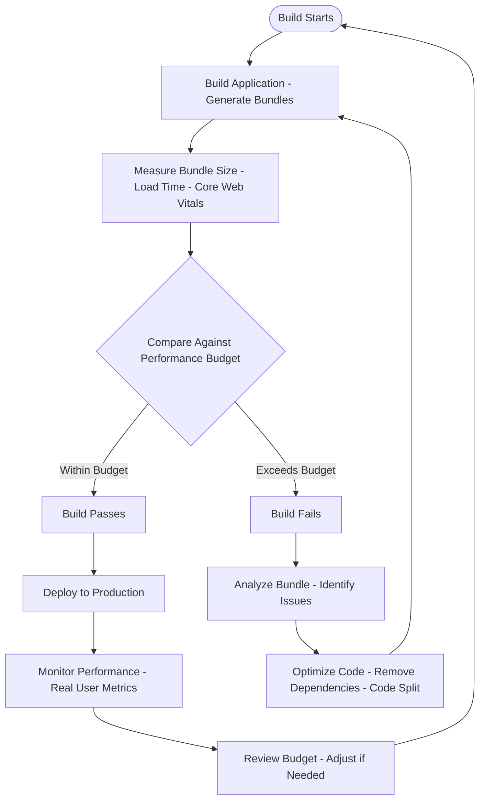
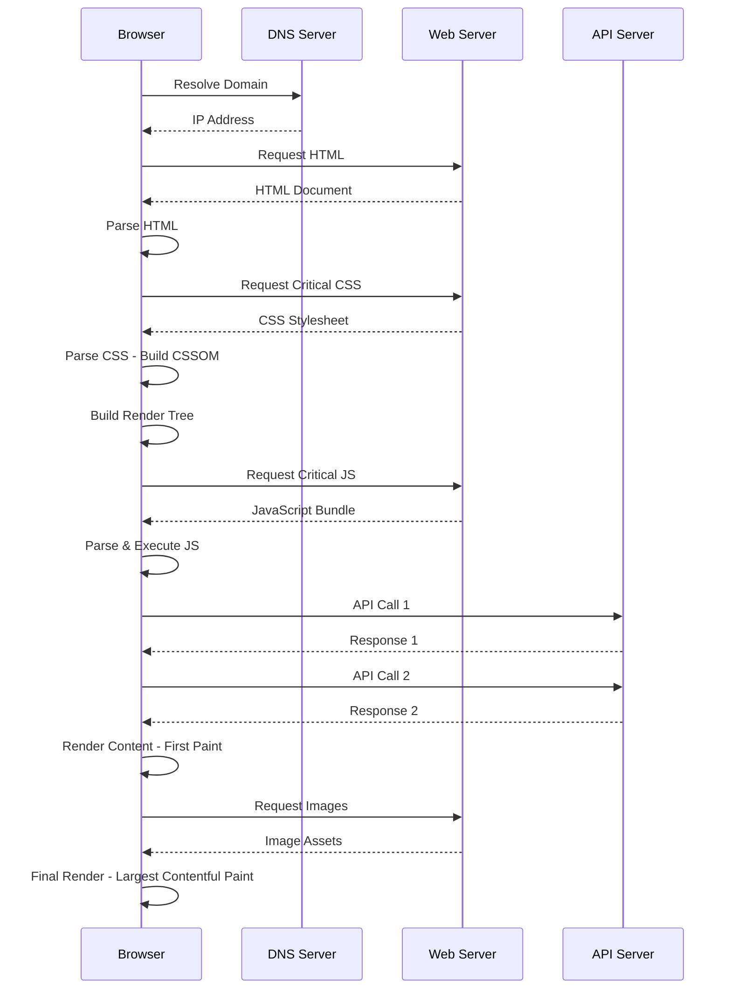
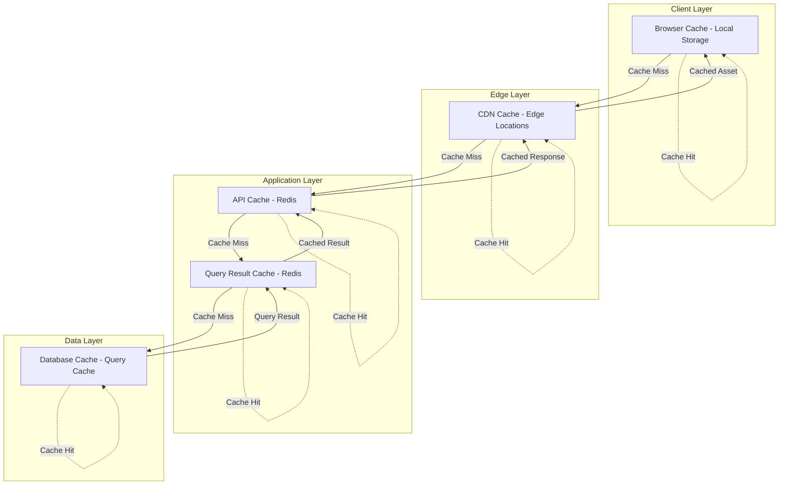

# Performance: Architecture

## Contents

- [Frontend Performance Architecture](#frontend-performance-architecture)
- [Backend Performance Architecture](#backend-performance-architecture)
- [Infrastructure Performance Architecture](#infrastructure-performance-architecture)

Performance architecture encompasses the patterns, techniques, and infrastructure decisions that enable applications to meet user experience and scalability goals. This perspective covers frontend rendering optimization, backend throughput, database performance, caching strategies, and infrastructure scaling.

## Frontend Performance Architecture

### Bundle Size Optimization

Bundle size directly impacts initial page load time. A 200KB gzipped bundle downloads and parses faster than a 2MB bundle, especially on mobile networks. Code splitting breaks the application into smaller chunks that load on demand, reducing initial bundle size.

Route-level code splitting loads each route's code only when the route is accessed. In Vue 3 with Vite, route components are automatically code-split when using dynamic imports. React applications using React Router can implement route-level splitting with React.lazy and Suspense. This approach ensures that users only download code for the routes they visit.

Component-level code splitting loads heavy components only when needed. A charting library used only on an analytics page should not be included in the main bundle. Dynamic imports enable component-level splitting, loading components asynchronously when they're required.

Tree shaking eliminates unused code from the bundle. Modern bundlers like Vite and Webpack analyze import statements and remove code that is never executed. This requires using ES modules and avoiding side-effect imports. Libraries that don't support tree shaking add unnecessary code to the bundle.

Dynamic imports enable lazy loading of code, routes, and components. The import() function returns a Promise that resolves to the module, enabling asynchronous loading. This is particularly valuable for heavy libraries, below-the-fold content, and features that may not be used.

Bundle analysis tools like rollup-plugin-visualizer reveal bundle composition, identifying large dependencies and opportunities for optimization. Regular bundle analysis prevents gradual size creep and helps teams make informed decisions about new dependencies.

### Rendering Performance

Rendering performance determines how quickly the UI updates in response to user interactions and data changes. Virtual DOM diffing efficiency minimizes unnecessary DOM updates, but applications must avoid triggering unnecessary re-renders.

React.memo prevents re-renders when props haven't changed, useful for expensive components that receive stable props. Vue 3's computed properties are cached by default, recalculating only when dependencies change. These optimizations should be applied based on profiling data, not preemptively.

Virtualization renders only visible items in long lists, dramatically improving performance for large datasets. Libraries like @tanstack/react-virtual and vue-virtual-scroller render a fixed number of items regardless of list size, recycling DOM nodes as the user scrolls. This enables smooth scrolling through thousands of items.

RequestAnimationFrame ensures animations run at 60fps by synchronizing with the browser's repaint cycle. CSS animations are often more performant than JavaScript animations, but when JavaScript is necessary, requestAnimationFrame provides optimal timing. Avoid setTimeout or setInterval for animations, as they don't align with the browser's rendering cycle.

Debouncing and throttling limit the frequency of expensive operations. Debouncing delays execution until after a pause in events, useful for search input that triggers API calls. Throttling limits execution frequency, useful for scroll handlers that update UI state. These techniques prevent performance degradation from rapid event firing.

### Image Optimization

Images often dominate page weight and load time. Responsive images using srcset serve appropriately sized images based on device capabilities and viewport size. A mobile device doesn't need a 2000px wide image when displaying a 400px wide viewport.

Modern image formats like WebP and AVIF provide superior compression compared to JPEG and PNG, reducing file size by 25-50% with equivalent visual quality. Browsers that don't support modern formats can fall back to traditional formats using the picture element.

Lazy loading defers image loading until images approach the viewport. The loading="lazy" attribute enables native lazy loading, reducing initial page load time. Intersection Observer API provides programmatic lazy loading for more control.

CDN delivery reduces latency by serving images from edge locations closer to users. CDNs cache images at the edge, reducing origin server load and improving global performance. Image optimization services can resize, compress, and convert formats on-the-fly.

Image compression reduces file size without noticeable quality loss. Tools like imagemin and sharp optimize images during build time. Lossy compression is acceptable for photographs, while lossless compression is preferred for graphics and icons.

### Font Optimization

Fonts can block rendering if not optimized. Font-display: swap shows fallback text immediately, then swaps to the web font when loaded. This prevents invisible text during font loading, improving perceived performance.

Font subsetting includes only the characters actually used, reducing file size. A font file with thousands of characters may only need a few hundred for a specific application. Tools like glyphhanger and fonttools enable subsetting.

Preloading critical fonts ensures they're available when needed. The preload link tag downloads fonts early in the page load process, preventing layout shifts when fonts load. Only preload fonts used above the fold, as preloading too many fonts wastes bandwidth.

Limiting font variations reduces bundle size. A font family with regular, bold, italic, and bold-italic variations requires four font files. Using only the variations actually needed reduces download time and improves performance.

### Critical Rendering Path

The critical rendering path is the sequence of steps the browser takes to render a page. Optimizing this path reduces time to first meaningful paint, improving perceived performance.

Inline critical CSS includes the CSS needed for above-the-fold content directly in the HTML, eliminating a render-blocking request. Non-critical CSS can be loaded asynchronously or deferred, allowing the browser to render content sooner.

Deferring non-critical JavaScript prevents it from blocking rendering. Scripts that don't affect initial render should use the defer attribute, loading after HTML parsing completes. Async scripts load independently and execute when ready, useful for analytics and third-party widgets.

Preloading critical resources hints to the browser about resources needed soon. Preload links for critical fonts, images, or API endpoints enable the browser to fetch them early. Prefetch hints about resources likely needed for future navigation, enabling speculative loading.

Minimizing render-blocking resources reduces time to first paint. Each render-blocking resource delays rendering, so eliminating or deferring these resources improves performance. The browser's critical path analysis identifies render-blocking resources.

### Caching Strategies

Caching reduces load time for repeat visits and improves perceived performance. HTTP cache headers control browser and CDN caching behavior.

Cache-Control headers specify how long resources can be cached and whether they can be shared across users. Public resources like images and fonts can be cached for long periods with content hashing for cache busting. Private resources like user-specific API responses should use no-cache or short TTLs.

ETag headers enable conditional requests, allowing browsers to validate cached content without downloading it again. If the ETag matches, the server returns 304 Not Modified, saving bandwidth and improving performance.

Service workers enable offline caching and programmatic cache control. Applications can cache API responses, images, and other resources for offline use. Cache-first strategies serve cached content immediately, falling back to the network if unavailable. Network-first strategies attempt the network first, falling back to cache if offline.

CDN caching distributes static assets to edge locations, reducing latency for geographically distributed users. CDNs cache HTML, CSS, JavaScript, images, and fonts, serving them from locations closer to users than the origin server.

Content hashing enables long cache times while ensuring updates are served immediately. A file named main.abc123.js can be cached indefinitely, while a new version named main.def456.js is fetched fresh. Build tools automatically generate content hashes for cacheable resources.

### Prefetching and Preloading

Prefetching and preloading enable speculative resource loading, improving perceived performance for likely next actions.

Prefetching hints about resources likely needed for future navigation. Link prefetch tags enable the browser to download resources in the background, ready when the user navigates. This is particularly valuable for likely next pages, such as a product detail page from a product list.

Preloading critical resources ensures they're available when needed. Preload links have high priority, downloading resources even if they're not immediately used. This is useful for critical fonts, images, or API endpoints needed for initial render.

Speculative loading predicts user actions and preloads resources. A user hovering over a link may be about to click it, so prefetching that page's resources improves perceived performance. Intersection Observer can trigger prefetching when elements approach the viewport.

## Backend Performance Architecture

### Database Query Optimization

Database queries are often the primary bottleneck in backend performance. Query optimization requires understanding query execution plans, proper indexing, and avoiding common pitfalls.

EXPLAIN ANALYZE reveals how PostgreSQL executes a query, showing the execution plan and actual execution time. This identifies sequential scans that should use indexes, expensive operations like sorts and joins, and opportunities for optimization. Regular query plan analysis prevents slow queries from reaching production.

Proper indexing speeds up queries but requires understanding query patterns. Indexes on frequently filtered columns enable fast lookups. Composite indexes support queries that filter on multiple columns. Partial indexes optimize queries with WHERE clauses that filter a subset of rows. See the data-persistence facet for detailed indexing strategies.

N+1 query problems occur when fetching a list of items, then making separate queries for each item's relationships. Fetching 100 orders, then 100 separate queries for each order's customer, results in 101 queries instead of 2. ORMs can hide this problem, so enable SQL logging in tests and count queries. Eager loading or batch loading solves N+1 problems.

Batch operations reduce database round trips. Instead of inserting 1000 records one at a time, use batch inserts that insert multiple records in a single query. Batch updates and deletes similarly reduce round trips, improving performance for bulk operations.

Connection pooling manages database connections efficiently. HikariCP provides high-performance connection pooling for Java applications, reusing connections instead of creating new ones for each request. Proper pool sizing balances connection availability with resource usage. Too few connections cause requests to wait; too many connections waste resources.

Read replicas distribute read load across multiple database instances, improving read throughput and reducing load on the primary database. Applications can route read queries to replicas while sending writes to the primary. This is particularly valuable for read-heavy workloads like reporting and analytics.

### Caching Layers

Caching reduces database load and improves response time by storing frequently accessed data in faster storage. Multiple caching layers serve different purposes.

Redis provides distributed application-level caching, storing computed values, query results, and session data. Cache-aside pattern loads data from cache, falling back to the database if not cached, then storing the result in cache. This pattern is simple and works well for read-heavy workloads.

HTTP response caching stores entire HTTP responses, useful for public API endpoints that return the same data for multiple users. Cache-Control headers control caching behavior, and ETag headers enable conditional requests. This reduces server load for frequently accessed endpoints.

Query result caching stores database query results, avoiding repeated query execution for identical queries. This is particularly valuable for expensive queries that return the same results for multiple requests. Cache invalidation must be carefully managed to prevent stale data.

Computed value caching stores expensive calculations, such as aggregations, transformations, or external API responses. Computing these values once and caching them improves performance for subsequent requests. TTLs ensure cached values don't become stale.

Cache invalidation strategies determine when cached data becomes invalid. Time-based invalidation uses TTLs to expire cached data after a period. Event-based invalidation invalidates cache when underlying data changes. Explicit invalidation requires manual cache clearing, useful for infrequently changing data.

Cache warming pre-populates cache with frequently accessed data, preventing cold cache performance degradation. Warmup endpoints can be called after deployment to populate cache before user traffic arrives. This is particularly important for applications with predictable access patterns.

### Async Processing

Moving non-time-critical work off the request path improves response time and enables better resource utilization. Async processing handles background tasks without blocking user requests.

Message queues like Kafka and RabbitMQ enable asynchronous task processing. Long-running operations like email sending, report generation, or data processing can be queued and processed by background workers. This keeps API responses fast while handling work asynchronously.

Returning 202 Accepted for long-running operations acknowledges the request and processes it asynchronously. The response includes a location header pointing to a status endpoint where clients can check progress. This pattern is essential for operations that take seconds or minutes to complete.

Background job processing handles queued tasks using worker processes or threads. Spring Boot's @Async annotation enables method-level async execution, while dedicated job processing frameworks provide more features. Workers process jobs from the queue, updating status and handling errors.

Event-driven architecture processes events asynchronously, enabling loose coupling and scalability. Events are published to message brokers, and subscribers process them independently. This enables horizontal scaling of event processors and improves system resilience.

### Connection Pooling

Connection pooling manages expensive resources like database connections and HTTP client connections, reusing them across requests instead of creating new ones for each request.

Database connection pooling with HikariCP provides high-performance connection management. Pool sizing balances connection availability with resource usage. A pool that's too small causes requests to wait for available connections; a pool that's too large wastes memory and database connections. Monitoring pool metrics reveals optimal sizing.

HTTP client connection pooling reuses TCP connections for multiple HTTP requests, avoiding the overhead of connection establishment. Spring's RestTemplate and WebClient support connection pooling, and proper configuration improves performance for services that make many HTTP calls.

Thread pools manage worker threads for async processing. Java 21+ virtual threads enable massive concurrency for I/O-bound workloads without the overhead of platform threads. Virtual threads block efficiently, enabling thousands of concurrent operations without excessive resource usage.

### Payload Optimization

Reducing payload size improves transfer time and reduces bandwidth costs. Multiple techniques optimize payloads without sacrificing functionality.

Sparse fieldsets return only requested fields, reducing payload size for clients that don't need all data. GraphQL enables clients to specify exactly which fields to return, while REST APIs can support field selection via query parameters. This is particularly valuable for mobile clients with limited bandwidth.

Response compression with gzip or Brotli reduces payload size by 60-80% for text-based content like JSON and HTML. Most web servers and CDNs support automatic compression, and clients indicate support via Accept-Encoding headers. Compression adds minimal CPU overhead for significant bandwidth savings.

Pagination limits response size by returning subsets of large collections. Default page sizes of 20-50 items balance usability with performance. Cursor-based pagination provides consistent results for real-time data, while offset-based pagination is simpler for static data. See the api-design facet for detailed pagination strategies.

Streaming enables progressive data transfer for large responses. Instead of buffering the entire response in memory, streaming sends data as it becomes available. This reduces memory usage and improves time to first byte for large datasets.

### JVM Tuning

JVM tuning optimizes Java application performance, particularly for latency-sensitive workloads. Garbage collector selection, heap sizing, and JIT warmup all impact performance.

G1GC (Garbage-First Garbage Collector) is the default collector for most workloads, providing a good balance of throughput and latency. G1GC divides the heap into regions and prioritizes garbage collection in regions with the most garbage, minimizing pause times.

ZGC (Z Garbage Collector) provides ultra-low latency for applications that require pause times under 10 milliseconds. ZGC uses concurrent marking and relocation, enabling very large heaps with minimal pause times. This is valuable for latency-sensitive applications like financial trading systems.

Heap sizing balances memory usage with garbage collection frequency. A heap that's too small causes frequent GC pauses, while a heap that's too large increases pause duration. Monitoring GC metrics reveals optimal heap sizing for specific workloads.

JIT warmup occurs when the JVM compiles frequently executed code to native code, improving performance. Applications that handle cold starts (serverless, containers that scale to zero) may experience slow performance until JIT warmup completes. Warmup endpoints can trigger JIT compilation before user traffic arrives.

GraalVM native images compile Java applications to native executables, providing fast startup times and lower memory usage. This is particularly valuable for serverless functions and containerized applications where startup time impacts cost and scalability. Native images require ahead-of-time compilation and have some limitations compared to standard JVM execution.

## Infrastructure Performance Architecture

### Horizontal Scaling

Horizontal scaling adds more instances to handle increased load, providing better scalability than vertical scaling. Stateless services enable horizontal scaling without session affinity or shared state.

Stateless services don't store session data in memory, enabling any instance to handle any request. Session data stored in Redis or databases allows instances to be added or removed without affecting user sessions. This is essential for cloud-native applications that scale dynamically.

Load balancing distributes requests across instances, improving throughput and availability. Health checks remove unhealthy instances from the pool, ensuring requests only go to healthy instances. Session affinity (sticky sessions) should be avoided unless absolutely necessary, as it reduces scalability.

Kubernetes Horizontal Pod Autoscaler (HPA) automatically scales pods based on CPU, memory, or custom metrics. HPA monitors metrics and adjusts replica count to maintain target utilization, enabling automatic scaling based on load. Custom metrics enable scaling based on application-specific metrics like request rate or queue depth.

### Vertical Scaling

Vertical scaling increases CPU and memory for existing instances, providing immediate performance improvement without architectural changes. This is simpler than horizontal scaling but has limits.

Database servers often benefit from vertical scaling, as they can utilize additional CPU and memory for query processing and caching. Connection-heavy services may require vertical scaling to support more concurrent connections, though horizontal scaling with connection pooling is often preferable.

Vertical scaling has limits based on available instance sizes and may require downtime for resizing. Cloud providers offer increasingly large instance sizes, but costs increase non-linearly with size. Horizontal scaling is generally more cost-effective and scalable.

### CDN and Edge Caching

Content Delivery Networks (CDNs) serve static assets from edge locations closer to users, reducing latency for geographically distributed users. CDNs cache HTML, CSS, JavaScript, images, and fonts at edge locations worldwide.

CDN caching reduces origin server load by serving cached content from edge locations. Cache hit rates of 90%+ are common for static assets, dramatically reducing origin server traffic. This improves performance and reduces infrastructure costs.

Edge computing enables running application logic at edge locations, reducing latency for user interactions. Edge functions can handle authentication, request routing, and simple data transformations closer to users. This is particularly valuable for global applications where round-trip time to origin servers is significant.

### Database Scaling

Database scaling requires techniques beyond simple vertical scaling. Read replicas, connection pooling, partitioning, and materialized views all improve database performance and scalability.

Read replicas distribute read load across multiple database instances, improving read throughput. Applications route read queries to replicas while sending writes to the primary. Replication lag must be considered—queries that require immediately consistent data should use the primary.

Connection pooling with PgBouncer reduces database connection overhead by pooling connections at the database level, separate from application-level pooling. This enables applications to use many logical connections while maintaining a smaller number of physical database connections.

Partitioning divides large tables into smaller partitions based on a key like date or region. Queries that filter on the partition key only scan relevant partitions, improving performance. Partitioning requires careful planning and maintenance but dramatically improves performance for very large tables.

Materialized views pre-compute expensive aggregations and joins, storing results for fast querying. Refreshing materialized views can be expensive, so they're best for data that doesn't change frequently. This is particularly valuable for reporting and analytics workloads.
