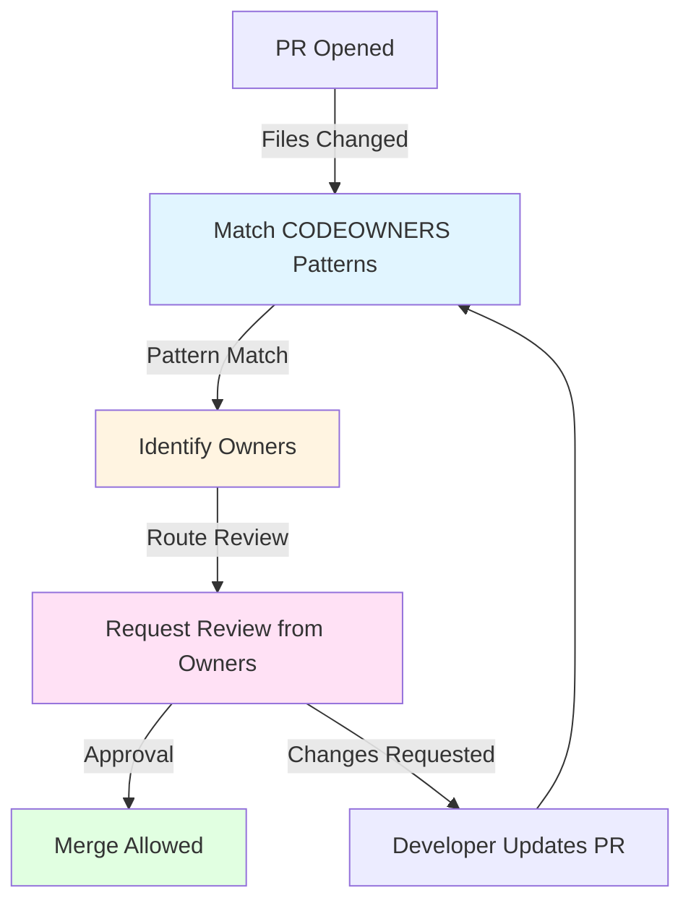

# Architecture: Repository Governance

## Contents

- [Branch Strategies](#branch-strategies)
- [Branch Protection Rules](#branch-protection-rules)
- [GitHub Rulesets vs Branch Protection](#github-rulesets-vs-branch-protection)
- [CODEOWNERS Patterns](#codeowners-patterns)
- [Monorepo vs Multi-Repo Governance](#monorepo-vs-multi-repo-governance)
- [Repository Templates and Scaffolding](#repository-templates-and-scaffolding)
- [Merge Strategies](#merge-strategies)

Repository governance architecture defines how code flows from development to production, how ownership is assigned, and how quality gates are enforced. This includes branch strategies that organize work, protection rules that prevent unsafe merges, CODEOWNERS files that route reviews, and templates that ensure consistency. Understanding these architectural patterns is essential for designing effective repository governance.

## Branch Strategies

Branch strategies define how code changes flow from development to production. Different strategies suit different team contexts, release cadences, and risk tolerances. The choice of branch strategy significantly impacts developer experience, code review efficiency, and deployment velocity.

### Trunk-Based Development

Trunk-based development keeps the main branch always deployable. Developers create short-lived feature branches (hours to days), open PRs, get review, and merge to main. Main is continuously integrated and deployed. This strategy maximizes feedback speed and minimizes merge conflicts.

Trunk-based development requires discipline. Main must always be deployable, so incomplete features use feature flags. PRs must be small and focused—large PRs create bottlenecks. CI must be fast—slow CI slows the feedback loop. This discipline pays off in deployment velocity and code quality.

The main branch is the source of truth. All production code comes from main. Feature branches are temporary—they exist only long enough to get review and merge. This simplicity eliminates branch management overhead and reduces merge conflict risk.

Short-lived branches (hours to days) prevent divergence. Long-lived branches accumulate merge conflicts, become difficult to review, and delay feedback. Trunk-based development enforces short branches through culture and tooling: PRs that sit open for weeks get closed, and developers are encouraged to break work into smaller PRs.

Feature flags enable incomplete features in main. A feature can be merged to main behind a flag, tested in production, and enabled when ready. This enables continuous integration without blocking on feature completion. Feature flags require discipline—flags must be cleaned up after feature launch.

### GitHub Flow

GitHub Flow extends trunk-based development with explicit release branches. Main is always deployable. Release branches (`release/v1.2.0`) prepare releases, enable final testing, and hotfixes. After release, the branch merges back to main and is deleted. This strategy suits teams that need release coordination without the complexity of GitFlow.

GitHub Flow adds release coordination without sacrificing trunk-based benefits. Release branches enable final testing, version tagging, and hotfixes without blocking main development. The release branch is short-lived—it exists only for the release cycle, then merges back and is deleted.

Release branches enable parallel work. While one team prepares a release, other teams continue developing on main. This parallelization prevents release preparation from blocking new development. After release, the branch merges back, ensuring fixes aren't lost.

GitHub Flow works well for teams with regular releases (weekly, bi-weekly, monthly). Teams with continuous deployment might not need release branches—they can deploy directly from main. Teams with complex release processes might need GitFlow's additional structure.

### GitFlow

GitFlow uses multiple long-lived branches: `main` (production), `develop` (integration), `feature/*` (features), `release/*` (releases), and `hotfix/*` (hotfixes). This structure provides clear separation between development, release preparation, and production, but adds complexity and merge overhead.

GitFlow suits teams with complex release management. If releases require extensive testing, coordination across teams, or regulatory approval, GitFlow's structure provides clear phases. However, this structure creates merge overhead and delays integration feedback.

The `develop` branch becomes a second main branch that must be maintained. Merges between `main` and `develop` create opportunities for conflicts and lost changes. This overhead is justified only when release complexity requires it.

GitFlow's complexity slows development velocity. Feature branches live longer, creating more merge conflicts. Integration happens on `develop` rather than `main`, delaying feedback. Most teams don't need this complexity—trunk-based development or GitHub Flow provides sufficient structure with less overhead.

### Branch Strategy Trade-offs

**Trunk-Based Development** maximizes velocity and feedback speed but requires discipline and feature flags. Best for teams with continuous deployment and fast CI.

**GitHub Flow** adds release coordination without GitFlow complexity. Best for teams with regular releases that need coordination but not complex release processes.

**GitFlow** provides maximum structure for complex releases but adds significant overhead. Best for teams with regulatory requirements, extensive release testing, or complex multi-team coordination.

The default recommendation is trunk-based development. Most teams don't need the complexity of GitFlow. GitHub Flow provides an escape hatch for teams that need release branches. GitFlow should be avoided unless release complexity truly requires it.

## Branch Protection Rules

Branch protection rules enforce quality gates before code merges to protected branches. These rules prevent unsafe merges, ensure code review, and maintain code quality. Understanding protection rule options and trade-offs enables effective governance design.

### Required Reviews

Required reviews ensure code is reviewed before merge. Typically, 1-2 approvals are required, depending on change risk. Critical paths (security, payments, data access) might require 2 approvals. Standard changes might require 1 approval.

Review requirements prevent unreviewed code from merging. However, requiring too many approvals creates bottlenecks. A requirement for 3+ approvals slows delivery without proportional quality benefit. Most teams find 1-2 approvals sufficient.

CODEOWNERS can override review requirements. If CODEOWNERS specifies owners for a path, those owners' approvals satisfy the requirement. This enables domain-specific review requirements: security changes require security team approval, payment changes require payment team approval.

Dismiss stale reviews when new commits are pushed. This ensures reviews apply to current code, not outdated versions. However, dismissing reviews can frustrate reviewers who must re-review after minor fixes. Teams should balance freshness with reviewer experience.

### Required Status Checks

Required status checks prevent merging until CI passes. These checks validate code quality (linting, type checking), test coverage, security scans, and build success. Failed checks block merge, ensuring only tested code reaches production.

Status checks must be fast to avoid blocking developers. Slow CI (30+ minutes) creates frustration and encourages workarounds. Fast CI (under 10 minutes) enables rapid feedback and maintains development velocity.

Required checks should be minimal and reliable. Requiring every possible check creates flaky gate failures that block legitimate merges. Focus on essential checks: tests must pass, linting must pass, security scans must pass. Nice-to-have checks (coverage thresholds, performance benchmarks) can be informational rather than required.

Status checks can be branch-specific. A check that runs on PRs might not run on hotfix branches, enabling faster emergency fixes. However, this flexibility must be used carefully—hotfixes still need quality validation.

### Linear History Requirements

Linear history requirements enforce clean commit history. Squash merge or rebase merge creates linear history, while merge commits create branching history. Linear history simplifies git log, makes bisection easier, and provides cleaner rollback.

Squash merge combines all PR commits into a single commit on main. This creates clean history but loses individual commit context. Commit messages should summarize the PR, not individual commits. This trade-off is acceptable for most teams—PR context is more valuable than individual commit context.

Rebase merge replays PR commits onto main, preserving individual commits. This maintains commit context but requires force-push to update the branch, which branch protection typically prevents. Rebase merge works best when developers rebase locally before opening PRs.

Merge commits preserve branch structure but create cluttered history. A main branch with hundreds of merge commits is difficult to navigate. Most teams prefer linear history for main branches.

### Force Push Prevention

Force push prevention prevents rewriting protected branch history. Force pushes can lose commits, break CI, and create confusion. Protected branches should never allow force pushes, except for administrators in emergencies.

Force push prevention is essential for collaboration. If one developer force-pushes, other developers' local branches become invalid. This breaks workflows and creates frustration. Prevention is better than cleanup.

Administrator override enables emergency fixes. If main branch history becomes corrupted, administrators can force-push to fix it. However, this should be rare and well-documented. Regular force pushes indicate process problems, not legitimate needs.

### Branch Protection Bypass

Branch protection can be bypassed by administrators or through specific workflows (e.g., hotfix branches). Bypasses should be rare and audited. Frequent bypasses indicate protection rules are too strict or workflows need adjustment.

Bypass audit logs track who bypassed protection and why. These logs enable compliance and process improvement. If bypasses are frequent, protection rules might need adjustment to accommodate legitimate workflows.

## GitHub Rulesets vs Branch Protection

GitHub Rulesets provide a newer, more flexible approach to branch protection. Rulesets enable organization-level policies, path-based rules, and more granular control than traditional branch protection rules.

### Rulesets Advantages

Rulesets enable organization-level policies that apply to all repositories. Instead of configuring branch protection for each repository, admins define rulesets that apply organization-wide. This ensures consistency and reduces configuration overhead.

Path-based rules enable different requirements for different code paths. Security-sensitive paths can require security team review. Documentation paths might have relaxed requirements. This granularity enables appropriate governance without one-size-fits-all rules.

Rulesets support more complex conditions than branch protection. Rules can depend on PR size, file changes, or other factors. This flexibility enables sophisticated governance policies that adapt to change context.

### Branch Protection Advantages

Branch protection rules are simpler and more familiar. Most teams understand branch protection—rulesets add learning curve. For simple requirements, branch protection is sufficient.

Branch protection rules are repository-specific, enabling per-repository customization. Teams with unique requirements can configure protection without affecting other teams. Rulesets' organization-level approach might be too rigid for diverse teams.

### Migration Path

Teams using branch protection can migrate to rulesets gradually. Rulesets can coexist with branch protection, enabling incremental adoption. However, having both creates complexity—teams should choose one approach.

The recommendation: use rulesets for new organizations or when consolidating governance. Use branch protection for existing repositories unless rulesets provide clear benefits. Both approaches work—choose based on team needs and organizational structure.

## CODEOWNERS Patterns

CODEOWNERS files define code ownership and automatically request reviews from owners when PRs touch their paths. Effective CODEOWNERS patterns balance ownership clarity with review efficiency.

### CODEOWNERS Resolution Flow

When a PR is opened, GitHub matches changed files against CODEOWNERS patterns. Matching patterns determine required reviewers. This automatic routing ensures domain experts review relevant changes.

CODEOWNERS uses pattern matching with most-specific-match wins. If `/src/auth/` matches one pattern and `/src/auth/password.ts` matches a more specific pattern, the more specific pattern's owners are used. This enables hierarchical ownership: team owns directory, expert owns specific file.

### Team-Based Ownership

Team-based ownership assigns entire directories to teams. This pattern works well when teams have clear domain boundaries. Example: `@company/backend-team` owns `/backend/`, `@company/frontend-team` owns `/frontend/`.

Team-based ownership is simple and scalable. New team members automatically get review requests. Team changes (members joining/leaving) don't require CODEOWNERS updates—GitHub team membership handles it.

However, team-based ownership can create bottlenecks. If one team owns a large directory, all PRs touching that directory require that team's review. This can slow delivery if the team is busy. Consider breaking large directories into smaller, team-owned subdirectories.

### Path-Based Ownership

Path-based ownership assigns specific paths to domain experts. This pattern works well for cross-cutting concerns or specialized domains. Example: `@company/security-team` owns `**/auth/**`, `**/payment/**`, `@company/data-team` owns `**/database/**`.

Path-based ownership enables expert review for critical paths. Security experts review authentication changes. Payment experts review payment changes. This ensures quality without requiring experts to review everything.

Path-based ownership requires maintenance. As code organization changes, CODEOWNERS must be updated. Stale CODEOWNERS routes reviews incorrectly, frustrating developers and reviewers. Regular CODEOWNERS audits prevent drift.

### Architecture-Level Ownership

Architecture-level ownership assigns ownership based on architectural layers or components. Example: `@company/api-team` owns `/api/`, `@company/ui-team` owns `/ui/`. This pattern aligns ownership with system architecture.

Architecture-level ownership works well for modular systems. Teams own their modules, enabling parallel development. Changes within a module only require that team's review. Cross-module changes require multiple teams' review, which is appropriate for architectural changes.

This pattern requires clear architectural boundaries. If boundaries are unclear, ownership becomes ambiguous. CODEOWNERS can't resolve "who owns this?" questions—architecture must be clear first.

### CODEOWNERS Best Practices

Use teams, not individuals. Individual ownership creates single points of failure—if someone is unavailable, reviews are blocked. Team ownership provides redundancy and enables knowledge sharing.

Keep patterns specific. Broad patterns (`*` matches everything) create ownership bottlenecks. Specific patterns (`/src/payment/**` matches payment code) enable targeted review. If patterns are too broad, break them into smaller, more specific patterns.

Review CODEOWNERS regularly. As teams change, code moves, and ownership evolves, CODEOWNERS becomes stale. Quarterly audits ensure ownership matches reality. Stale CODEOWNERS frustrates developers and creates review bottlenecks.

Document ownership rationale. A comment explaining why a team owns a path helps future maintainers. Example: `# Payment team owns payment processing for PCI compliance requirements`.

## Monorepo vs Multi-Repo Governance

Monorepos and multi-repo organizations require different governance approaches. Understanding these differences enables effective governance design for each structure.

### Monorepo Governance

Monorepos require CODEOWNERS for ownership clarity. With hundreds of packages in one repository, CODEOWNERS ensures PRs route to the right teams. Without CODEOWNERS, ownership is ambiguous and reviews are inconsistent.

Monorepo CODEOWNERS must account for shared code. A change to a shared utility might affect multiple teams. CODEOWNERS should require reviews from affected teams, not just the team that made the change. This requires careful pattern design.

Branch protection in monorepos must account for cross-team dependencies. A PR that touches multiple packages might require multiple team approvals. This can slow delivery but ensures quality. Teams must balance speed with coordination needs.

Monorepo CI must be fast despite repository size. Techniques like affected package detection, parallel test execution, and incremental builds enable fast CI in large monorepos. Slow CI creates bottlenecks that governance can't solve.

### Multi-Repo Governance

Multi-repo organizations can use repository-level governance. Each repository can have its own branch protection and CODEOWNERS. This flexibility enables teams to optimize governance for their context.

However, multi-repo consistency requires templates. Without templates, repositories diverge in structure, CI setup, and governance. Repository templates ensure consistency: every repository starts with standard branch protection, CODEOWNERS patterns, and CI workflows.

Multi-repo organizations need discovery mechanisms. With hundreds of repositories, developers need ways to find relevant code. Consistent naming conventions, clear descriptions, and proper organization structure enable discovery.

Cross-repo changes require coordination. A change that spans multiple repositories requires multiple PRs and coordination. This coordination overhead is a cost of multi-repo structure. Some teams use automation to coordinate cross-repo changes.

### Choosing Structure

Monorepos suit organizations with tightly coupled code, shared libraries, and atomic cross-cutting changes. Multi-repos suit organizations with independent services, different release cadences, and clear service boundaries.

Governance should match structure. Monorepo governance focuses on CODEOWNERS and cross-team coordination. Multi-repo governance focuses on templates and consistency. Don't force monorepo governance patterns onto multi-repo organizations, or vice versa.

## Repository Templates and Scaffolding

Repository templates ensure new repositories start with best practices. A template repository with standard structure, CI workflows, branch protection, and documentation enables consistency without manual configuration.

### Template Structure

A template repository should include:

- **README.md**: Standard structure explaining repository purpose, setup, testing, and contribution guidelines
- **.github/**: Issue templates, PR templates, workflows, CODEOWNERS
- **CI configuration**: Standard workflows for testing, linting, and deployment
- **Documentation**: Contributing guidelines, code of conduct, architecture decisions
- **License**: Standard license file
- **.gitignore**: Language-appropriate ignore patterns

This structure ensures every repository has essential files. Developers don't need to remember what to create—they customize the template for their specific repository.

### Automated Setup

GitHub repository templates enable one-click repository creation from templates. When creating a new repository, developers select a template, and GitHub creates the repository with template files. This automation reduces setup time and ensures consistency.

CI workflows in templates should be generic but functional. A template workflow should run tests, but teams can customize test commands for their stack. This balance enables consistency while allowing customization.

Branch protection can be configured via GitHub API or Terraform. Automated branch protection setup ensures every repository gets protection rules without manual configuration. This automation scales governance across hundreds of repositories.

### Template Maintenance

Templates must be maintained. As best practices evolve, templates should be updated. However, updating templates doesn't automatically update existing repositories—those must be updated manually or through migration scripts.

Template versioning helps manage updates. A template with a version tag enables teams to choose when to adopt updates. However, versioning adds complexity—most teams use a single, evolving template.

Regular template audits ensure templates reflect current best practices. Quarterly reviews catch drift and enable updates. Stale templates propagate outdated practices to new repositories.

## Merge Strategies

Merge strategies determine how PR commits appear in branch history. Different strategies suit different team preferences and tooling requirements.

### Squash Merge

Squash merge combines all PR commits into a single commit on the target branch. This creates linear history and simplifies git log. The squashed commit message should summarize the PR, not individual commits.

Squash merge is the default recommendation. It provides clean history without requiring developers to manage individual commits. PR context (description, comments, linked tickets) provides the detail that individual commits would provide.

Squash merge loses individual commit context. If a PR has 20 commits with detailed messages, squashing combines them into one message. This trade-off is acceptable—PR context is more valuable than commit context for most teams.

### Rebase Merge

Rebase merge replays PR commits onto the target branch, preserving individual commits. This maintains commit context but requires force-push to update the branch, which branch protection typically prevents.

Rebase merge works when developers rebase locally before opening PRs. The PR branch is rebased onto main, then opened. This preserves commits while maintaining linear history. However, it requires developer discipline and tooling support.

Rebase merge is less common than squash merge. Most teams prefer squash merge's simplicity. Rebase merge is useful when commit-level history is important (e.g., for compliance or detailed change tracking).

### Merge Commit

Merge commit preserves branch structure with a merge commit. This creates branching history that some teams find cluttered. Merge commits can be useful for tracking feature completion, but most teams prefer linear history.

Merge commits are the default Git behavior but are less common in modern workflows. Teams using trunk-based development typically prefer linear history (squash or rebase) over branching history (merge commits).

The recommendation: use squash merge for linear history and simplicity. Use rebase merge if commit-level context is critical. Avoid merge commits unless there's a specific reason to preserve branch structure.
