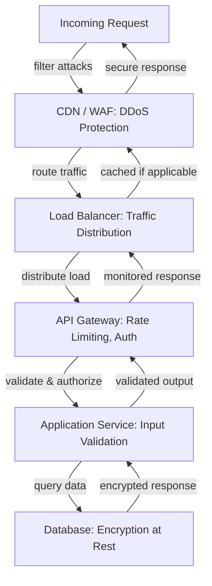
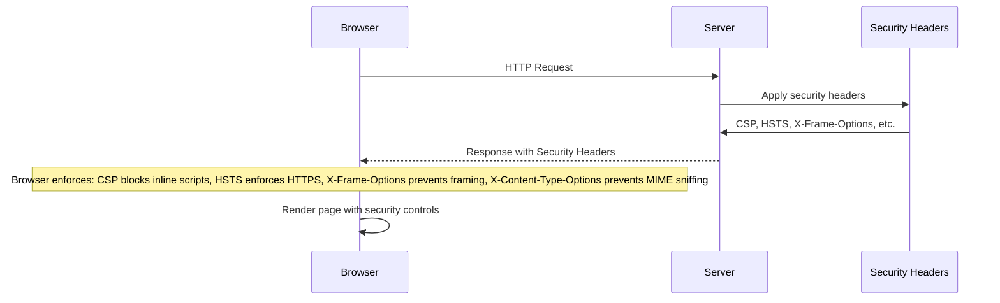
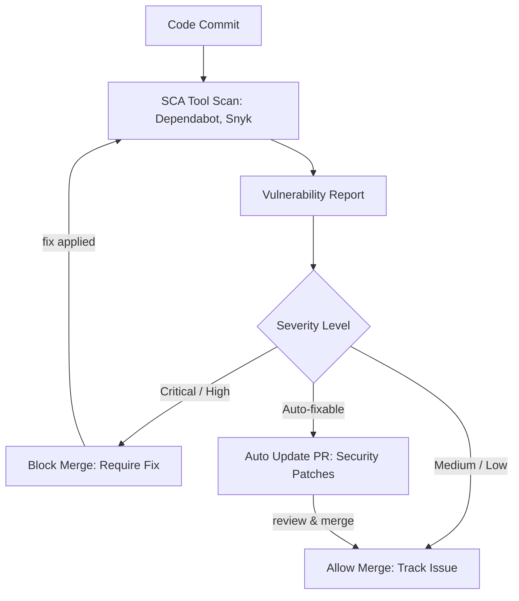

# Security -- Architecture

## Contents

- [Defense in Depth: Multiple Security Layers](#defense-in-depth-multiple-security-layers)
- [Input Validation and Sanitization](#input-validation-and-sanitization)
- [Secrets Management](#secrets-management)
- [Transport Security](#transport-security)
- [Data Protection](#data-protection)
- [Browser Security Headers](#browser-security-headers)
- [Cross-Origin Resource Sharing (CORS)](#cross-origin-resource-sharing-cors)
- [API Security](#api-security)
- [Dependency Security](#dependency-security)
- [OWASP Top 10](#owasp-top-10)

Security architecture implements defense in depth—multiple layers of security controls where no single control is sufficient. Attackers who bypass one layer encounter another. This layered approach recognizes that perfect security is impossible, but making attacks progressively harder and more expensive reduces risk to acceptable levels.

## Defense in Depth: Multiple Security Layers

Defense in depth organizes security controls into layers: network security, transport security, application security, and data security. Network security controls include firewalls, Web Application Firewalls (WAFs), network segmentation, and DDoS protection. These controls filter traffic before it reaches application servers, blocking known attack patterns and limiting the attack surface.

Transport security ensures that data in motion is protected from interception and tampering. TLS (Transport Layer Security) encrypts all HTTP traffic, preventing man-in-the-middle attacks and ensuring data confidentiality and integrity. Certificate management automates the provisioning and renewal of TLS certificates, ensuring that expired certificates don't create security gaps.

Application security includes input validation, authentication, authorization, session management, and business logic protections. These controls operate at the application layer, understanding application context and enforcing security policies based on user identity and request content.

Data security protects data at rest through encryption, access controls, and data masking. Database encryption, file system encryption, and backup encryption ensure that stolen data remains unreadable without decryption keys. Access controls limit who can read and modify data, while data masking protects sensitive information in non-production environments and logs.

Each layer provides independent protection. A vulnerability in one layer doesn't compromise the entire system if other layers remain intact. However, layers must be configured correctly—misconfigured security controls provide false confidence while leaving systems vulnerable.

## Input Validation and Sanitization

All user input is untrusted until validated. Input validation occurs at the API boundary, before data enters application logic. Validation checks include type validation (ensuring data matches expected types), length validation (preventing buffer overflows and DoS attacks), format validation (ensuring data matches expected patterns like email addresses or phone numbers), and range validation (ensuring numeric values fall within acceptable bounds).

Allowlist validation (accepting only known-good values) is stronger than denylist validation (rejecting known-bad values) because allowlists are finite and explicit, while denylists can never be complete. For example, validating file uploads by checking file extensions against an allowlist of permitted types is more secure than checking against a denylist of dangerous extensions, since new dangerous extensions can always be invented.

Server-side validation is mandatory. Client-side validation improves user experience by providing immediate feedback, but it provides no security because attackers can bypass client-side checks by sending requests directly to APIs. Every API endpoint must validate all input parameters, headers, and body content on the server.

SQL injection attacks occur when user input is concatenated into SQL queries, allowing attackers to execute arbitrary SQL commands. Parameterized queries (prepared statements) prevent SQL injection by separating SQL structure from data values. ORMs like JPA and Hibernate use parameterized queries by default for standard operations, but native queries require explicit parameter binding. Never concatenate user input into SQL strings, even with escaping functions—use parameterized queries exclusively.

Cross-site scripting (XSS) attacks inject malicious JavaScript into web pages, which executes in other users' browsers. XSS prevention requires output encoding—converting special characters to HTML entities so they're displayed as text rather than executed as code. Content Security Policy (CSP) headers provide additional protection by restricting where scripts can load from, preventing injected scripts from executing even if output encoding fails.

Path traversal attacks use sequences like `../` in file paths to access files outside intended directories. Prevent path traversal by validating file paths, resolving them to absolute paths, and ensuring they fall within allowed directories. Never use user input directly in file system operations—always validate and sanitize paths first.

Command injection attacks occur when user input is used to construct OS commands. Like SQL injection, command injection is prevented by avoiding user input in command construction. Use APIs and libraries instead of shell commands when possible. If shell commands are necessary, use parameterized execution that separates commands from arguments.

## Secrets Management

Secrets—passwords, API keys, database credentials, encryption keys, OAuth client secrets—must never be stored in source code, configuration files committed to version control, or environment variables in deployment scripts. Once secrets are in source control, they're effectively public—even if repositories are private, anyone with access can view history, and secrets can be exposed through repository leaks or insider threats.

Secrets management systems provide secure storage, access control, audit logging, and rotation capabilities. HashiCorp Vault offers comprehensive secrets management with dynamic secrets (generating credentials on-demand with automatic expiration), encryption as a service, and integration with cloud providers and databases. Cloud provider secrets managers (AWS Secrets Manager, Azure Key Vault, Google Cloud Secret Manager) provide managed services integrated with cloud infrastructure, simplifying deployment but with vendor lock-in.

Kubernetes Secrets provide basic secrets storage within Kubernetes clusters, but they're base64-encoded, not encrypted by default. Enable encryption at rest for Kubernetes Secrets using encryption providers, and restrict access using RBAC. Kubernetes Secrets are suitable for simple use cases but lack advanced features like dynamic secrets and rotation automation.

Secret rotation is critical—compromised secrets remain dangerous until rotated. Automate rotation where possible, especially for database credentials and API keys. Manual rotation processes are error-prone and often delayed, leaving systems vulnerable. Rotation should be transparent to applications—secrets managers can provide new credentials while applications continue using old credentials until rotation completes.

Secret scanning in CI/CD pipelines detects accidentally committed secrets before they reach production. Tools like git-secrets, truffleHog, and GitHub secret scanning scan commit history and code for patterns matching secrets (API keys, passwords, tokens). These scans should block merges when secrets are detected, preventing them from entering repositories.

## Transport Security

All HTTP traffic must use HTTPS (HTTP over TLS). Unencrypted HTTP allows man-in-the-middle attacks where attackers intercept and modify traffic. Modern browsers mark HTTP sites as insecure, and many web features (geolocation, camera access) require HTTPS.

TLS configuration must use strong cipher suites and current protocol versions. TLS 1.2 is the minimum acceptable version, with TLS 1.3 preferred for improved performance and security. Disable weak cipher suites that use outdated encryption algorithms or key exchange methods. Tools like SSL Labs Server Test can evaluate TLS configuration and identify weaknesses.

Certificate management automates the provisioning and renewal of TLS certificates. Let's Encrypt provides free certificates with automated renewal via the ACME protocol. Cert-manager in Kubernetes automates certificate management, integrating with Let's Encrypt and other certificate authorities to provision and renew certificates automatically.

HTTP Strict Transport Security (HSTS) headers instruct browsers to always use HTTPS for a domain, even if users type HTTP URLs. HSTS prevents downgrade attacks and cookie hijacking. The `Strict-Transport-Security` header includes a `max-age` directive specifying how long browsers should enforce HTTPS, and an optional `includeSubDomains` directive that applies HSTS to all subdomains.

Internal service-to-service communication should also use TLS, even within private networks. Defense in depth assumes that network boundaries can be breached—if an attacker gains access to internal networks, unencrypted traffic becomes vulnerable. Mutual TLS (mTLS) provides additional security by requiring both client and server certificates, enabling service authentication.

## Data Protection

Encryption at rest protects data stored in databases, file systems, and backups. Database encryption can be implemented at the database level (Transparent Data Encryption in PostgreSQL, SQL Server, Oracle) or at the storage level (encrypted EBS volumes in AWS, encrypted disks in Azure). Cloud-managed databases typically include encryption at rest by default, while self-managed databases require explicit configuration.

File storage encryption protects files in object storage (S3, Azure Blob Storage) and file systems. Object storage services provide server-side encryption options, and client-side encryption provides additional protection by encrypting data before upload. File system encryption (LUKS on Linux, BitLocker on Windows) encrypts entire volumes, protecting all files automatically.

Encryption keys must be managed securely. Key management services (AWS KMS, Azure Key Vault, HashiCorp Vault) provide secure key storage, access control, and audit logging. Keys should be rotated regularly, and key material should never be stored alongside encrypted data.

Data masking protects sensitive information in non-production environments and logs. PII (personally identifiable information) like names, email addresses, and phone numbers should be masked or pseudonymized in development and testing environments. Credit card numbers should be tokenized or masked, showing only the last four digits. Data masking prevents accidental exposure of sensitive data while maintaining data utility for testing.

Data classification identifies what data is sensitive and requires protection. Classification categories might include public (no restrictions), internal (restricted to employees), confidential (restricted to specific roles), and restricted (highest sensitivity, minimal access). Classification drives access controls, encryption requirements, retention policies, and audit logging. Data should be classified at creation and reclassified as sensitivity changes.

## Browser Security Headers

Content-Security-Policy (CSP) headers restrict where resources can be loaded from, preventing XSS attacks by blocking execution of injected scripts. CSP directives specify allowed sources for scripts (`script-src`), styles (`style-src`), images (`img-src`), fonts (`font-src`), and other resource types. A restrictive CSP might allow scripts only from the same origin and trusted CDNs, blocking inline scripts and `eval()`.

CSP can be challenging to implement in applications that rely on inline scripts or third-party libraries. Start with a report-only policy that logs violations without blocking, identify all required sources, then switch to an enforcing policy. CSP violations can be reported to endpoints for monitoring and debugging.

X-Content-Type-Options: nosniff prevents browsers from MIME type sniffing, where browsers guess content types based on content rather than headers. MIME type sniffing can enable XSS attacks if browsers misinterpret content types. The nosniff directive forces browsers to respect declared content types.

X-Frame-Options and the `frame-ancestors` CSP directive prevent clickjacking attacks by controlling whether pages can be embedded in frames. Clickjacking overlays invisible frames on legitimate pages, tricking users into clicking on attacker-controlled content. `X-Frame-Options: DENY` prevents all framing, while `SAMEORIGIN` allows framing only from the same origin.

Referrer-Policy controls how much referrer information is sent to other sites. Referrer information can leak sensitive data in URLs (session tokens, user IDs, search queries). Policies range from `no-referrer` (send nothing) to `unsafe-url` (send full URL). A balanced policy like `strict-origin-when-cross-origin` sends the origin for cross-origin requests but the full URL for same-origin requests.

Permissions-Policy (formerly Feature-Policy) controls access to browser features like camera, microphone, geolocation, and payment APIs. Restrict features to specific origins or disable them entirely if not needed. This prevents malicious scripts from accessing sensitive device capabilities.

## Cross-Origin Resource Sharing (CORS)

CORS allows web applications to make requests to APIs on different origins (different protocol, domain, or port). Browsers enforce the same-origin policy by default, blocking cross-origin requests unless the server explicitly allows them via CORS headers.

CORS configuration must be restrictive. `Access-Control-Allow-Origin: *` allows any origin to make requests, which is acceptable for public APIs but dangerous for authenticated APIs because any website can make authenticated requests on behalf of users. For authenticated APIs, specify exact allowed origins.

CORS preflight requests (OPTIONS) occur for certain request types (custom headers, non-simple methods) to check if the actual request is allowed. Preflight responses can be cached using `Access-Control-Max-Age`, reducing overhead for repeated requests. Configure allowed methods (`Access-Control-Allow-Methods`), allowed headers (`Access-Control-Allow-Headers`), and whether credentials can be included (`Access-Control-Allow-Credentials`).

Spring Security provides CORS configuration through `CorsConfigurationSource` beans, allowing fine-grained control over allowed origins, methods, headers, and credentials. Configure CORS at the security filter chain level to ensure it's applied consistently across all endpoints.

Misconfigured CORS can create security vulnerabilities. Allowing credentials (`Access-Control-Allow-Credentials: true`) with a wildcard origin (`Access-Control-Allow-Origin: *`) is explicitly forbidden by browsers but sometimes misconfigured in server responses. Ensure that credential-allowing CORS uses specific origins.

## API Security

Rate limiting prevents abuse and protects against denial-of-service attacks by limiting the number of requests from a single client within a time window. Rate limits can be applied per user (authenticated requests), per IP address (unauthenticated requests), or per endpoint (different limits for different operations). Login endpoints should have stricter rate limits to prevent brute force attacks.

Rate limiting implementations include token bucket algorithms (allowing bursts up to a limit), sliding window algorithms (tracking requests over rolling time windows), and fixed window algorithms (resetting limits at fixed intervals). Choose algorithms based on use cases—token buckets allow natural traffic bursts, while fixed windows are simpler but can allow double the limit if requests span window boundaries.

API keys identify clients but don't authorize actions. OAuth tokens provide both identification and authorization, including scopes that define permitted operations. Use API keys for service identification in machine-to-machine scenarios, and OAuth tokens for user-authorized API access. API keys should be rotated regularly and revoked immediately if compromised.

Request signing provides integrity verification for webhooks and sensitive API calls. Clients sign requests using shared secrets or private keys, and servers verify signatures to ensure requests haven't been tampered with. HMAC-based signing is common for webhooks, while asymmetric signing (using private/public key pairs) provides non-repudiation.

Input size limits prevent large payload attacks that consume server resources. Configure maximum request body sizes, file upload sizes, and URL lengths. These limits should be enforced at multiple layers—web servers (Nginx, Apache), application frameworks (Spring Boot `spring.servlet.multipart.max-file-size`), and API gateways. Reject oversized requests early to prevent resource exhaustion.

## Dependency Security

Software Composition Analysis (SCA) tools scan dependencies for known vulnerabilities listed in databases like the National Vulnerability Database (NVD) and GitHub Advisory Database. Dependabot (GitHub), Snyk, and OWASP Dependency-Check integrate with CI/CD pipelines to scan dependencies and create pull requests for security updates.

Dependency scanning should block merges when critical or high-severity vulnerabilities are detected. Medium and low-severity vulnerabilities can be tracked and remediated over time, but critical vulnerabilities require immediate attention. Scanning should occur on every pull request and on a schedule to detect newly discovered vulnerabilities in existing dependencies.

Lock files (package-lock.json, yarn.lock, gradle.lockfile) pin exact dependency versions, ensuring reproducible builds and preventing unexpected updates that introduce vulnerabilities or breaking changes. Commit lock files to version control and update them intentionally when upgrading dependencies.

Automated dependency updates can keep dependencies current with security patches. Dependabot and Renovate create pull requests for dependency updates, allowing teams to review and test changes before merging. Enable automated updates for patch versions (security fixes) while requiring manual review for minor and major versions (potential breaking changes).

Supply chain attacks inject malicious code into dependencies. Verify dependency integrity using checksums and signed packages. npm supports package signatures, Maven supports GPG signatures, and some package registries provide integrity hashes. Verify signatures during installation to detect tampering.

## OWASP Top 10

The OWASP Top 10 lists the most critical web application security risks. Understanding these risks helps prioritize security controls.

**A01:2021 – Broken Access Control** occurs when applications fail to enforce authorization properly, allowing users to access resources they shouldn't. Prevent with proper authorization checks on every endpoint, principle of least privilege, and regular access control testing. See the [Authentication facet](../authentication/) for authorization models.

**A02:2021 – Cryptographic Failures** (formerly Sensitive Data Exposure) occur when sensitive data is not properly protected. Prevent with encryption at rest and in transit, strong encryption algorithms, and secure key management.

**A03:2021 – Injection** includes SQL injection, NoSQL injection, command injection, and LDAP injection. Prevent with parameterized queries, input validation, and output encoding. ORMs like JPA protect against SQL injection for standard queries.

**A04:2021 – Insecure Design** refers to security flaws in architecture and design, not implementation. Prevent with threat modeling, secure design patterns, and security reviews during architecture design.

**A05:2021 – Security Misconfiguration** occurs when security settings are incorrect, default, or missing. Prevent with secure defaults, automated configuration validation, and regular security audits.

**A06:2021 – Vulnerable and Outdated Components** refers to dependencies with known vulnerabilities. Prevent with dependency scanning, automated updates, and maintaining a software inventory.

**A07:2021 – Identification and Authentication Failures** (formerly Broken Authentication) occur when authentication mechanisms are weak or misconfigured. Prevent with strong password policies, multi-factor authentication, secure session management, and protection against credential stuffing. See the [Authentication facet](../authentication/) for detailed guidance.

**A08:2021 – Software and Data Integrity Failures** include supply chain attacks and insecure CI/CD pipelines. Prevent with dependency integrity verification, secure CI/CD configurations, and code signing.

**A09:2021 – Security Logging and Monitoring Failures** occur when security events aren't logged or monitored effectively. Prevent with comprehensive audit logging, security monitoring, and incident response procedures. See the [Observability facet](../observability/) for logging guidance.

**A10:2021 – Server-Side Request Forgery (SSRF)** occurs when applications make requests to attacker-controlled URLs. Prevent with URL validation, network segmentation, and outbound request filtering.

Each OWASP Top 10 risk maps to specific security controls described throughout this architecture document. Regular OWASP Top 10 reviews help ensure comprehensive security coverage.
