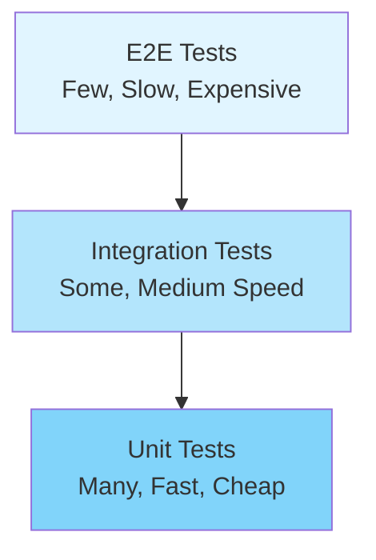
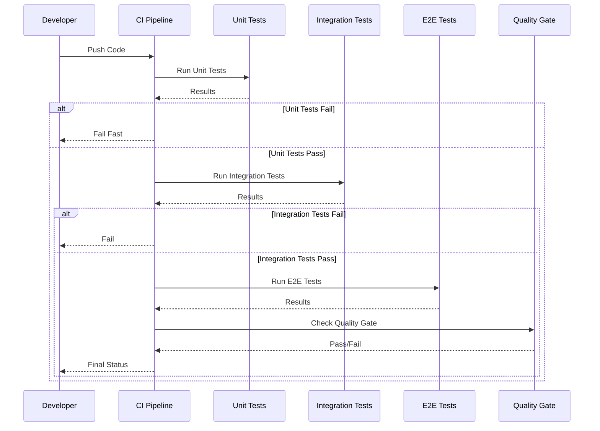
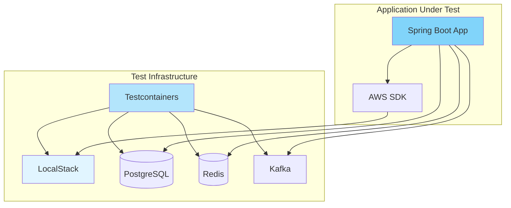

# Testing: Architecture

## Contents

- [Test Pyramid](#test-pyramid)
- [Testing Diamond](#testing-diamond)
- [Testing Trophy](#testing-trophy)
- [Test Isolation Strategies](#test-isolation-strategies)
- [Test Data Management](#test-data-management)
- [Contract Testing](#contract-testing)
- [Test Infrastructure](#test-infrastructure)
  - [CI Parallelization Strategies](#ci-parallelization-strategies)
  - [Cloud Service Emulation](#cloud-service-emulation)
  - [Test Environment Management](#test-environment-management)
  - [Shared vs Isolated Test Databases](#shared-vs-isolated-test-databases)
  - [Test Reporting and Trend Analysis](#test-reporting-and-trend-analysis)
- [Test Boundaries](#test-boundaries)

## Test Pyramid

The test pyramid is a model for organizing tests by type and quantity:



```
        /\
       /  \     E2E Tests (few, slow, expensive)
      /____\
     /      \   Integration Tests (some, medium speed)
    /________\
   /          \ Unit Tests (many, fast, cheap)
  /____________\
```

### Unit Tests

**Characteristics**:
- Fast execution (< 1ms per test typically)
- Isolated from external dependencies
- Test individual functions, methods, or classes
- Use mocks/stubs for dependencies
- Large quantity (70-80% of tests)

**When the Pyramid is Right**:
- Business logic is primarily in isolated units
- Complex algorithms need thorough unit testing
- Fast feedback is critical for developer productivity
- System has clear boundaries between components

**Tools**: JUnit 5, Vitest, Jest, Mockito, MockK

### Integration Tests

**Characteristics**:
- Slower execution (seconds per test)
- Test interactions between components
- Use real dependencies (databases, APIs, file systems)
- Medium quantity (15-20% of tests)

**When the Pyramid is Right**:
- Components have meaningful interactions
- Database queries need validation
- API contracts need verification
- Configuration and wiring need testing

**Tools**: Spring Boot Test Slices (@WebMvcTest, @DataJpaTest), Testcontainers, Vitest with MSW

### E2E Tests

**Characteristics**:
- Slowest execution (minutes per test)
- Test full system from user perspective
- Use real browsers, databases, networks
- Small quantity (5-10% of tests)

**When the Pyramid is Right**:
- Critical user journeys need validation
- Cross-system integration needs verification
- Production-like scenarios need testing

**Tools**: Playwright, Cypress, Selenium

### When Alternatives Are Better

The pyramid assumes most bugs are in unit logic. If bugs primarily occur in integration between components, the pyramid may not be optimal. Consider alternatives like the testing diamond or trophy.

## Testing Diamond

The testing diamond inverts the pyramid, emphasizing integration tests:

```
    /\
   /  \     E2E Tests (few)
  /____\
 /      \   Integration Tests (many)
/________\
\        /  Unit Tests (some)
 \______/
```

**When to Use**:
- Business logic lives in the integration between components
- Microservices where service boundaries are critical
- Systems where configuration and wiring are complex
- When unit tests provide limited value (thin controllers, anemic domain models)

**Example**: A Spring Boot application with thin controllers delegating to services—integration tests validate the full request/response cycle more effectively than isolated unit tests.

## Testing Trophy

The testing trophy emphasizes integration tests with static analysis at the base:

```
    /\
   /  \     E2E Tests
  /____\
 /      \   Integration Tests (many)
/________\
\        /  Unit Tests (some)
 \______/
    ||      Static Analysis (many)
```

**Characteristics**:
- Static analysis (TypeScript types, ESLint, SonarQube) catches many issues
- Integration tests validate component interactions
- Fewer unit tests (focus on complex logic only)
- Popular in frontend/React ecosystem

**When to Use**:
- Type-safe languages where static analysis catches many bugs
- Component-based architectures (React, Vue) where integration tests are natural
- When unit testing framework internals provides limited value

## Test Isolation Strategies

### In-Memory Databases

**Use Case**: Fast database tests without external dependencies

**Examples**:
- H2 for JVM applications (in-memory SQL database)
- SQLite in-memory mode
- MongoDB in-memory

**Trade-offs**:
- ✅ Fast execution
- ✅ No external dependencies
- ✅ Easy cleanup (just drop in-memory database)
- ❌ May behave differently than production database
- ❌ Limited to SQL databases (for H2)

**When to Use**: Unit and integration tests where database behavior needs validation but production-like behavior isn't critical.

### Containerized Dependencies

**Use Case**: Real dependencies in isolated containers

**Examples**:
- Testcontainers (Postgres, Redis, Kafka, etc.)
- Docker Compose for multi-service tests

**Trade-offs**:
- ✅ Real dependency behavior
- ✅ Production-like testing
- ✅ Isolated from other tests
- ❌ Slower than in-memory alternatives
- ❌ Requires Docker

**When to Use**: Integration tests where production-like behavior is critical, especially for database-specific features (JSON queries, full-text search, etc.).

### Mocks and Stubs

**Use Case**: Replace external dependencies with controlled responses

**Examples**:
- Mockito (Java) — mock method calls
- MockK (Kotlin) — mock with Kotlin-friendly API
- MSW (Mock Service Worker) — intercept HTTP requests
- Sinon (JavaScript) — spies, stubs, mocks

**Trade-offs**:
- ✅ Fast execution
- ✅ Deterministic behavior
- ✅ Test error scenarios easily
- ❌ May not reflect real dependency behavior
- ❌ Can hide integration bugs

**When to Use**: Unit tests, testing error handling, testing without external dependencies.

### Fakes

**Use Case**: In-memory implementations of interfaces

**Examples**:
- In-memory repository implementations
- Fake email service (stores emails in memory)
- Fake payment gateway (simulates payment processing)

**Trade-offs**:
- ✅ Realistic behavior (implements real interface)
- ✅ Fast execution
- ✅ No external dependencies
- ❌ Requires maintaining fake implementation
- ❌ May diverge from real implementation

**When to Use**: Integration tests where you need realistic behavior but can't use real dependencies (cost, rate limits, side effects).

## Test Data Management

### Factories and Builders

**Pattern**: Create test objects with sensible defaults, allow customization

**Example**:
```kotlin
data class User(
    val id: String = UUID.randomUUID().toString(),
    val email: String = "test@example.com",
    val role: Role = Role.USER
)

fun user(block: User.() -> Unit = {}): User = User().apply(block)

// Usage
val admin = user { role = Role.ADMIN; email = "admin@example.com" }
```

**Benefits**:
- Tests focus on what's different, not boilerplate
- Defaults provide sensible values
- Easy to create variations

**Tools**: Kotlin builders, Java Builder pattern, factory functions

### Fixtures

**Pattern**: Reusable test setup data

**Examples**:
- Database seed scripts
- JSON/YAML fixture files
- Factory methods that create related objects

**Benefits**:
- Consistent test data across tests
- Easy to update when schema changes
- Can be versioned and shared

**When to Use**: Integration tests requiring complex data setup, E2E tests with realistic data scenarios.

### Database Seeding

**Pattern**: Pre-populate database with known data

**Strategies**:
- **Per-test seeding**: Each test seeds its own data (slower, more isolated)
- **Suite-level seeding**: Seed once per test suite (faster, risk of test interference)
- **Lazy seeding**: Seed on first access, reuse (balance of speed and isolation)

**Trade-offs**:
- Per-test: Maximum isolation, slower execution
- Suite-level: Faster execution, risk of test pollution
- Lazy: Balance of both, requires careful cleanup

### Test Data Cleanup Strategies

**Transaction Rollback**:
- Wrap each test in a transaction, rollback at end
- ✅ Fast cleanup
- ✅ Perfect isolation
- ❌ Can't test transaction behavior
- ❌ May hide transaction-related bugs

**Truncation**:
- Delete all data after each test
- ✅ Works with transactions
- ✅ Fast for small datasets
- ❌ Slower for large datasets
- ❌ May fail if foreign key constraints exist

**Deletion by ID**:
- Track created IDs, delete specific records
- ✅ Precise cleanup
- ✅ Works with foreign keys
- ❌ Requires tracking IDs
- ❌ Slower than truncation

**Separate Test Database**:
- Each test runs against fresh database
- ✅ Perfect isolation
- ✅ No cleanup needed
- ❌ Very slow
- ❌ Complex setup

**Recommendation**: Use transaction rollback for most tests, separate databases only for tests that specifically need to test transaction behavior.

## Contract Testing

### Consumer-Driven Contracts

**Pattern**: Consumers define expected API behavior, providers verify they meet contracts

**Example**: Pact

**Flow**:
1. Consumer tests define expected API responses
2. Consumer tests generate contract files
3. Provider tests verify they satisfy contracts
4. CI fails if contracts are broken

**Benefits**:
- Prevents breaking API changes
- Enables independent deployment of services
- Documents API expectations
- Catches integration issues early

**When to Use**: Microservices architectures, API-first development, multiple consumers of same API.

### Provider Verification

**Pattern**: Provider tests verify they satisfy consumer contracts

**Implementation**:
- Provider runs consumer contract tests
- Provider verifies responses match contracts
- CI fails if provider breaks contract

**Benefits**:
- Providers know immediately if they break consumers
- Enables safe refactoring
- Documents provider responsibilities

### Schema Validation

**Pattern**: Validate API requests/responses against schemas

**Examples**:
- OpenAPI/Swagger schema validation
- JSON Schema validation
- TypeSpec validation
- GraphQL schema validation

**Benefits**:
- Catches schema mismatches early
- Documents API structure
- Enables code generation from schemas

**When to Use**: All APIs, especially public APIs or APIs with multiple consumers.

### Preventing Breaking API Changes

**Strategies**:
1. **Versioning**: Version APIs to allow breaking changes
2. **Contract Testing**: Verify contracts aren't broken
3. **Schema Evolution**: Support backward-compatible schema changes
4. **Deprecation**: Deprecate old fields before removing

**Best Practice**: Combine contract testing with API versioning for safe evolution.

## Test Infrastructure

### CI Parallelization Strategies

**Test Sharding**:
- Split test suite across multiple CI runners
- Each runner runs subset of tests
- Reduces total execution time

**Parallel Test Execution**:
- Run tests in parallel within single runner
- Requires test isolation
- Faster than sequential execution

**Test Prioritization**:
- Run fast tests first (unit tests)
- Run slow tests later (E2E tests)
- Fail fast on unit test failures

**Optimization**:
- Cache test dependencies
- Reuse test containers
- Parallelize at multiple levels (shard + parallel)

**Test Execution Pipeline**:



### Cloud Service Emulation

**LocalStack** provides a local emulation environment for AWS services, enabling integration tests against cloud services without requiring real infrastructure.

**Why It Matters**:
- Enables integration tests against AWS services without real infrastructure
- Faster feedback loops (no network latency to real AWS)
- No cloud costs in CI/CD pipelines
- Tests can run offline and in isolated environments
- Provides realistic behavior compared to mocking SDK clients

**How It Works**:
- Docker container that implements AWS API endpoints locally
- Supports many AWS services: S3, SQS, SNS, DynamoDB, Lambda, Secrets Manager, Kinesis, and more
- Applications connect to LocalStack endpoints instead of real AWS endpoints
- Configuration overrides point AWS SDK clients to LocalStack endpoints

**Use Cases**:
- **S3**: Testing file uploads, downloads, bucket operations, presigned URLs
- **SQS**: Testing message publishing, queue consumption, dead-letter queues
- **SNS**: Testing topic subscriptions, message publishing, notifications
- **DynamoDB**: Testing table operations, queries, scans, transactions
- **Secrets Manager**: Testing secret retrieval, rotation, versioning
- **Lambda**: Testing function invocations, event processing
- **Kinesis**: Testing stream operations, record processing

**Testcontainers + LocalStack**: The recommended approach uses Testcontainers to manage LocalStack lifecycle in tests, ensuring proper startup, shutdown, and isolation.

**Configuration**: Override AWS endpoint URLs in Spring Boot test configuration to point to LocalStack endpoints.

**Example**:
```kotlin
@Testcontainers
@SpringBootTest
class S3UploadServiceTest {
    companion object {
        @Container
        val localStack = LocalStackContainer(DockerImageName.parse("localstack/localstack:latest"))
            .withServices(LocalStackContainer.Service.S3)

        @JvmStatic
        @DynamicPropertySource
        fun properties(registry: DynamicPropertyRegistry) {
            registry.add("aws.s3.endpoint") { localStack.getEndpointOverride(LocalStackContainer.Service.S3) }
            registry.add("aws.credentials.access-key") { localStack.accessKey }
            registry.add("aws.credentials.secret-key") { localStack.secretKey }
            registry.add("aws.region") { localStack.region }
        }
    }

    @Autowired
    lateinit var s3UploadService: S3UploadService

    @Test
    fun `should upload file to S3`() {
        val fileContent = "test content".toByteArray()
        val key = s3UploadService.upload("test-bucket", "test-key", fileContent)
        
        assertNotNull(key)
        // Verify file exists in LocalStack S3
    }
}
```

**Limitations**:
- Not all AWS services are fully emulated (check LocalStack's coverage matrix)
- Some services have behavioral differences from real AWS
- Performance characteristics may differ from production
- Advanced features may not be supported (e.g., advanced S3 features, complex DynamoDB operations)

**Alternatives**:
- **Moto**: Python-focused AWS mocking library (good for Python projects)
- **WireMock**: Generic HTTP API mocking (can mock AWS APIs but less realistic)
- **Real AWS**: Use real AWS for smoke tests in staging environments (slower, costs money, requires network access)

**Test Infrastructure Stack**:



**Best Practice**: Use LocalStack + Testcontainers for integration tests that need AWS service behavior. Prefer LocalStack over mocking AWS SDK clients—you want to test your serialization, error handling, and configuration, not just that you called the right method.

### Test Environment Management

**Strategies**:
- **Ephemeral Environments**: Create fresh environment per test run
- **Shared Environments**: Reuse environments across test runs
- **Containerized Environments**: Use Docker for consistent environments

**Trade-offs**:
- Ephemeral: Clean state, slower setup
- Shared: Faster, risk of test pollution
- Containerized: Consistent, requires Docker

**Recommendation**: Use ephemeral containerized environments for CI, shared environments for local development.

### Shared vs Isolated Test Databases

**Shared Database**:
- ✅ Faster (no setup per test)
- ✅ Tests can share data
- ❌ Risk of test interference
- ❌ Flaky tests from shared state

**Isolated Database**:
- ✅ Perfect isolation
- ✅ No test interference
- ❌ Slower (setup per test)
- ❌ More complex

**Recommendation**: Use isolated databases for CI, shared databases for local development (with careful cleanup).

### Test Reporting and Trend Analysis

**Metrics to Track**:
- Test execution time trends
- Flaky test identification
- Coverage trends
- Failure rate by test type
- Failure rate by component

**Tools**:
- Test result aggregation (Allure, TestNG reports)
- CI/CD analytics (GitHub Actions insights, Jenkins trends)
- Custom dashboards (Grafana, DataDog)

**Benefits**:
- Identify slow tests for optimization
- Track flaky tests for elimination
- Understand test suite health over time
- Make data-driven decisions about test investment

## Test Boundaries

### Where to Draw the Line: Unit vs Integration

**Unit Test Characteristics**:
- Tests single unit (function, method, class)
- All dependencies mocked/stubbed
- Fast execution (< 1ms)
- No external resources (database, network, file system)

**Integration Test Characteristics**:
- Tests interaction between components
- Some real dependencies
- Slower execution (seconds)
- May use external resources

**Gray Area**: Tests that use real database but mock everything else. These are integration tests, not unit tests, even if they're fast.

### What "Integration" Means

**In-Process Integration**:
- Components run in same process
- May use real dependencies (database, file system)
- Still relatively fast
- Example: Spring Boot @DataJpaTest with H2

**Out-of-Process Integration**:
- Components communicate across process boundaries
- Uses real network, real services
- Slower, more realistic
- Example: HTTP client tests against real API server

**Both are integration tests**, but out-of-process is closer to E2E.

### Component Tests as Middle Ground

**Component Tests**:
- Test a component (service, module) in isolation
- Use real dependencies for that component
- Mock external dependencies
- Faster than full integration, more realistic than unit

**Example**: Testing a payment service with real database but mocked payment gateway.

**When to Use**: When unit tests are too isolated but full integration tests are too slow or complex.

**Benefits**:
- Good balance of speed and realism
- Tests component behavior, not just implementation
- Easier to debug than full integration tests

The key is choosing the right test type for each scenario, not rigidly following a pyramid structure.
