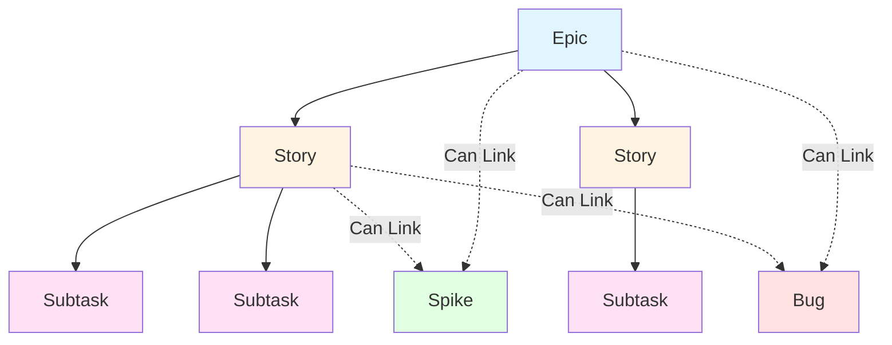
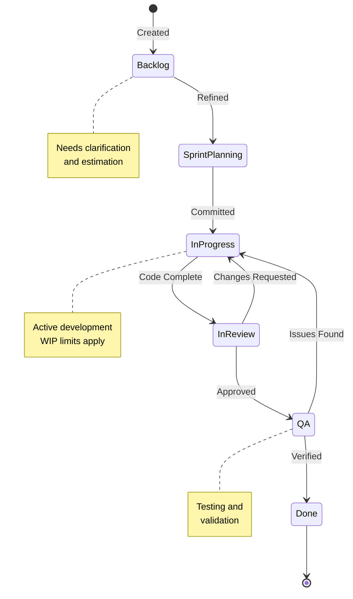

# Architecture: Work Management Systems

## Contents

- [Ticket Hierarchy](#ticket-hierarchy)
- [Ticket Structure and Templates](#ticket-structure-and-templates)
- [Workflow States](#workflow-states)
- [Estimation](#estimation)
- [Sprint Management](#sprint-management)
- [Linking Work to Code](#linking-work-to-code)

Work management architecture defines how work is structured, tracked, and executed. This includes ticket hierarchies that organize work by scope, templates that standardize information capture, workflows that enforce process, estimation approaches that enable planning, and linking mechanisms that connect work to code. Understanding these architectural patterns is essential for designing effective work management systems.

## Ticket Hierarchy

Work management systems organize work into a hierarchy that reflects scope and relationships. Understanding each level of this hierarchy—and when to use it—ensures work is tracked at the appropriate granularity.

### Work Hierarchy Structure

The work hierarchy organizes tickets by scope, with epics containing stories, stories containing subtasks, and parallel ticket types for different work categories.

Epics represent large initiatives spanning multiple sprints. Stories break epics into independently valuable pieces of work. Subtasks decompose stories into implementation steps. Spikes and bugs are parallel ticket types that can link to epics or stories but don't fit the hierarchical structure.

### Epic

An epic represents a large body of work that can be broken into smaller stories. Epics span multiple sprints and often represent a feature, initiative, or project. They have a clear business objective and measurable outcome. Examples include "Implement invoice management system" or "Migrate authentication to OIDC."

Epics serve as containers for related stories, providing context and alignment. When a product manager asks "how is the invoice management initiative progressing?", the epic aggregates status from all linked stories. This high-level visibility is essential for roadmap planning and stakeholder communication.

An epic should have a clear problem statement (what pain point this addresses), a goal (measurable outcome), and high-level requirements (feature list). It should not include implementation details—those belong in stories. An epic that's too detailed becomes a specification document rather than a planning tool. An epic that's too vague provides no guidance for story breakdown.

Epics enable capacity planning at a strategic level. By tracking epic progress and linking stories to epics, teams can forecast when large initiatives will complete. This visibility helps product managers make trade-off decisions: if Epic A is behind schedule, should we delay Epic B or increase capacity?

### Story (User Story)

A story is a vertical slice of user-facing value that can be completed in a single sprint. Stories follow the format "As a [persona], I want [capability], so that [benefit]." This format ensures stories focus on user value, not technical implementation. A story should be independently testable and deployable—completing a story should deliver tangible value, even if it's behind a feature flag.

Stories represent the unit of planning and commitment. During sprint planning, teams select stories from the refined backlog and commit to completing them. A story that's too large (spanning multiple sprints) can't be committed to—it becomes a mini-epic that needs breakdown. A story that's too small (a few hours of work) creates overhead without proportional value.

Well-written stories include acceptance criteria that define what "done" means. These criteria should be testable: "Given a logged-in user, when they click the download button, then a PDF invoice is generated and downloaded." Vague criteria like "the feature works" don't provide clear boundaries and lead to scope creep.

Stories should be sized appropriately for a sprint. A story that takes one developer more than 3-5 days to complete is likely too large and should be broken down. Smaller stories enable faster feedback, easier code review, and more accurate estimation. They also reduce risk—if a large story encounters unexpected complexity, the entire sprint commitment is at risk.

### Task

A task is a technical work item that doesn't directly deliver user value but is necessary for stories to be completed. Examples include infrastructure setup, refactoring, tooling improvements, and dependency upgrades. Tasks should still be linked to the story or epic they support, ensuring traceability.

Tasks enable tracking of non-user-facing work that's essential for delivery. A story might require "set up CI/CD pipeline for new service" as a task. This task doesn't deliver user value directly, but without it, the story can't be deployed. Tracking tasks separately from stories provides visibility into technical work that might otherwise be invisible.

Tasks should still have clear acceptance criteria. "Upgrade React from 17 to 18" is a task with clear completion criteria: tests pass, no breaking changes, documentation updated. Vague tasks like "improve code quality" aren't trackable and should be refined or converted to spikes.

Some teams prefer to keep tasks within stories as subtasks rather than separate tickets. This approach reduces ticket overhead but can obscure technical work in reporting. The choice depends on team preferences and reporting needs.

### Spike

A spike is a time-boxed research effort to answer a technical question or reduce uncertainty before committing to implementation. Spikes have questions (what we're investigating), a hypothesis (what we expect to find), and outputs (findings, recommendation, prototype).

Spikes are essential for managing uncertainty. Committing to a 13-point story without understanding the technical approach is risky—unknowns discovered during implementation can derail the sprint. A spike that investigates the approach first enables informed estimation and reduces risk.

Spikes must be time-boxed to prevent scope creep. A typical spike lasts 1-3 days. If a spike exceeds its time box, it should produce interim findings and a recommendation for whether to continue or pivot. Spikes that drag on become research projects rather than risk-reduction activities.

The output of a spike should inform story creation. A spike investigating "OpenSearch vs PostgreSQL FTS for product search" should produce a recommendation, performance benchmarks, and implementation notes. These findings become the foundation for stories that implement the chosen approach.

Spikes are not implementation work—they're investigation work. A spike that produces working code has exceeded its scope. The code might be a prototype to validate an approach, but the actual implementation should be tracked as stories.

### Bug

A bug is a defect in existing functionality. Bugs should include steps to reproduce, expected behavior, actual behavior, environment details, and severity. Bugs are not stories—they represent broken promises (documented or expected behavior that doesn't work), not new features.

Bug severity helps prioritize fixes. Critical bugs (system down, data loss) require immediate attention. High bugs (major feature broken) should be fixed in the current sprint. Medium bugs (minor feature issues) can be planned in upcoming sprints. Low bugs (cosmetic issues) can be backlogged.

Bugs should be linked to the story or epic that introduced them, when identifiable. This traceability helps identify patterns: are bugs concentrated in certain areas? Do certain types of changes introduce more bugs? This data informs process improvements.

Some teams track bugs separately from stories in their workflow. Others include bug fixes in sprint planning alongside stories. The approach depends on team capacity and bug volume. High bug volume might require dedicated bug-fixing capacity or a separate bug-fixing sprint.

### Subtask

A subtask is a breakdown of a story into smaller implementation steps. Subtasks are useful for tracking progress within a story, but they should not be required. If a story needs more than 5-6 subtasks, it may be too large and should be broken into separate stories.

Subtasks enable parallel work when multiple developers collaborate on a story. One developer might work on the API endpoint while another works on the frontend component. Subtasks provide visibility into who's doing what without fragmenting the story.

However, subtasks add overhead. Creating, estimating, and tracking subtasks takes time. For a 3-point story that one developer completes in a day, subtasks might be unnecessary. Use subtasks when they provide genuine value—parallel work, progress tracking, or clarity—not as a default practice.

Subtasks should not become a way to avoid breaking down large stories. A 13-point story broken into 15 subtasks is still a 13-point story. The story itself should be broken down into smaller, independently valuable stories.

## Ticket Structure and Templates

Tickets need consistent structure to ensure all necessary information is captured. Templates standardize this structure, making tickets easier to write, read, and review. Different ticket types need different templates because they serve different purposes.

### Story Template

A story template should include:

**Overview**: What needs to be built and why. This section captures the user story format and business context. It answers "what problem are we solving?" and "who benefits?"

**Refinement Notes**: Technical details, implementation approach, and dependencies. This section captures decisions made during refinement: which services are involved, what APIs are needed, what data models are required. It provides context for developers starting the work.

**Success Criteria**: Acceptance criteria in Given/When/Then format or a clear checklist. These criteria define what "done" means. They should be testable and specific. Vague criteria like "it works" don't provide boundaries.

The template should be flexible enough to accommodate different types of stories while ensuring consistency. A story about a new API endpoint might have different technical details than a story about a UI change, but both should include overview and success criteria.

### Spike Template

A spike template should include:

**Questions**: What technical questions are we investigating? What unknowns need to be resolved? This section defines the scope of investigation.

**Hypothesis**: What do we expect to find? This helps focus the research and provides a baseline for comparison.

**Research**: Findings from investigation. This might include performance benchmarks, API documentation review, prototype results, or architectural analysis.

**Summary**: Key takeaways from the spike. What did we learn? What are the implications?

**Recommendation**: Proposed next steps. Should we proceed with implementation? What approach should we take? What stories need to be created?

The spike template ensures spikes produce actionable outputs rather than just research notes. A spike without a recommendation hasn't completed its purpose.

### Bug Template

A bug template should include:

**Steps to Reproduce**: Detailed steps that reliably reproduce the issue. This should be specific enough that another developer can reproduce it without guessing.

**Expected Behavior**: What should happen when following the steps? This defines the correct behavior.

**Actual Behavior**: What actually happens? This describes the defect.

**Environment**: Browser, OS, API version, or other environment details that might affect reproduction.

**Severity**: Critical, high, medium, or low. This helps prioritize fixes.

**Screenshots/Logs**: Visual evidence or error logs that help diagnose the issue.

The bug template ensures bugs are actionable. A bug report that says "it's broken" without reproduction steps isn't useful. Developers need enough information to reproduce and diagnose the issue.

### Epic Template

An epic template should include:

**Problem**: What pain point does this epic address? What problem are we solving for users or the business?

**Goal**: What measurable outcome defines success? This should be specific and quantifiable.

**Requirements**: High-level feature list. What capabilities does this epic deliver? This provides scope boundaries.

**PRD Link**: Link to product requirements document if one exists. This provides detailed specifications without cluttering the epic.

The epic template keeps epics focused on outcomes rather than implementation. An epic that reads like a technical specification has too much detail. An epic that's too vague provides no guidance for story breakdown.

## Workflow States

Workflow states define the lifecycle of a ticket from creation to completion. The workflow enforces process and provides visibility into work status. Different teams need different workflow complexity, but all workflows should enable clear status tracking.

### Ticket Lifecycle

Tickets progress through a series of states from initial planning to completion. Understanding this lifecycle helps teams track progress and identify bottlenecks.

The lifecycle begins when a ticket is created and added to the backlog. After refinement and estimation, tickets move to sprint planning where they're committed to a sprint. Once work begins, tickets move to In Progress. After code completion, tickets enter review, then QA, and finally Done when all acceptance criteria are met.

### Minimal Workflow

A minimal workflow has three states: To Do → In Progress → Done. This simplicity reduces overhead and works well for small teams or projects with fast iteration cycles.

**To Do**: Work that's planned but not started. Tickets in this state are ready to be picked up.

**In Progress**: Work that's actively being developed. A ticket moves to In Progress when development begins.

**Done**: Work that's completed, reviewed, and merged. A ticket moves to Done when all acceptance criteria are met and the change is deployed (or behind a feature flag).

This minimal workflow works when process overhead would slow delivery more than it helps. It's common in startups, small teams, or projects with high trust and low process requirements.

### Extended Workflow

An extended workflow adds intermediate states for better visibility: Backlog → Refinement → Ready → In Progress → In Review → QA → Done. This complexity provides more granular status tracking but requires more discipline to maintain.

**Backlog**: Work that's identified but not yet refined. Tickets in backlog need clarification, estimation, or breakdown before they can be planned.

**Refinement**: Work that's being clarified and estimated. Tickets in refinement are actively being discussed to ensure they're ready for sprint planning.

**Ready**: Work that's refined and ready to be planned. Tickets in Ready have clear acceptance criteria, estimates, and no blocking dependencies.

**In Progress**: Work that's actively being developed. Same as minimal workflow.

**In Review**: Work that's completed and awaiting peer review. Code is written, tests pass locally, and a pull request is open.

**QA**: Work that's reviewed and merged, awaiting QA verification. Code is in a test environment and QA is validating acceptance criteria.

**Done**: Work that's completed, tested, and deployed. All acceptance criteria are met and the feature is live (or behind a feature flag).

The extended workflow provides visibility into bottlenecks. If many tickets are stuck in "In Review," it indicates a code review bottleneck. If many tickets are stuck in "QA," it indicates a testing bottleneck. This visibility enables targeted process improvements.

### Key Workflow Principles

**Forward Flow**: Tickets should flow forward through states. Moving backward (e.g., from "In Review" back to "In Progress") indicates issues: missing requirements discovered during review, failed tests, or scope changes. While occasional backward flow is normal, frequent backward flow signals process problems.

**WIP Limits**: Work in Progress limits prevent overloading. Limiting "In Progress" tickets to 1-2 per developer prevents context switching and ensures focus. When a developer tries to start a third ticket, they must complete or block an existing one first.

**Blocked Visibility**: Blocked tickets should be visible and escalated. A ticket that's blocked for more than a day needs attention. Blockers should be tracked explicitly (a "Blocked" state or label) and reviewed in daily standups.

**Definition of Ready**: A ticket isn't ready to be worked on until it meets the Definition of Ready: refined, acceptance criteria clear, dependencies identified, team has asked questions. Starting work on a ticket that doesn't meet Definition of Ready leads to blockers and rework.

**Definition of Done**: A ticket isn't done until it meets the Definition of Done: code written, reviewed, and merged; tests pass; feature deployed (or behind feature flag); documentation updated; acceptance criteria met. Moving tickets to Done prematurely inflates velocity metrics but doesn't reflect actual delivery.

## Estimation

Estimation enables capacity planning and sprint commitment. Different estimation approaches suit different team contexts, but all approaches require consistent application to be useful.

### Story Points (Fibonacci)

Story points measure relative complexity and effort, not absolute time. A 5-point story is more complex than a 3-point story, but the ratio (5:3) is what matters, not the absolute hours. Teams calibrate points through practice: after completing several sprints, a team learns that their 5-point stories typically take 2-3 days.

The Fibonacci sequence (1, 2, 3, 5, 8, 13) forces decisions. The gap between 5 and 8 is large enough that teams must decide: is this closer to 5 or 8? This prevents false precision. A 13-point story should probably be broken down—it's too large to estimate accurately or complete reliably.

Story points are team-relative. Team A's 5 points might represent different effort than Team B's 5 points. This is fine—points are for planning within a team, not comparing across teams. Velocity (points completed per sprint) is meaningful only within a team's context.

Estimation should consider complexity, uncertainty, and effort. A story that's straightforward but time-consuming might be 5 points. A story that's quick but requires research might also be 5 points. The point value reflects the overall challenge, not just coding time.

### T-Shirt Sizing

T-shirt sizing (S, M, L, XL) is simpler than story points and works well for roadmap-level planning. It's easier for non-technical stakeholders to understand: "this feature is Large" is more intuitive than "this feature is 8 points."

T-shirt sizes can be mapped to point ranges if needed: S = 1-2, M = 3-5, L = 8, XL = 13+. This mapping enables teams to use t-shirt sizing for high-level planning and story points for sprint planning.

T-shirt sizing works well when precise estimation isn't needed. For quarterly roadmaps or epic-level planning, the granularity of story points might be unnecessary. T-shirt sizing provides enough detail for capacity planning without estimation overhead.

### No Estimates

The #NoEstimates movement argues that estimation overhead exceeds its value. Instead of estimating, teams track throughput: how many tickets are completed per sprint. This approach requires consistently-sized tickets—if tickets vary widely in size, throughput isn't meaningful.

No-estimates works well for mature teams with consistent practices. Teams that have refined their ticket sizing to be relatively uniform can rely on count rather than points. A team that completes 5-7 tickets per sprint can plan based on that range.

The challenge with no-estimates is ensuring ticket consistency. Without estimation, there's no forcing function to break down large tickets. Teams must be disciplined about ticket sizing to make throughput meaningful.

### Estimation Principles

**Estimation is for Planning**: Story points help teams commit to sprint scope and forecast delivery. They're not for performance measurement. Comparing Team A's velocity to Team B's velocity is meaningless—points are team-relative.

**Estimation Accuracy Improves with Practice**: Early sprints will have inaccurate estimates as teams calibrate. This is normal. After 3-4 sprints, estimates should become more consistent.

**Large Estimates Signal Breakdown Needed**: A 13-point story is too large to estimate accurately or complete reliably. It should be broken into smaller stories.

**Spike Before Estimating Complex Work**: Don't estimate work you don't understand. Create a spike first, then estimate informed stories.

## Sprint Management

Sprints are time-boxed iterations (typically 1-2 weeks) where teams commit to completing a set of tickets. Effective sprint management requires planning, daily coordination, review, and retrospective.

### Sprint Planning

Sprint planning selects tickets from the refined backlog that the team commits to completing. Capacity is based on historical velocity adjusted for team availability (vacations, holidays, other commitments).

During planning, the team reviews refined tickets, asks clarifying questions, and commits to a scope that fits capacity. Planning should be efficient—if tickets are already refined, planning takes 1-2 hours. If tickets need refinement during planning, the session becomes a multi-hour refinement meeting.

The output of sprint planning is a sprint goal (what we're trying to achieve) and a committed set of tickets. This commitment is important—it creates accountability and enables measurement. If a team consistently fails to complete committed work, it indicates estimation problems, scope creep, or capacity issues.

### Daily Standup

Daily standup is a brief (15-minute maximum) coordination meeting where team members share: what I did yesterday, what I'm doing today, and any blockers. The focus should be on blockers and collaboration, not status reporting—ticket status is visible in the system.

Standup should be time-boxed and focused. If standup regularly exceeds 15 minutes, it's become a problem-solving session rather than coordination. Blockers identified in standup should be addressed outside standup with relevant people.

Some teams use async standup (Slack updates, ticket comments) instead of meetings. This works well for distributed teams or teams that prefer async communication. The key is ensuring blockers are visible and addressed.

### Sprint Review/Demo

Sprint review demonstrates completed work to stakeholders. This is an opportunity to get feedback, celebrate progress, and ensure alignment. Completed tickets should be demoed, not just reported as "done."

The review should be interactive—stakeholders can ask questions, provide feedback, and request changes. This feedback informs backlog prioritization and ensures the team is building the right things.

Sprint review also serves as a forcing function for Definition of Done. If a ticket can't be demoed, it's not really done. This prevents the accumulation of "mostly done" work that doesn't deliver value.

### Retrospective

Retrospective is a process improvement meeting where the team reflects: what went well, what didn't go well, and what should change. The focus is on actionable improvements, not venting.

Retrospectives should produce action items tracked as tickets. A retrospective without action items is just a discussion. Action items should be specific, assigned, and reviewed in the next retrospective to ensure they're completed.

Common retrospective topics include: process bottlenecks, communication issues, technical debt, tooling problems, and team dynamics. The goal is continuous improvement, not blame assignment.

### Backlog Refinement

Backlog refinement (also called grooming) is an ongoing process of reviewing upcoming tickets, clarifying requirements, estimating, and breaking down large tickets. This should happen continuously, not in a single meeting.

The goal is to maintain 1-2 sprints of refined work ahead. When sprint planning begins, tickets should already be clear, estimated, and ready to commit to. This prevents planning from becoming a refinement session.

Refinement should involve product, engineering, and design as needed. Technical tickets might need only engineering input. User-facing tickets need product and design input. The right people should be involved to ensure tickets are truly ready.

Regular refinement prevents backlog decay. Tickets that sit unrefined for months become stale—requirements change, context is lost, and the ticket might no longer be relevant. Regular review keeps the backlog current and useful.

## Linking Work to Code

Tickets should be linked to code changes to enable traceability. This linking happens through branch names, commit messages, and pull request descriptions.

### Branch Naming

Branch names should include the ticket ID: `HRZN-123-add-invoice-pdf`. This enables automated linking in Jira, Azure Boards, or GitHub. When a branch is created or a PR is opened, the ticket system can automatically link it to the ticket.

Branch naming conventions vary by team, but consistency is key. A convention like `{ticket-id}-{short-description}` works well. The description should be concise but descriptive enough to identify the work.

### Commit Messages

Commit messages should include the ticket ID: `HRZN-123: Add PDF download endpoint`. This enables traceability from code to requirement. When reviewing git history, the ticket ID provides context for why a change was made.

Some teams use conventional commits with ticket IDs: `feat(HRZN-123): add PDF download endpoint`. This provides both ticket traceability and change type (feat, fix, refactor, etc.).

### Pull Request Descriptions

PR descriptions should link to the ticket, summarize changes, and note anything reviewers should pay attention to. A good PR description helps reviewers understand the context and scope without reading the ticket.

PR descriptions should also note testing: what was tested, how to test, and what environments were verified. This helps reviewers assess completeness.

### Deployment Tracking

Deployments should be linked to tickets for change management. Knowing which tickets are in which release enables rollback planning, change communication, and incident response.

Some teams use deployment tickets that aggregate all tickets in a release. Others link individual tickets to deployments. The approach depends on deployment frequency and change management requirements.

Linking deployments to tickets completes the traceability chain: requirement → ticket → code → deployment → production. This chain enables answering "what changed in this release?" and "why was this change made?" months after deployment.
