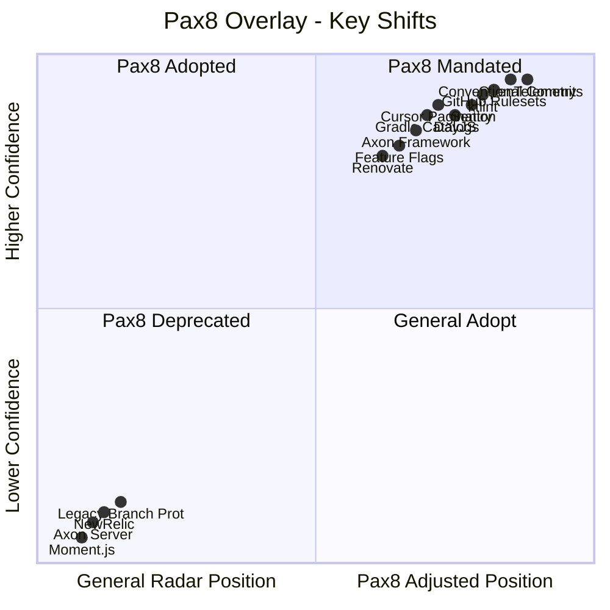

# Pax8 Tech Radar Overlay

Adjustments to the [industry-general tech radar](tech-radar.md) based on Pax8 Architecture Decision Records. These shifts reflect organisational decisions that may differ from — or reinforce — industry defaults.

> This overlay only applies to Pax8 projects. For non-Pax8 work, use the [general tech radar](tech-radar.md) as-is.

## How to Read This

Each entry shows the **general ring** (from the codex) and the **Pax8 ring** (after applying the ADR). Where they differ, the Pax8 ring takes precedence for Pax8 projects.

---

## Ring Changes

### Promoted (moved to a more confident ring for Pax8)

| Technology | General Ring | Pax8 Ring | ADR | Rationale |
|-----------|-------------|-----------|-----|-----------|
| Conventional Commits | Adopt | **Adopt (Mandated)** | ADR-00038 | Required across all Pax8 repositories, not optional |
| GitHub Repository Rulesets | Adopt | **Adopt (Mandated)** | ADR-00034 | Mandatory — legacy branch protection must be migrated |
| Cursor-Based Pagination | Trial | **Adopt** | ADR-00074 | Preferred for all new user-facing list endpoints with infinite scroll |
| Renovate | Trial | **Adopt** | ADR-00046 | Required alongside dependency tier evaluation process |
| Sentry | Adopt | **Adopt (Mandated)** | ADR-00027 | Required for all frontend projects |
| OpenTelemetry | Adopt | **Adopt (Mandated)** | ADR-00026, ADR-00041 | Spans must be prefixed with service name; SLOs must be defined |
| Axon Framework (no Axon Server) | Trial | **Adopt** | ADR-00060 | Standard for CQRS/event sourcing at Pax8, with Kafka + PostgreSQL |
| ktlint | Adopt | **Adopt (Mandated)** | ADR-00016 | Required in all Kotlin microservices |
| DayJS | Adopt | **Adopt (Mandated)** | ADR-00049 | Mandatory replacement for Moment.js |
| Atlantis | Adopt | **Adopt (Mandated)** | ADR-00047 | Required for all Terraform plan/apply workflows |
| Feature Flags | Trial | **Adopt** | ADR-00035 | Approved for use; evaluate LaunchDarkly vs simpler approach per-project |
| UUIDs for Domain IDs | Adopt | **Adopt (Mandated)** | ADR-00007 | Required — no sequential integers for external exposure |
| Gradle Version Catalogs | Assess | **Adopt** | ADR-00025 | Mandatory replacement for ext variables |

### Demoted (moved to Hold for Pax8)

| Technology | General Ring | Pax8 Ring | ADR | Rationale |
|-----------|-------------|-----------|-----|-----------|
| NewRelic | Hold | **Hold (Deprecated)** | ADR-00009 | Active migration away; do not create new dashboards or alerts |
| Axon Server | Hold | **Hold (Deprecated)** | ADR-00060 | Removed from Pax8 architecture entirely |
| Moment.js | Hold | **Hold (Deprecated)** | ADR-00049 | DayJS is the mandated replacement |
| Legacy Branch Protection | Hold | **Hold (Deprecated)** | ADR-00034 | GitHub Rulesets are the standard |
| Gradle ext Variables | Hold | **Hold (Deprecated)** | ADR-00025 | Version catalogs are mandated |
| Manual GitHub Team Mgmt | Hold | **Hold (Deprecated)** | ADR-00040 | Entra SSO-based assignment is the standard |

### Pax8-Specific Additions (not in general radar)

| Technology | Pax8 Ring | ADR | Rationale |
|-----------|-----------|-----|-----------|
| Pax8 Search Spring Boot Starter | **Adopt** | ADR-00061 | Standard for OpenSearch integration |
| Golden Docker Base Images | **Adopt** | ADR-00039 | Mandatory for all container builds |
| ECR Image Tag Prefixing | **Adopt** | ADR-00039 | Required tagging convention |
| FGA Client (Monolith) | **Adopt** | ADR-00076 | Standard for Fine-Grained Authorization |
| RFC 4180 for CSV | **Adopt** | ADR-00068 | Required for all CSV generation/parsing |
| Standardised Audit Fields | **Adopt** | ADR-00079 | createdAt, updatedAt, createdBy, updatedBy in all APIs and events |
| X-Idempotency-Key Header | **Adopt** | ADR-00080 | Required for all mutation endpoints |
| Standardised Error Response | **Adopt** | ADR-00081 | Uniform error format across all Pax8 APIs |
| Architecture CODEOWNERS | **Adopt** | ADR-00062 | Architecture team reviews required on best-practice files |
| Team-Based CODEOWNERS | **Adopt** | ADR-00056 | Required when multiple teams contribute to a repo |

### Pax8 Guidance (recommended, not mandated)

| Technology | Pax8 Ring | ADR | Rationale |
|-----------|-----------|-----|-----------|
| MongoDB | **Trial** | ADR-00037 | Approved for specific use cases; PostgreSQL remains default |
| Kafka Topic Backfill | **Trial** | ADR-00051 | Internal endpoints for data replay — use when needed |
| Quartz for Axon Deadlines | **Trial** | ADR-00069 | Isolates deadline handling from aggregate lifecycle |
| Shadow Entities (Vendor) | **Trial** | ADR-00077 | Recommended pattern for vendor data in purchasing domain |
| Browser Support (Last 2) | **Adopt** | ADR-00042 | Chrome, Firefox, Safari, Edge — no IE11 |

---

## Visual Comparison

---

## Summary

| Category | Count |
|----------|-------|
| Promoted to higher ring | 13 |
| Demoted to Hold | 6 |
| Pax8-specific additions | 10 |
| Pax8 guidance (non-mandated) | 5 |

**Source:** [Pax8 Standards Map](pax8-context/standards-map.md) | [Deprecated Technologies](pax8-context/deprecated.md)

**Last generated:** 2026-02-09

**Refresh with:** Use the `refresh-tech-radar` skill to regenerate from current codex and Pax8 ADR content.
