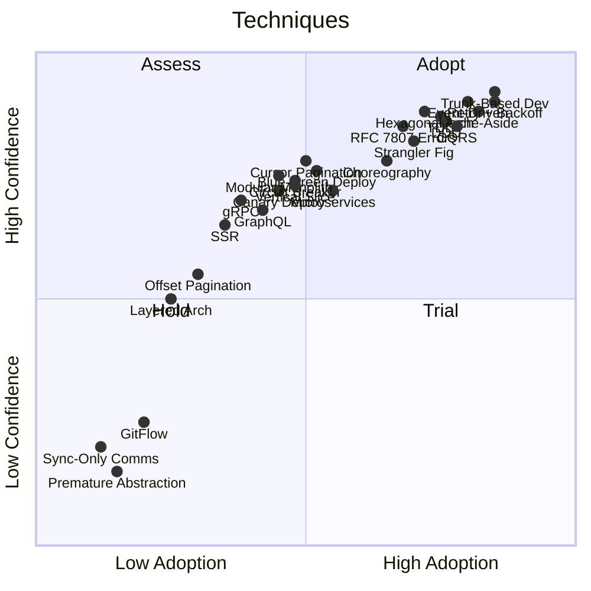
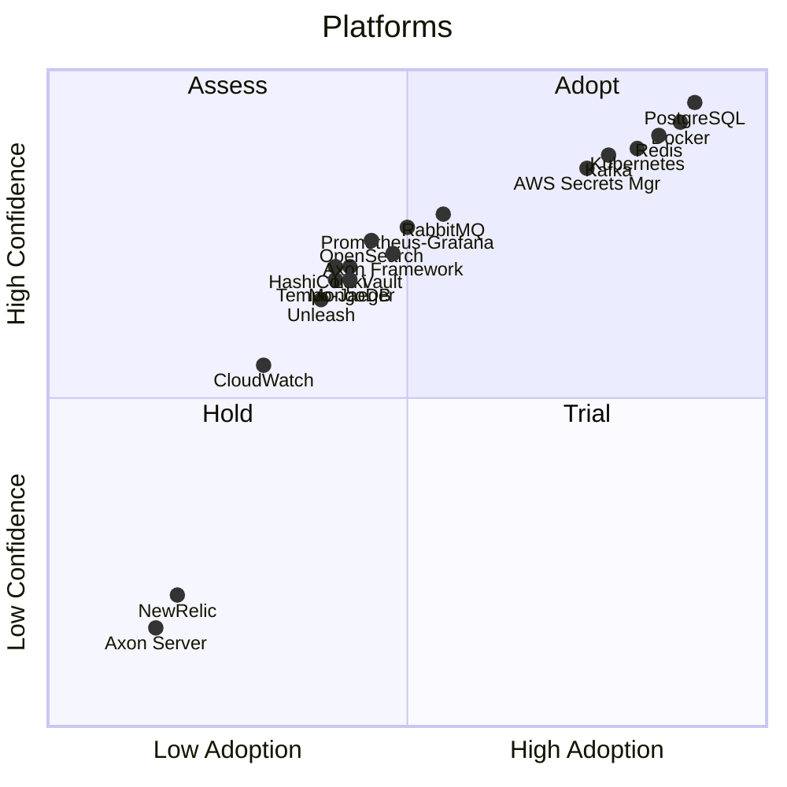
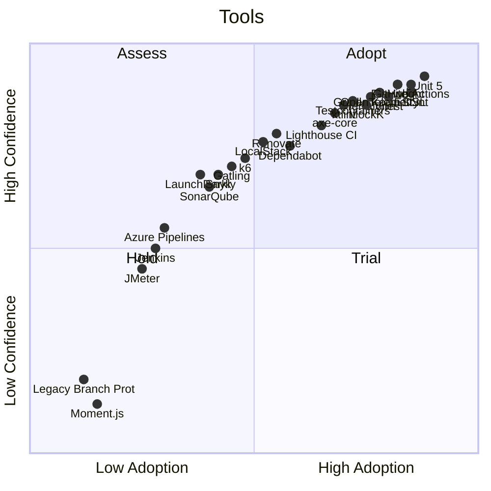
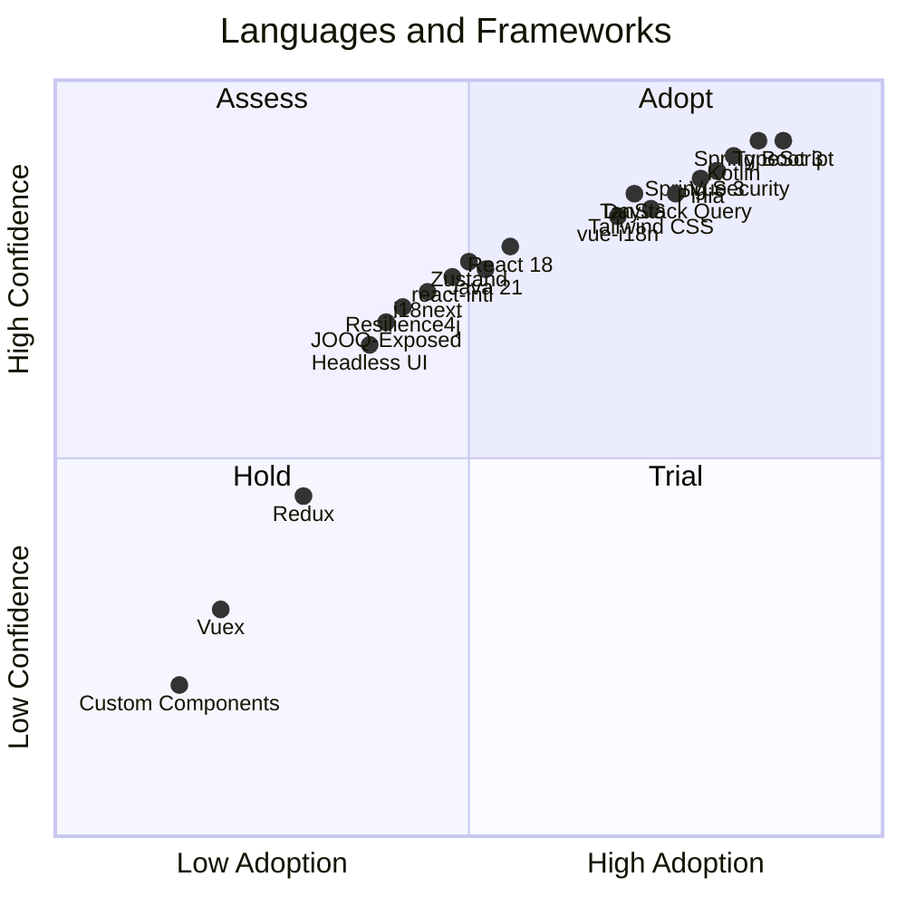

# Engineering Codex Tech Radar

A technology radar derived from the recommendations, alternatives, and warnings across all 21 Engineering Codex facets. Inspired by the [ThoughtWorks Technology Radar](https://www.thoughtworks.com/radar).

## How to Read This

| Ring | Meaning |
|------|---------|
| **Adopt** | Proven, recommended default. Use unless you have a strong reason not to. |
| **Trial** | Strong alternative with clear use cases. Worth adopting for the right context. |
| **Assess** | Promising or situational. Evaluate for your specific needs before committing. |
| **Hold** | Avoid for new work. Migrate away from if encountered in existing code. |

> This is the **industry-general** radar based on codex best practices.
> For Pax8-specific adjustments, see [tech-radar-pax8.md](tech-radar-pax8.md).
>
> For an interactive version, feed [tech-radar.json](tech-radar.json) into [Zalando's Tech Radar](https://github.com/zalando/tech-radar).

---

## Quadrant 1: Techniques

Architectural patterns, methodologies, and development approaches.

### Adopt

| Technology | Rationale | Source Facet |
|-----------|-----------|-------------|
| Trunk-Based Development | Fastest feedback loop, simplest branching model | [repository-governance](facets/repository-governance/) |
| CQRS | Separates read/write concerns for complex domains | [event-driven-architecture](facets/event-driven-architecture/) |
| Hexagonal Architecture | Isolates domain from infrastructure for testability | [backend-architecture](facets/backend-architecture/) |
| Event-Driven (Hybrid) | Sync for queries, async for commands — best of both | [event-driven-architecture](facets/event-driven-architecture/) |
| Strangler Fig Pattern | Safest path for incremental architectural extraction | [refactoring-and-extraction](facets/refactoring-and-extraction/) |
| TDD for Business Logic | Catches regressions early, drives clean design | [testing](facets/testing/) |
| BDD for User-Facing Features | Aligns tests with acceptance criteria | [testing](facets/testing/) |
| RFC 7807 Problem Details | Standard error response format, machine-readable | [error-handling](facets/error-handling/) |
| Cache-Aside with Redis | Simple, effective caching with explicit invalidation | [performance](facets/performance/) |
| Retry with Exponential Backoff | Resilience without thundering herd | [error-handling](facets/error-handling/) |
| Conventional Commits | Consistent history, enables automated changelogs | [repository-governance](facets/repository-governance/) |
| Choreography (simple flows) | Low coupling for straightforward event reactions | [event-driven-architecture](facets/event-driven-architecture/) |
| Orchestration/Saga (complex flows) | Explicit coordination for multi-step processes | [event-driven-architecture](facets/event-driven-architecture/) |
| Squash Merge | Clean main branch history, atomic feature commits | [repository-governance](facets/repository-governance/) |
| Contract Testing | Catches integration breaks without full environment | [testing](facets/testing/) |
| Component-Driven Development | Build UIs from isolated, testable components | [frontend-architecture](facets/frontend-architecture/) |
| Domain-Driven Design | Bounded contexts, aggregates, ubiquitous language for complex domains | [backend-architecture](facets/backend-architecture/) |

### Trial

| Technology | Rationale | Source Facet |
|-----------|-----------|-------------|
| Vertical Slice Architecture | Feature-based code organisation, strong for CRUD-heavy domains | [backend-architecture](facets/backend-architecture/) |
| Modular Monolith (Modulith) | Monolith benefits with clear module boundaries | [backend-architecture](facets/backend-architecture/) |
| Microservices (teams 15+) | Independent deployment at scale, high operational cost | [backend-architecture](facets/backend-architecture/) |
| GraphQL | Excellent for complex data relationships and mobile clients | [api-design](facets/api-design/) |
| gRPC | High-performance internal service communication | [api-design](facets/api-design/) |
| Cursor-Based Pagination | Consistent results in real-time datasets | [api-design](facets/api-design/) |
| Blue-Green Deployment | Zero-downtime releases with instant rollback | [ci-cd](facets/ci-cd/) |
| Canary Deployment | Gradual rollout with real traffic validation | [ci-cd](facets/ci-cd/) |
| Circuit Breaker (Resilience4j) | Prevents cascade failures in distributed systems | [error-handling](facets/error-handling/) |
| Server-Side Rendering | SEO-critical apps, faster first paint | [frontend-architecture](facets/frontend-architecture/) |
| Module Federation (MFE) | Runtime MFE composition, shared dependencies | [frontend-architecture](facets/frontend-architecture/) |
| Database-Backed Feature Toggles | Simple, queryable, no vendor dependency | [feature-toggles](facets/feature-toggles/) |
| Write-Through Cache | Consistency when stale data is unacceptable | [performance](facets/performance/) |

### Assess

| Technology | Rationale | Source Facet |
|-----------|-----------|-------------|
| REST (default) | Well-understood, sufficient for most APIs | [api-design](facets/api-design/) |
| Offset Pagination (Spring Pageable) | Familiar, but problematic for large/real-time datasets | [api-design](facets/api-design/) |
| Layered Architecture | Suitable for simple CRUD, not for complex domains | [backend-architecture](facets/backend-architecture/) |
| Monolith (teams <5) | Simplest starting point, evolve when triggers hit | [backend-architecture](facets/backend-architecture/) |
| Rolling Deployment | Simple but no instant rollback | [ci-cd](facets/ci-cd/) |
| Web Components (for MFE) | Framework-agnostic but limited ecosystem | [frontend-architecture](facets/frontend-architecture/) |
| Testing Diamond/Trophy | Alternative test distribution strategies | [testing](facets/testing/) |
| T-Shirt Sizing | Quick estimation for roadmap planning | [work-management](facets/work-management/) |

### Hold

| Technology | Rationale | Source Facet |
|-----------|-----------|-------------|
| GitFlow | Unnecessary complexity for CI/CD-enabled teams | [repository-governance](facets/repository-governance/) |
| Premature Abstraction | Wait for Rule of Three before abstracting | [refactoring-and-extraction](facets/refactoring-and-extraction/) |
| Sync-Only Communication | Doesn't scale for high-throughput event processing | [event-driven-architecture](facets/event-driven-architecture/) |
| Refactoring Without Tests | High risk of silent regression | [refactoring-and-extraction](facets/refactoring-and-extraction/) |

---

## Quadrant 2: Platforms

Databases, infrastructure, cloud services, and runtime platforms.

### Adopt

| Technology | Rationale | Source Facet |
|-----------|-----------|-------------|
| PostgreSQL | Default relational database, excellent ecosystem | [data-persistence](facets/data-persistence/) |
| Redis | Proven caching layer, pub/sub, session storage | [performance](facets/performance/) |
| Kubernetes | Standard container orchestration | [ci-cd](facets/ci-cd/) |
| Docker | Standard containerisation | [ci-cd](facets/ci-cd/) |
| Kafka | Event streaming, replay capability, high throughput | [event-driven-architecture](facets/event-driven-architecture/) |
| AWS Secrets Manager / Azure Key Vault | Managed secrets with rotation and audit | [security](facets/security/) |

### Trial

| Technology | Rationale | Source Facet |
|-----------|-----------|-------------|
| RabbitMQ | Task distribution, simpler than Kafka for basic messaging | [event-driven-architecture](facets/event-driven-architecture/) |
| MongoDB | Genuine schema flexibility use cases, not a default | [data-persistence](facets/data-persistence/) |
| Axon Framework (without Axon Server) | CQRS/event sourcing with Kafka + PostgreSQL backend | [event-driven-architecture](facets/event-driven-architecture/) |
| OpenSearch | Full-text search, analytics, log aggregation | [api-design](facets/api-design/) |
| HashiCorp Vault | Advanced secrets management for complex setups | [security](facets/security/) |
| Prometheus + Grafana | Open-source observability stack | [observability](facets/observability/) |
| Loki | Log aggregation, pairs with Grafana | [observability](facets/observability/) |
| Tempo / Jaeger | Distributed tracing backends | [observability](facets/observability/) |
| Unleash / Flagsmith | Open-source feature flag platforms | [feature-toggles](facets/feature-toggles/) |

### Assess

| Technology | Rationale | Source Facet |
|-----------|-----------|-------------|
| CloudWatch / Azure Monitor | Cloud-native observability, vendor-locked | [observability](facets/observability/) |
| Spring Cloud Config Server | Runtime config for large microservice fleets | [configuration-management](facets/configuration-management/) |
| Kubernetes ConfigMaps | Simple file-based config, limited secret handling | [configuration-management](facets/configuration-management/) |
| Sealed-Secrets | Kubernetes-native encrypted secrets in Git | [security](facets/security/) |

### Hold

| Technology | Rationale | Source Facet |
|-----------|-----------|-------------|
| Axon Server | Removed from recommended architecture — use Kafka + PostgreSQL | [event-driven-architecture](facets/event-driven-architecture/) |
| NewRelic | Deprecated — migrate to OpenTelemetry-based alternatives | [observability](facets/observability/) |
| Legacy Secrets Management | Superseded by managed cloud secrets services | [security](facets/security/) |

---

## Quadrant 3: Tools

Build tools, CI/CD, testing frameworks, and developer tooling.

### Adopt

| Technology | Rationale | Source Facet |
|-----------|-----------|-------------|
| GitHub Actions | Default CI/CD for GitHub-hosted repositories | [ci-cd](facets/ci-cd/) |
| OpenTelemetry | Vendor-neutral instrumentation standard | [observability](facets/observability/) |
| Vitest | Fast, Vite-native unit testing for frontend | [testing](facets/testing/) |
| Playwright | Reliable cross-browser e2e testing | [testing](facets/testing/) |
| JUnit 5 | Standard Java/Kotlin test framework | [testing](facets/testing/) |
| MockK | Idiomatic Kotlin mocking library | [testing](facets/testing/) |
| Testcontainers | Real dependencies in integration tests | [testing](facets/testing/) |
| Gradle (Kotlin DSL) | Type-safe build scripts with version catalogs | [backend-architecture](facets/backend-architecture/) |
| Vite | Fast frontend build tool with HMR | [frontend-architecture](facets/frontend-architecture/) |
| ESLint | Standard JavaScript/TypeScript linting | [frontend-architecture](facets/frontend-architecture/) |
| ktlint | Kotlin code formatting standard | [backend-architecture](facets/backend-architecture/) |
| Terraform | Infrastructure as code standard | [ci-cd](facets/ci-cd/) |
| axe-core | Automated accessibility testing | [accessibility](facets/accessibility/) |
| Lighthouse CI | Automated performance budgets in CI | [performance](facets/performance/) |
| Sentry | Frontend error tracking and performance monitoring | [observability](facets/observability/) |
| GitHub Repository Rulesets | Modern branch protection with granular control | [repository-governance](facets/repository-governance/) |
| Atlantis | Terraform plan/apply via pull requests | [ci-cd](facets/ci-cd/) |

### Trial

| Technology | Rationale | Source Facet |
|-----------|-----------|-------------|
| LocalStack | Local AWS service emulation for integration tests | [testing](facets/testing/) |
| Renovate | Highly configurable automated dependency updates | [dependency-management](facets/dependency-management/) |
| Dependabot | Simpler automated dependency updates, GitHub-native | [dependency-management](facets/dependency-management/) |
| k6 | JavaScript-based load testing | [performance](facets/performance/) |
| Gatling | JVM-based load testing | [performance](facets/performance/) |
| Snyk | Dependency vulnerability scanning | [security](facets/security/) |
| OWASP Dependency-Check | Free dependency vulnerability scanning | [security](facets/security/) |
| SonarQube / Semgrep | Static application security testing | [security](facets/security/) |
| OWASP ZAP | Dynamic application security testing | [security](facets/security/) |
| LaunchDarkly | Commercial feature flags with targeting | [feature-toggles](facets/feature-toggles/) |
| OpenFeature | Vendor-neutral feature flag standard | [feature-toggles](facets/feature-toggles/) |
| Crowdin / Phrase / Lokalise | Translation management systems | [internationalization](facets/internationalization/) |

### Assess

| Technology | Rationale | Source Facet |
|-----------|-----------|-------------|
| Azure DevOps Pipelines | CI/CD for Azure-centric organisations | [ci-cd](facets/ci-cd/) |
| GitLab CI | CI/CD for GitLab-hosted repositories | [ci-cd](facets/ci-cd/) |
| Jenkins | Self-hosted CI/CD, high maintenance cost | [ci-cd](facets/ci-cd/) |
| JMeter | Load testing, dated UI but capable | [performance](facets/performance/) |
| Micrometer | Metrics-only observability (without tracing) | [observability](facets/observability/) |
| Gradle Version Catalogs | Centralized dependency version management | [dependency-management](facets/dependency-management/) |

### Hold

| Technology | Rationale | Source Facet |
|-----------|-----------|-------------|
| Moment.js | Maintenance mode — use DayJS as drop-in replacement | [frontend-architecture](facets/frontend-architecture/) |
| Legacy Branch Protection | Superseded by GitHub Repository Rulesets | [repository-governance](facets/repository-governance/) |
| Gradle ext Variables | Superseded by version catalogs (libs.versions.toml) | [dependency-management](facets/dependency-management/) |
| Manual GitHub Team Mgmt | No audit trail — use SSO-based team assignment | [repository-governance](facets/repository-governance/) |

---

## Quadrant 4: Languages & Frameworks

Programming languages, application frameworks, and libraries.

### Adopt

| Technology | Rationale | Source Facet |
|-----------|-----------|-------------|
| TypeScript | Type safety for frontend and Node.js projects | [frontend-architecture](facets/frontend-architecture/) |
| Kotlin | Concise, null-safe, idiomatic JVM language | [backend-architecture](facets/backend-architecture/) |
| Vue 3 (Composition API) | Reactive, performant, strong ecosystem | [frontend-architecture](facets/frontend-architecture/) |
| Spring Boot 3 | Standard Java/Kotlin web framework | [backend-architecture](facets/backend-architecture/) |
| Pinia | Lightweight Vue state management | [state-management](facets/state-management/) |
| TanStack Query / VueQuery | Server state management with caching | [state-management](facets/state-management/) |
| Tailwind CSS | Utility-first CSS with design system support | [frontend-architecture](facets/frontend-architecture/) |
| DayJS | Lightweight date/time manipulation | [frontend-architecture](facets/frontend-architecture/) |
| Spring Security | Standard authentication/authorization framework | [authentication](facets/authentication/) |
| vue-i18n | Vue 3 internationalisation library | [internationalization](facets/internationalization/) |
| Spring Data JPA / Hibernate | Standard ORM for Spring applications | [data-persistence](facets/data-persistence/) |

### Trial

| Technology | Rationale | Source Facet |
|-----------|-----------|-------------|
| React 18+ | Strong ecosystem, component model, hooks | [frontend-architecture](facets/frontend-architecture/) |
| Zustand | Minimal React state management | [state-management](facets/state-management/) |
| Java 21 | Virtual threads, pattern matching, records | [backend-architecture](facets/backend-architecture/) |
| react-intl | React internationalisation library | [internationalization](facets/internationalization/) |
| i18next | Framework-agnostic i18n | [internationalization](facets/internationalization/) |
| Resilience4j | Circuit breakers, rate limiters for JVM | [error-handling](facets/error-handling/) |
| JOOQ / Exposed | Type-safe SQL query builders | [data-persistence](facets/data-persistence/) |
| Headless UI / Radix / React Aria | Unstyled accessible component primitives | [accessibility](facets/accessibility/) |
| single-spa | MFE orchestration framework | [frontend-architecture](facets/frontend-architecture/) |

### Assess

| Technology | Rationale | Source Facet |
|-----------|-----------|-------------|
| Spring JDBC / JdbcTemplate | Raw SQL when ORM is overkill | [data-persistence](facets/data-persistence/) |
| Apollo / urql | GraphQL clients for complex data needs | [api-design](facets/api-design/) |

### Hold

| Technology | Rationale | Source Facet |
|-----------|-----------|-------------|
| Redux / Vuex (full Flux) | Overkill for most applications — use Pinia/Zustand | [state-management](facets/state-management/) |
| Vue 2 | End of life — migrate to Vue 3 | [frontend-architecture](facets/frontend-architecture/) |
| Spring Boot 2.x | End of maintenance — migrate to Spring Boot 3 | [backend-architecture](facets/backend-architecture/) |
| React Class Components | Superseded by hooks and function components | [frontend-architecture](facets/frontend-architecture/) |
| Java 11 | Upgrade to Java 17+ for LTS and language features | [backend-architecture](facets/backend-architecture/) |
| Custom Accessibility Components | Use established libraries — last resort only | [accessibility](facets/accessibility/) |

---

## Radar Summary

| Ring | Count | Description |
|------|-------|-------------|
| Adopt | 51 | Proven defaults — use confidently |
| Trial | 44 | Strong alternatives — adopt for the right context |
| Assess | 20 | Situational — evaluate before committing |
| Hold | 17 | Avoid or migrate away from |

**Last generated:** 2026-02-09

**Refresh with:** Use the `refresh-tech-radar` skill to regenerate from current codex content.
